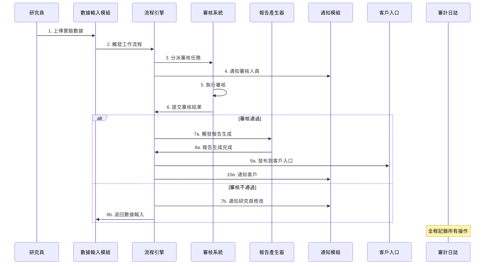
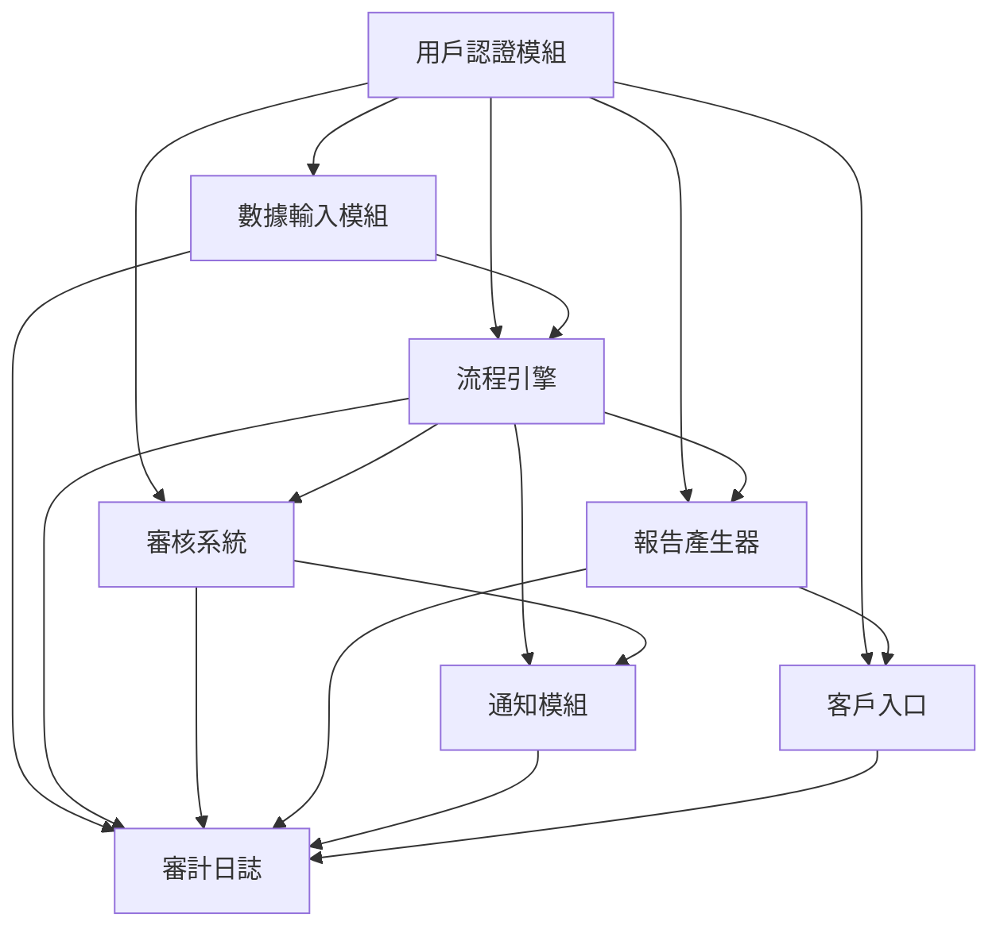
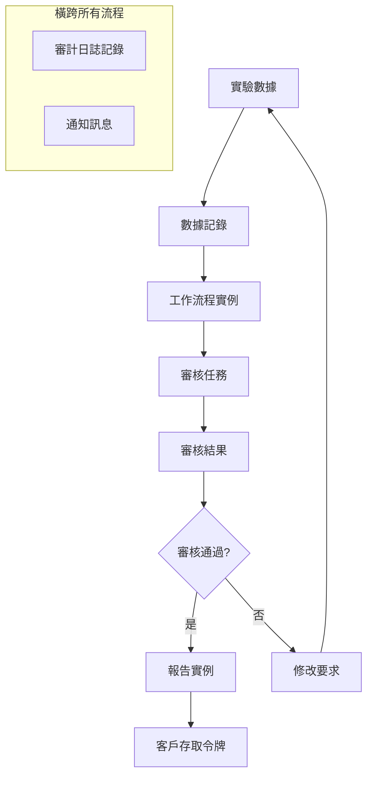

# Hwayo 專案模組交互分析與初步接口定義

## 文件資訊
- **文件名稱**: 模組交互分析與初步接口定義
- **建立日期**: 2025/05/30
- **階段**: 子任務 3.1 - 模組交互分析與初步接口定義
- **狀態**: 進行中

## 1. 業務流程分析

### 1.1 核心業務流程
基於 [`planning/productBrief.md`](../planning/productBrief.md) 的分析，Hwayo 檢驗實驗室的核心業務流程如下：



## 2. 模組間依賴關係分析

### 2.1 依賴關係圖


### 2.2 核心交互場景

#### 場景 1: 研究員提交實驗數據
1. **用戶認證模組** 驗證研究員身份和權限
2. **數據輸入模組** 接收和驗證實驗數據
3. **流程引擎** 啟動檢驗工作流程實例
4. **審計日誌** 記錄數據提交操作

#### 場景 2: 自動分派審核任務
1. **流程引擎** 根據業務規則分派審核任務
2. **審核系統** 接收並建立審核任務
3. **通知模組** 發送任務通知給審核人員
4. **審計日誌** 記錄任務分派過程

#### 場景 3: 審核完成後報告生成
1. **審核系統** 完成審核並提交結果
2. **流程引擎** 接收審核結果並觸發下一步
3. **報告產生器** 根據審核通過的數據生成報告
4. **客戶入口** 接收報告並生成存取連結
5. **通知模組** 通知客戶報告已完成

## 3. 關鍵模組間接口定義

### 3.1 數據輸入模組 ↔ 流程引擎

#### 接口 1: 觸發工作流程
**用途**: 當研究員提交完整的實驗數據時，觸發檢驗工作流程

```typescript
// POST /api/workflow/instances
interface StartWorkflowRequest {
  definitionId: string;           // 檢驗流程定義ID
  entityId: string;               // 數據記錄ID
  entityType: 'data_record';
  variables: {
    submitterId: string;          // 提交者ID
    sampleType: string;           // 樣本類型
    urgencyLevel: 'normal' | 'urgent' | 'critical';
    specialInstructions?: string;
  };
}

interface StartWorkflowResponse {
  success: boolean;
  data: {
    instanceId: string;
    currentState: 'submitted';
    assignedTasks: WorkflowTask[];
  };
}
```

#### 接口 2: 數據狀態更新通知
**用途**: 流程引擎通知數據輸入模組更新記錄狀態

```typescript
// PUT /api/data/records/:id/status
interface UpdateDataStatusRequest {
  status: 'draft' | 'submitted' | 'under_review' | 'approved' | 'rejected';
  workflowInstanceId: string;
  updatedBy: string;
  comment?: string;
}
```

### 3.2 流程引擎 ↔ 審核系統

#### 接口 3: 建立審核任務
**用途**: 流程引擎為審核系統建立新的審核任務

```typescript
// POST /api/review/tasks
interface CreateReviewTaskRequest {
  dataRecordId: string;
  workflowInstanceId: string;
  reviewType: 'data_review' | 'report_review' | 'final_approval';
  assignedTo?: string;            // 可選的指定審核員
  dueDate: Date;
  priority: 'low' | 'medium' | 'high' | 'critical';
  metadata: {
    sampleType: string;
    submitterName: string;
    submissionDate: Date;
  };
}

interface CreateReviewTaskResponse {
  success: boolean;
  data: {
    taskId: string;
    assignedTo: string;
    estimatedDuration: number;    // 預估審核時間(分鐘)
  };
}
```

#### 接口 4: 審核結果回報
**用途**: 審核系統向流程引擎回報審核結果

```typescript
// POST /api/workflow/tasks/:taskId/complete
interface CompleteReviewRequest {
  result: 'approved' | 'rejected' | 'requires_modification';
  comments: ReviewComment[];
  nextAction?: 'generate_report' | 'return_for_modification' | 'escalate';
  metadata: {
    reviewDuration: number;       // 實際審核時間
    issuesFound: number;
    criticalIssues: number;
  };
}
```

### 3.3 流程引擎 ↔ 報告產生器

#### 接口 5: 觸發報告生成
**用途**: 審核通過後觸發報告生成

```typescript
// POST /api/reports/generate
interface GenerateReportRequest {
  dataRecordId: string;
  templateId: string;
  workflowInstanceId: string;
  generationOptions: {
    format: 'pdf';
    includeRawData: boolean;
    includeCharts: boolean;
    watermark?: string;
  };
  metadata: {
    approvedBy: string;
    approvalDate: Date;
    reportType: 'standard' | 'detailed' | 'summary';
  };
}

interface GenerateReportResponse {
  success: boolean;
  data: {
    reportId: string;
    estimatedCompletionTime: Date;
    status: 'queued' | 'generating';
  };
}
```

#### 接口 6: 報告生成完成通知
**用途**: 報告產生器通知流程引擎報告已完成

```typescript
// POST /api/workflow/events/report-completed
interface ReportCompletedEvent {
  workflowInstanceId: string;
  reportId: string;
  reportUrl: string;
  fileSize: number;
  generationTime: number;       // 生成耗時(秒)
  status: 'completed' | 'failed';
  errorMessage?: string;
}
```

### 3.4 流程引擎 ↔ 通知模組

#### 接口 7: 發送流程通知
**用途**: 流程引擎觸發各種業務通知

```typescript
// POST /api/notifications
interface SendWorkflowNotificationRequest {
  type: 'task_assigned' | 'review_required' | 'report_ready' | 'deadline_reminder';
  recipientId: string;
  templateId: string;
  templateData: {
    workflowInstanceId: string;
    taskId?: string;
    reportId?: string;
    sampleName: string;
    dueDate?: Date;
    actionUrl: string;
    [key: string]: any;
  };
  priority: 'low' | 'medium' | 'high';
  scheduledAt?: Date;             // 可選的排程發送時間
}
```

### 3.5 報告產生器 ↔ 客戶入口

#### 接口 8: 發布報告到客戶入口
**用途**: 報告生成完成後發布到客戶入口供客戶下載

```typescript
// POST /api/customer-portal/reports/publish
interface PublishReportRequest {
  reportId: string;
  customerId: string;
  reportMetadata: {
    title: string;
    reportNumber: string;
    sampleName: string;
    testDate: Date;
    expirationDate?: Date;        // 報告有效期
  };
  accessSettings: {
    maxDownloads: number;
    accessDuration: number;       // 存取有效期(小時)
    requiresPassword: boolean;
  };
}

interface PublishReportResponse {
  success: boolean;
  data: {
    accessToken: string;
    accessUrl: string;
    expiresAt: Date;
  };
}
```

### 3.6 用戶認證模組 ↔ 其他模組

#### 接口 9: 權限驗證服務
**用途**: 各模組向用戶認證模組驗證用戶權限

```typescript
// POST /api/auth/verify-permission
interface VerifyPermissionRequest {
  userId: string;
  resource: string;             // 如 'data_records', 'review_tasks', 'reports'
  action: string;               // 如 'create', 'read', 'update', 'delete', 'approve'
  context?: {
    recordId?: string;
    departmentId?: string;
    [key: string]: any;
  };
}

interface VerifyPermissionResponse {
  success: boolean;
  data: {
    hasPermission: boolean;
    permissions: string[];       // 用戶擁有的相關權限列表
    restrictions?: {
      timeRestriction?: string;
      ipRestriction?: string[];
      [key: string]: any;
    };
  };
}
```

### 3.7 審計日誌模組 ↔ 所有模組

#### 接口 10: 統一審計日誌記錄
**用途**: 所有模組向審計日誌模組記錄操作

```typescript
// POST /api/audit/log
interface LogAuditEventRequest {
  eventType: 'user_action' | 'system_event' | 'data_change' | 'security_event';
  category: 'authentication' | 'data_access' | 'data_modification' | 'workflow_operation';
  userId?: string;
  sessionId?: string;
  resource: string;             // 操作的資源
  action: string;               // 執行的動作
  details: {
    entityType?: string;        // 如 'data_record', 'review_task', 'report'
    entityId?: string;
    oldValues?: Record<string, any>;
    newValues?: Record<string, any>;
    workflowInstanceId?: string;
    [key: string]: any;
  };
  result: 'success' | 'failure' | 'partial_success';
  severity: 'info' | 'warning' | 'error' | 'critical';
}
```

## 4. 數據流分析

### 4.1 主要數據實體流轉



### 4.2 關鍵數據同步點

1. **數據提交同步**: 數據輸入模組與流程引擎的狀態同步
2. **任務分派同步**: 流程引擎與審核系統的任務狀態同步
3. **審核結果同步**: 審核系統與流程引擎的結果同步
4. **報告發布同步**: 報告產生器與客戶入口的發布同步

## 5. 錯誤處理與補償機制

### 5.1 分散式事務處理
由於模組間的操作可能涉及多個步驟，需要考慮補償機制：

```typescript
// 範例：數據提交失敗的補償流程
interface CompensationAction {
  action: 'rollback_workflow' | 'cleanup_data' | 'notify_failure';
  targetModule: string;
  parameters: Record<string, any>;
}
```

### 5.2 重試機制
對於關鍵的模組間通信，實施重試機制：

```typescript
interface RetryPolicy {
  maxAttempts: number;
  backoffStrategy: 'exponential' | 'linear' | 'fixed';
  retryableErrors: string[];
}
```

## 6. 效能考量

### 6.1 非同步處理
- 報告生成採用非同步處理，避免阻塞工作流程
- 通知發送採用佇列機制，確保高可用性
- 審計日誌採用批量寫入，提升效能

### 6.2 快取策略
- 用戶權限資訊快取，減少認證模組負載
- 工作流程定義快取，提升流程引擎效能
- 報告模板快取，加速報告生成

## 7. 安全考量

### 7.1 模組間通信安全
- 所有內部 API 使用 JWT 令牌驗證
- 敏感資料傳輸加密
- API 呼叫頻率限制

### 7.2 資料隔離
- 客戶資料嚴格隔離
- 審核過程資料保護
- 審計日誌完整性保護

## 8. 監控與可觀測性

### 8.1 關鍵指標
- 模組間 API 呼叫成功率
- 工作流程完成時間
- 審核任務處理時間
- 報告生成成功率

### 8.2 分散式追蹤
使用 `correlationId` 追蹤跨模組的請求流程，便於問題排查和效能分析。

## 9. 總結

本分析識別了 Hwayo 專案中 8 個核心模組間的主要交互關係，定義了 10 個關鍵接口，涵蓋了從數據輸入到客戶交付的完整業務流程。這些接口設計考慮了：

1. **業務完整性**: 確保業務流程的完整執行
2. **技術可行性**: 基於各模組的技術設計
3. **擴展性**: 為未來功能擴展預留空間
4. **可靠性**: 包含錯誤處理和補償機制
5. **安全性**: 確保資料和操作的安全性

下一步將基於此分析進行系統架構圖的設計，並進一步細化接口規格。