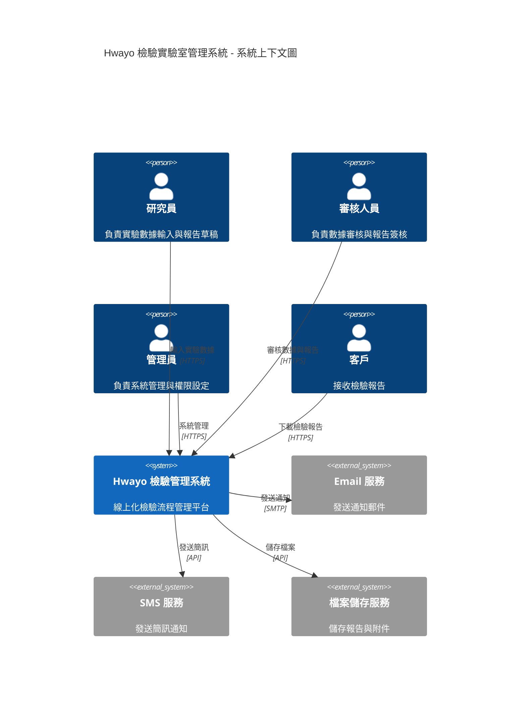
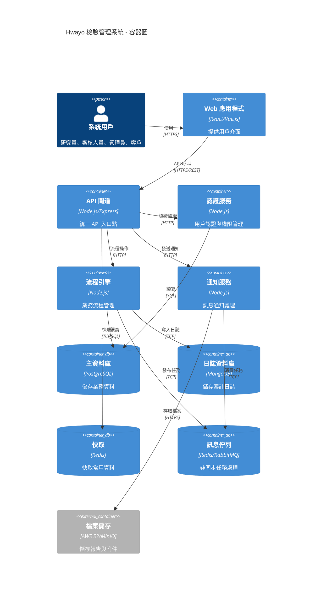
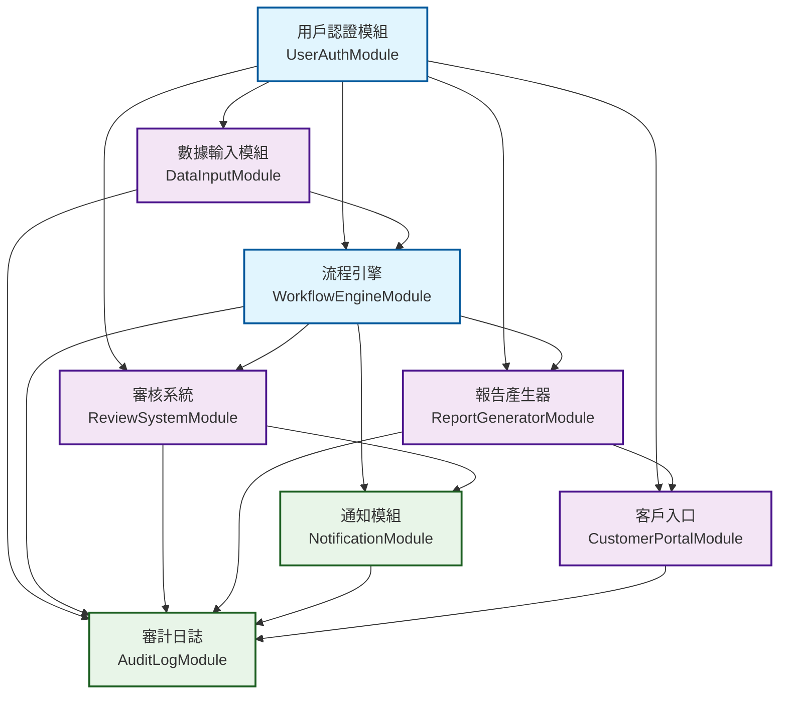
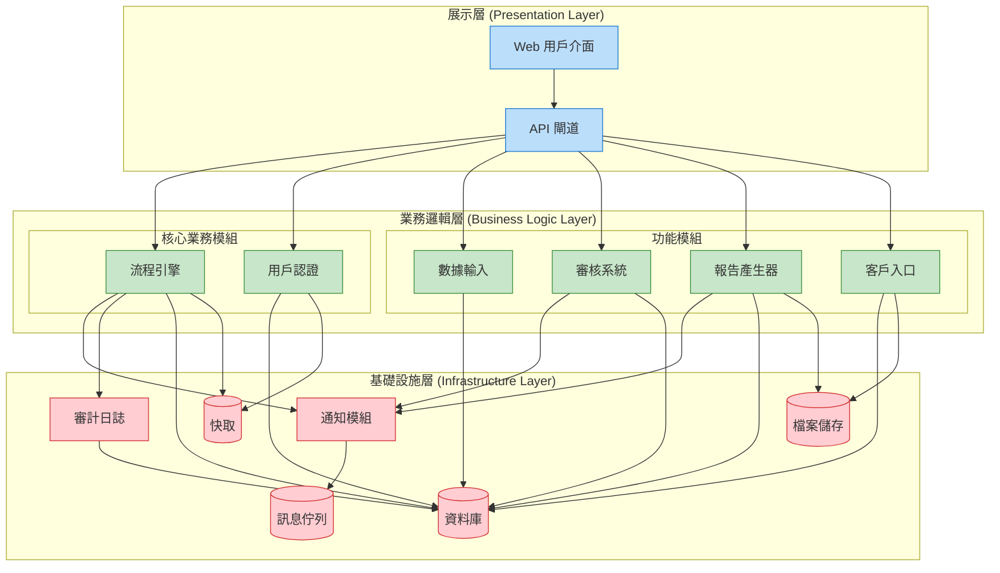
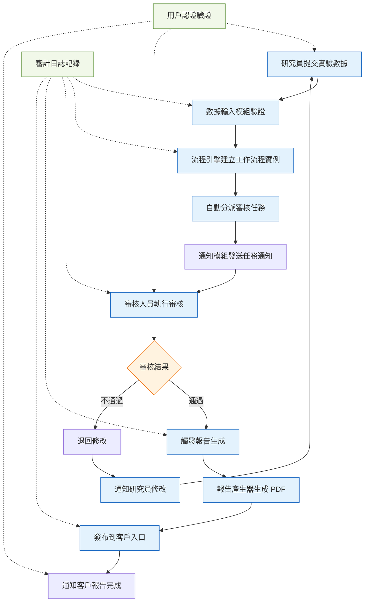
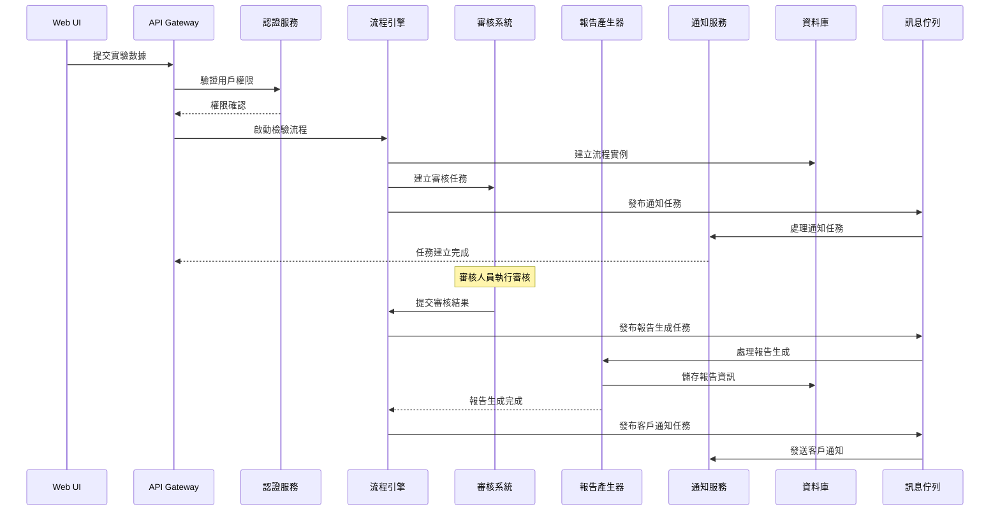
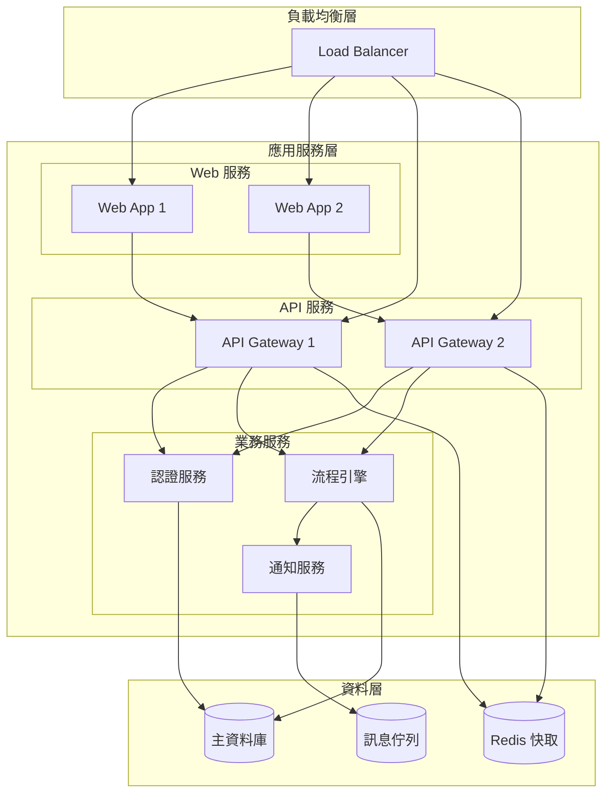
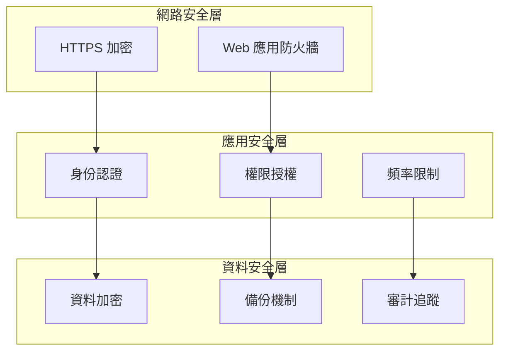
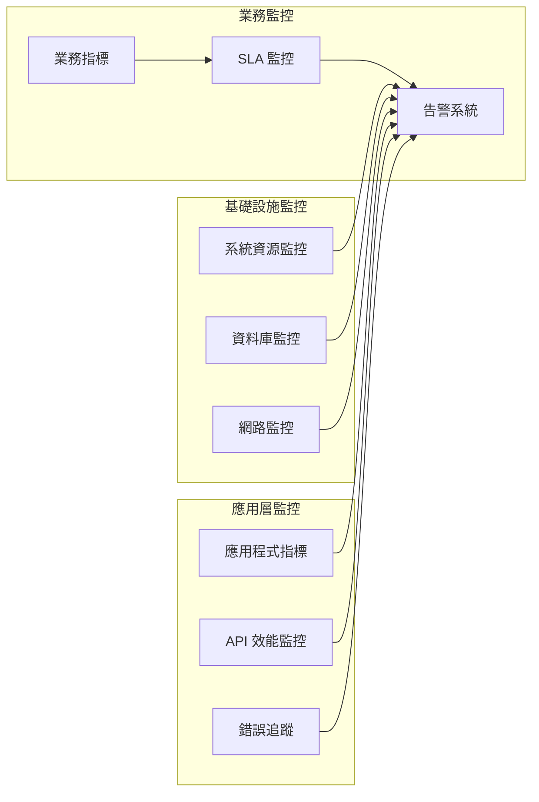

# Hwayo 專案系統架構設計

## 文件資訊
- **文件名稱**: 系統架構設計
- **建立日期**: 2025/05/30
- **階段**: 子任務 3.2 - 繪製模組依賴圖與系統架構圖
- **狀態**: 已完成
- **參考文件**: 
  - [`docs/architecture/module_interaction_analysis.md`](module_interaction_analysis.md)
  - [`planning/productBrief.md`](../planning/productBrief.md)
  - MVP 核心模組 MDD 文件

## 1. 高層次系統架構圖

### 1.1 系統上下文圖 (C4 Context Diagram)

### 1.2 系統容器圖 (C4 Container Diagram)

## 2. 模組依賴關係圖

### 2.1 MVP 核心模組依賴圖

### 2.2 模組層次架構圖

## 3. 數據流架構圖

### 3.1 主要業務數據流

### 3.2 系統間通信架構

## 4. 技術架構說明

### 4.1 架構設計原則

1. **模組化設計**: 每個模組具有明確的職責邊界，降低耦合度
2. **分層架構**: 清晰的展示層、業務邏輯層、基礎設施層分離
3. **事件驅動**: 使用訊息佇列實現模組間的非同步通信
4. **可擴展性**: 支援水平擴展和模組獨立部署
5. **安全性**: 統一的認證授權機制和完整的審計追蹤

### 4.2 核心模組職責

#### 4.2.1 核心業務模組
- **用戶認證模組**: 提供統一的身份驗證和權限管理服務
- **流程引擎**: 管理檢驗業務流程的狀態轉換和任務分派

#### 4.2.2 功能模組
- **數據輸入模組**: 處理實驗數據的輸入、驗證和儲存
- **審核系統**: 管理審核任務的分派、執行和結果處理
- **報告產生器**: 根據模板生成標準化的檢驗報告
- **客戶入口**: 提供客戶存取報告的安全介面

#### 4.2.3 基礎設施模組
- **通知模組**: 處理各種通知訊息的發送
- **審計日誌**: 記錄所有系統操作的完整追蹤

### 4.3 關鍵交互模式

#### 4.3.1 同步交互
- 用戶認證驗證
- 數據驗證和儲存
- 即時狀態查詢

#### 4.3.2 非同步交互
- 通知發送
- 報告生成
- 審計日誌記錄

#### 4.3.3 事件驅動
- 工作流程狀態變更
- 任務分派和完成
- 系統間狀態同步

## 5. 部署架構考量

### 5.1 微服務部署策略

### 5.2 擴展性設計

1. **水平擴展**: Web 應用和 API 服務支援多實例部署
2. **資料庫分離**: 讀寫分離和業務資料與日誌資料分離
3. **快取策略**: 多層快取提升系統效能
4. **非同步處理**: 訊息佇列處理耗時操作

## 6. 安全架構

### 6.1 安全層次

### 6.2 安全控制措施

1. **傳輸安全**: 全站 HTTPS 加密
2. **身份驗證**: JWT Token 機制
3. **權限控制**: 基於角色的存取控制 (RBAC)
4. **資料保護**: 敏感資料加密儲存
5. **審計追蹤**: 完整的操作日誌記錄

## 7. 監控與可觀測性

### 7.1 監控架構

### 7.2 關鍵監控指標

1. **系統指標**: CPU、記憶體、磁碟、網路使用率
2. **應用指標**: 回應時間、吞吐量、錯誤率
3. **業務指標**: 流程完成時間、審核通過率、客戶滿意度
4. **安全指標**: 登入失敗次數、異常存取模式

## 8. 總結

本系統架構設計基於 Hwayo 檢驗實驗室的業務需求，採用模組化、分層化的設計原則，確保系統的：

1. **可維護性**: 清晰的模組邊界和職責分離
2. **可擴展性**: 支援業務成長和功能擴展
3. **可靠性**: 完整的錯誤處理和恢復機制
4. **安全性**: 多層次的安全防護措施
5. **可觀測性**: 全面的監控和追蹤能力

此架構為 MVP 階段提供了堅實的技術基礎，同時為後續階段的功能擴展預留了充分的空間。

## 9. 下一步行動

1. **詳細設計**: 基於此架構進行各模組的詳細技術設計
2. **技術選型**: 確定具體的技術棧和第三方服務
3. **開發規劃**: 制定模組開發的優先順序和時程
4. **環境準備**: 建立開發、測試、生產環境
5. **團隊協作**: 建立開發團隊的協作流程和標準