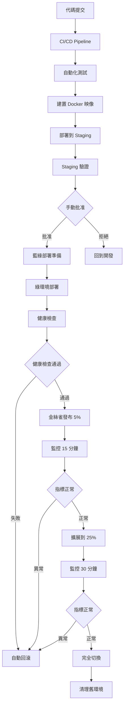
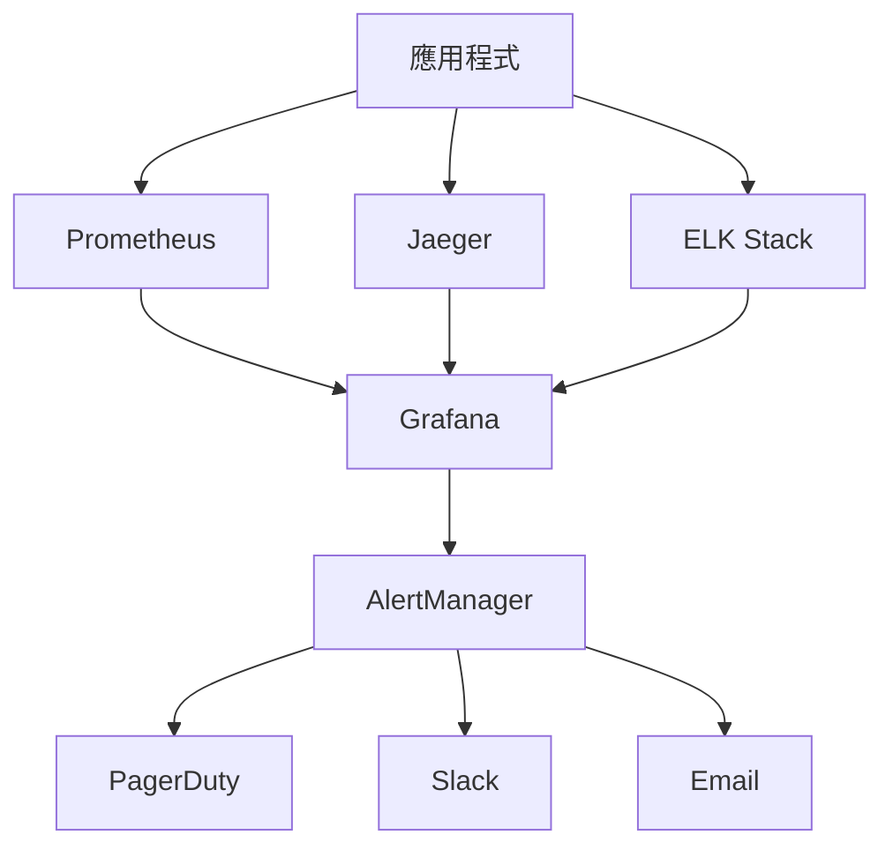
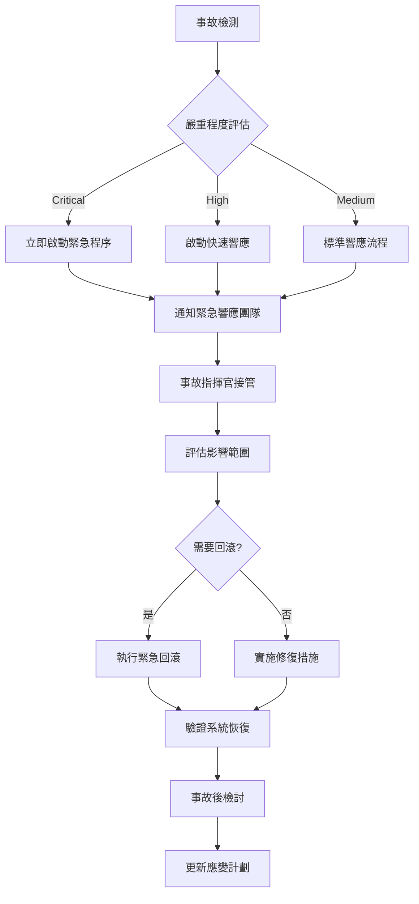

# Hwayo MVP 部署策略與計劃

## 文件資訊
- **文件名稱**: Hwayo 檢驗流程線上化系統 - MVP 部署策略與計劃
- **建立日期**: 2025/05/31
- **階段**: 子任務 6.5 - 制定 MVP 部署策略與計劃
- **狀態**: 已完成
- **維護責任**: DevOps 團隊 + 技術領導
- **版本**: v1.0
- **參考文件**: 
  - [`docs/environment_configs/production_env_sot.md`](../environment_configs/production_env_sot.md)
  - [`docs/hwayo_project_development_guidelines.md`](../hwayo_project_development_guidelines.md)
  - [`docs/test-plan/deployment_stage_test_plan.md`](../test-plan/deployment_stage_test_plan.md)
  - [`planning/project_development_dod_guide.md`](../../planning/project_development_dod_guide.md)

---

## 1. 引言

### 1.1 目的
本文件定義 Hwayo 檢驗流程線上化系統 MVP 版本的完整部署策略，確保：
- 安全、可靠的生產環境部署
- 最小化服務中斷時間
- 快速回滾能力
- 完整的監控和告警機制
- 符合企業級安全和合規要求

### 1.2 範圍
本策略涵蓋 MVP 階段的以下部署活動：
- **部署策略選擇**: 藍綠部署與金絲雀發布的混合策略
- **環境準備**: 基於生產環境 SOT 的完整環境配置
- **部署流程**: 自動化 CI/CD 流程與手動檢查點
- **回滾計劃**: 快速回滾機制與災難恢復
- **監控方案**: 業務指標與系統指標的全面監控
- **安全措施**: 部署過程中的安全檢查與合規驗證

### 1.3 部署原則
- **零停機部署**: 採用藍綠部署確保服務連續性
- **漸進式發布**: 使用金絲雀發布降低風險
- **自動化優先**: 最大化自動化，減少人為錯誤
- **可觀測性**: 全面的監控、日誌和追蹤
- **安全第一**: 每個步驟都包含安全檢查
- **快速回滾**: 15 分鐘內完成回滾操作

---

## 2. 部署策略概覽

### 2.1 混合部署策略



### 2.2 部署階段定義

#### 階段 1: 藍綠部署準備 (Blue-Green Preparation)
- **目的**: 準備新的生產環境副本
- **時間**: 30-45 分鐘
- **風險**: 低
- **回滾**: 不需要（尚未切換流量）

#### 階段 2: 金絲雀發布 (Canary Release)
- **目的**: 逐步將流量切換到新版本
- **時間**: 2-4 小時
- **風險**: 中等
- **回滾**: 5-15 分鐘

#### 階段 3: 完全部署 (Full Deployment)
- **目的**: 將所有流量切換到新版本
- **時間**: 15-30 分鐘
- **風險**: 低（已通過金絲雀驗證）
- **回滾**: 5-10 分鐘

---

## 3. 環境準備

### 3.1 基礎設施需求

基於 [`docs/environment_configs/production_env_sot.md`](../environment_configs/production_env_sot.md) 的配置：

```yaml
infrastructure_requirements:
  kubernetes_cluster:
    version: "1.28.4"
    node_groups:
      system: 
        min_size: 3
        max_size: 6
        instance_type: "m5.large"
      application:
        min_size: 8  # 增加以支援藍綠部署
        max_size: 24
        instance_type: "m5.xlarge"
      compute_intensive:
        min_size: 4  # 增加以支援藍綠部署
        max_size: 12
        instance_type: "c5.2xlarge"
        
  database:
    postgresql:
      primary: "db.r6g.2xlarge"
      read_replicas: 3
      backup_retention: "30 days"
    mongodb:
      tier: "M30"
      replication_factor: 3
    redis:
      node_type: "cache.r6g.large"
      num_cache_nodes: 6
      
  storage:
    s3_buckets:
      - "hwayo-prod-assets"
      - "hwayo-prod-backups"
      - "hwayo-prod-logs"
    efs_storage: "1TB"
    
  networking:
    load_balancer: "Application Load Balancer"
    cdn: "CloudFront"
    waf: "AWS WAF v2"
    ssl_certificates: "ACM managed"
```

### 3.2 部署前環境檢查清單

```yaml
pre_deployment_checklist:
  infrastructure:
    - name: "Kubernetes 集群健康檢查"
      command: "kubectl get nodes"
      expected: "所有節點 Ready 狀態"
      
    - name: "資料庫連接測試"
      command: "pg_isready -h production-db"
      expected: "accepting connections"
      
    - name: "Redis 連接測試"
      command: "redis-cli -h production-redis ping"
      expected: "PONG"
      
    - name: "S3 存取權限驗證"
      command: "aws s3 ls s3://hwayo-prod-assets"
      expected: "成功列出內容"
      
  security:
    - name: "SSL 憑證有效性"
      command: "openssl s_client -connect hwayo.com:443"
      expected: "憑證有效且未過期"
      
    - name: "WAF 規則檢查"
      command: "aws wafv2 get-web-acl"
      expected: "規則正確配置"
      
    - name: "網路安全群組檢查"
      command: "aws ec2 describe-security-groups"
      expected: "僅開放必要端口"
      
  monitoring:
    - name: "監控系統狀態"
      command: "curl -f http://monitoring.internal/health"
      expected: "HTTP 200"
      
    - name: "告警規則驗證"
      command: "prometheus-cli query up"
      expected: "所有服務 up=1"
      
    - name: "日誌收集驗證"
      command: "elasticsearch-cli cluster health"
      expected: "status: green"
```

### 3.3 容器映像準備

```yaml
container_images:
  base_requirements:
    vulnerability_scan: "必須通過"
    security_scan: "必須通過"
    size_limit: "< 1GB"
    
  images:
    web_app:
      repository: "${ECR_REGISTRY}/hwayo-web"
      tag: "${BUILD_NUMBER}-${GIT_COMMIT_SHORT}"
      health_check: "/health"
      
    api_gateway:
      repository: "${ECR_REGISTRY}/hwayo-api"
      tag: "${BUILD_NUMBER}-${GIT_COMMIT_SHORT}"
      health_check: "/api/v1/health"
      
    auth_service:
      repository: "${ECR_REGISTRY}/hwayo-auth"
      tag: "${BUILD_NUMBER}-${GIT_COMMIT_SHORT}"
      health_check: "/auth/health"
      
    workflow_engine:
      repository: "${ECR_REGISTRY}/hwayo-workflow"
      tag: "${BUILD_NUMBER}-${GIT_COMMIT_SHORT}"
      health_check: "/workflow/health"
      
    notification_service:
      repository: "${ECR_REGISTRY}/hwayo-notification"
      tag: "${BUILD_NUMBER}-${GIT_COMMIT_SHORT}"
      health_check: "/notification/health"
      
    report_generator:
      repository: "${ECR_REGISTRY}/hwayo-report"
      tag: "${BUILD_NUMBER}-${GIT_COMMIT_SHORT}"
      health_check: "/report/health"
```

---

## 4. CI/CD 流程設計

### 4.1 CI/CD Pipeline 架構

```yaml
cicd_pipeline:
  trigger:
    - "push to main branch"
    - "manual deployment trigger"
    
  stages:
    build:
      duration: "10-15 minutes"
      steps:
        - "代碼檢出"
        - "依賴安裝"
        - "TypeScript 編譯"
        - "靜態代碼分析"
        - "單元測試執行"
        - "代碼覆蓋率檢查"
        
    security_scan:
      duration: "5-10 minutes"
      steps:
        - "依賴漏洞掃描"
        - "SAST 靜態安全分析"
        - "容器映像安全掃描"
        - "密鑰洩漏檢查"
        
    package:
      duration: "10-15 minutes"
      steps:
        - "Docker 映像建置"
        - "映像標籤與推送"
        - "Helm Chart 打包"
        - "部署清單生成"
        
    staging_deployment:
      duration: "15-20 minutes"
      steps:
        - "Staging 環境部署"
        - "健康檢查"
        - "整合測試執行"
        - "效能測試執行"
        
    approval_gate:
      type: "manual"
      approvers:
        - "技術領導"
        - "產品經理"
        - "QA 負責人"
      timeout: "24 hours"
      
    production_deployment:
      duration: "2-4 hours"
      steps:
        - "藍綠環境準備"
        - "金絲雀部署"
        - "監控與驗證"
        - "完全切換"
        - "清理作業"
```

### 4.2 自動化測試整合

```yaml
automated_testing:
  unit_tests:
    framework: "Jest"
    coverage_threshold: "80%"
    timeout: "10 minutes"
    
  integration_tests:
    framework: "Supertest + Jest"
    database: "Test PostgreSQL"
    timeout: "15 minutes"
    
  api_tests:
    framework: "Newman (Postman)"
    environment: "Staging"
    timeout: "20 minutes"
    
  e2e_tests:
    framework: "Playwright"
    browsers: ["Chrome", "Firefox", "Safari"]
    timeout: "30 minutes"
    
  performance_tests:
    framework: "Artillery"
    load_profile: "100 concurrent users"
    duration: "10 minutes"
    
  security_tests:
    framework: "OWASP ZAP"
    scan_type: "Active scan"
    timeout: "45 minutes"
```

---

## 5. 詳細部署步驟

### 5.1 階段 1: 藍綠部署準備

#### 5.1.1 綠環境建立
```bash
# 1. 創建新的 Kubernetes 命名空間
kubectl create namespace hwayo-production-green

# 2. 複製配置和密鑰
kubectl get secret -n hwayo-production -o yaml | \
  sed 's/namespace: hwayo-production/namespace: hwayo-production-green/' | \
  kubectl apply -f -

# 3. 部署新版本到綠環境
helm upgrade --install hwayo-green ./helm-charts/hwayo \
  --namespace hwayo-production-green \
  --values values-production.yaml \
  --set image.tag=${NEW_VERSION} \
  --set environment=green

# 4. 等待所有 Pod 就緒
kubectl wait --for=condition=ready pod \
  --all -n hwayo-production-green \
  --timeout=600s
```

#### 5.1.2 健康檢查驗證
```bash
# 1. 內部健康檢查
for service in web-app api-gateway auth-service workflow-engine notification-service report-generator; do
  kubectl exec -n hwayo-production-green deployment/$service -- \
    curl -f http://localhost:3000/health
done

# 2. 資料庫連接測試
kubectl exec -n hwayo-production-green deployment/api-gateway -- \
  node -e "
    const { Pool } = require('pg');
    const pool = new Pool(process.env.DATABASE_CONFIG);
    pool.query('SELECT 1').then(() => console.log('DB OK')).catch(console.error);
  "

# 3. Redis 連接測試
kubectl exec -n hwayo-production-green deployment/api-gateway -- \
  node -e "
    const redis = require('redis');
    const client = redis.createClient(process.env.REDIS_CONFIG);
    client.ping().then(() => console.log('Redis OK')).catch(console.error);
  "
```

### 5.2 階段 2: 金絲雀發布

#### 5.2.1 流量切換配置
```yaml
# Istio VirtualService 配置
apiVersion: networking.istio.io/v1beta1
kind: VirtualService
metadata:
  name: hwayo-canary
  namespace: hwayo-production
spec:
  hosts:
  - hwayo.com
  http:
  - match:
    - headers:
        canary:
          exact: "true"
    route:
    - destination:
        host: api-gateway.hwayo-production-green.svc.cluster.local
        port:
          number: 80
      weight: 100
  - route:
    - destination:
        host: api-gateway.hwayo-production.svc.cluster.local
        port:
          number: 80
      weight: 95
    - destination:
        host: api-gateway.hwayo-production-green.svc.cluster.local
        port:
          number: 80
      weight: 5
```

#### 5.2.2 金絲雀發布階段
```bash
# 階段 2.1: 5% 流量切換
kubectl apply -f canary-5-percent.yaml
echo "等待 15 分鐘並監控指標..."
sleep 900

# 檢查關鍵指標
if check_metrics_healthy; then
  # 階段 2.2: 25% 流量切換
  kubectl apply -f canary-25-percent.yaml
  echo "等待 30 分鐘並監控指標..."
  sleep 1800
  
  if check_metrics_healthy; then
    # 階段 2.3: 50% 流量切換
    kubectl apply -f canary-50-percent.yaml
    echo "等待 30 分鐘並監控指標..."
    sleep 1800
    
    if check_metrics_healthy; then
      # 準備完全切換
      echo "金絲雀發布成功，準備完全切換"
    else
      echo "50% 階段指標異常，執行回滾"
      rollback_deployment
    fi
  else
    echo "25% 階段指標異常，執行回滾"
    rollback_deployment
  fi
else
  echo "5% 階段指標異常，執行回滾"
  rollback_deployment
fi
```

#### 5.2.3 指標監控腳本
```bash
#!/bin/bash
check_metrics_healthy() {
  # 1. 檢查錯誤率 (< 1%)
  error_rate=$(prometheus_query 'rate(http_requests_total{status=~"5.."}[5m]) / rate(http_requests_total[5m]) * 100')
  if (( $(echo "$error_rate > 1" | bc -l) )); then
    echo "錯誤率過高: $error_rate%"
    return 1
  fi
  
  # 2. 檢查響應時間 (< 2 秒)
  response_time=$(prometheus_query 'histogram_quantile(0.95, rate(http_request_duration_seconds_bucket[5m]))')
  if (( $(echo "$response_time > 2" | bc -l) )); then
    echo "響應時間過長: $response_time 秒"
    return 1
  fi
  
  # 3. 檢查 CPU 使用率 (< 80%)
  cpu_usage=$(prometheus_query 'avg(rate(container_cpu_usage_seconds_total[5m])) * 100')
  if (( $(echo "$cpu_usage > 80" | bc -l) )); then
    echo "CPU 使用率過高: $cpu_usage%"
    return 1
  fi
  
  # 4. 檢查記憶體使用率 (< 85%)
  memory_usage=$(prometheus_query 'avg(container_memory_usage_bytes / container_spec_memory_limit_bytes) * 100')
  if (( $(echo "$memory_usage > 85" | bc -l) )); then
    echo "記憶體使用率過高: $memory_usage%"
    return 1
  fi
  
  # 5. 檢查業務指標
  login_success_rate=$(prometheus_query 'rate(user_login_success_total[5m]) / rate(user_login_attempts_total[5m]) * 100')
  if (( $(echo "$login_success_rate < 95" | bc -l) )); then
    echo "登入成功率過低: $login_success_rate%"
    return 1
  fi
  
  echo "所有指標正常"
  return 0
}
```

### 5.3 階段 3: 完全部署

#### 5.3.1 流量完全切換
```bash
# 1. 將所有流量切換到綠環境
kubectl apply -f production-green-100-percent.yaml

# 2. 等待 10 分鐘確保穩定
sleep 600

# 3. 最終健康檢查
if check_metrics_healthy && check_business_metrics; then
  echo "部署成功，開始清理舊環境"
  cleanup_blue_environment
else
  echo "最終檢查失敗，執行緊急回滾"
  emergency_rollback
fi
```

#### 5.3.2 舊環境清理
```bash
cleanup_blue_environment() {
  # 1. 備份舊環境配置
  kubectl get all -n hwayo-production -o yaml > backup-blue-${TIMESTAMP}.yaml
  
  # 2. 縮減舊環境資源
  kubectl scale deployment --all --replicas=1 -n hwayo-production
  
  # 3. 等待 24 小時觀察期
  echo "保留舊環境 24 小時以備緊急回滾"
  
  # 4. 24 小時後自動清理（通過 CronJob）
  # kubectl delete namespace hwayo-production-old
}
```

---

## 6. 回滾計劃

### 6.1 回滾觸發條件

```yaml
rollback_triggers:
  automatic:
    - "錯誤率 > 5%"
    - "響應時間 > 5 秒"
    - "健康檢查失敗 > 3 次"
    - "CPU 使用率 > 95%"
    - "記憶體使用率 > 95%"
    
  manual:
    - "業務功能異常"
    - "資料完整性問題"
    - "安全性問題"
    - "合規性問題"
    - "客戶投訴激增"
    
  business_metrics:
    - "登入成功率 < 90%"
    - "資料提交成功率 < 95%"
    - "報告生成成功率 < 98%"
    - "API 可用性 < 99%"
```

### 6.2 快速回滾流程

#### 6.2.1 自動回滾 (5 分鐘內)
```bash
#!/bin/bash
automatic_rollback() {
  echo "執行自動回滾..."
  
  # 1. 立即切換流量到藍環境 (30 秒)
  kubectl apply -f production-blue-100-percent.yaml
  
  # 2. 驗證藍環境健康狀態 (2 分鐘)
  kubectl wait --for=condition=ready pod \
    --all -n hwayo-production \
    --timeout=120s
  
  # 3. 執行健康檢查 (1 分鐘)
  if check_blue_environment_health; then
    echo "回滾成功"
    send_notification "自動回滾完成" "success"
  else
    echo "回滾失敗，執行緊急程序"
    emergency_procedures
  fi
  
  # 4. 清理綠環境 (1 分鐘)
  kubectl delete namespace hwayo-production-green
  
  echo "自動回滾完成，總耗時: $(date)"
}
```

#### 6.2.2 手動回滾 (10 分鐘內)
```bash
#!/bin/bash
manual_rollback() {
  echo "執行手動回滾..."
  
  # 1. 確認回滾決策
  read -p "確認執行回滾? (yes/no): " confirm
  if [ "$confirm" != "yes" ]; then
    echo "回滾已取消"
    return 1
  fi
  
  # 2. 記錄回滾原因
  read -p "請輸入回滾原因: " reason
  log_rollback_reason "$reason"
  
  # 3. 執行回滾步驟
  automatic_rollback
  
  # 4. 通知相關團隊
  send_notification "手動回滾完成" "warning" "$reason"
}
```

### 6.3 災難恢復程序

#### 6.3.1 緊急程序
```bash
emergency_procedures() {
  echo "執行緊急災難恢復程序..."
  
  # 1. 啟用維護模式
  kubectl apply -f maintenance-mode.yaml
  
  # 2. 從備份恢復資料庫
  restore_database_from_backup
  
  # 3. 部署最後已知穩定版本
  deploy_last_known_good_version
  
  # 4. 通知所有相關人員
  send_emergency_notification
  
  # 5. 啟動事故響應流程
  trigger_incident_response
}
```

#### 6.3.2 資料庫回滾
```bash
restore_database_from_backup() {
  # 1. 停止所有應用程式連接
  kubectl scale deployment --all --replicas=0 -n hwayo-production
  kubectl scale deployment --all --replicas=0 -n hwayo-production-green
  
  # 2. 創建當前資料庫快照
  aws rds create-db-snapshot \
    --db-instance-identifier hwayo-prod-db \
    --db-snapshot-identifier emergency-snapshot-$(date +%Y%m%d%H%M%S)
  
  # 3. 從最近的備份恢復
  aws rds restore-db-instance-from-db-snapshot \
    --db-instance-identifier hwayo-prod-db-restored \
    --db-snapshot-identifier hwayo-prod-db-backup-latest
  
  # 4. 更新連接字串
  update_database_connection_string
  
  # 5. 重新啟動應用程式
  kubectl scale deployment --all --replicas=1 -n hwayo-production
}
```

---

## 7. 監控與告警方案

### 7.1 監控架構



### 7.2 關鍵監控指標

#### 7.2.1 系統指標
```yaml
system_metrics:
  infrastructure:
    - name: "CPU 使用率"
      query: "avg(rate(container_cpu_usage_seconds_total[5m])) * 100"
      threshold: "80%"
      severity: "warning"
      
    - name: "記憶體使用率"
      query: "avg(container_memory_usage_bytes / container_spec_memory_limit_bytes) * 100"
      threshold: "85%"
      severity: "warning"
      
    - name: "磁碟使用率"
      query: "avg(disk_usage_percent)"
      threshold: "90%"
      severity: "critical"
      
    - name: "網路延遲"
      query: "avg(network_latency_seconds)"
      threshold: "100ms"
      severity: "warning"
      
  application:
    - name: "HTTP 錯誤率"
      query: "rate(http_requests_total{status=~'5..'}[5m]) / rate(http_requests_total[5m]) * 100"
      threshold: "1%"
      severity: "critical"
      
    - name: "HTTP 響應時間"
      query: "histogram_quantile(0.95, rate(http_request_duration_seconds_bucket[5m]))"
      threshold: "2s"
      severity: "warning"
      
    - name: "資料庫連接池"
      query: "avg(database_connection_pool_active / database_connection_pool_max) * 100"
      threshold: "80%"
      severity: "warning"
      
    - name: "佇列長度"
      query: "avg(queue_length)"
      threshold: "1000"
      severity: "warning"
```

#### 7.2.2 業務指標
```yaml
business_metrics:
  user_experience:
    - name: "用戶登入成功率"
      query: "rate(user_login_success_total[5m]) / rate(user_login_attempts_total[5m]) * 100"
      threshold: "95%"
      severity: "critical"
      
    - name: "資料提交成功率"
      query: "rate(data_submission_success_total[5m]) / rate(data_submission_attempts_total[5m]) * 100"
      threshold: "98%"
      severity: "critical"
      
    - name: "報告生成成功率"
      query: "rate(report_generation_success_total[5m]) / rate(report_generation_attempts_total[5m]) * 100"
      threshold: "99%"
      severity: "critical"
      
    - name: "頁面載入時間"
      query: "histogram_quantile(0.95, rate(page_load_duration_seconds_bucket[5m]))"
      threshold: "3s"
      severity: "warning"
      
  business_operations:
    - name: "每分鐘活躍用戶數"
      query: "count(increase(user_activity_total[1m]))"
      threshold: "10"
      severity: "info"
      
    - name: "每小時新註冊用戶"
      query: "increase(user_registration_total[1h])"
      threshold: "5"
      severity: "info"
      
    - name: "每日報告生成數量"
      query: "increase(reports_generated_total[24h])"
      threshold: "50"
      severity: "info"
```

### 7.3 告警規則配置

#### 7.3.1 Prometheus 告警規則
```yaml
groups:
- name: hwayo-critical
  rules:
  - alert: HighErrorRate
    expr: rate(http_requests_total{status=~"5.."}[5m]) / rate(http_requests_total[5m]) * 100 > 5
    for: 2m
    labels:
      severity: critical
    annotations:
      summary: "高錯誤率檢測"
      description: "錯誤率 {{ $value }}% 超過閾值 5%"
      
  - alert: HighResponseTime
    expr: histogram_quantile(0.95, rate(http_request_duration_seconds_bucket[5m])) > 5
    for: 5
labels:
      severity: critical
    annotations:
      summary: "高錯誤率檢測"
      description: "錯誤率 {{ $value }}% 超過閾值 5%"
      
  - alert: HighResponseTime
    expr: histogram_quantile(0.95, rate(http_request_duration_seconds_bucket[5m])) > 5
    for: 5m
    labels:
      severity: critical
    annotations:
      summary: "高響應時間檢測"
      description: "95% 響應時間 {{ $value }}s 超過閾值 5s"
      
  - alert: DatabaseConnectionFailure
    expr: up{job="postgresql"} == 0
    for: 1m
    labels:
      severity: critical
    annotations:
      summary: "資料庫連接失敗"
      description: "PostgreSQL 資料庫無法連接"
      
  - alert: LowLoginSuccessRate
    expr: rate(user_login_success_total[5m]) / rate(user_login_attempts_total[5m]) * 100 < 90
    for: 3m
    labels:
      severity: critical
    annotations:
      summary: "登入成功率過低"
      description: "登入成功率 {{ $value }}% 低於閾值 90%"

- name: hwayo-warning
  rules:
  - alert: HighCPUUsage
    expr: avg(rate(container_cpu_usage_seconds_total[5m])) * 100 > 80
    for: 10m
    labels:
      severity: warning
    annotations:
      summary: "CPU 使用率過高"
      description: "平均 CPU 使用率 {{ $value }}% 超過閾值 80%"
      
  - alert: HighMemoryUsage
    expr: avg(container_memory_usage_bytes / container_spec_memory_limit_bytes) * 100 > 85
    for: 10m
    labels:
      severity: warning
    annotations:
      summary: "記憶體使用率過高"
      description: "平均記憶體使用率 {{ $value }}% 超過閾值 85%"
```

#### 7.3.2 告警通知配置
```yaml
alertmanager_config:
  global:
    smtp_smarthost: 'smtp.company.com:587'
    smtp_from: 'alerts@hwayo.com'
    
  route:
    group_by: ['alertname', 'cluster', 'service']
    group_wait: 10s
    group_interval: 10s
    repeat_interval: 1h
    receiver: 'default'
    routes:
    - match:
        severity: critical
      receiver: 'critical-alerts'
      group_wait: 0s
      repeat_interval: 5m
    - match:
        severity: warning
      receiver: 'warning-alerts'
      repeat_interval: 30m
      
  receivers:
  - name: 'default'
    slack_configs:
    - api_url: '${SLACK_WEBHOOK_URL}'
      channel: '#hwayo-alerts'
      title: 'Hwayo 系統告警'
      text: '{{ range .Alerts }}{{ .Annotations.summary }}: {{ .Annotations.description }}{{ end }}'
      
  - name: 'critical-alerts'
    pagerduty_configs:
    - service_key: '${PAGERDUTY_SERVICE_KEY}'
      description: '{{ .GroupLabels.alertname }}: {{ .CommonAnnotations.summary }}'
    slack_configs:
    - api_url: '${SLACK_WEBHOOK_URL}'
      channel: '#hwayo-critical'
      title: '🚨 CRITICAL: Hwayo 系統告警'
      text: '{{ range .Alerts }}{{ .Annotations.summary }}: {{ .Annotations.description }}{{ end }}'
    email_configs:
    - to: 'oncall@hwayo.com'
      subject: '🚨 CRITICAL: Hwayo 系統告警'
      body: '{{ range .Alerts }}{{ .Annotations.summary }}: {{ .Annotations.description }}{{ end }}'
      
  - name: 'warning-alerts'
    slack_configs:
    - api_url: '${SLACK_WEBHOOK_URL}'
      channel: '#hwayo-alerts'
      title: '⚠️ WARNING: Hwayo 系統告警'
      text: '{{ range .Alerts }}{{ .Annotations.summary }}: {{ .Annotations.description }}{{ end }}'
```

---

## 8. 安全措施

### 8.1 部署安全檢查

```yaml
security_checks:
  pre_deployment:
    - name: "容器映像漏洞掃描"
      tool: "Trivy"
      threshold: "無 HIGH/CRITICAL 漏洞"
      
    - name: "密鑰洩漏檢查"
      tool: "GitLeaks"
      threshold: "無密鑰洩漏"
      
    - name: "靜態代碼安全分析"
      tool: "SonarQube Security"
      threshold: "無 Security Hotspots"
      
    - name: "依賴漏洞檢查"
      tool: "npm audit"
      threshold: "無 HIGH/CRITICAL 漏洞"
      
  during_deployment:
    - name: "網路政策驗證"
      command: "kubectl get networkpolicy"
      expected: "所有必要的網路政策已配置"
      
    - name: "RBAC 權限檢查"
      command: "kubectl auth can-i --list"
      expected: "最小權限原則"
      
    - name: "Pod 安全標準"
      command: "kubectl get pod -o yaml | grep securityContext"
      expected: "所有 Pod 配置安全上下文"
      
  post_deployment:
    - name: "運行時安全掃描"
      tool: "Falco"
      monitoring: "持續監控"
      
    - name: "網路流量分析"
      tool: "Istio Security"
      monitoring: "mTLS 加密驗證"
```

### 8.2 合規性檢查

```yaml
compliance_checks:
  data_protection:
    - name: "個人資料加密"
      requirement: "所有 PII 資料必須加密"
      verification: "資料庫欄位加密檢查"
      
    - name: "資料傳輸加密"
      requirement: "所有資料傳輸使用 TLS 1.3"
      verification: "SSL/TLS 配置檢查"
      
    - name: "資料備份加密"
      requirement: "所有備份資料必須加密"
      verification: "S3 加密設定檢查"
      
  access_control:
    - name: "多因子認證"
      requirement: "管理員帳戶必須啟用 MFA"
      verification: "IAM 政策檢查"
      
    - name: "角色基礎存取控制"
      requirement: "實施最小權限原則"
      verification: "RBAC 配置審查"
      
  audit_logging:
    - name: "審計日誌完整性"
      requirement: "所有操作必須記錄"
      verification: "審計日誌覆蓋率檢查"
      
    - name: "日誌保留期限"
      requirement: "審計日誌保留 7 年"
      verification: "MongoDB TTL 設定檢查"
```

---

## 9. 部署檢查清單

### 9.1 部署前檢查清單

```yaml
pre_deployment_checklist:
  infrastructure:
    - [ ] Kubernetes 集群健康檢查通過
    - [ ] 資料庫連接測試成功
    - [ ] Redis 連接測試成功
    - [ ] S3 存取權限驗證通過
    - [ ] SSL 憑證有效且未過期
    - [ ] WAF 規則正確配置
    - [ ] 網路安全群組檢查通過
    - [ ] 負載均衡器配置正確
    - [ ] DNS 記錄配置正確
    
  security:
    - [ ] 容器映像安全掃描通過
    - [ ] 密鑰洩漏檢查通過
    - [ ] 靜態代碼安全分析通過
    - [ ] 依賴漏洞檢查通過
    - [ ] 網路政策配置正確
    - [ ] RBAC 權限設定正確
    - [ ] Pod 安全標準符合要求
    
  monitoring:
    - [ ] 監控系統運行正常
    - [ ] 告警規則配置正確
    - [ ] 日誌收集系統正常
    - [ ] 儀表板配置完成
    - [ ] 通知渠道測試通過
    
  backup:
    - [ ] 資料庫備份策略已配置
    - [ ] 應用程式配置備份完成
    - [ ] 回滾腳本測試通過
    - [ ] 災難恢復計劃已準備
    
  team_readiness:
    - [ ] 部署團隊已就位
    - [ ] 監控團隊已就位
    - [ ] 客服團隊已通知
    - [ ] 緊急聯絡清單已更新
    - [ ] 部署溝通計劃已執行
```

### 9.2 部署中檢查清單

```yaml
during_deployment_checklist:
  blue_green_preparation:
    - [ ] 綠環境成功創建
    - [ ] 所有服務成功部署
    - [ ] 健康檢查全部通過
    - [ ] 資料庫連接測試成功
    - [ ] 快取連接測試成功
    - [ ] 內部 API 測試通過
    
  canary_release:
    - [ ] 5% 流量切換成功
    - [ ] 15 分鐘監控期間指標正常
    - [ ] 25% 流量切換成功
    - [ ] 30 分鐘監控期間指標正常
    - [ ] 50% 流量切換成功
    - [ ] 30 分鐘監控期間指標正常
    - [ ] 業務指標保持穩定
    
  monitoring:
    - [ ] 錯誤率保持在閾值內
    - [ ] 響應時間保持正常
    - [ ] CPU 使用率正常
    - [ ] 記憶體使用率正常
    - [ ] 資料庫效能正常
    - [ ] 用戶體驗指標正常
```

### 9.3 部署後檢查清單

```yaml
post_deployment_checklist:
  functional_verification:
    - [ ] 用戶登入功能正常
    - [ ] 資料提交功能正常
    - [ ] 報告生成功能正常
    - [ ] 通知系統功能正常
    - [ ] 客戶入口功能正常
    - [ ] 審計日誌功能正常
    - [ ] 所有 API 端點正常響應
    
  performance_verification:
    - [ ] 頁面載入時間符合要求
    - [ ] API 響應時間符合要求
    - [ ] 資料庫查詢效能正常
    - [ ] 報告生成時間合理
    - [ ] 系統資源使用率正常
    
  security_verification:
    - [ ] SSL/TLS 加密正常
    - [ ] 認證授權功能正常
    - [ ] 資料加密功能正常
    - [ ] 審計日誌記錄正常
    - [ ] 網路安全政策生效
    
  monitoring_verification:
    - [ ] 所有監控指標正常收集
    - [ ] 告警規則正常觸發
    - [ ] 儀表板顯示正確
    - [ ] 日誌正常收集和索引
    - [ ] 通知系統正常運作
    
  business_verification:
    - [ ] 核心業務流程測試通過
    - [ ] 用戶驗收測試通過
    - [ ] 效能基準測試通過
    - [ ] 資料完整性驗證通過
    - [ ] 備份恢復測試通過
    
  cleanup:
    - [ ] 舊環境資源已標記
    - [ ] 部署文件已更新
    - [ ] 監控基線已調整
    - [ ] 團隊已收到部署通知
    - [ ] 部署報告已生成
```

---

## 10. 緊急應變計劃

### 10.1 事故響應流程



### 10.2 緊急聯絡清單

```yaml
emergency_contacts:
  incident_commander:
    primary: "技術領導"
    phone: "+886-XXX-XXXXXX"
    email: "tech-lead@hwayo.com"
    backup: "資深工程師"
    
  technical_team:
    devops_lead:
      name: "DevOps 負責人"
      phone: "+886-XXX-XXXXXX"
      email: "devops@hwayo.com"
      
    backend_lead:
      name: "後端負責人"
      phone: "+886-XXX-XXXXXX"
      email: "backend@hwayo.com"
      
    frontend_lead:
      name: "前端負責人"
      phone: "+886-XXX-XXXXXX"
      email: "frontend@hwayo.com"
      
  business_team:
    product_manager:
      name: "產品經理"
      phone: "+886-XXX-XXXXXX"
      email: "pm@hwayo.com"
      
    customer_success:
      name: "客戶成功經理"
      phone: "+886-XXX-XXXXXX"
      email: "cs@hwayo.com"
      
  external_vendors:
    aws_support:
      level: "Enterprise"
      phone: "+1-XXX-XXX-XXXX"
      case_url: "https://console.aws.amazon.com/support/"
      
    monitoring_vendor:
      name: "DataDog/New Relic"
      support_email: "support@vendor.com"
      escalation_phone: "+1-XXX-XXX-XXXX"
```

### 10.3 通訊計劃

```yaml
communication_plan:
  internal_communication:
    immediate:
      - "Slack #hwayo-incidents 頻道"
      - "緊急電話會議"
      - "事故指揮官決策"
      
    regular_updates:
      - "每 30 分鐘狀態更新"
      - "Slack #hwayo-general 通知"
      - "管理層簡報"
      
  external_communication:
    customer_notification:
      - "狀態頁面更新"
      - "客戶服務團隊通知"
      - "主要客戶直接聯繫"
      
    stakeholder_notification:
      - "管理層即時通知"
      - "董事會報告（如需要）"
      - "法務團隊通知（如涉及合規）"
      
  post_incident:
    - "事故報告撰寫"
    - "客戶道歉信"
    - "改善措施公告"
    - "團隊檢討會議"
```

---

## 11. 效能基準與 SLA

### 11.1 效能基準

```yaml
performance_baselines:
  response_time:
    api_endpoints:
      - endpoint: "/api/v1/auth/login"
        baseline: "< 500ms"
        target: "< 300ms"
        
      - endpoint: "/api/v1/data-records"
        baseline: "< 1s"
        target: "< 800ms"
        
      - endpoint: "/api/v1/reports/generate"
        baseline: "< 30s"
        target: "< 20s"
        
    page_load:
      - page: "登入頁面"
        baseline: "< 2s"
        target: "< 1.5s"
        
      - page: "儀表板"
        baseline: "< 3s"
        target: "< 2s"
        
      - page: "資料輸入表單"
        baseline: "< 2.5s"
        target: "< 2s"
        
  throughput:
    concurrent_users: "100"
    requests_per_second: "500"
    data_processing: "1000 records/hour"
    report_generation: "50 reports/hour"
    
  resource_utilization:
    cpu_usage: "< 70%"
    memory_usage: "< 80%"
    disk_usage: "< 85%"
    network_bandwidth: "< 60%"
```

### 11.2 服務等級協議 (SLA)

```yaml
service_level_agreements:
  availability:
    target: "99.9%"
    measurement_period: "monthly"
    downtime_allowance: "43.8 minutes/month"
    
  performance:
    api_response_time:
      target: "95% of requests < 2s"
      measurement_period: "daily"
      
    page_load_time:
      target: "95% of pages < 3s"
      measurement_period: "daily"
      
  reliability:
    error_rate:
      target: "< 0.1%"
      measurement_period: "daily"
      
    data_integrity:
      target: "100%"
      verification: "daily backup verification"
      
  support:
    incident_response:
      critical: "< 15 minutes"
      high: "< 1 hour"
      medium: "< 4 hours"
      low: "< 24 hours"
      
    resolution_time:
      critical: "< 4 hours"
      high: "< 24 hours"
      medium: "< 72 hours"
      low: "< 1 week"
```

---

## 12. 部署時程規劃

### 12.1 MVP 部署時程

```yaml
deployment_timeline:
  preparation_phase:
    duration: "2 weeks"
    activities:
      - "基礎設施準備"
      - "CI/CD 流程建立"
      - "監控系統配置"
      - "安全檢查實施"
      - "團隊培訓"
      
  staging_deployment:
    duration: "1 week"
    activities:
      - "Staging 環境部署"
      - "整合測試執行"
      - "效能測試執行"
      - "安全測試執行"
      - "用戶驗收測試"
      
  production_deployment:
    duration: "1 day"
    schedule:
      - "09:00 - 部署開始"
      - "09:30 - 藍綠環境準備完成"
      - "10:00 - 金絲雀發布開始 (5%)"
      - "10:15 - 監控期間"
      - "10:30 - 擴展到 25%"
      - "11:00 - 監控期間"
      - "11:30 - 擴展到 50%"
      - "12:00 - 午餐休息"
      - "13:00 - 監控期間"
      - "13:30 - 完全切換"
      - "14:00 - 最終驗證"
      - "14:30 - 部署完成"
      
  post_deployment:
    duration: "1 week"
    activities:
      - "24/7 監控"
      - "效能調優"
      - "用戶反饋收集"
      - "問題修復"
      - "文件更新"
```

### 12.2 維護窗口規劃

```yaml
maintenance_windows:
  regular_maintenance:
    schedule: "每週日 02:00-04:00 UTC+8"
    activities:
      - "系統更新"
      - "資料庫維護"
      - "備份驗證"
      - "效能調優"
      
  emergency_maintenance:
    trigger: "Critical security patches"
    notification: "24 hours advance notice"
    duration: "< 2 hours"
    
  planned_upgrades:
    schedule: "每季度一次"
    notification: "2 weeks advance notice"
    duration: "< 4 hours"
    rollback_plan: "< 1 hour"
```

---

## 13. 總結與後續步驟

### 13.1 部署策略總結

本 MVP 部署策略採用了業界最佳實踐，結合了：

1. **混合部署策略**: 藍綠部署 + 金絲雀發布，確保零停機和風險控制
2. **全面監控**: 系統指標 + 業務指標的完整監控體系
3. **快速回滾**: 15 分鐘內完成回滾的能力
4. **安全優先**: 多層次的安全檢查和合規驗證
5. **自動化流程**: 最大化自動化，減少人為錯誤

### 13.2 成功指標

部署成功的關鍵指標：
- ✅ 零停機部署
- ✅ 錯誤率 < 0.1%
- ✅ 響應時間 < 2 秒
- ✅ 可用性 > 99.9%
- ✅ 用戶滿意度 > 95%

### 13.3 後續改進計劃

1. **自動化增強**: 進一步自動化部署流程
2. **監控優化**: 基於實際運行數據調整監控閾值
3. **效能調優**: 持續優化系統效能
4. **安全加強**: 定期安全審查和改進
5. **流程完善**: 基於實際經驗完善部署流程

### 13.4 文件維護

本文件將根據以下情況進行更新：
- 技術棧版本升級
- 基礎設施變更
- 監控指標調整
- 安全要求變更
- 實際部署經驗回饋

---

## 附錄

### 附錄 A: 相關文件連結

- [`docs/environment_configs/production_env_sot.md`](../environment_configs/production_env_sot.md) - 生產環境配置 SOT
- [`docs/hwayo_project_development_guidelines.md`](../hwayo_project_development_guidelines.md) - 開發指南
- [`docs/test-plan/deployment_stage_test_plan.md`](../test-plan/deployment_stage_test_plan.md) - 部署階段測試計劃
- [`docs/architecture/system_architecture.md`](../architecture/system_architecture.md) - 系統架構設計
- [`docs/mvp_definition.md`](../mvp_definition.md) - MVP 定義

### 附錄 B: 工具與資源

- **容器編排**: Kubernetes 1.28+
- **服務網格**: Istio 1.19+
- **監控**: Prometheus + Grafana
- **日誌**: ELK Stack
- **追蹤**: Jaeger
- **告警**: AlertManager + PagerDuty
- **CI/CD**: GitHub Actions
- **容器註冊表**: Amazon ECR

### 附錄 C: 緊急程序快速參考

```bash
# 緊急回滾
kubectl apply -f production-blue-100-percent.yaml

# 檢查系統狀態
kubectl get pods -n hwayo-production
kubectl get svc -n hwayo-production

# 查看日誌
kubectl logs -f deployment/api-gateway -n hwayo-production

# 監控指標查詢
curl -G 'http://prometheus:9090/api/v1/query' \
  --data-urlencode 'query=up{job="hwayo-api"}'
```

---

**文件結束**

*本文件版本: v1.0*  
*最後更新: 2025/05/31*  
*維護責任: DevOps 團隊 + 技術領導*