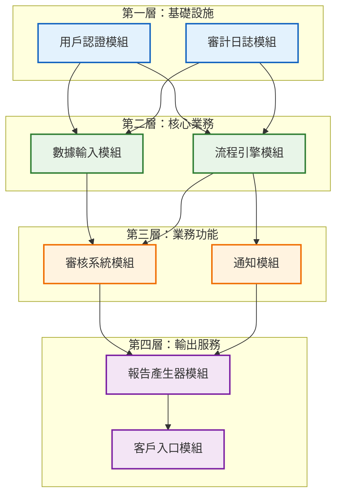
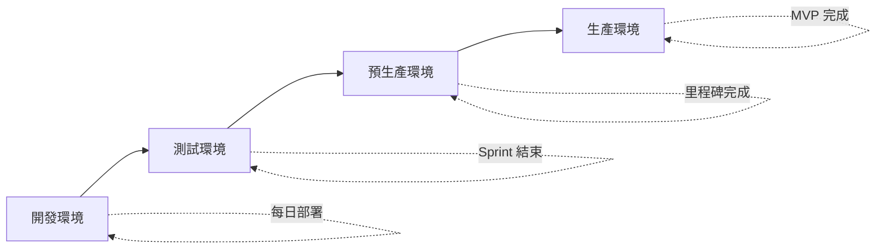

# Hwayo MVP 開發順序與迭代計劃

## 文件資訊
- **文件名稱**: MVP 開發順序與迭代計劃
- **建立日期**: 2025/05/31
- **階段**: 子任務 5.1 - 規劃開發順序與迭代
- **狀態**: 已完成
- **參考文件**: 
  - [`docs/architecture/system_architecture.md`](../architecture/system_architecture.md)
  - [`docs/user_flows/core_user_flows.md`](../user_flows/core_user_flows.md)
  - [`docs/mvp_definition.md`](../mvp_definition.md)
  - [`planning/productBrief.md`](../../planning/productBrief.md)

## 1. 開發順序規劃原則

### 1.1 規劃考量因素

#### 1.1.1 模組依賴分析
基於 [`docs/architecture/system_architecture.md`](../architecture/system_architecture.md) 的模組依賴圖：

#### 1.1.2 業務優先級排序
基於 [`docs/mvp_definition.md`](../mvp_definition.md) 的核心用戶故事：

1. **最高優先級**: US-001 (研究員資料輸入) - 核心業務流程起點
2. **高優先級**: US-002 (研究員報告提交) - 完成輸入到審核的銜接
3. **高優先級**: US-003 (審核人員審核報告) - 核心品質控制流程
4. **中高優先級**: US-004 (審核人員簽核發送) - 完成內部流程
5. **中優先級**: US-005 (客戶報告接收) - 外部客戶服務

#### 1.1.3 技術風險評估

**高風險模組**:
- **報告產生器**: PDF 生成、模板引擎複雜度
- **流程引擎**: 狀態機邏輯、事件處理複雜度

**中風險模組**:
- **用戶認證**: JWT 實現、權限控制
- **通知模組**: 外部服務整合

**低風險模組**:
- **數據輸入**: 標準 CRUD 操作
- **審計日誌**: 簡單記錄功能
- **客戶入口**: 基本檔案下載

#### 1.1.4 團隊資源考量
- **團隊規模**: 2-3 位全端開發人員
- **技能特點**: 可同時處理前後端開發
- **並行能力**: 有限，需要序列化部分開發工作

### 1.2 開發順序決策

基於上述分析，確定以下開發順序：

```mermaid
gantt
    title Hwayo MVP 模組開發順序
    dateFormat  X
    axisFormat %s
    
    section 第一階段：基礎設施
    用戶認證模組     :done, auth, 0, 1
    審計日誌模組     :done, audit, 0, 1
    
    section 第二階段：核心業務
    數據輸入模組     :active, input, 1, 2
    流程引擎模組     :workflow, 1, 3
    
    section 第三階段：業務功能
    審核系統模組     :review, 2, 4
    通知模組        :notify, 3, 4
    
    section 第四階段：輸出服務
    報告產生器模組   :report, 4, 6
    客戶入口模組     :portal, 5, 6
```

## 2. Sprint 迭代規劃

### 2.1 Sprint 配置
- **Sprint 週期**: 2 週
- **總開發時間**: 12 週 (6 個 Sprint)
- **團隊配置**: 2-3 位全端開發人員

### 2.2 詳細 Sprint 計劃

#### Sprint 1 (週 1-2): 基礎設施建立
**主要目標**: 建立專案基礎架構和核心認證功能

**開發內容**:
- **用戶認證模組 (100%)**
  - JWT Token 機制實現
  - 角色權限控制 (研究員、審核人員、管理員、客戶)
  - 登入/登出功能
  - 權限中介層實現
- **審計日誌模組 (100%)**
  - 基本日誌記錄功能
  - 操作追蹤機制
  - 日誌查詢介面
- **專案基礎設施**
  - 資料庫 Schema 建立
  - API 框架搭建
  - 基本前端架構

**預期交付物**:
- 可運行的認證系統
- 基本的系統架構
- 開發環境完整配置

**驗收標準**:
- 用戶可以成功登入/登出
- 權限控制正常運作
- 所有操作都有日誌記錄

#### Sprint 2 (週 3-4): 核心數據流程
**主要目標**: 實現數據輸入和基本工作流程

**開發內容**:
- **數據輸入模組 (100%)**
  - 動態表單系統
  - 檔案上傳功能
  - 數據驗證機制
  - 草稿儲存功能
- **流程引擎模組 (70%)**
  - 基本狀態機實現
  - 流程實例管理
  - 簡單任務分派

**預期交付物**:
- 完整的數據輸入介面
- 基本的工作流程引擎
- 研究員可以建立和編輯檢驗案例

**驗收標準**:
- 研究員可以輸入實驗數據
- 數據可以儲存為草稿
- 基本的流程狀態轉換正常

#### Sprint 3 (週 5-6): 審核流程實現
**主要目標**: 完成審核系統和流程引擎

**開發內容**:
- **流程引擎模組 (30% 剩餘)**
  - 完整的任務分派邏輯
  - 事件觸發機制
  - 流程監控功能
- **審核系統模組 (100%)**
  - 審核任務列表
  - 報告檢視功能
  - 審核意見記錄
  - 審核決策處理 (通過/修正/退回)
- **通知模組 (60%)**
  - Email 通知基礎功能
  - 通知模板系統

**預期交付物**:
- 完整的審核工作流程
- 審核人員操作介面
- 基本通知功能

**驗收標準**:
- 研究員提交報告後自動分派給審核人員
- 審核人員可以檢視和審核報告
- 基本的 Email 通知正常運作

#### Sprint 4 (週 7-8): 通知與報告準備
**主要目標**: 完善通知系統並開始報告生成功能

**開發內容**:
- **通知模組 (40% 剩餘)**
  - 完整的通知觸發邏輯
  - 通知歷史記錄
  - 通知偏好設定
- **報告產生器模組 (60%)**
  - 基本模板引擎
  - PDF 生成功能
  - 企業識別套用
- **系統整合測試**
  - 端到端流程測試
  - 效能優化

**預期交付物**:
- 完整的通知系統
- 基本的報告生成功能
- 系統整合測試通過

**驗收標準**:
- 所有流程節點都有適當通知
- 可以生成基本的 PDF 報告
- 端到端流程運作順暢

#### Sprint 5 (週 9-10): 報告生成與簽核
**主要目標**: 完成報告生成和簽核流程

**開發內容**:
- **報告產生器模組 (40% 剩餘)**
  - 進階模板功能
  - 報告版本管理
  - 簽核記錄整合
- **審核系統模組 (簽核功能增強)**
  - 數位簽核功能
  - 簽核時間戳記
  - 最終審核流程
- **客戶入口模組 (50%)**
  - 基本客戶介面
  - 安全連結機制

**預期交付物**:
- 完整的報告生成系統
- 數位簽核功能
- 客戶入口基礎功能

**驗收標準**:
- 可以生成完整格式的檢驗報告
- 審核人員可以進行數位簽核
- 客戶可以透過安全連結存取

#### Sprint 6 (週 11-12): 客戶入口與系統完善
**主要目標**: 完成客戶入口並進行系統最終優化

**開發內容**:
- **客戶入口模組 (50% 剩餘)**
  - 報告下載功能
  - 歷史查詢功能
  - 安全性增強
- **系統最終優化**
  - 效能調優
  - 安全性檢查
  - 使用者體驗優化
- **測試與部署準備**
  - 完整系統測試
  - 使用者驗收測試
  - 生產環境準備

**預期交付物**:
- 完整的客戶入口系統
- 經過優化的完整系統
- 準備上線的 MVP 版本

**驗收標準**:
- 客戶可以完整使用報告接收功能
- 所有 MVP 功能正常運作
- 系統效能符合要求

## 3. 風險管控與應對策略

### 3.1 技術風險應對

#### 3.1.1 報告產生器風險
**風險**: PDF 生成複雜度高，模板引擎實現困難
**應對策略**:
- Sprint 4 提前開始基礎功能開發
- 選用成熟的 PDF 生成庫 (如 Puppeteer、jsPDF)
- 準備簡化版本作為備案

#### 3.1.2 流程引擎風險
**風險**: 狀態機邏輯複雜，事件處理困難
**應對策略**:
- 採用漸進式開發，先實現基本狀態轉換
- 使用狀態機庫 (如 XState) 降低實現複雜度
- 充分的單元測試覆蓋

### 3.2 進度風險應對

#### 3.2.1 開發進度延遲
**應對策略**:
- 每個 Sprint 預留 20% 緩衝時間
- 關鍵功能優先開發
- 準備功能降級方案

#### 3.2.2 團隊資源不足
**應對策略**:
- 功能優先級明確，可適當調整範圍
- 考慮外部技術支援
- 延長 Sprint 週期至 3 週 (如必要)

## 4. 里程碑定義

### 4.1 主要里程碑

| 里程碑 | 時間點 | 關鍵交付物 | 驗收標準 |
|--------|--------|------------|----------|
| **M1: 基礎架構完成** | Sprint 1 結束 | 認證系統、基礎架構 | 用戶可以登入，基本權限控制運作 |
| **M2: 核心流程可用** | Sprint 3 結束 | 完整的輸入→審核流程 | 端到端的基本檢驗流程可運行 |
| **M3: 報告生成就緒** | Sprint 5 結束 | 報告生成、簽核功能 | 可以產生並簽核完整報告 |
| **M4: MVP 功能完整** | Sprint 6 結束 | 完整 MVP 系統 | 所有核心用戶故事驗收通過 |

### 4.2 每週檢查點

**每週五進行**:
- 進度檢查與風險評估
- 下週工作規劃調整
- 阻塞問題識別與解決

## 5. 並行開發策略

### 5.1 前後端並行開發

由於團隊為全端開發人員，建議採用以下策略：

```mermaid
gantt
    title 前後端並行開發時程
    dateFormat  X
    axisFormat %s
    
    section 後端 API
    認證 API        :done, auth-api, 0, 1
    數據輸入 API    :input-api, 1, 2
    流程引擎 API    :workflow-api, 1, 3
    審核系統 API    :review-api, 2, 4
    
    section 前端介面
    登入介面        :done, auth-ui, 0, 1
    數據輸入介面    :input-ui, 1, 2
    審核介面        :review-ui, 2, 3
    客戶入口介面    :portal-ui, 4, 5
```

### 5.2 開發人員分工建議

**2 人團隊配置**:
- **開發人員 A**: 主要負責後端 API 和核心業務邏輯
- **開發人員 B**: 主要負責前端介面和使用者體驗

**3 人團隊配置**:
- **開發人員 A**: 後端核心模組 (認證、流程引擎)
- **開發人員 B**: 業務功能模組 (數據輸入、審核、報告)
- **開發人員 C**: 前端介面和整合測試

## 6. 品質保證策略

### 6.1 測試策略

#### 6.1.1 單元測試
- **覆蓋率目標**: 80%
- **重點模組**: 用戶認證、流程引擎、報告生成
- **測試工具**: Jest (Node.js), Vitest (前端)

#### 6.1.2 整合測試
- **API 測試**: 每個 Sprint 結束前完成
- **端到端測試**: 關鍵用戶流程覆蓋
- **測試工具**: Supertest (API), Playwright (E2E)

### 6.2 代碼品質

#### 6.2.1 代碼審查
- 所有代碼必須經過 Peer Review
- 使用 Pull Request 工作流程
- 關鍵模組需要資深開發人員審查

#### 6.2.2 靜態分析
- ESLint + Prettier 代碼格式化
- SonarQube 代碼品質檢查
- TypeScript 嚴格模式

## 7. 部署與發布策略

### 7.1 環境策略

### 7.2 發布計劃

- **開發環境**: 每日自動部署
- **測試環境**: 每個 Sprint 結束後部署
- **預生產環境**: 每個里程碑完成後部署
- **生產環境**: MVP 完成後首次部署

## 8. 成功標準與驗收

### 8.1 技術驗收標準

- 所有核心用戶故事功能完整實現
- 系統效能符合 MVP 定義要求
- 安全性檢查通過
- 代碼品質達到標準

### 8.2 業務驗收標準

- 內部用戶 (研究員、審核人員) 可以完成完整檢驗流程
- 客戶可以成功接收和下載報告
- 系統穩定性和可用性符合要求

## 9. 後續規劃

### 9.1 MVP 後優化

- 效能調優和擴展性改善
- 使用者體驗優化
- 額外功能需求評估

### 9.2 Phase 2 準備

- 客戶送件線上化功能規劃
- 進階通知功能 (SMS、即時通訊)
- 系統監控和運維工具

---

**文件狀態**: 已完成  
**下一步行動**: 與開發團隊審閱計劃，確認可行性並開始 Sprint 1 執行