# Hwayo MVP 任務分解與初步估時

## 文件資訊
- **文件名稱**: 任務分解與初步估時
- **建立日期**: 2025/05/31
- **階段**: 子任務 5.2 - 任務分解與初步估時
- **狀態**: 已完成
- **參考文件**: 
  - [`docs/development_plan/mvp_development_sequence_and_sprints.md`](mvp_development_sequence_and_sprints.md)
  - [`docs/mvp_definition.md`](../mvp_definition.md)
  - [`docs/mod/`](../mod/) 目錄下的各模組 MDD 文件
  - [`docs/master_data_model.md`](../master_data_model.md)
  - [`docs/api_specification.yaml`](../api_specification.yaml)
  - [`docs/ui_prototypes/mvp_detailed_prototypes.md`](../ui_prototypes/mvp_detailed_prototypes.md)

## 1. 估時方法與單位

### 1.1 估時單位
採用 **理想人天 (Ideal Person-Days)** 作為估時單位：
- 1 理想人天 = 8 小時專注開發時間
- 不包含會議、溝通、環境問題等干擾因素
- 基於有經驗的全端開發人員能力水平

### 1.2 估時方法
採用 **三點估算法的簡化版**：
- **樂觀估時 (O)**: 最理想情況下的時間
- **最可能估時 (M)**: 最現實的預期時間
- **悲觀估時 (P)**: 考慮風險和複雜度的時間
- **期望估時 (E)**: (O + 4M + P) / 6

### 1.3 複雜度分級
- **簡單 (Simple)**: 標準 CRUD 操作、基本 UI 組件
- **中等 (Medium)**: 業務邏輯實現、API 整合、表單驗證
- **複雜 (Complex)**: 狀態機、PDF 生成、安全機制
- **高複雜 (High)**: 流程引擎、報告模板、權限系統

## 2. Sprint 1 任務分解 (週 1-2): 基礎設施建立

### 2.1 專案基礎設施任務

#### T1.1 專案初始化與環境配置
**描述**: 建立專案結構、配置開發環境、設定基本工具鏈
**複雜度**: 中等
**前後端**: 全端
**估時**: 
- 樂觀: 1.5 天
- 最可能: 2 天  
- 悲觀: 3 天
- **期望估時: 2.1 天**

**子任務**:
- 建立 Node.js + TypeScript 後端專案結構
- 配置 React + TypeScript 前端專案
- 設定 ESLint、Prettier、Husky
- 配置 Jest 測試環境
- 建立基本的 CI/CD pipeline

#### T1.2 資料庫設計與建立
**描述**: 實現完整的資料庫 Schema 和基礎數據
**複雜度**: 中等
**前後端**: 後端
**估時**:
- 樂觀: 1 天
- 最可能: 1.5 天
- 悲觀: 2 天
- **期望估時: 1.5 天**

**子任務**:
- 建立 PostgreSQL 資料庫
- 實現所有表格 Schema (基於 master_data_model.md)
- 建立索引和約束
- 準備基礎種子數據 (角色、權限等)
- 設定資料庫遷移機制

#### T1.3 API 框架搭建
**描述**: 建立 Express.js API 框架和基礎中介層
**複雜度**: 中等
**前後端**: 後端
**估時**:
- 樂觀: 1 天
- 最可能: 1.5 天
- 悲觀: 2.5 天
- **期望估時: 1.7 天**

**子任務**:
- 設定 Express.js 伺服器
- 實現基礎中介層 (CORS, 日誌, 錯誤處理)
- 建立統一的 API 響應格式
- 設定 API 路由結構
- 實現基本的健康檢查端點

### 2.2 用戶認證模組任務

#### T1.4 JWT Token 機制實現
**描述**: 實現 JWT Token 生成、驗證和管理機制
**複雜度**: 複雜
**前後端**: 後端
**估時**:
- 樂觀: 1.5 天
- 最可能: 2 天
- 悲觀: 3 天
- **期望估時: 2.1 天**

**子任務**:
- 實現 JWT Service (生成、驗證、刷新)
- 建立 Token 儲存機制 (Redis)
- 實現 Access Token 和 Refresh Token 邏輯
- 建立 Token 中介層
- 實現 Token 撤銷機制

#### T1.5 用戶認證 API 實現
**描述**: 實現登入、登出、Token 刷新等認證 API
**複雜度**: 中等
**前後端**: 後端
**估時**:
- 樂觀: 1 天
- 最可能: 1.5 天
- 悲觀: 2 天
- **期望估時: 1.5 天**

**子任務**:
- 實現 POST /api/v1/auth/login
- 實現 POST /api/v1/auth/logout
- 實現 POST /api/v1/auth/refresh
- 實現密碼雜湊和驗證
- 建立登入失敗鎖定機制

#### T1.6 角色權限控制系統
**描述**: 實現基於角色的權限控制 (RBAC) 系統
**複雜度**: 複雜
**前後端**: 後端
**估時**:
- 樂觀: 2 天
- 最可能: 2.5 天
- 悲觀: 3.5 天
- **期望估時: 2.7 天**

**子任務**:
- 實現 Permission Service
- 建立權限檢查中介層
- 實現角色權限查詢 API
- 建立權限快取機制
- 實現內部權限驗證 API

#### T1.7 認證前端介面
**描述**: 實現登入、登出等認證相關前端介面
**複雜度**: 簡單
**前後端**: 前端
**估時**:
- 樂觀: 1 天
- 最可能: 1.5 天
- 悲觀: 2 天
- **期望估時: 1.5 天**

**子任務**:
- 建立登入頁面組件
- 實現認證狀態管理 (Context/Redux)
- 建立受保護路由機制
- 實現自動 Token 刷新
- 建立基本的導航組件

### 2.3 審計日誌模組任務

#### T1.8 審計日誌後端實現
**描述**: 實現審計日誌記錄和查詢功能
**複雜度**: 簡單
**前後端**: 後端
**估時**:
- 樂觀: 0.5 天
- 最可能: 1 天
- 悲觀: 1.5 天
- **期望估時: 1 天**

**子任務**:
- 實現 AuditLog Service
- 建立日誌記錄中介層
- 實現日誌查詢 API
- 建立日誌清理機制

#### T1.9 審計日誌前端介面
**描述**: 實現審計日誌查詢和顯示介面
**複雜度**: 簡單
**前後端**: 前端
**估時**:
- 樂觀: 0.5 天
- 最可能: 1 天
- 悲觀: 1.5 天
- **期望估時: 1 天**

**子任務**:
- 建立日誌列表組件
- 實現日誌篩選功能
- 建立日誌詳情檢視

### 2.4 Sprint 1 整合與測試

#### T1.10 Sprint 1 整合測試
**描述**: 進行 Sprint 1 功能的整合測試和 Bug 修復
**複雜度**: 中等
**前後端**: 全端
**估時**:
- 樂觀: 1 天
- 最可能: 1.5 天
- 悲觀: 2.5 天
- **期望估時: 1.7 天**

**子任務**:
- 端到端認證流程測試
- API 整合測試
- 前端功能測試
- 效能基準測試
- Bug 修復和優化

**Sprint 1 總估時: 16.8 理想人天**

## 3. Sprint 2 任務分解 (週 3-4): 核心數據流程

### 3.1 數據輸入模組任務

#### T2.1 動態表單系統後端
**描述**: 實現可配置的動態表單系統後端邏輯
**複雜度**: 複雜
**前後端**: 後端
**估時**:
- 樂觀: 2 天
- 最可能: 3 天
- 悲觀: 4 天
- **期望估時: 3.2 天**

**子任務**:
- 實現表單配置管理
- 建立動態驗證引擎
- 實現表單數據儲存
- 建立表單版本控制
- 實現表單權限控制

#### T2.2 檔案上傳功能
**描述**: 實現安全的檔案上傳、儲存和管理功能
**複雜度**: 中等
**前後端**: 後端
**估時**:
- 樂觀: 1 天
- 最可能: 1.5 天
- 悲觀: 2.5 天
- **期望估時: 1.7 天**

**子任務**:
- 實現檔案上傳 API
- 建立檔案儲存機制
- 實現檔案類型和大小驗證
- 建立檔案安全掃描
- 實現檔案存取權限控制

#### T2.3 數據驗證機制
**描述**: 實現前後端數據驗證和錯誤處理
**複雜度**: 中等
**前後端**: 全端
**估時**:
- 樂觀: 1 天
- 最可能: 1.5 天
- 悲觀: 2 天
- **期望估時: 1.5 天**

**子任務**:
- 建立後端驗證規則引擎
- 實現前端即時驗證
- 建立統一錯誤訊息系統
- 實現驗證錯誤回饋機制

#### T2.4 草稿儲存功能
**描述**: 實現自動草稿儲存和恢復功能
**複雜度**: 中等
**前後端**: 全端
**估時**:
- 樂觀: 1 天
- 最可能: 1.5 天
- 悲觀: 2 天
- **期望估時: 1.5 天**

**子任務**:
- 實現自動儲存機制
- 建立草稿版本管理
- 實現草稿恢復功能
- 建立草稿清理機制

#### T2.5 數據輸入前端介面
**描述**: 實現動態表單前端介面和使用者體驗
**複雜度**: 複雜
**前後端**: 前端
**估時**:
- 樂觀: 2.5 天
- 最可能: 3.5 天
- 悲觀: 4.5 天
- **期望估時: 3.7 天**

**子任務**:
- 建立動態表單渲染引擎
- 實現多種輸入組件 (文字、數字、檔案、日期等)
- 建立表單狀態管理
- 實現拖拽檔案上傳
- 建立表單進度指示器

### 3.2 流程引擎模組任務 (基礎部分)

#### T2.6 基本狀態機實現
**描述**: 實現檢驗流程的基本狀態機邏輯
**複雜度**: 高複雜
**前後端**: 後端
**估時**:
- 樂觀: 2.5 天
- 最可能: 3.5 天
- 悲觀: 5 天
- **期望估時: 3.8 天**

**子任務**:
- 設計狀態機架構
- 實現狀態轉換邏輯
- 建立狀態驗證機制
- 實現狀態歷史記錄
- 建立狀態事件觸發

#### T2.7 流程實例管理
**描述**: 實現工作流程實例的建立和管理
**複雜度**: 複雜
**前後端**: 後端
**估時**:
- 樂觀: 1.5 天
- 最可能: 2 天
- 悲觀: 3 天
- **期望估時: 2.2 天**

**子任務**:
- 實現流程實例建立
- 建立實例狀態追蹤
- 實現實例查詢 API
- 建立實例生命週期管理

#### T2.8 簡單任務分派
**描述**: 實現基本的任務自動分派邏輯
**複雜度**: 中等
**前後端**: 後端
**估時**:
- 樂觀: 1 天
- 最可能: 1.5 天
- 悲觀: 2.5 天
- **期望估時: 1.7 天**

**子任務**:
- 實現基本分派算法
- 建立任務佇列機制
- 實現分派規則配置
- 建立分派歷史記錄

### 3.3 Sprint 2 整合與測試

#### T2.9 Sprint 2 整合測試
**描述**: 進行數據輸入和基本流程的整合測試
**複雜度**: 中等
**前後端**: 全端
**估時**:
- 樂觀: 1 天
- 最可能: 1.5 天
- 悲觀: 2.5 天
- **期望估時: 1.7 天**

**子任務**:
- 端到端數據輸入流程測試
- 狀態機轉換測試
- 檔案上傳功能測試
- 效能和穩定性測試

**Sprint 2 總估時: 20.8 理想人天**

## 4. Sprint 3 任務分解 (週 5-6): 審核流程實現

### 4.1 流程引擎模組任務 (完整實現)

#### T3.1 完整任務分派邏輯
**描述**: 實現智能任務分派和負載均衡算法
**複雜度**: 複雜
**前後端**: 後端
**估時**:
- 樂觀: 1.5 天
- 最可能: 2 天
- 悲觀: 3 天
- **期望估時: 2.2 天**

**子任務**:
- 實現智能分派算法
- 建立負載均衡機制
- 實現專業領域匹配
- 建立分派優先級系統

#### T3.2 事件觸發機制
**描述**: 實現工作流程事件監聽和觸發系統
**複雜度**: 複雜
**前後端**: 後端
**估時**:
- 樂觀: 1.5 天
- 最可能: 2 天
- 悲觀: 2.5 天
- **期望估時: 2 天**

**子任務**:
- 建立事件監聽器
- 實現事件觸發機制
- 建立事件佇列系統
- 實現事件處理器

#### T3.3 流程監控功能
**描述**: 實現流程狀態監控和追蹤功能
**複雜度**: 中等
**前後端**: 後端
**估時**:
- 樂觀: 1 天
- 最可能: 1.5 天
- 悲觀: 2 天
- **期望估時: 1.5 天**

**子任務**:
- 實現流程監控 API
- 建立流程統計功能
- 實現流程瓶頸檢測
- 建立流程報告生成

### 4.2 審核系統模組任務

#### T3.4 審核任務列表後端
**描述**: 實現審核任務的查詢和管理後端邏輯
**複雜度**: 中等
**前後端**: 後端
**估時**:
- 樂觀: 1 天
- 最可能: 1.5 天
- 悲觀: 2 天
- **期望估時: 1.5 天**

**子任務**:
- 實現任務查詢 API
- 建立任務篩選功能
- 實現任務排序機制
- 建立任務統計功能

#### T3.5 報告檢視功能
**描述**: 實現審核人員檢視報告內容的功能
**複雜度**: 中等
**前後端**: 全端
**估時**:
- 樂觀: 1.5 天
- 最可能: 2 天
- 悲觀: 2.5 天
- **期望估時: 2 天**

**子任務**:
- 實現報告檢視 API
- 建立報告渲染組件
- 實現報告註解功能
- 建立報告比較功能

#### T3.6 審核意見記錄
**描述**: 實現審核意見的記錄和管理功能
**複雜度**: 中等
**前後端**: 全端
**估時**:
- 樂觀: 1 天
- 最可能: 1.5 天
- 悲觀: 2 天
- **期望估時: 1.5 天**

**子任務**:
- 實現意見記錄 API
- 建立意見編輯器組件
- 實現意見歷史追蹤
- 建立意見模板系統

#### T3.7 審核決策處理
**描述**: 實現審核決策 (通過/修正/退回) 的處理邏輯
**複雜度**: 複雜
**前後端**: 全端
**估時**:
- 樂觀: 1.5 天
- 最可能: 2 天
- 悲觀: 3 天
- **期望估時: 2.2 天**

**子任務**:
- 實現決策處理 API
- 建立決策驗證機制
- 實現狀態轉換觸發
- 建立決策通知機制

#### T3.8 審核介面實現
**描述**: 實現完整的審核工作台前端介面
**複雜度**: 複雜
**前後端**: 前端
**估時**:
- 樂觀: 2.5 天
- 最可能: 3 天
- 悲觀: 4 天
- **期望估時: 3.2 天**

**子任務**:
- 建立審核任務列表組件
- 實現報告檢視器
- 建立審核意見編輯器
- 實現決策操作介面
- 建立審核進度追蹤

### 4.3 通知模組任務 (基礎功能)

#### T3.9 Email 通知基礎功能
**描述**: 實現基本的 Email 通知發送功能
**複雜度**: 中等
**前後端**: 後端
**估時**:
- 樂觀: 1 天
- 最可能: 1.5 天
- 悲觀: 2 天
- **期望估時: 1.5 天**

**子任務**:
- 設定 Email 服務提供者
- 實現 Email 發送 API
- 建立 Email 佇列機制
- 實現發送狀態追蹤

#### T3.10 通知模板系統
**描述**: 實現可配置的通知模板系統
**複雜度**: 中等
**前後端**: 後端
**估時**:
- 樂觀: 1 天
- 最可能: 1.5 天
- 悲觀: 2 天
- **期望估時: 1.5 天**

**子任務**:
- 建立模板引擎
- 實現模板管理 API
- 建立模板變數系統
- 實現模板預覽功能

### 4.4 Sprint 3 整合與測試

#### T3.11 Sprint 3 整合測試
**描述**: 進行完整審核流程的整合測試
**複雜度**: 中等
**前後端**: 全端
**估時**:
- 樂觀: 1.5 天
- 最可能: 2 天
- 悲觀: 3 天
- **期望估時: 2.2 天**

**子任務**:
- 端到端審核流程測試
- 通知功能測試
- 工作流程引擎測試
- 效能和穩定性測試

**Sprint 3 總估時: 20.8 理想人天**

## 5. Sprint 4 任務分解 (週 7-8): 通知與報告準備

### 5.1 通知模組任務 (完整實現)

#### T4.1 完整通知觸發邏輯
**描述**: 實現基於工作流程事件的自動通知觸發
**複雜度**: 複雜
**前後端**: 後端
**估時**:
- 樂觀: 1.5 天
- 最可能: 2 天
- 悲觀: 2.5 天
- **期望估時: 2 天**

**子任務**:
- 實現事件監聽器
- 建立通知規則引擎
- 實現條件判斷邏輯
- 建立通知去重機制

#### T4.2 通知歷史記錄
**描述**: 實現通知發送歷史的記錄和查詢功能
**複雜度**: 簡單
**前後端**: 全端
**估時**:
- 樂觀: 0.5 天
- 最可能: 1 天
- 悲觀: 1.5 天
- **期望估時: 1 天**

**子任務**:
- 實現通知歷史 API
- 建立歷史查詢介面
- 實現通知狀態追蹤
- 建立通知統計功能

#### T4.3 通知偏好設定
**描述**: 實現用戶通知偏好的設定和管理功能
**複雜度**: 中等
**前後端**: 全端
**估時**:
- 樂觀: 1 天
- 最可能: 1.5 天
- 悲觀: 2 天
- **期望估時: 1.5 天**

**子任務**:
- 實現偏好設定 API
- 建立偏好管理介面
- 實現通知頻率控制
- 建立偏好驗證機制

### 5.2 報告產生器模組任務 (基礎功能)

#### T4.4 基本模板引擎
**描述**: 實現報告模板的解析和渲染引擎
**複雜度**: 高複雜
**前後端**: 後端
**估時**:
- 樂觀: 2.5 天
- 最可能: 3.5 天
- 悲觀: 5 天
- **期望估時: 3.8 天**

**子任務**:
- 選擇和整合模板引擎
- 實現模板解析器
- 建立數據綁定機制
- 實現模板驗證功能
- 建立模板快取系統

#### T4.5 PDF 生成功能
**描述**: 實現 HTML 到 PDF 的轉換功能
**複雜度**: 複雜
**前後端**: 後端
**估時**:
- 樂觀: 2 天
- 最可能: 2.5 天
- 悲觀: 3.5 天
- **期望估時: 2.7 天**

**子任務**:
- 整合 PDF 生成庫 (Puppeteer)
- 實現 PDF 生成 API
- 建立 PDF 樣式控制
- 實現 PDF 品質優化
- 建立 PDF 快取機制

#### T4.6 企業識別套用
**描述**: 實現公司品牌和格式的自動套用功能
**複雜度**: 中等
**前後端**: 後端
**估時**:
- 樂觀: 1 天
- 最可能: 1.5 天
- 悲觀: 2 天
- **期望估時: 1.5 天**

**子任務**:
- 建立品牌資源管理
- 實現 Logo 和浮水印套用
- 建立格式標準化
- 實現頁首頁尾生成

### 5.3 系統整合測試

#### T4.7 端到端流程測試
**描述**: 進行完整業務流程的端到端測試
**複雜度**: 複雜
**前後端**: 全端
**估時**:
- 樂觀: 2 天
- 最可能: 2.5 天
- 悲觀: 3.5 天
- **期望估時: 2.7 天**

**子任務**:
- 建立自動化測試腳本
- 執行完整流程測試
- 進行負載測試
- 執行安全性測試
- 進行相容性測試

#### T4.8 效能優化
**描述**: 進行系統效能分析和優化
**複雜度**: 中等
**前後端**: 全端
**估時**:
- 樂觀: 1 天
- 最可能: 1.5 天
- 悲觀: 2.5 天
- **期望估時: 1.7 天**

**子任務**:
- 進行效能分析
- 優化資料庫查詢
- 實現快取策略
- 優化前端載入速度
- 進行記憶體優化

**Sprint 4 總估時: 16.9 理想人天**

## 6. Sprint 5 任務分解 (週 9-10): 報告生成與簽核

### 6.1 報告產生器模組任務 (進階功能)

#### T5.1 進階模板功能
**描述**: 實現條件渲染、迴圈、計算等進階模板功能
**複雜度**: 複雜
**前後端**: 後端
**估時**:
- 樂觀: 2 天
- 最可能: 2.5 天
- 悲觀: 3.5 天
- **期望估時: 2.7 天**

**子任務**:
- 實現條件渲染邏輯
- 建立迴
- 進行記憶體優化

**Sprint 4 總估時: 16.9 理想人天**

## 6. Sprint 5 任務分解 (週 9-10): 報告生成與簽核

### 6.1 報告產生器模組任務 (進階功能)

#### T5.1 進階模板功能
**描述**: 實現條件渲染、迴圈、計算等進階模板功能
**複雜度**: 複雜
**前後端**: 後端
**估時**:
- 樂觀: 2 天
- 最可能: 2.5 天
- 悲觀: 3.5 天
- **期望估時: 2.7 天**

**子任務**:
- 實現條件渲染邏輯
- 建立迴圈處理機制
- 實現計算表達式
- 建立自定義函數系統
- 實現模板繼承功能

#### T5.2 報告版本管理
**描述**: 實現報告的版本控制和歷史管理功能
**複雜度**: 中等
**前後端**: 後端
**估時**:
- 樂觀: 1 天
- 最可能: 1.5 天
- 悲觀: 2 天
- **期望估時: 1.5 天**

**子任務**:
- 實現版本儲存機制
- 建立版本比較功能
- 實現版本回滾功能
- 建立版本標籤系統
- 實現版本清理機制

#### T5.3 簽核記錄整合
**描述**: 將數位簽核資訊整合到報告生成流程
**複雜度**: 中等
**前後端**: 後端
**估時**:
- 樂觀: 1 天
- 最可能: 1.5 天
- 悲觀: 2 天
- **期望估時: 1.5 天**

**子任務**:
- 實現簽核資訊嵌入
- 建立簽核驗證機制
- 實現簽核時間戳記
- 建立簽核證書管理
- 實現簽核狀態追蹤

### 6.2 審核系統模組任務 (簽核功能增強)

#### T5.4 數位簽核功能
**描述**: 實現審核人員的數位簽核功能
**複雜度**: 複雜
**前後端**: 全端
**估時**:
- 樂觀: 2 天
- 最可能: 2.5 天
- 悲觀: 3.5 天
- **期望估時: 2.7 天**

**子任務**:
- 實現數位簽名機制
- 建立簽核介面組件
- 實現簽核驗證邏輯
- 建立簽核憑證管理
- 實現簽核稽核追蹤

#### T5.5 簽核時間戳記
**描述**: 實現可信任的時間戳記服務
**複雜度**: 中等
**前後端**: 後端
**估時**:
- 樂觀: 0.5 天
- 最可能: 1 天
- 悲觀: 1.5 天
- **期望估時: 1 天**

**子任務**:
- 實現時間戳記服務
- 建立時間同步機制
- 實現時間戳記驗證
- 建立時間稽核日誌

#### T5.6 最終審核流程
**描述**: 實現最終審核和發布流程
**複雜度**: 中等
**前後端**: 全端
**估時**:
- 樂觀: 1 天
- 最可能: 1.5 天
- 悲觀: 2 天
- **期望估時: 1.5 天**

**子任務**:
- 實現最終審核邏輯
- 建立發布前檢查
- 實現自動發布機制
- 建立發布狀態追蹤

### 6.3 客戶入口模組任務 (基礎功能)

#### T5.7 基本客戶介面
**描述**: 實現客戶入口的基本介面和功能
**複雜度**: 中等
**前後端**: 全端
**估時**:
- 樂觀: 1.5 天
- 最可能: 2 天
- 悲觀: 2.5 天
- **期望估時: 2 天**

**子任務**:
- 建立客戶入口頁面
- 實現客戶認證機制
- 建立基本導航功能
- 實現響應式設計
- 建立客戶支援功能

#### T5.8 安全連結機制
**描述**: 實現安全的報告存取連結生成和驗證
**複雜度**: 複雜
**前後端**: 後端
**估時**:
- 樂觀: 1.5 天
- 最可能: 2 天
- 悲觀: 2.5 天
- **期望估時: 2 天**

**子任務**:
- 實現安全 Token 生成
- 建立連結過期機制
- 實現存取權限驗證
- 建立連結使用追蹤
- 實現連結撤銷功能

### 6.4 Sprint 5 整合與測試

#### T5.9 Sprint 5 整合測試
**描述**: 進行報告生成和簽核流程的整合測試
**複雜度**: 中等
**前後端**: 全端
**估時**:
- 樂觀: 1.5 天
- 最可能: 2 天
- 悲觀: 2.5 天
- **期望估時: 2 天**

**子任務**:
- 測試完整報告生成流程
- 驗證數位簽核功能
- 測試客戶存取機制
- 進行安全性測試
- 執行效能測試

**Sprint 5 總估時: 16.9 理想人天**

## 7. Sprint 6 任務分解 (週 11-12): 客戶入口與系統完善

### 7.1 客戶入口模組任務 (完整實現)

#### T6.1 報告下載功能
**描述**: 實現客戶報告下載和檢視功能
**複雜度**: 中等
**前後端**: 全端
**估時**:
- 樂觀: 1 天
- 最可能: 1.5 天
- 悲觀: 2 天
- **期望估時: 1.5 天**

**子任務**:
- 實現報告下載 API
- 建立報告檢視器
- 實現下載權限控制
- 建立下載歷史記錄
- 實現下載統計功能

#### T6.2 歷史查詢功能
**描述**: 實現客戶歷史報告的查詢和管理功能
**複雜度**: 中等
**前後端**: 全端
**估時**:
- 樂觀: 1 天
- 最可能: 1.5 天
- 悲觀: 2 天
- **期望估時: 1.5 天**

**子任務**:
- 實現歷史查詢 API
- 建立查詢篩選功能
- 實現分頁和排序
- 建立查詢結果快取
- 實現查詢統計功能

#### T6.3 安全性增強
**描述**: 強化客戶入口的安全性措施
**複雜度**: 複雜
**前後端**: 全端
**估時**:
- 樂觀: 1.5 天
- 最可能: 2 天
- 悲觀: 2.5 天
- **期望估時: 2 天**

**子任務**:
- 實現進階存取控制
- 建立異常行為檢測
- 實現 IP 白名單功能
- 建立安全稽核日誌
- 實現自動安全掃描

### 7.2 系統最終優化

#### T6.4 效能調優
**描述**: 進行全系統的效能分析和優化
**複雜度**: 複雜
**前後端**: 全端
**估時**:
- 樂觀: 2 天
- 最可能: 2.5 天
- 悲觀: 3.5 天
- **期望估時: 2.7 天**

**子任務**:
- 進行效能瓶頸分析
- 優化資料庫查詢效能
- 實現進階快取策略
- 優化前端載入效能
- 進行記憶體和 CPU 優化

#### T6.5 安全性檢查
**描述**: 進行全面的安全性檢查和加固
**複雜度**: 複雜
**前後端**: 全端
**估時**:
- 樂觀: 1.5 天
- 最可能: 2 天
- 悲觀: 2.5 天
- **期望估時: 2 天**

**子任務**:
- 執行安全漏洞掃描
- 進行滲透測試
- 檢查資料加密實現
- 驗證存取控制機制
- 進行合規性檢查

#### T6.6 使用者體驗優化
**描述**: 優化整體使用者體驗和介面設計
**複雜度**: 中等
**前後端**: 前端
**估時**:
- 樂觀: 1.5 天
- 最可能: 2 天
- 悲觀: 2.5 天
- **期望估時: 2 天**

**子任務**:
- 進行使用者體驗測試
- 優化介面響應速度
- 改善錯誤處理體驗
- 實現無障礙功能
- 優化行動裝置體驗

### 7.3 測試與部署準備

#### T6.7 完整系統測試
**描述**: 進行全面的系統功能和整合測試
**複雜度**: 複雜
**前後端**: 全端
**估時**:
- 樂觀: 2 天
- 最可能: 2.5 天
- 悲觀: 3.5 天
- **期望估時: 2.7 天**

**子任務**:
- 執行完整功能測試
- 進行跨瀏覽器測試
- 執行負載和壓力測試
- 進行災難恢復測試
- 執行使用者驗收測試

#### T6.8 使用者驗收測試
**描述**: 與實際使用者進行驗收測試和回饋收集
**複雜度**: 中等
**前後端**: 全端
**估時**:
- 樂觀: 1 天
- 最可能: 1.5 天
- 悲觀: 2 天
- **期望估時: 1.5 天**

**子任務**:
- 準備測試環境和數據
- 執行使用者驗收測試
- 收集和分析使用者回饋
- 進行必要的調整和修正
- 完成驗收文件

#### T6.9 生產環境準備
**描述**: 準備生產環境部署和上線
**複雜度**: 中等
**前後端**: 全端
**估時**:
- 樂觀: 1 天
- 最可能: 1.5 天
- 悲觀: 2 天
- **期望估時: 1.5 天**

**子任務**:
- 配置生產環境
- 準備部署腳本
- 建立監控和告警
- 準備備份和恢復機制
- 完成上線檢查清單

**Sprint 6 總估時: 16.9 理想人天**

## 8. 總體估時摘要

### 8.1 各 Sprint 估時總覽

| Sprint | 週期 | 主要目標 | 估時 (理想人天) | 實際工作天數 |
|--------|------|----------|----------------|-------------|
| Sprint 1 | 週 1-2 | 基礎設施建立 | 16.8 | 10 |
| Sprint 2 | 週 3-4 | 核心數據流程 | 20.8 | 10 |
| Sprint 3 | 週 5-6 | 審核流程實現 | 20.8 | 10 |
| Sprint 4 | 週 7-8 | 通知與報告準備 | 16.9 | 10 |
| Sprint 5 | 週 9-10 | 報告生成與簽核 | 16.9 | 10 |
| Sprint 6 | 週 11-12 | 客戶入口與系統完善 | 16.9 | 10 |
| **總計** | **12 週** | **完整 MVP 系統** | **109.1** | **60** |

### 8.2 團隊配置建議

#### 2 人團隊配置
- **每 Sprint 可用工時**: 2 人 × 10 天 × 8 小時 = 160 小時
- **理想工時需求**: 平均 18.2 天 × 8 小時 = 145.6 小時
- **緩衝比例**: 約 10%
- **可行性**: 可行，但需要嚴格的時間管理

#### 3 人團隊配置
- **每 Sprint 可用工時**: 3 人 × 10 天 × 8 小時 = 240 小時
- **理想工時需求**: 平均 18.2 天 × 8 小時 = 145.6 小時
- **緩衝比例**: 約 65%
- **可行性**: 非常可行，有充足的緩衝時間

### 8.3 風險評估與緩解策略

#### 高風險任務
1. **T2.6 基本狀態機實現** (3.8 天)
   - **風險**: 狀態機邏輯複雜度高
   - **緩解**: 採用成熟的狀態機庫，充分的單元測試

2. **T4.4 基本模板引擎** (3.8 天)
   - **風險**: 模板引擎整合複雜
   - **緩解**: 選用成熟的模板引擎，準備簡化版本

3. **T4.5 PDF 生成功能** (2.7 天)
   - **風險**: PDF 生成品質和效能問題
   - **緩解**: 使用 Puppeteer，準備備用方案

#### 中風險任務
1. **T2.5 數據輸入前端介面** (3.7 天)
   - **風險**: 動態表單複雜度
   - **緩解**: 採用成熟的表單庫，分階段實現

2. **T3.8 審核介面實現** (3.2 天)
   - **風險**: 使用者體驗設計複雜
   - **緩解**: 參考現有設計模式，進行使用者測試

### 8.4 品質保證策略

#### 測試覆蓋率目標
- **單元測試**: 80% 以上
- **整合測試**: 關鍵業務流程 100%
- **端到端測試**: 核心用戶故事 100%

#### 代碼審查要求
- 所有代碼必須經過 Peer Review
- 關鍵模組需要資深開發人員審查
- 使用自動化代碼品質檢查工具

#### 持續整合策略
- 每日自動建置和測試
- 自動化部署到測試環境
- 自動化安全掃描和品質檢查

## 9. 依賴關係與關鍵路徑

### 9.1 跨 Sprint 依賴關係

```mermaid
gantt
    title 關鍵任務依賴關係
    dateFormat  X
    axisFormat %s
    
    section Sprint 1
    認證系統        :crit, auth, 0, 3
    審計日誌        :audit, 0, 2
    
    section Sprint 2
    數據輸入        :input, after auth, 4
    基礎流程引擎    :workflow1, after auth, 4
    
    section Sprint 3
    完整流程引擎    :workflow2, after workflow1, 3
    審核系統        :review, after workflow1, 4
    基礎通知        :notify1, after workflow1, 2
    
    section Sprint 4
    完整通知        :notify2, after notify1, 2
    基礎報告        :report1, after review, 4
    
    section Sprint 5
    完整報告        :report2, after report1, 3
    簽核功能        :sign, after report1, 3
    基礎客戶入口    :portal1, after sign, 2
    
    section Sprint 6
    完整客戶入口    :portal2, after portal1, 2
    系統優化        :optimize, after portal2, 4
```

### 9.2 關鍵路徑分析

**關鍵路徑**: 認證系統 → 流程引擎 → 審核系統 → 報告生成 → 簽核功能 → 客戶入口

**關鍵路徑總時間**: 約 19.5 理想人天

**非關鍵任務**: 審計日誌、通知系統、系統優化等可以並行開發

## 10. 成功標準與驗收條件

### 10.1 功能驗收標準

#### Sprint 1 驗收標準
- [ ] 用戶可以成功登入/登出系統
- [ ] 角色權限控制正常運作
- [ ] 所有操作都有審計日誌記錄
- [ ] 基本 API 框架運作正常

#### Sprint 2 驗收標準
- [ ] 研究員可以輸入和儲存實驗數據
- [ ] 動態表單系統正常運作
- [ ] 檔案上傳功能正常
- [ ] 基本工作流程狀態轉換正常

#### Sprint 3 驗收標準
- [ ] 完整的審核工作流程運作
- [ ] 任務自動分派功能正常
- [ ] 審核人員可以檢視和審核報告
- [ ] Email 通知功能正常

#### Sprint 4 驗收標準
- [ ] 完整的通知系統運作
- [ ] 可以生成基本的 PDF 報告
- [ ] 端到端流程運作順暢
- [ ] 系統效能符合要求

#### Sprint 5 驗收標準
- [ ] 可以生成完整格式的檢驗報告
- [ ] 數位簽核功能正常
- [ ] 客戶可以透過安全連結存取報告
- [ ] 報告版本管理正常

#### Sprint 6 驗收標準
- [ ] 客戶可以完整使用報告接收功能
- [ ] 所有 MVP 功能正常運作
- [ ] 系統效能和安全性符合要求
- [ ] 使用者驗收測試通過

### 10.2 技術驗收標準

#### 效能標準
- 系統回應時間 < 3 秒
- 支援同時 10 位用戶操作
- 系統可用性 > 95%

#### 品質標準
- 單元測試覆蓋率 > 80%
- 零關鍵安全漏洞
- 代碼品質評分 > B 級

#### 安全標準
- 通過基本安全掃描
- 實現適當的存取控制
- 敏感資料加密儲存

## 11. 結論與建議

### 11.1 估時總結

本次任務分解將 Hwayo MVP 開發工作細分為 **6 個 Sprint**，總計 **109.1 理想人天**的開發工作量。基於 2-3 人的全端開發團隊配置，預計需要 **12 週**完成。

### 11.2 關鍵建議

1. **優先處理高風險任務**: 特別是流程引擎和報告生成器模組
2. **保持充足的緩衝時間**: 建議每個 Sprint 預留 20% 的緩衝時間
3. **重視測試和品質保證**: 確保每個 Sprint 都有充分的測試時間
4. **定期檢視和調整**: 每週進行進度檢查和風險評估

### 11.3 下一步行動

1. 與開發團隊審閱任務分解和估時
2. 確認團隊技能和資源配置
3. 調整任務優先級和分配
4. 開始 Sprint 1 的詳細規劃和執行

---

**文件狀態**: 已完成  
**下一步行動**: 與開發團隊確認估時合理性，開始詳細環境配置定義 (子任務 5.3)