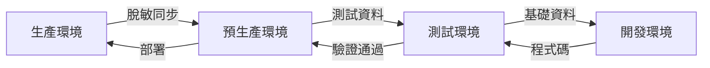

# 初步環境概述文件

## 文件資訊
- **專案名稱**: Hwayo 檢驗流程線上化系統
- **文件版本**: v1.0
- **建立日期**: 2025/05/30
- **最後更新**: 2025/05/30

## 1. 環境類型定義

### 1.1 開發環境 (Development)
**用途**: 開發人員日常開發和單元測試
**特性**:
- 快速部署和重啟
- 詳細的除錯資訊
- 模擬資料和服務
- 開發工具整合

**主要用戶**: 開發團隊

### 1.2 測試環境 (Testing/QA)
**用途**: 功能測試、整合測試、用戶驗收測試
**特性**:
- 接近生產環境配置
- 測試資料管理
- 自動化測試執行
- 效能監控

**主要用戶**: QA 團隊、業務用戶

### 1.3 預生產環境 (Staging/Pre-production)
**用途**: 最終驗證、部署演練、效能測試
**特性**:
- 與生產環境完全一致
- 生產級資料 (脫敏)
- 完整監控系統
- 災備測試

**主要用戶**: DevOps 團隊、業務負責人

### 1.4 生產環境 (Production)
**用途**: 正式服務運行
**特性**:
- 高可用性配置
- 完整安全措施
- 即時監控告警
- 備份和災備

**主要用戶**: 最終用戶、運維團隊

## 2. 環境架構概述

### 2.1 基礎架構需求

#### 2.1.1 計算資源
- **開發環境**: 中等規格，支援快速迭代
- **測試環境**: 中高規格，支援並行測試
- **預生產環境**: 生產級規格
- **生產環境**: 高規格，支援業務負載

#### 2.1.2 儲存需求
- **資料庫**: 關聯式資料庫 (PostgreSQL/MySQL)
- **檔案儲存**: 物件儲存服務 (報告、附件)
- **快取**: Redis/Memcached
- **備份**: 自動化備份策略

#### 2.1.3 網路配置
- **安全性**: VPN、防火牆、SSL/TLS
- **負載均衡**: 應用層負載均衡
- **CDN**: 靜態資源分發 (生產環境)

### 2.2 應用架構

#### 2.2.1 前端應用
- **技術棧**: React/Vue.js + TypeScript
- **部署**: Nginx 靜態檔案服務
- **環境配置**: 環境變數注入

#### 2.2.2 後端服務
- **技術棧**: Node.js/Python/Java (待確定)
- **架構**: RESTful API + 微服務 (可選)
- **容器化**: Docker + Kubernetes (可選)

#### 2.2.3 資料層
- **主資料庫**: 業務資料儲存
- **快取層**: 效能優化
- **檔案儲存**: 報告和附件管理

## 3. 環境特定需求

### 3.1 開發環境特殊需求
- **本地開發**: Docker Compose 支援
- **熱重載**: 開發效率優化
- **除錯工具**: 整合開發環境支援
- **模擬服務**: 第三方服務模擬

### 3.2 測試環境特殊需求
- **測試資料**: 自動化測試資料生成
- **並行測試**: 支援多分支同時測試
- **測試報告**: 自動化測試結果收集
- **效能監控**: 基本效能指標追蹤

### 3.3 預生產環境特殊需求
- **資料同步**: 生產資料脫敏同步
- **監控系統**: 完整監控配置
- **災備演練**: 定期災備測試
- **安全掃描**: 自動化安全檢測

### 3.4 生產環境特殊需求
- **高可用性**: 多節點部署
- **自動擴展**: 基於負載的自動擴展
- **監控告警**: 24/7 監控和告警
- **備份策略**: 多層次備份機制

## 4. 資料管理策略

### 4.1 資料分類
- **業務資料**: 檢驗記錄、報告、用戶資料
- **系統資料**: 日誌、配置、監控資料
- **臨時資料**: 快取、會話資料

### 4.2 環境間資料流向

### 4.3 資料安全要求
- **加密**: 敏感資料加密儲存
- **存取控制**: 基於角色的資料存取
- **稽核**: 資料存取日誌記錄
- **合規**: 符合資料保護法規

## 5. 部署策略

### 5.1 部署流程
1. **開發環境**: 持續整合 (CI)
2. **測試環境**: 自動化部署 + 測試
3. **預生產環境**: 手動部署 + 驗證
4. **生產環境**: 藍綠部署/金絲雀部署

### 5.2 版本控制
- **Git 分支策略**: GitFlow 或 GitHub Flow
- **版本標籤**: 語義化版本控制
- **發布管理**: 自動化發布流程

## 6. 監控與維運

### 6.1 監控指標
- **應用效能**: 回應時間、吞吐量、錯誤率
- **系統資源**: CPU、記憶體、磁碟、網路
- **業務指標**: 用戶活躍度、功能使用率

### 6.2 日誌管理
- **集中化日誌**: ELK Stack 或類似方案
- **日誌等級**: 開發環境詳細，生產環境精簡
- **日誌保留**: 符合合規要求的保留策略

### 6.3 告警機制
- **即時告警**: 關鍵指標異常告警
- **告警分級**: 不同嚴重程度的處理流程
- **告警通道**: Email、SMS、即時通訊

## 7. 安全考量

### 7.1 網路安全
- **防火牆**: 網路層安全控制
- **VPN**: 安全遠端存取
- **SSL/TLS**: 資料傳輸加密

### 7.2 應用安全
- **身份驗證**: 強化的用戶認證
- **授權控制**: 細粒度權限管理
- **資料驗證**: 輸入資料安全檢查

### 7.3 合規要求
- **資料保護**: 個人資料保護法規遵循
- **稽核追蹤**: 完整的操作記錄
- **備份恢復**: 資料安全和業務連續性

## 8. 成本考量

### 8.1 基礎設施成本
- **雲端服務**: 按需付費模式
- **資源優化**: 自動擴展和縮減
- **成本監控**: 定期成本分析和優化

### 8.2 維運成本
- **自動化**: 減少人工維運成本
- **監控**: 預防性維護降低故障成本
- **培訓**: 團隊技能提升投資

## 9. 後續規劃

### 9.1 短期目標 (MVP 階段)
- 建立基本的四環境架構
- 實現基本的 CI/CD 流程
- 建立基礎監控和告警

### 9.2 中期目標 (Phase 1-2)
- 完善監控和日誌系統
- 實現自動化擴展
- 強化安全措施

### 9.3 長期目標 (Phase 3+)
- 多地區部署
- 災備中心建設
- 進階 AI 運維

## 10. 風險評估

### 10.1 技術風險
- **單點故障**: 通過冗餘設計緩解
- **效能瓶頸**: 通過監控和優化預防
- **安全漏洞**: 通過定期安全檢測防範

### 10.2 業務風險
- **服務中斷**: 通過高可用性設計降低
- **資料遺失**: 通過多層備份保護
- **合規風險**: 通過定期合規檢查確保

### 10.3 緩解策略
- **定期演練**: 災備和故障恢復演練
- **持續改進**: 基於監控資料的持續優化
- **知識管理**: 文件化和知識分享