# Hwayo 檢驗管理系統 - 主數據模型 (SOT)

## 文件資訊
- **文件名稱**: 主數據模型 (Master Data Model)
- **建立日期**: 2025/05/31
- **階段**: 子任務 4.1 - 設計詳細數據模型並確立 SOT
- **狀態**: 已完成
- **版本**: 1.0
- **參考文件**: 
  - [`docs/user_flows/core_user_flows.md`](user_flows/core_user_flows.md)
  - [`docs/architecture/system_architecture.md`](architecture/system_architecture.md)
  - [`planning/productBrief.md`](../planning/productBrief.md)
  - 各模組 MDD 文件 (位於 `docs/mod/` 目錄下)

## SOT 聲明 (Source of Truth Declaration)

**本文件為 Hwayo 檢驗管理系統的數據模型唯一真實來源 (SOT)。**

所有系統開發、數據庫設計、API 接口設計、模組實作等相關工作，在涉及數據結構時，必須以本文件為準。任何對數據模型的變更，都必須先更新本文件，並通知所有相關開發人員。

### SOT 適用範圍
- 數據庫 Schema 設計
- API 請求/響應數據結構
- 前端數據模型定義
- 模組間數據交換格式
- 數據遷移腳本設計
- 測試數據準備

## 1. 數據模型概述

### 1.1 設計原則
1. **一致性**: 統一的命名規範和數據類型使用
2. **完整性**: 完整的約束條件和關係定義
3. **可擴展性**: 為未來功能擴展預留空間
4. **效能優化**: 基於查詢模式設計索引策略
5. **安全性**: 敏感數據標識和保護機制

### 1.2 命名規範
- **表名**: 使用複數形式，snake_case (例如: `users`, `test_reports`)
- **欄位名**: 使用 snake_case (例如: `user_id`, `created_at`)
- **主鍵**: 統一使用 `id` 作為主鍵名稱
- **外鍵**: 使用 `[referenced_table]_id` 格式 (例如: `user_id`, `workflow_instance_id`)
- **時間戳**: 統一使用 `created_at`, `updated_at`, `deleted_at`

### 1.3 數據類型標準 (PostgreSQL)
- **主鍵**: `BIGSERIAL PRIMARY KEY`
- **外鍵**: `BIGINT`
- **字串**: `VARCHAR(n)` 或 `TEXT`
- **時間戳**: `TIMESTAMP WITH TIME ZONE`
- **布林值**: `BOOLEAN`
- **JSON 數據**: `JSONB`
- **枚舉**: `VARCHAR(50)` 配合 CHECK 約束

## 2. 核心實體關係圖 (ERD)

### 2.1 主要實體關係圖

```mermaid
erDiagram
    %% 用戶管理相關實體
    users {
        bigserial id PK
        varchar username UK
        varchar email UK
        varchar password_hash
        varchar full_name
        varchar phone
        boolean is_active
        timestamp created_at
        timestamp updated_at
        timestamp deleted_at
    }
    
    roles {
        bigserial id PK
        varchar name UK
        varchar description
        jsonb permissions
        boolean is_active
        timestamp created_at
        timestamp updated_at
    }
    
    user_roles {
        bigserial id PK
        bigint user_id FK
        bigint role_id FK
        timestamp assigned_at
        bigint assigned_by FK
        timestamp expires_at
    }
    
    %% 檢驗業務相關實體
    test_cases {
        bigserial id PK
        varchar case_number UK
        varchar title
        text description
        varchar test_type
        varchar priority
        varchar status
        bigint created_by FK
        bigint assigned_to FK
        timestamp due_date
        jsonb metadata
        timestamp created_at
        timestamp updated_at
        timestamp deleted_at
    }
    
    form_templates {
        bigserial id PK
        varchar name UK
        varchar version
        text description
        jsonb schema
        jsonb ui_schema
        varchar status
        bigint created_by FK
        timestamp created_at
        timestamp updated_at
    }
    
    data_records {
        bigserial id PK
        bigint test_case_id FK
        bigint form_template_id FK
        jsonb form_data
        varchar status
        bigint created_by FK
        bigint last_modified_by FK
        timestamp created_at
        timestamp updated_at
        timestamp deleted_at
    }
    
    file_attachments {
        bigserial id PK
        bigint data_record_id FK
        varchar original_filename
        varchar stored_filename
        varchar file_path
        varchar mime_type
        bigint file_size
        varchar checksum
        bigint uploaded_by FK
        timestamp uploaded_at
        timestamp deleted_at
    }
    
    %% 工作流程相關實體
    workflow_definitions {
        bigserial id PK
        varchar name UK
        varchar version
        text description
        jsonb definition
        varchar status
        bigint created_by FK
        timestamp created_at
        timestamp updated_at
    }
    
    workflow_instances {
        bigserial id PK
        bigint workflow_definition_id FK
        bigint test_case_id FK
        varchar current_state
        jsonb state_data
        varchar status
        bigint initiated_by FK
        timestamp started_at
        timestamp completed_at
        timestamp created_at
        timestamp updated_at
    }
    
    workflow_tasks {
        bigserial id PK
        bigint workflow_instance_id FK
        varchar task_type
        varchar task_name
        text description
        varchar status
        varchar priority
        bigint assigned_to FK
        bigint assigned_by FK
        jsonb task_data
        timestamp assigned_at
        timestamp due_date
        timestamp started_at
        timestamp completed_at
        timestamp created_at
        timestamp updated_at
    }
    
    %% 審核相關實體
    review_tasks {
        bigserial id PK
        bigint workflow_task_id FK
        bigint data_record_id FK
        bigint reviewer_id FK
        varchar review_type
        varchar status
        varchar priority
        timestamp assigned_at
        timestamp due_date
        timestamp started_at
        timestamp completed_at
        timestamp created_at
        timestamp updated_at
    }
    
    review_comments {
        bigserial id PK
        bigint review_task_id FK
        bigint reviewer_id FK
        varchar comment_type
        text content
        varchar field_path
        varchar severity
        varchar status
        bigint parent_comment_id FK
        timestamp created_at
        timestamp updated_at
        timestamp deleted_at
    }
    
    digital_signatures {
        bigserial id PK
        bigint review_task_id FK
        bigint signer_id FK
        varchar signature_type
        text signature_data
        varchar certificate_info
        timestamp signed_at
        varchar ip_address
        varchar user_agent
        timestamp created_at
    }
    
    %% 報告相關實體
    report_templates {
        bigserial id PK
        varchar name UK
        varchar version
        text description
        text template_content
        jsonb template_variables
        varchar format_type
        varchar status
        bigint created_by FK
        timestamp created_at
        timestamp updated_at
    }
    
    test_reports {
        bigserial id PK
        bigint test_case_id FK
        bigint report_template_id FK
        varchar report_number UK
        varchar title
        varchar status
        varchar format_type
        text file_path
        bigint file_size
        varchar checksum
        bigint generated_by FK
        timestamp generated_at
        timestamp published_at
        timestamp created_at
        timestamp updated_at
        timestamp deleted_at
    }
    
    %% 客戶相關實體
    customers {
        bigserial id PK
        varchar customer_code UK
        varchar company_name
        varchar contact_person
        varchar email
        varchar phone
        text address
        varchar status
        jsonb preferences
        timestamp created_at
        timestamp updated_at
        timestamp deleted_at
    }
    
    customer_access_tokens {
        bigserial id PK
        bigint customer_id FK
        bigint test_report_id FK
        varchar token_hash UK
        varchar access_type
        timestamp expires_at
        integer max_downloads
        integer download_count
        varchar ip_whitelist
        varchar status
        bigint created_by FK
        timestamp created_at
        timestamp last_accessed_at
    }
    
    report_downloads {
        bigserial id PK
        bigint customer_access_token_id FK
        bigint test_report_id FK
        bigint customer_id FK
        varchar ip_address
        varchar user_agent
        varchar download_method
        timestamp downloaded_at
    }
    
    %% 通知相關實體
    notification_templates {
        bigserial id PK
        varchar name UK
        varchar type
        varchar channel
        varchar subject_template
        text content_template
        jsonb variables
        varchar status
        bigint created_by FK
        timestamp created_at
        timestamp updated_at
    }
    
    notifications {
        bigserial id PK
        bigint template_id FK
        bigint recipient_id FK
        varchar channel
        varchar subject
        text content
        varchar status
        varchar priority
        jsonb metadata
        timestamp scheduled_at
        timestamp sent_at
        timestamp delivered_at
        timestamp read_at
        integer retry_count
        text error_message
        timestamp created_at
        timestamp updated_at
    }
    
    %% 審計日誌相關實體
    audit_logs {
        bigserial id PK
        varchar event_type
        varchar entity_type
        bigint entity_id
        bigint user_id FK
        varchar action
        jsonb old_values
        jsonb new_values
        varchar ip_address
        varchar user_agent
        varchar session_id
        timestamp created_at
    }
    
    security_events {
        bigserial id PK
        varchar event_type
        varchar severity
        bigint user_id FK
        varchar ip_address
        varchar user_agent
        text description
        jsonb event_data
        varchar status
        timestamp detected_at
        timestamp resolved_at
        bigint resolved_by FK
        timestamp created_at
    }
    
    %% 關係定義
    users ||--o{ user_roles : "has"
    roles ||--o{ user_roles : "assigned_to"
    users ||--o{ user_roles : "assigned_by"
    
    users ||--o{ test_cases : "creates"
    users ||--o{ test_cases : "assigned_to"
    
    users ||--o{ form_templates : "creates"
    form_templates ||--o{ data_records : "uses"
    test_cases ||--o{ data_records : "contains"
    users ||--o{ data_records : "creates"
    users ||--o{ data_records : "modifies"
    
    data_records ||--o{ file_attachments : "contains"
    users ||--o{ file_attachments : "uploads"
    
    users ||--o{ workflow_definitions : "creates"
    workflow_definitions ||--o{ workflow_instances : "instantiated_as"
    test_cases ||--o{ workflow_instances : "follows"
    users ||--o{ workflow_instances : "initiates"
    
    workflow_instances ||--o{ workflow_tasks : "contains"
    users ||--o{ workflow_tasks : "assigned_to"
    users ||--o{ workflow_tasks : "assigned_by"
    
    workflow_tasks ||--o{ review_tasks : "creates"
    data_records ||--o{ review_tasks : "reviews"
    users ||--o{ review_tasks : "assigned_to"
    
    review_tasks ||--o{ review_comments : "contains"
    users ||--o{ review_comments : "creates"
    review_comments ||--o{ review_comments : "replies_to"
    
    review_tasks ||--o{ digital_signatures : "signed_with"
    users ||--o{ digital_signatures : "signs"
    
    users ||--o{ report_templates : "creates"
    test_cases ||--o{ test_reports : "generates"
    report_templates ||--o{ test_reports : "uses"
    users ||--o{ test_reports : "generates"
    
    customers ||--o{ customer_access_tokens : "has"
    test_reports ||--o{ customer_access_tokens : "accessible_via"
    users ||--o{ customer_access_tokens : "creates"
    
    customer_access_tokens ||--o{ report_downloads : "enables"
    test_reports ||--o{ report_downloads : "downloaded_as"
    customers ||--o{ report_downloads : "downloads"
    
    users ||--o{ notification_templates : "creates"
    notification_templates ||--o{ notifications : "uses"
    users ||--o{ notifications : "receives"
    
    users ||--o{ audit_logs : "performs"
    users ||--o{ security_events : "triggers"
    users ||--o{ security_events : "resolves"
```



## 3. 詳細數據字典

### 3.1 用戶管理模組

#### 3.1.1 users (用戶表)
| 欄位名 | 數據類型 | 約束 | 描述 | 備註 |
|--------|----------|------|------|------|
| id | BIGSERIAL | PRIMARY KEY | 用戶唯一識別碼 | 自動遞增主鍵 |
| username | VARCHAR(50) | NOT NULL, UNIQUE | 用戶名稱 | 登入用，3-50字元 |
| email | VARCHAR(255) | NOT NULL, UNIQUE | 電子郵件 | 用於通知和登入 |
| password_hash | VARCHAR(255) | NOT NULL | 密碼雜湊值 | 使用 bcrypt 加密 |
| full_name | VARCHAR(100) | NOT NULL | 完整姓名 | 顯示用 |
| phone | VARCHAR(20) | NULL | 電話號碼 | 可選，用於緊急聯絡 |
| is_active | BOOLEAN | NOT NULL DEFAULT TRUE | 帳戶狀態 | 軟刪除標記 |
| created_at | TIMESTAMP WITH TIME ZONE | NOT NULL DEFAULT NOW() | 建立時間 | 自動設定 |
| updated_at | TIMESTAMP WITH TIME ZONE | NOT NULL DEFAULT NOW() | 更新時間 | 觸發器自動更新 |
| deleted_at | TIMESTAMP WITH TIME ZONE | NULL | 刪除時間 | 軟刪除時間戳 |

**索引策略:**
- PRIMARY KEY: `id`
- UNIQUE INDEX: `username`, `email`
- INDEX: `is_active`, `created_at`

#### 3.1.2 roles (角色表)
| 欄位名 | 數據類型 | 約束 | 描述 | 備註 |
|--------|----------|------|------|------|
| id | BIGSERIAL | PRIMARY KEY | 角色唯一識別碼 | 自動遞增主鍵 |
| name | VARCHAR(50) | NOT NULL, UNIQUE | 角色名稱 | 如: researcher, reviewer, admin |
| description | VARCHAR(255) | NULL | 角色描述 | 說明角色職責 |
| permissions | JSONB | NOT NULL DEFAULT '[]' | 權限列表 | JSON 陣列格式 |
| is_active | BOOLEAN | NOT NULL DEFAULT TRUE | 角色狀態 | 是否啟用 |
| created_at | TIMESTAMP WITH TIME ZONE | NOT NULL DEFAULT NOW() | 建立時間 | 自動設定 |
| updated_at | TIMESTAMP WITH TIME ZONE | NOT NULL DEFAULT NOW() | 更新時間 | 觸發器自動更新 |

**索引策略:**
- PRIMARY KEY: `id`
- UNIQUE INDEX: `name`
- INDEX: `is_active`

#### 3.1.3 user_roles (用戶角色關聯表)
| 欄位名 | 數據類型 | 約束 | 描述 | 備註 |
|--------|----------|------|------|------|
| id | BIGSERIAL | PRIMARY KEY | 關聯唯一識別碼 | 自動遞增主鍵 |
| user_id | BIGINT | NOT NULL, FOREIGN KEY | 用戶 ID | 參照 users.id |
| role_id | BIGINT | NOT NULL, FOREIGN KEY | 角色 ID | 參照 roles.id |
| assigned_at | TIMESTAMP WITH TIME ZONE | NOT NULL DEFAULT NOW() | 分配時間 | 角色分配時間 |
| assigned_by | BIGINT | NOT NULL, FOREIGN KEY | 分配者 ID | 參照 users.id |
| expires_at | TIMESTAMP WITH TIME ZONE | NULL | 過期時間 | 可選，角色過期時間 |

**索引策略:**
- PRIMARY KEY: `id`
- UNIQUE INDEX: `user_id, role_id` (防止重複分配)
- INDEX: `user_id`, `role_id`, `expires_at`

### 3.2 檢驗業務模組

#### 3.2.1 test_cases (檢驗案例表)
| 欄位名 | 數據類型 | 約束 | 描述 | 備註 |
|--------|----------|------|------|------|
| id | BIGSERIAL | PRIMARY KEY | 案例唯一識別碼 | 自動遞增主鍵 |
| case_number | VARCHAR(50) | NOT NULL, UNIQUE | 案例編號 | 業務編號，如 TC-2025-001 |
| title | VARCHAR(200) | NOT NULL | 案例標題 | 簡短描述 |
| description | TEXT | NULL | 詳細描述 | 檢驗需求說明 |
| test_type | VARCHAR(50) | NOT NULL | 檢驗類型 | 如: chemical, biological |
| priority | VARCHAR(20) | NOT NULL DEFAULT 'medium' | 優先級 | low, medium, high, urgent |
| status | VARCHAR(30) | NOT NULL DEFAULT 'draft' | 案例狀態 | draft, active, completed, cancelled |
| created_by | BIGINT | NOT NULL, FOREIGN KEY | 建立者 ID | 參照 users.id |
| assigned_to | BIGINT | NULL, FOREIGN KEY | 負責人 ID | 參照 users.id |
| due_date | TIMESTAMP WITH TIME ZONE | NULL | 截止日期 | 預期完成時間 |
| metadata | JSONB | NOT NULL DEFAULT '{}' | 元數據 | 額外的業務數據 |
| created_at | TIMESTAMP WITH TIME ZONE | NOT NULL DEFAULT NOW() | 建立時間 | 自動設定 |
| updated_at | TIMESTAMP WITH TIME ZONE | NOT NULL DEFAULT NOW() | 更新時間 | 觸發器自動更新 |
| deleted_at | TIMESTAMP WITH TIME ZONE | NULL | 刪除時間 | 軟刪除時間戳 |

**約束條件:**
- CHECK: `priority IN ('low', 'medium', 'high', 'urgent')`
- CHECK: `status IN ('draft', 'active', 'in_progress', 'review', 'completed', 'cancelled')`

**索引策略:**
- PRIMARY KEY: `id`
- UNIQUE INDEX: `case_number`
- INDEX: `status`, `test_type`, `priority`, `created_by`, `assigned_to`, `due_date`

#### 3.2.2 form_templates (表單模板表)
| 欄位名 | 數據類型 | 約束 | 描述 | 備註 |
|--------|----------|------|------|------|
| id | BIGSERIAL | PRIMARY KEY | 模板唯一識別碼 | 自動遞增主鍵 |
| name | VARCHAR(100) | NOT NULL | 模板名稱 | 如: 化學檢驗表單 v1.0 |
| version | VARCHAR(20) | NOT NULL | 版本號 | 如: 1.0.0 |
| description | TEXT | NULL | 模板描述 | 用途說明 |
| schema | JSONB | NOT NULL | 表單結構 | JSON Schema 格式 |
| ui_schema | JSONB | NOT NULL DEFAULT '{}' | UI 配置 | 前端渲染配置 |
| status | VARCHAR(20) | NOT NULL DEFAULT 'draft' | 模板狀態 | draft, active, deprecated |
| created_by | BIGINT | NOT NULL, FOREIGN KEY | 建立者 ID | 參照 users.id |
| created_at | TIMESTAMP WITH TIME ZONE | NOT NULL DEFAULT NOW() | 建立時間 | 自動設定 |
| updated_at | TIMESTAMP WITH TIME ZONE | NOT NULL DEFAULT NOW() | 更新時間 | 觸發器自動更新 |

**約束條件:**
- UNIQUE: `name, version`
- CHECK: `status IN ('draft', 'active', 'deprecated')`

**索引策略:**
- PRIMARY KEY: `id`
- UNIQUE INDEX: `name, version`
- INDEX: `status`, `created_by`

#### 3.2.3 data_records (數據記錄表)
| 欄位名 | 數據類型 | 約束 | 描述 | 備註 |
|--------|----------|------|------|------|
| id | BIGSERIAL | PRIMARY KEY | 記錄唯一識別碼 | 自動遞增主鍵 |
| test_case_id | BIGINT | NOT NULL, FOREIGN KEY | 檢驗案例 ID | 參照 test_cases.id |
| form_template_id | BIGINT | NOT NULL, FOREIGN KEY | 表單模板 ID | 參照 form_templates.id |
| form_data | JSONB | NOT NULL | 表單數據 | 實際填寫的數據 |
| status | VARCHAR(20) | NOT NULL DEFAULT 'draft' | 記錄狀態 | draft, submitted, approved |
| created_by | BIGINT | NOT NULL, FOREIGN KEY | 建立者 ID | 參照 users.id |
| last_modified_by | BIGINT | NOT NULL, FOREIGN KEY | 最後修改者 ID | 參照 users.id |
| created_at | TIMESTAMP WITH TIME ZONE | NOT NULL DEFAULT NOW() | 建立時間 | 自動設定 |
| updated_at | TIMESTAMP WITH TIME ZONE | NOT NULL DEFAULT NOW() | 更新時間 | 觸發器自動更新 |
| deleted_at | TIMESTAMP WITH TIME ZONE | NULL | 刪除時間 | 軟刪除時間戳 |

**約束條件:**
- CHECK: `status IN ('draft', 'submitted', 'under_review', 'approved', 'rejected')`

**索引策略:**
- PRIMARY KEY: `id`
- INDEX: `test_case_id`, `form_template_id`, `status`, `created_by`
- GIN INDEX: `form_data` (支援 JSONB 查詢)

#### 3.2.4 file_attachments (檔案附件表)
| 欄位名 | 數據類型 | 約束 | 描述 | 備註 |
|--------|----------|------|------|------|
| id | BIGSERIAL | PRIMARY KEY | 附件唯一識別碼 | 自動遞增主鍵 |
| data_record_id | BIGINT | NOT NULL, FOREIGN KEY | 數據記錄 ID | 參照 data_records.id |
| original_filename | VARCHAR(255) | NOT NULL | 原始檔名 | 用戶上傳的檔名 |
| stored_filename | VARCHAR(255) | NOT NULL | 儲存檔名 | 系統生成的唯一檔名 |
| file_path | VARCHAR(500) | NOT NULL | 檔案路徑 | 完整的儲存路徑 |
| mime_type | VARCHAR(100) | NOT NULL | MIME 類型 | 如: image/jpeg, application/pdf |
| file_size | BIGINT | NOT NULL | 檔案大小 | 位元組數 |
| checksum | VARCHAR(64) | NOT NULL | 檔案校驗碼 | SHA-256 雜湊值 |
| uploaded_by | BIGINT | NOT NULL, FOREIGN KEY | 上傳者 ID | 參照 users.id |
| uploaded_at | TIMESTAMP WITH TIME ZONE | NOT NULL DEFAULT NOW() | 上傳時間 | 自動設定 |
| deleted_at | TIMESTAMP WITH TIME ZONE | NULL | 刪除時間 | 軟刪除時間戳 |

**索引策略:**
- PRIMARY KEY: `id`
- INDEX: `data_record_id`, `uploaded_by`, `mime_type`
- UNIQUE INDEX: `checksum` (防止重複上傳)

### 3.3 工作流程模組

#### 3.3.1 workflow_definitions (工作流程定義表)
| 欄位名 | 數據類型 | 約束 | 描述 | 備註 |
|--------|----------|------|------|------|
| id | BIGSERIAL | PRIMARY KEY | 定義唯一識別碼 | 自動遞增主鍵 |
| name | VARCHAR(100) | NOT NULL | 流程名稱 | 如: 標準檢驗流程 |
| version | VARCHAR(20) | NOT NULL | 版本號 | 如: 1.0.0 |
| description | TEXT | NULL | 流程描述 | 詳細說明 |
| definition | JSONB | NOT NULL | 流程定義 | BPMN 或自定義格式 |
| status | VARCHAR(20) | NOT NULL DEFAULT 'draft' | 定義狀態 | draft, active, deprecated |
| created_by | BIGINT | NOT NULL, FOREIGN KEY | 建立者 ID | 參照 users.id |
| created_at | TIMESTAMP WITH TIME ZONE | NOT NULL DEFAULT NOW() | 建立時間 | 自動設定 |
| updated_at | TIMESTAMP WITH TIME ZONE | NOT NULL DEFAULT NOW() | 更新時間 | 觸發器自動更新 |

**約束條件:**
- UNIQUE: `name, version`
- CHECK: `status IN ('draft', 'active', 'deprecated')`

**索引策略:**
- PRIMARY KEY: `id`
- UNIQUE INDEX: `name, version`
- INDEX: `status`, `created_by`

#### 3.3.2 workflow_instances (工作流程實例表)
| 欄位名 | 數據類型 | 約束 | 描述 | 備註 |
|--------|----------|------|------|------|
| id | BIGSERIAL | PRIMARY KEY | 實例唯一識別碼 | 自動遞增主鍵 |
| workflow_definition_id | BIGINT | NOT NULL, FOREIGN KEY | 流程定義 ID | 參照 workflow_definitions.id |
| test_case_id | BIGINT | NOT NULL, FOREIGN KEY | 檢驗案例 ID | 參照 test_cases.id |
| current_state | VARCHAR(50) | NOT NULL | 當前狀態 | 流程當前所在節點 |
| state_data | JSONB | NOT NULL DEFAULT '{}' | 狀態數據 | 流程執行過程中的數據 |
| status | VARCHAR(20) | NOT NULL DEFAULT 'running' | 實例狀態 | running, completed, failed, cancelled |
| initiated_by | BIGINT | NOT NULL, FOREIGN KEY | 發起者 ID | 參照 users.id |
| started_at | TIMESTAMP WITH TIME ZONE | NOT NULL DEFAULT NOW() | 開始時間 | 流程啟動時間 |
| completed_at | TIMESTAMP WITH TIME ZONE | NULL | 完成時間 | 流程結束時間 |
| created_at | TIMESTAMP WITH TIME ZONE | NOT NULL DEFAULT NOW() | 建立時間 | 自動設定 |
| updated_at | TIMESTAMP WITH TIME ZONE | NOT NULL DEFAULT NOW() | 更新時間 | 觸發器自動更新 |

**約束條件:**
- CHECK: `status IN ('running', 'completed', 'failed', 'cancelled', 'suspended')`

**索引策略:**
- PRIMARY KEY: `id`
- INDEX: `workflow_definition_id`, `test_case_id`, `status`, `current_state`
- GIN INDEX: `state_data`

#### 3.3.3 workflow_tasks (工作流程任務表)
| 欄位名 | 數據類型 | 約束 | 描述 | 備註 |
|--------|----------|------|------|------|
| id | BIGSERIAL | PRIMARY KEY | 任務唯一識別碼 | 自動遞增主鍵 |
| workflow_instance_id | BIGINT | NOT NULL, FOREIGN KEY | 流程實例 ID | 參照 workflow_instances.id |
| task_type | VARCHAR(50) | NOT NULL | 任務類型 | data_input, review, approval |
| task_name | VARCHAR(100) | NOT NULL | 任務名稱 | 人類可讀的任務名稱 |
| description | TEXT | NULL | 任務描述 | 詳細說明 |
| status | VARCHAR(20) | NOT NULL DEFAULT 'pending' | 任務狀態 | pending, assigned, in_progress, completed |
| priority | VARCHAR(20) | NOT NULL DEFAULT 'medium' | 任務優先級 | low, medium, high, urgent |
| assigned_to | BIGINT | NULL, FOREIGN KEY | 分配給 | 參照 users.id |
| assigned_by | BIG
(
    id BIGSERIAL PRIMARY KEY,
    test_case_id BIGINT NOT NULL REFERENCES test_cases(id) ON DELETE CASCADE,
    form_template_id BIGINT NOT NULL REFERENCES form_templates(id),
    form_data JSONB NOT NULL,
    status VARCHAR(20) NOT NULL DEFAULT 'draft' 
        CHECK (status IN ('draft', 'submitted', 'under_review', 'approved', 'rejected')),
    created_by BIGINT NOT NULL REFERENCES users(id),
    last_modified_by BIGINT NOT NULL REFERENCES users(id),
    created_at TIMESTAMP WITH TIME ZONE NOT NULL DEFAULT NOW(),
    updated_at TIMESTAMP WITH TIME ZONE NOT NULL DEFAULT NOW(),
    deleted_at TIMESTAMP WITH TIME ZONE
);

-- 更多建表語句...
```

### 4.2 索引建立語句

```sql
-- 用戶表索引
CREATE INDEX idx_users_is_active ON users(is_active);
CREATE INDEX idx_users_created_at ON users(created_at);

-- 檢驗案例表索引
CREATE INDEX idx_test_cases_status ON test_cases(status);
CREATE INDEX idx_test_cases_test_type ON test_cases(test_type);
CREATE INDEX idx_test_cases_priority ON test_cases(priority);
CREATE INDEX idx_test_cases_created_by ON test_cases(created_by);
CREATE INDEX idx_test_cases_assigned_to ON test_cases(assigned_to);
CREATE INDEX idx_test_cases_due_date ON test_cases(due_date);

-- 數據記錄表索引
CREATE INDEX idx_data_records_test_case_id ON data_records(test_case_id);
CREATE INDEX idx_data_records_form_template_id ON data_records(form_template_id);
CREATE INDEX idx_data_records_status ON data_records(status);
CREATE INDEX idx_data_records_created_by ON data_records(created_by);
CREATE GIN INDEX idx_data_records_form_data ON data_records USING gin(form_data);

-- 工作流程實例表索引
CREATE INDEX idx_workflow_instances_workflow_definition_id ON workflow_instances(workflow_definition_id);
CREATE INDEX idx_workflow_instances_test_case_id ON workflow_instances(test_case_id);
CREATE INDEX idx_workflow_instances_status ON workflow_instances(status);
CREATE INDEX idx_workflow_instances_current_state ON workflow_instances(current_state);
CREATE GIN INDEX idx_workflow_instances_state_data ON workflow_instances USING gin(state_data);

-- 審計日誌表索引
CREATE INDEX idx_audit_logs_event_type ON audit_logs(event_type);
CREATE INDEX idx_audit_logs_entity_type ON audit_logs(entity_type);
CREATE INDEX idx_audit_logs_entity_id ON audit_logs(entity_id);
CREATE INDEX idx_audit_logs_user_id ON audit_logs(user_id);
CREATE INDEX idx_audit_logs_created_at ON audit_logs(created_at);
CREATE GIN INDEX idx_audit_logs_old_values ON audit_logs USING gin(old_values);
CREATE GIN INDEX idx_audit_logs_new_values ON audit_logs USING gin(new_values);
```

### 4.3 觸發器設定

```sql
-- 自動更新 updated_at 欄位的觸發器函數
CREATE OR REPLACE FUNCTION update_updated_at_column()
RETURNS TRIGGER AS $$
BEGIN
    NEW.updated_at = NOW();
    RETURN NEW;
END;
$$ language 'plpgsql';

-- 為各表建立觸發器
CREATE TRIGGER update_users_updated_at BEFORE UPDATE ON users 
    FOR EACH ROW EXECUTE FUNCTION update_updated_at_column();

CREATE TRIGGER update_test_cases_updated_at BEFORE UPDATE ON test_cases 
    FOR EACH ROW EXECUTE FUNCTION update_updated_at_column();

CREATE TRIGGER update_data_records_updated_at BEFORE UPDATE ON data_records 
    FOR EACH ROW EXECUTE FUNCTION update_updated_at_column();

-- 更多觸發器...
```

## 5. 初步索引策略

### 5.1 查詢模式分析

基於使用者流程分析，系統的主要查詢模式包括：

1. **用戶認證查詢**
   - 按 username/email 查詢用戶
   - 按用戶 ID 查詢角色權限

2. **檢驗案例查詢**
   - 按狀態查詢待處理案例
   - 按負責人查詢分配的案例
   - 按檢驗類型和優先級查詢

3. **工作流程查詢**
   - 按案例 ID 查詢流程實例
   - 按狀態查詢待處理任務
   - 按負責人查詢待辦任務

4. **審核查詢**
   - 按審核者查詢待審核任務
   - 按案例查詢審核歷史
   - 按時間範圍查詢審核記錄

5. **報告查詢**
   - 按案例查詢相關報告
   - 按客戶查詢可存取報告
   - 按狀態查詢報告生成進度

6. **審計查詢**
   - 按實體類型和 ID 查詢操作歷史
   - 按用戶查詢操作記錄
   - 按時間範圍查詢系統活動

### 5.2 索引優化策略

1. **主鍵索引**: 所有表的 id 欄位自動建立主鍵索引
2. **唯一索引**: 業務唯一欄位（如 username, email, case_number）
3. **外鍵索引**: 所有外鍵欄位建立索引以優化 JOIN 查詢
4. **狀態索引**: 經常用於篩選的狀態欄位
5. **時間索引**: created_at, updated_at, due_date 等時間欄位
6. **複合索引**: 常見的多欄位查詢組合
7. **JSON 索引**: 使用 GIN 索引支援 JSONB 欄位查詢

### 5.3 效能考量

1. **讀寫分離**: 考慮使用讀寫分離架構處理大量查詢
2. **分區策略**: 對於大表（如 audit_logs）考慮按時間分區
3. **快取策略**: 頻繁查詢的數據使用 Redis 快取
4. **歸檔策略**: 歷史數據定期歸檔以維持查詢效能

## 6. 數據安全與合規性

### 6.1 敏感數據識別

根據 DoD 指南中的合規性要求，以下欄位被標識為敏感數據：

| 表名 | 敏感欄位 | 敏感程度 | 保護措施 |
|------|----------|----------|----------|
| users | password_hash | 高 | bcrypt 加密 |
| users | email, phone | 中 | 存取控制 |
| customers | email, phone, address | 中 | 存取控制 |
| digital_signatures | signature_data | 高 | 加密儲存 |
| audit_logs | old_values, new_values | 中 | 存取控制 |
| data_records | form_data | 中 | 依內容而定 |

### 6.2 數據保護機制

1. **加密儲存**: 高敏感度數據使用應用層加密
2. **存取控制**: 基於角色的數據存取控制
3. **審計追蹤**: 所有敏感數據存取都記錄審計日誌
4. **數據遮罩**: 非生產環境使用數據遮罩
5. **備份加密**: 數據庫備份檔案加密儲存

### 6.3 合規性考量

1. **數據保留**: 定義各類數據的保留期限
2. **數據刪除**: 實施真實刪除機制（非僅軟刪除）
3. **存取日誌**: 完整記錄數據存取歷史
4. **數據匯出**: 支援數據可攜性要求
5. **隱私權**: 支援數據主體權利請求

## 7. 數據遷移考量

### 7.1 現有系統整合

根據 DoD 指南中的斷點問題，需要考慮：

1. **歷史數據遷移**: 
   - 評估現有紙本記錄的數位化需求
   - 設計數據清理和標準化流程
   - 建立數據驗證機制

2. **系統兼容性**:
   - 保留與現有系統的數據交換能力
   - 設計數據格式轉換機制
   - 建立同步機制（如需要）

### 7.2 遷移策略

1. **階段性遷移**: 分批次遷移不同類型的數據
2. **並行運行**: 新舊系統並行運行一段時間
3. **回滾機制**: 建立數據回滾和恢復機制
4. **驗證機制**: 遷移後的數據完整性驗證

## 8. 第三方系統整合

### 8.1 預留擴展點

為未來可能的第三方系統整合預留擴展點：

1. **API 整合表**: 記錄第三方系統的 API 配置
2. **數據映射表**: 定義內外部數據格式映射
3. **同步日誌表**: 記錄數據同步狀態和歷史
4. **錯誤處理表**: 記錄整合過程中的錯誤和重試

### 8.2 整合考量

1. **數據格式**: 支援多種數據格式的轉換
2. **同步策略**: 實時同步 vs 批次同步
3. **錯誤處理**: 完善的錯誤處理和重試機制
4. **監控告警**: 整合狀態的監控和告警

## 9. 版本控制與變更管理

### 9.1 Schema 版本控制

1. **遷移腳本**: 使用版本化的數據庫遷移腳本
2. **向後兼容**: 確保 Schema 變更的向後兼容性
3. **變更記錄**: 完整記錄所有 Schema 變更
4. **測試驗證**: 變更前的完整測試驗證

### 9.2 數據模型演進

1. **版本標記**: 為數據模型版本建立標記系統
2. **影響分析**: 變更前的影響範圍分析
3. **通知機制**: 變更通知所有相關開發人員
4. **文件更新**: 及時更新相關技術文件

## 10. 監控與維護

### 10.1 數據庫監控指標

1. **效能指標**: 查詢回應時間、吞吐量、連接數
2. **容量指標**: 表大小、索引大小、磁碟使用率
3. **健康指標**: 死鎖、長時間查詢、錯誤率
4. **業務指標**: 數據增長率、使用模式分析

### 10.2 維護策略

1. **定期維護**: 索引重建、統計資料更新、清理作業
2. **效能調優**: 基於監控數據的查詢優化
3. **容量規劃**: 基於增長趨勢的容量預測
4. **備份恢復**: 定期備份和恢復測試

## 11. 總結

本數據模型設計涵蓋了 Hwayo 檢驗管理系統的所有核心業務需求，包括：

### 11.1 設計特點

1. **完整性**: 涵蓋所有 MVP 功能的數據需求
2. **一致性**: 統一的命名規範和設計模式
3. **可擴展性**: 為未來功能擴展預留空間
4. **效能優化**: 基於查詢模式的索引策略
5. **安全性**: 完善的數據保護和合規性措施

### 11.2 關鍵決策

1. **PostgreSQL**: 選擇 PostgreSQL 作為主數據庫
2. **JSONB**: 使用 JSONB 儲存靈活的業務數據
3. **軟刪除**: 重要數據採用軟刪除策略
4. **審計追蹤**: 完整的操作審計機制
5. **時間戳**: 統一的時間戳管理

### 11.3 實施建議

1. **分階段實施**: 按模組優先級分階段建立表結構
2. **測試驗證**: 每個階段都進行完整的測試驗證
3. **效能測試**: 使用模擬數據進行效能測試
4. **文件維護**: 持續維護和更新本 SOT 文件

---

**本文件作為 Hwayo 檢驗管理系統數據模型的唯一真實來源 (SOT)，所有相關開發工作必須以此為準。任何變更都必須先更新本文件並通知相關人員。**

**最後更新**: 2025/05/31  
**版本**: 1.0  
**維護者**: Architect 模式