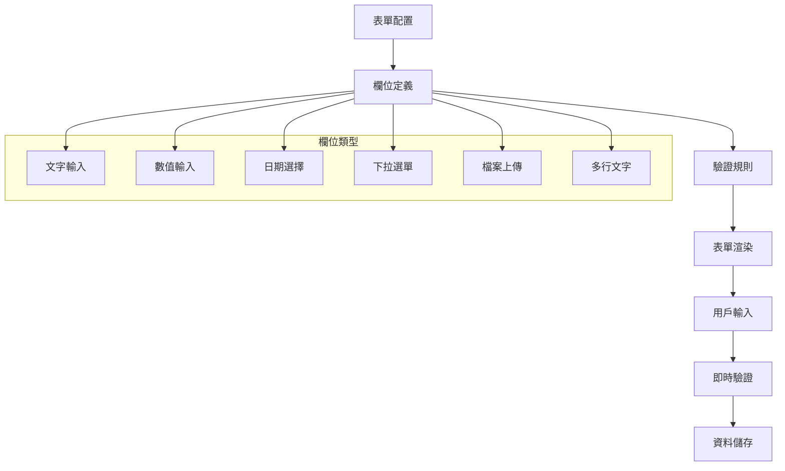
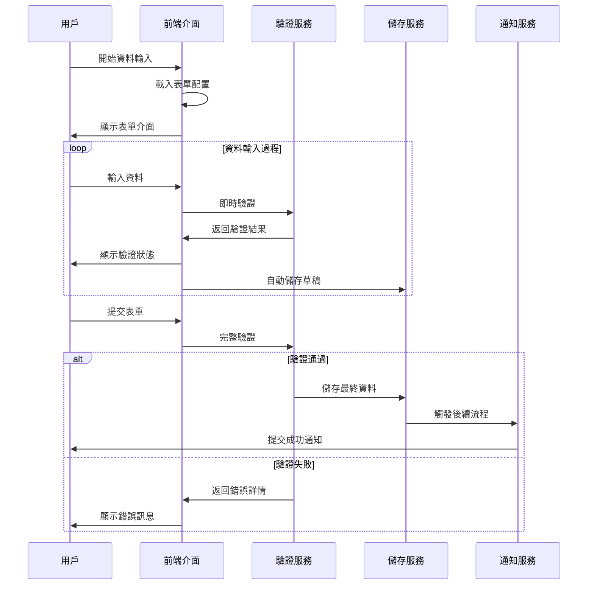
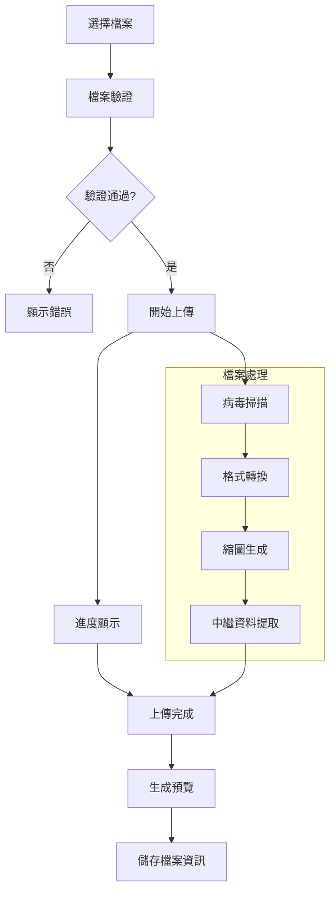
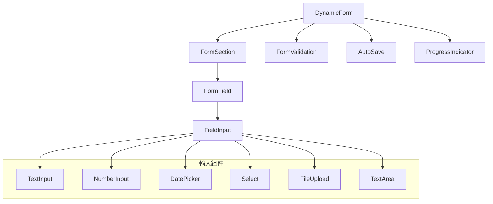

# 實驗數據輸入介面模組設計文件 (MDD)

## 文件資訊
- **模組名稱**: DataInputModule (實驗數據輸入介面模組)
- **文件版本**: v1.0
- **建立日期**: 2025/05/30
- **最後更新**: 2025/05/30
- **階段標記**: [MVP]

## 1. 模組概述

### 1.1 模組目標
提供直觀、高效的實驗數據輸入介面，支援多種資料類型和格式，確保資料的準確性和完整性，取代傳統的紙本記錄方式。

### 1.2 業務價值
- 提升資料輸入效率和準確性
- 標準化實驗數據格式
- 減少人工錯誤和重複工作
- 支援資料驗證和品質控制
- 提供便捷的草稿儲存功能

### 1.3 模組邊界
**包含功能**:
- 動態表單生成與管理
- 多種資料類型輸入支援
- 檔案上傳與預覽
- 資料驗證與清理
- 草稿自動儲存

**不包含功能**:
- 批量資料匯入 (Phase 1)
- 條件式欄位顯示 (Phase 1)
- 資料分析功能 (Phase 2)

## 2. 功能需求

### 2.1 核心功能列表

#### 2.1.1 表單管理功能
- **F001**: 動態表單配置
- **F002**: 表單樣板管理
- **F003**: 欄位類型定義
- **F004**: 表單版本控制

#### 2.1.2 資料輸入功能
- **F005**: 多類型資料輸入
- **F006**: 檔案上傳處理
- **F007**: 資料格式驗證
- **F008**: 自動儲存機制

#### 2.1.3 資料管理功能
- **F009**: 草稿管理
- **F010**: 資料預覽
- **F011**: 資料匯出
- **F012**: 歷史版本追蹤

### 2.2 詳細功能規格

#### 2.2.1 動態表單系統 (F001)


**表單配置結構**:
```typescript
interface FormConfiguration {
  id: string;
  name: string;
  version: string;
  description: string;
  sections: FormSection[];
  validationRules: ValidationRule[];
  metadata: FormMetadata;
}

interface FormSection {
  id: string;
  title: string;
  description?: string;
  order: number;
  fields: FormField[];
  isRequired: boolean;
}

interface FormField {
  id: string;
  name: string;
  label: string;
  type: FieldType;
  required: boolean;
  defaultValue?: any;
  placeholder?: string;
  helpText?: string;
  validationRules: FieldValidation[];
  options?: FieldOption[];
  order: number;
}
```

#### 2.2.2 資料輸入流程 (F005)


#### 2.2.3 檔案上傳處理 (F006)


**支援的檔案類型**:
- **圖片**: JPG, PNG, GIF, BMP, TIFF
- **文件**: PDF, DOC, DOCX, XLS, XLSX
- **資料**: CSV, JSON, XML
- **其他**: TXT, ZIP (限制大小 100MB)

## 3. 技術設計

### 3.1 資料模型

#### 3.1.1 表單配置實體
**參考 SOT**: [`docs/master_data_model.md`](../master_data_model.md) - 3.2.2 form_templates (表單模板表)

```typescript
interface FormTemplate {
  id: bigint;                    // 表單模板唯一識別碼 (BIGSERIAL)
  name: string;                  // 表單名稱 (VARCHAR(100), UNIQUE)
  version: string;               // 版本號 (VARCHAR(20))
  description?: string;          // 表單描述 (TEXT)
  schema: object;                // 表單結構定義 (JSONB)
  uiSchema: object;              // UI 渲染配置 (JSONB)
  status: string;                // 表單狀態 (VARCHAR(20))
  createdBy: bigint;             // 建立者 ID (BIGINT, 參照 users.id)
  createdAt: Date;               // 建立時間 (TIMESTAMP WITH TIME ZONE)
  updatedAt: Date;               // 更新時間 (TIMESTAMP WITH TIME ZONE)
}
```

#### 3.1.2 資料記錄實體
**參考 SOT**: [`docs/master_data_model.md`](../master_data_model.md) - 3.2.3 data_records (數據記錄表)

```typescript
interface DataRecord {
  id: bigint;                    // 數據記錄唯一識別碼 (BIGSERIAL)
  testCaseId: bigint;            // 檢驗案例 ID (BIGINT, 參照 test_cases.id)
  formTemplateId: bigint;        // 表單模板 ID (BIGINT, 參照 form_templates.id)
  formData: object;              // 表單數據 (JSONB)
  status: string;                // 記錄狀態 (VARCHAR(20))
  createdBy: bigint;             // 建立者 ID (BIGINT, 參照 users.id)
  lastModifiedBy: bigint;        // 最後修改者 ID (BIGINT, 參照 users.id)
  createdAt: Date;               // 建立時間 (TIMESTAMP WITH TIME ZONE)
  updatedAt: Date;               // 更新時間 (TIMESTAMP WITH TIME ZONE)
  deletedAt?: Date;              // 刪除時間 (TIMESTAMP WITH TIME ZONE, 軟刪除)
}

// 狀態枚舉 (與 SOT 保持一致)
enum RecordStatus {
  DRAFT = 'draft',
  SUBMITTED = 'submitted',
  UNDER_REVIEW = 'under_review',
  APPROVED = 'approved',
  REJECTED = 'rejected'
}
```

#### 3.1.3 檔案附件實體
**參考 SOT**: [`docs/master_data_model.md`](../master_data_model.md) - 3.2.4 file_attachments (檔案附件表)

```typescript
interface FileAttachment {
  id: bigint;                    // 檔案附件唯一識別碼 (BIGSERIAL)
  dataRecordId: bigint;          // 數據記錄 ID (BIGINT, 參照 data_records.id)
  originalFilename: string;      // 原始檔案名稱 (VARCHAR(255))
  storedFilename: string;        // 儲存檔案名稱 (VARCHAR(255))
  filePath: string;              // 檔案路徑 (VARCHAR(500))
  mimeType: string;              // MIME 類型 (VARCHAR(100))
  fileSize: bigint;              // 檔案大小 (BIGINT, 位元組)
  checksum: string;              // 檔案校驗和 (VARCHAR(64))
  uploadedBy: bigint;            // 上傳者 ID (BIGINT, 參照 users.id)
  uploadedAt: Date;              // 上傳時間 (TIMESTAMP WITH TIME ZONE)
  deletedAt?: Date;              // 刪除時間 (TIMESTAMP WITH TIME ZONE, 軟刪除)
}
```

### 3.2 API 接口設計

#### 3.2.1 資料記錄 API
**參考 SOT**: [`docs/api_specification.md`](../api_specification.md) - 4.2 數據輸入模組 API

**POST /api/v1/data/records**
```typescript
// 請求 (遵循 SOT API 規格)
interface CreateDataRecordRequest {
  testCaseId: string;
  formTemplateId: string;
  formData: object;              // 動態表單數據，結構由 formTemplate 定義
  attachments?: AttachmentInput[];
}

interface AttachmentInput {
  filename: string;
  fileData: string;              // Base64 編碼的檔案內容
  mimeType: string;
}

// 回應 (遵循標準響應格式)
interface CreateRecordResponse {
  success: boolean;
  data: {
    recordId: string;
    status: string;
    // ... 其他欄位參考 master_data_model.md
  };
  meta: {
    timestamp: string;
    version: string;
    requestId: string;
  };
}
```

**PUT /api/v1/data/records/{recordId}**
```typescript
// 請求
interface UpdateDataRecordRequest {
  formData: object;
  attachments?: AttachmentInput[];
}

// 回應
interface UpdateRecordResponse {
  success: boolean;
  data: {
    recordId: string;
    status: string;
    updatedAt: string;
  };
  meta: {
    timestamp: string;
    version: string;
    requestId: string;
  };
}
```

**GET /api/v1/data/records/{recordId}**
```typescript
// 回應
interface GetRecordResponse {
  success: boolean;
  data: DataRecord;              // 完整的數據記錄物件
  meta: {
    timestamp: string;
    version: string;
    requestId: string;
  };
}
```

#### 3.2.2 內部狀態更新 API
**參考 SOT**: [`docs/api_specification.md`](../api_specification.md) - 4.2.4 更新記錄狀態 (內部 API)

**PUT /api/v1/internal/data/records/{recordId}/status**
```typescript
// 請求 (內部模組間通信使用)
interface UpdateDataRecordStatusRequest {
  status: string;                // draft, submitted, under_review, approved, rejected
  workflowInstanceId: string;
  updatedBy: string;
  comment?: string;
}

// 回應
interface UpdateStatusResponse {
  success: boolean;
  data: {
    recordId: string;
    status: string;
    updatedAt: string;
  };
  meta: {
    timestamp: string;
    version: string;
    requestId: string;
  };
}
```

### 3.3 核心類別設計

#### 3.3.1 表單服務 (FormService)
```typescript
class FormService {
  // 獲取表單樣板
  async getFormTemplate(templateId: string): Promise<FormTemplate>;
  
  // 渲染表單配置
  async renderFormConfiguration(templateId: string): Promise<FormConfiguration>;
  
  // 驗證表單資料
  async validateFormData(templateId: string, data: Record<string, any>): Promise<ValidationResult>;
  
  // 建立表單樣板
  async createFormTemplate(template: CreateFormTemplateRequest): Promise<FormTemplate>;
  
  // 更新表單樣板
  async updateFormTemplate(templateId: string, updates: UpdateFormTemplateRequest): Promise<FormTemplate>;
}
```

#### 3.3.2 資料記錄服務 (DataRecordService)
```typescript
class DataRecordService {
  // 建立資料記錄
  async createRecord(request: CreateRecordRequest): Promise<DataRecord>;
  
  // 更新資料記錄
  async updateRecord(recordId: string, request: UpdateRecordRequest): Promise<DataRecord>;
  
  // 獲取資料記錄
  async getRecord(recordId: string): Promise<DataRecord>;
  
  // 提交資料記錄
  async submitRecord(recordId: string): Promise<DataRecord>;
  
  // 自動儲存草稿
  async autoSaveDraft(recordId: string, data: Record<string, any>): Promise<void>;
}
```

#### 3.3.3 檔案服務 (FileService)
```typescript
class FileService {
  // 上傳檔案
  async uploadFile(file: Express.Multer.File, metadata: FileUploadMetadata): Promise<FileAttachment>;
  
  // 下載檔案
  async downloadFile(fileId: string): Promise<FileStream>;
  
  // 生成預覽
  async generatePreview(fileId: string): Promise<PreviewResult>;
  
  // 刪除檔案
  async deleteFile(fileId: string): Promise<void>;
  
  // 驗證檔案
  async validateFile(file: Express.Multer.File): Promise<FileValidationResult>;
}
```

### 3.4 驗證系統設計

#### 3.4.1 驗證規則引擎
```typescript
interface ValidationRule {
  field: string;
  type: ValidationType;
  parameters: Record<string, any>;
  message: string;
  severity: 'error' | 'warning' | 'info';
}

enum ValidationType {
  REQUIRED = 'required',
  MIN_LENGTH = 'minLength',
  MAX_LENGTH = 'maxLength',
  PATTERN = 'pattern',
  NUMERIC_RANGE = 'numericRange',
  DATE_RANGE = 'dateRange',
  FILE_SIZE = 'fileSize',
  FILE_TYPE = 'fileType',
  CUSTOM = 'custom'
}

class ValidationEngine {
  // 執行驗證
  async validate(data: Record<string, any>, rules: ValidationRule[]): Promise<ValidationResult>;
  
  // 即時驗證
  async validateField(fieldName: string, value: any, rules: ValidationRule[]): Promise<FieldValidationResult>;
  
  // 自訂驗證器
  registerCustomValidator(name: string, validator: CustomValidator): void;
}
```

#### 3.4.2 驗證結果結構
```typescript
interface ValidationResult {
  isValid: boolean;
  errors: ValidationError[];
  warnings: ValidationWarning[];
  fieldResults: Record<string, FieldValidationResult>;
}

interface ValidationError {
  field: string;
  message: string;
  code: string;
  value: any;
}

interface FieldValidationResult {
  isValid: boolean;
  errors: string[];
  warnings: string[];
}
```

## 4. 前端設計

### 4.1 組件架構

#### 4.1.1 表單組件層次


#### 4.1.2 核心 React 組件
```typescript
// 動態表單主組件
interface DynamicFormProps {
  templateId: string;
  recordId?: string;
  mode: 'create' | 'edit' | 'view';
  onSubmit: (data: Record<string, any>) => void;
  onSave?: (data: Record<string, any>) => void;
}

const DynamicForm: React.FC<DynamicFormProps> = ({
  templateId,
  recordId,
  mode,
  onSubmit,
  onSave
}) => {
  // 表單狀態管理
  const [formData, setFormData] = useState<Record<string, any>>({});
  const [validationErrors, setValidationErrors] = useState<ValidationError[]>([]);
  const [isLoading, setIsLoading] = useState(false);
  
  // 自動儲存邏輯
  useAutoSave(formData, recordId, onSave);
  
  // 表單提交處理
  const handleSubmit = async (data: Record<string, any>) => {
    const validationResult = await validateForm(data);
    if (validationResult.isValid) {
      onSubmit(data);
    } else {
      setValidationErrors(validationResult.errors);
    }
  };
  
  return (
    <Form onSubmit={handleSubmit}>
      {/* 表單內容渲染 */}
    </Form>
  );
};
```

#### 4.1.3 檔案上傳組件
```typescript
interface FileUploadProps {
  fieldId: string;
  accept: string[];
  maxSize: number;
  multiple: boolean;
  onUpload: (files: FileAttachment[]) => void;
  onError: (error: string) => void;
}

const FileUpload: React.FC<FileUploadProps> = ({
  fieldId,
  accept,
  maxSize,
  multiple,
  onUpload,
  onError
}) => {
  const [uploadProgress, setUploadProgress] = useState<Record<string, number>>({});
  const [previews, setPreviews] = useState<FilePreview[]>([]);
  
  const handleFileSelect = async (files: FileList) => {
    for (const file of Array.from(files)) {
      if (validateFile(file, accept, maxSize)) {
        await uploadFile(file, fieldId, setUploadProgress);
      } else {
        onError(`檔案 ${file.name} 不符合要求`);
      }
    }
  };
  
  return (
    <div className="file-upload">
      <DropZone onDrop={handleFileSelect} />
      <ProgressIndicator progress={uploadProgress} />
      <PreviewList previews={previews} />
    </div>
  );
};
```

### 4.2 狀態管理

#### 4.2.1 Redux Store 結構
```typescript
interface DataInputState {
  forms: {
    templates: Record<string, FormTemplate>;
    configurations: Record<string, FormConfiguration>;
    loading: boolean;
    error: string | null;
  };
  records: {
    current: DataRecord | null;
    drafts: Record<string, DataRecord>;
    loading: boolean;
    error: string | null;
  };
  files: {
    uploads: Record<string, FileUploadState>;
    attachments: Record<string, FileAttachment>;
    loading: boolean;
    error: string | null;
  };
  validation: {
    errors: Record<string, ValidationError[]>;
    warnings: Record<string, ValidationWarning[]>;
  };
}
```

#### 4.2.2 自動儲存 Hook
```typescript
const useAutoSave = (
  data: Record<string, any>,
  recordId: string | undefined,
  onSave?: (data: Record<string, any>) => void,
  delay: number = 3000
) => {
  const [lastSaved, setLastSaved] = useState<Date | null>(null);
  const [isSaving, setIsSaving] = useState(false);
  
  useEffect(() => {
    if (!recordId || !onSave) return;
    
    const timeoutId = setTimeout(async () => {
      setIsSaving(true);
      try {
        await onSave(data);
        setLastSaved(new Date());
      } catch (error) {
        console.error('自動儲存失敗:', error);
      } finally {
        setIsSaving(false);
      }
    }, delay);
    
    return () => clearTimeout(timeoutId);
  }, [data, recordId, onSave, delay]);
  
  return { lastSaved, isSaving };
};
```

## 5. 效能優化

### 5.1 前端優化
- **虛擬滾動**: 大型表單的欄位虛擬化
- **懶載入**: 表單配置按需載入
- **防抖處理**: 輸入驗證防抖
- **快取策略**: 表單樣板本地快取

### 5.2 後端優化
- **資料庫索引**: 查詢欄位適當索引
- **檔案分塊**: 大檔案分塊上傳
- **壓縮儲存**: JSON 資料壓縮
- **快取層**: Redis 快取熱門表單

### 5.3 檔案處理優化
- **非同步處理**: 檔案上傳非同步處理
- **CDN 分發**: 靜態檔案 CDN 加速
- **格式轉換**: 背景格式轉換
- **縮圖生成**: 圖片縮圖快取

## 6. 安全考量

### 6.1 檔案安全
- **病毒掃描**: 上傳檔案病毒檢測
- **類型驗證**: 嚴格的檔案類型檢查
- **大小限制**: 檔案大小和數量限制
- **路徑安全**: 防止路徑遍歷攻擊

### 6.2 資料安全
- **輸入驗證**: 嚴格的資料驗證
- **SQL 注入**: 參數化查詢防護
- **XSS 防護**: 輸出編碼和 CSP
- **CSRF 防護**: Token 驗證機制

### 6.3 存取控制
- **權限檢查**: 資料記錄存取權限
- **資料隔離**: 用戶資料隔離
- **稽核日誌**: 完整的操作記錄
- **敏感資料**: 敏感欄位加密儲存

## 7. 測試策略

### 7.1 單元測試
- **服務層**: 資料驗證、檔案處理邏輯
- **組件測試**: React 組件單元測試
- **工具函數**: 驗證器和格式化函數
- **覆蓋率**: 85% 以上程式碼覆蓋率

### 7.2 整合測試
- **API 測試**: 完整的 CRUD 操作
- **檔案上傳**: 各種檔案類型上傳測試
- **表單驗證**: 複雜驗證規則測試
- **資料庫**: 資料一致性測試

### 7.3 端到端測試
- **用戶流程**: 完整的資料輸入流程
- **檔案處理**: 上傳、預覽、下載流程
- **錯誤處理**: 各種錯誤情況測試
- **效能測試**: 大型表單和檔案測試

## 8. 部署配置

### 8.1 環境變數
```bash
# 檔案上傳配置
UPLOAD_MAX_SIZE=100MB
UPLOAD_ALLOWED_TYPES=jpg,png,pdf,doc,docx,xls,xlsx
UPLOAD_PATH=/uploads
UPLOAD_TEMP_PATH=/tmp/uploads

# 資料驗證配置
VALIDATION_TIMEOUT=5000
VALIDATION_CACHE_TTL=3600

# 自動儲存配置
AUTO_SAVE_INTERVAL=3000
DRAFT_RETENTION_DAYS=30
```

### 8.2 資料庫 Schema
**參考 SOT**: [`docs/master_data_model.md`](../master_data_model.md) - 3.2 檢驗業務模組

```sql
-- 表單模板表 (遵循 SOT 數據模型)
CREATE TABLE form_templates (
  id BIGSERIAL PRIMARY KEY,
  name VARCHAR(100) NOT NULL UNIQUE,
  version VARCHAR(20) NOT NULL,
  description TEXT,
  schema JSONB NOT NULL,
  ui_schema JSONB NOT NULL,
  status VARCHAR(20) NOT NULL DEFAULT 'active',
  created_by BIGINT NOT NULL REFERENCES users(id),
  created_at TIMESTAMP WITH TIME ZONE NOT NULL DEFAULT NOW(),
  updated_at TIMESTAMP WITH TIME ZONE NOT NULL DEFAULT NOW()
);

-- 檢驗案例表 (遵循 SOT 數據模型)
CREATE TABLE test_cases (
  id BIGSERIAL PRIMARY KEY,
  case_number VARCHAR(50) NOT NULL UNIQUE,
  title VARCHAR(200) NOT NULL,
  description TEXT,
  test_type VARCHAR(50) NOT NULL,
  priority VARCHAR(20) NOT NULL,
  status VARCHAR(20) NOT NULL,
  created_by BIGINT NOT NULL REFERENCES users(id),
  assigned_to BIGINT REFERENCES users(id),
  due_date TIMESTAMP WITH TIME ZONE,
  metadata JSONB DEFAULT '{}',
  created_at TIMESTAMP WITH TIME ZONE NOT NULL DEFAULT NOW(),
  updated_at TIMESTAMP WITH TIME ZONE NOT NULL DEFAULT NOW(),
  deleted_at TIMESTAMP WITH TIME ZONE
);

-- 數據記錄表 (遵循 SOT 數據模型)
CREATE TABLE data_records (
  id BIGSERIAL PRIMARY KEY,
  test_case_id BIGINT NOT NULL REFERENCES test_cases(id),
  form_template_id BIGINT NOT NULL REFERENCES form_templates(id),
  form_data JSONB NOT NULL,
  status VARCHAR(20) NOT NULL DEFAULT 'draft',
  created_by BIGINT NOT NULL REFERENCES users(id),
  last_modified_by BIGINT NOT NULL REFERENCES users(id),
  created_at TIMESTAMP WITH TIME ZONE NOT NULL DEFAULT NOW(),
  updated_at TIMESTAMP WITH TIME ZONE NOT NULL DEFAULT NOW(),
  deleted_at TIMESTAMP WITH TIME ZONE
);

-- 檔案附件表 (遵循 SOT 數據模型)
CREATE TABLE file_attachments (
  id BIGSERIAL PRIMARY KEY,
  data_record_id BIGINT NOT NULL REFERENCES data_records(id),
  original_filename VARCHAR(255) NOT NULL,
  stored_filename VARCHAR(255) NOT NULL,
  file_path VARCHAR(500) NOT NULL,
  mime_type VARCHAR(100) NOT NULL,
  file_size BIGINT NOT NULL,
  checksum VARCHAR(64) NOT NULL,
  uploaded_by BIGINT NOT NULL REFERENCES users(id),
  uploaded_at TIMESTAMP WITH TIME ZONE NOT NULL DEFAULT NOW(),
  deleted_at TIMESTAMP WITH TIME ZONE
);

-- 索引策略 (遵循 SOT 索引設計)
CREATE INDEX idx_form_templates_status ON form_templates(status);
CREATE INDEX idx_form_templates_created_by ON form_templates(created_by);
CREATE INDEX idx_test_cases_status ON test_cases(status);
CREATE INDEX idx_test_cases_assigned_to ON test_cases(assigned_to);
CREATE INDEX idx_test_cases_created_by ON test_cases(created_by);
CREATE INDEX idx_data_records_test_case_id ON data_records(test_case_id);
CREATE INDEX idx_data_records_form_template_id ON data_records(form_template_id);
CREATE INDEX idx_data_records_status ON data_records(status);
CREATE INDEX idx_data_records_created_by ON data_records(created_by);
CREATE INDEX idx_file_attachments_data_record_id ON file_attachments(data_record_id);
CREATE INDEX idx_file_attachments_uploaded_by ON file_attachments(uploaded_by);

-- 觸發器設定 (自動更新 updated_at)
CREATE TRIGGER update_form_templates_updated_at BEFORE UPDATE ON form_templates
    FOR EACH ROW EXECUTE FUNCTION update_updated_at_column();

CREATE TRIGGER update_test_cases_updated_at BEFORE UPDATE ON test_cases
    FOR EACH ROW EXECUTE FUNCTION update_updated_at_column();

CREATE TRIGGER update_data_records_updated_at BEFORE UPDATE ON data_records
    FOR EACH ROW EXECUTE FUNCTION update_updated_at_column();
```

## 9. 監控與維運

### 9.1 監控指標
- **表單載入時間**: 平均表單載入時間
- **資料提交成功率**: 成功提交 / 總提交次數
- **檔案上傳成功率**: 成功上傳 / 總上傳次數
- **驗證錯誤率**: 驗證失敗 / 總驗證次數
- **自動儲存頻率**: 自動儲存觸發次數

### 9.2 告警規則
- **高錯誤率**: 提交失敗率 > 5%
- **慢查詢**: 表單載入時間 > 3 秒
- **檔案問題**: 上傳失敗率 > 10%
- **儲存空間**: 檔案儲存使用率 > 80%

### 9.3 日誌記錄
```typescript
interface DataInputLog {
  timestamp: Date;
  event: 'form_load' | 'data_input' | 'file_upload' | 'validation' | 'submit';
  userId: string;
  recordId?: string;
  formTemplateId?: string;
  success: boolean;
  duration?: number;
  errorCode?: string;
  metadata?: Record<string, any>;
}
```

## 10. 未來擴展

### 10.1 Phase 1 擴展
- **批量匯入**: Excel/CSV 批量資料匯入
- **條件欄位**: 基於條件的動態欄位顯示
- **公式計算**: 欄位間的自動計算
- **進階驗證**: 跨欄位驗證規則

### 10.2 Phase 2 擴展
- **協作編輯**: 多人同時編輯支援
- **版本比較**: 資料版本差異比較
- **工作流整合**: 與審核流程深度整合
- **行動端優化**: 手機端輸入體驗優化

### 10.3 長期規劃
- **AI 輔助**: 智能資料建議和自動填充
- **語音輸入**: 語音轉文字輸入支援
- **OCR 識別**: 圖片文字自動識別
- **區塊鏈**: 資料完整性區塊鏈驗證

## 11. 模組接口定義

### 11.1 對外提供的接口

#### 11.1.1 數據狀態更新接口
**接口名稱**: `PUT /api/data/records/:id/status`
**用途**: 接收來自流程引擎的狀態更新通知
**調用方**: 流程引擎模組

基於 [`docs/architecture/module_interaction_analysis.md`](../architecture/module_interaction_analysis.md) 中的接口 2：

```typescript
interface UpdateDataStatusRequest {
  status: 'draft' | 'submitted' | 'under_review' | 'approved' | 'rejected';
  workflowInstanceId: string;
  updatedBy: string;
  comment?: string;
}

interface UpdateDataStatusResponse {
  success: boolean;
  data: {
    recordId: string;
    previousStatus: string;
    newStatus: string;
    updatedAt: Date;
  };
}
```

#### 11.1.2 數據記錄查詢接口
**接口名稱**: `GET /api/data/records/:id`
**用途**: 提供數據記錄詳細資訊查詢
**調用方**: 審核系統、報告產生器

```typescript
interface DataRecordResponse {
  success: boolean;
  data: {
    record: DataRecord;
    attachments: FileAttachment[];
    history: RecordHistory[];
    validationResults: ValidationResult;
  };
}
```

### 11.2 依賴的外部接口

#### 11.2.1 用戶認證模組接口
**依賴接口**: `POST /api/auth/verify-permission`
**用途**: 驗證用戶的數據輸入和修改權限
**調用場景**: 每次數據操作前的權限檢查

```typescript
// 數據輸入權限檢查
interface DataInputPermissionRequest {
  userId: string;
  resource: 'data_records';
  action: 'create' | 'read' | 'update' | 'delete';
  context: {
    recordId?: string;
    formTemplateId?: string;
    departmentId?: string;
  };
}
```

#### 11.2.2 流程引擎接口
**依賴接口**: `POST /api/workflow/instances`
**用途**: 數據提交完成後觸發檢驗工作流程
**調用場景**: 研究員提交完整實驗數據時

基於 [`docs/architecture/module_interaction_analysis.md`](../architecture/module_interaction_analysis.md) 中的接口 1：

```typescript
interface StartWorkflowRequest {
  definitionId: string;           // 檢驗流程定義ID
  entityId: string;               // 數據記錄ID
  entityType: 'data_record';
  variables: {
    submitterId: string;          // 提交者ID
    sampleType: string;           // 樣本類型
    urgencyLevel: 'normal' | 'urgent' | 'critical';
    specialInstructions?: string;
  };
}
```

#### 11.2.3 審計日誌模組接口
**依賴接口**: `POST /api/audit/log`
**用途**: 記錄所有數據操作的審計日誌
**調用頻率**: 每次數據建立、修改、提交、刪除操作

```typescript
interface DataAuditLogRequest {
  eventType: 'user_action' | 'data_change';
  category: 'data_access' | 'data_modification';
  userId: string;
  resource: 'data_records';
  action: 'create' | 'update' | 'submit' | 'delete' | 'file_upload';
  details: {
    entityType: 'data_record';
    entityId: string;
    oldValues?: Record<string, any>;
    newValues?: Record<string, any>;
    formTemplateId?: string;
    fileInfo?: {
      fileName: string;
      fileSize: number;
      mimeType: string;
    };
  };
  result: 'success' | 'failure';
  severity: 'info' | 'warning' | 'error';
}
```

## 12. 依賴關係

### 12.1 直接依賴的核心模組
根據 [`docs/architecture/system_architecture.md`](../architecture/system_architecture.md) 中的模組依賴圖：

1. **用戶認證模組 (UserAuthModule)**
   - **依賴原因**: 驗證用戶身份和數據操作權限
   - **交互接口**: `POST /api/auth/verify-permission`
   - **調用場景**: 每次數據操作前的權限檢查
   - **依賴強度**: 強依賴（所有操作都需要權限驗證）

2. **流程引擎 (WorkflowEngineModule)**
   - **依賴原因**: 數據提交後觸發檢驗工作流程
   - **交互接口**: `POST /api/workflow/instances`
   - **調用場景**: 研究員提交完整實驗數據時
   - **依賴強度**: 強依賴（數據提交的核心流程）

3. **審計日誌模組 (AuditLogModule)**
   - **依賴原因**: 記錄所有數據操作的完整追蹤
   - **交互接口**: `POST /api/audit/log`
   - **調用場景**: 數據建立、修改、提交、刪除等操作
   - **依賴強度**: 強依賴（合規要求）

### 12.2 被依賴的模組
本模組被以下模組依賴：

1. **審核系統 (ReviewSystemModule)**
   - **依賴接口**: `GET /api/data/records/:id`
   - **依賴原因**: 獲取待審核的數據記錄詳細資訊

2. **報告產生器 (ReportGeneratorModule)**
   - **依賴接口**: `GET /api/data/records/:id`
   - **依賴原因**: 獲取已審核通過的數據用於報告生成

3. **流程引擎 (WorkflowEngineModule)**
   - **依賴接口**: `PUT /api/data/records/:id/status`
   - **依賴原因**: 根據工作流程狀態更新數據記錄狀態

### 12.3 技術基礎設施依賴
- **PostgreSQL**: 表單配置、數據記錄、檔案中繼資料儲存
- **MinIO/S3**: 檔案物件儲存
- **Redis**: 表單配置快取、草稿自動儲存
- **multer**: 檔案上傳處理
- **sharp**: 圖片處理和縮圖生成

### 12.4 外部服務依賴
- **病毒掃描服務**: 上傳檔案的安全檢查
- **檔案格式轉換服務**: 文件預覽和格式標準化

## 12. 風險評估

### 12.1 技術風險
| 風險項目 | 風險等級 | 影響 | 緩解策略 |
|---------|---------|------|----------|
| 大檔案上傳 | 中 | 效能問題 | 分塊上傳、進度顯示 |
| 複雜驗證 | 中 | 效能瓶頸 | 非同步驗證、快取 |
| 資料遺失 | 高 | 業務中斷 | 自動儲存、備份 |
| 檔案損壞 | 中 | 資料不完整 | 校驗和驗證、備份 |

### 12.2 業務風險
| 風險項目 | 風險等級 | 影響 | 緩解策略 |
|---------|---------|------|----------|
| 用戶適應 | 中 | 採用率低 | 培訓、漸進式導入 |
| 資料格式 | 中 | 相容性問題 | 版本管理、遷移工具 |
| 效能問題 | 中 | 用戶體驗差 | 效能監控、優化 |

## 13. 驗收標準 (Acceptance Criteria)

### 13.1 表單管理功能驗收標準

#### AC-DATA-001: 動態表單載入 (F001)
**Given** 研究員選擇特定的檢驗類型
**When** 系統載入對應的表單模板
**Then**
- 表單在 2 秒內完成載入
- 所有必填欄位正確標示 (紅色星號)
- 欄位類型正確顯示 (文字、數值、下拉選單、檔案上傳等)
- 欄位驗證規則正確套用
- 表單佈局符合設計規範

#### AC-DATA-002: 表單欄位驗證 (F002)
**Given** 研究員在表單中輸入資料
**When** 觸發欄位驗證 (失去焦點或即時驗證)
**Then**
- 數值欄位驗證範圍限制 (最小值、最大值)
- 文字欄位驗證長度限制和格式要求
- 必填欄位空值檢查
- 電子郵件格式驗證
- 日期格式驗證
- 錯誤訊息即時顯示且清晰易懂

#### AC-DATA-003: 自訂欄位支援 (F001)
**Given** 管理員配置自訂欄位
**When** 研究員使用包含自訂欄位的表單
**Then**
- 自訂欄位正確渲染
- 自訂驗證規則正常運作
- 自訂欄位資料正確儲存
- 支援至少 10 種欄位類型 (文字、數值、日期、選擇、檔案等)

### 13.2 資料輸入功能驗收標準

#### AC-DATA-004: 實驗數據輸入 (F003)
**Given** 研究員在數據輸入介面
**When** 輸入實驗數據
**Then**
- 支援數值、文字、日期時間等多種資料類型
- 數值欄位支援科學記號格式
- 自動格式化數值顯示 (千分位、小數位數)
- 支援複製貼上功能
- 輸入過程中無資料遺失

#### AC-DATA-005: 檔案上傳功能 (F004)
**Given** 研究員需要上傳檢驗相關檔案
**When** 使用檔案上傳功能
**Then**
- 支援多種檔案格式 (PDF, DOC, XLS, JPG, PNG 等)
- 單檔案大小限制 ≤ 50MB
- 總檔案大小限制 ≤ 200MB
- 上傳進度即時顯示
- 檔案預覽功能正常 (圖片、PDF)
- 檔案病毒掃描通過
- 檔案完整性校驗通過

#### AC-DATA-006: 自動儲存機制 (F005)
**Given** 研究員正在編輯數據記錄
**When** 系統觸發自動儲存
**Then**
- 每 30 秒自動儲存一次
- 網路中斷時本地暫存資料
- 網路恢復後自動同步
- 自動儲存狀態即時顯示
- 不影響用戶正常操作

### 13.3 資料管理功能驗收標準

#### AC-DATA-007: 草稿管理 (F006)
**Given** 研究員建立或編輯數據記錄
**When** 儲存為草稿
**Then**
- 草稿狀態正確標示
- 可隨時繼續編輯
- 草稿列表正確顯示
- 支援草稿搜尋和篩選
- 草稿自動過期清理 (30天)

#### AC-DATA-008: 資料提交流程 (F007)
**Given** 研究員完成數據輸入
**When** 提交數據記錄進行審核
**Then**
- 提交前完整性檢查通過
- 所有必填欄位已填寫
- 檔案上傳完成且有效
- 狀態變更為 "待審核"
- 自動觸發工作流程
- 通知相關審核人員
- 提交後鎖定編輯權限

#### AC-DATA-009: 版本控制 (F008)
**Given** 數據記錄經過多次修改
**When** 查看記錄歷史
**Then**
- 完整記錄所有變更歷史
- 顯示變更時間、變更人員、變更內容
- 支援版本比較功能
- 可回復到特定版本 (管理員權限)
- 變更日誌格式標準化

### 13.4 整合功能驗收標準

#### AC-DATA-010: 權限控制整合
**Given** 不同角色的用戶存取系統
**When** 進行數據操作
**Then**
- 研究員只能編輯自己建立的記錄
- 審核人員可查看待審核記錄
- 管理員具有完整存取權限
- 權限檢查回應時間 < 100ms
- 未授權操作正確阻止並記錄

#### AC-DATA-011: 工作流程整合
**Given** 數據記錄提交審核
**When** 工作流程狀態變更
**Then**
- 數據記錄狀態同步更新
- 狀態變更通知及時發送
- 工作流程變數正確傳遞
- 支援工作流程回退操作
- 整合無資料不一致問題

#### AC-DATA-012: 審計日誌整合
**Given** 用戶進行任何數據操作
**When** 操作執行
**Then**
- 所有操作完整記錄到審計日誌
- 日誌包含操作時間、用戶、動作、結果
- 敏感資料適當遮罩
- 日誌格式符合標準
- 日誌查詢效能良好

### 13.5 效能與可靠性驗收標準

#### AC-DATA-013: 系統效能要求
**Given** 系統處於正常負載狀態
**When** 執行數據操作
**Then**
- 表單載入時間 < 2 秒
- 資料儲存回應時間 < 1 秒
- 檔案上傳速度 > 1MB/s
- 支援同時 20 位用戶操作無效能衰減
- 大型表單 (>100 欄位) 載入時間 < 5 秒

#### AC-DATA-014: 資料完整性保障
**Given** 系統處理數據操作
**When** 發生異常情況
**Then**
- 資料庫事務確保資料一致性
- 檔案上傳失敗不影響其他資料
- 網路中斷不導致資料遺失
- 並發編輯衝突正確處理
- 資料備份機制正常運作

#### AC-DATA-015: 錯誤處理與恢復
**Given** 系統遇到錯誤情況
**When** 錯誤發生
**Then**
- 用戶友善的錯誤訊息顯示
- 系統自動嘗試恢復操作
- 錯誤詳情記錄到日誌
- 不影響其他用戶正常使用
- 提供明確的解決建議

### 13.6 用戶體驗驗收標準

#### AC-DATA-016: 介面易用性
**Given** 新用戶首次使用系統
**When** 進行數據輸入操作
**Then**
- 介面直觀易懂，無需額外說明
- 操作流程符合用戶習慣
- 重要功能易於發現
- 錯誤提示清晰具體
- 支援鍵盤快捷鍵操作

#### AC-DATA-017: 回應性設計
**Given** 用戶使用不同設備存取系統
**When** 在各種螢幕尺寸下操作
**Then**
- 桌面端 (≥1024px) 完整功能支援
- 平板端 (768-1023px) 主要功能可用
- 手機端 (≤767px) 基本功能可用
- 觸控操作友善
- 載入速度在各設備上均可接受

## 14. 結論

實驗數據輸入介面模組是系統的核心功能之一，本設計通過動態表單系統和完善的驗證機制，能夠有效提升資料輸入的效率和準確性。模組化的設計和豐富的擴展性為未來的功能增強提供了良好的基礎。

關鍵設計亮點：
1. **靈活性**: 動態表單配置支援多樣化需求
2. **可靠性**: 多層次驗證確保資料品質
3. **易用性**: 直觀的用戶介面和自動