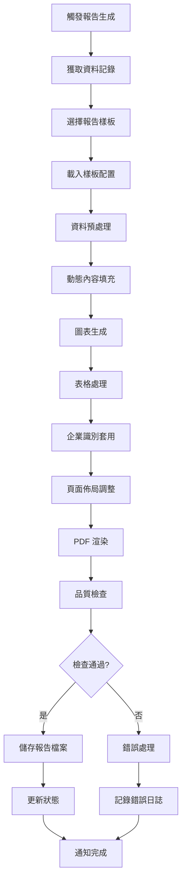
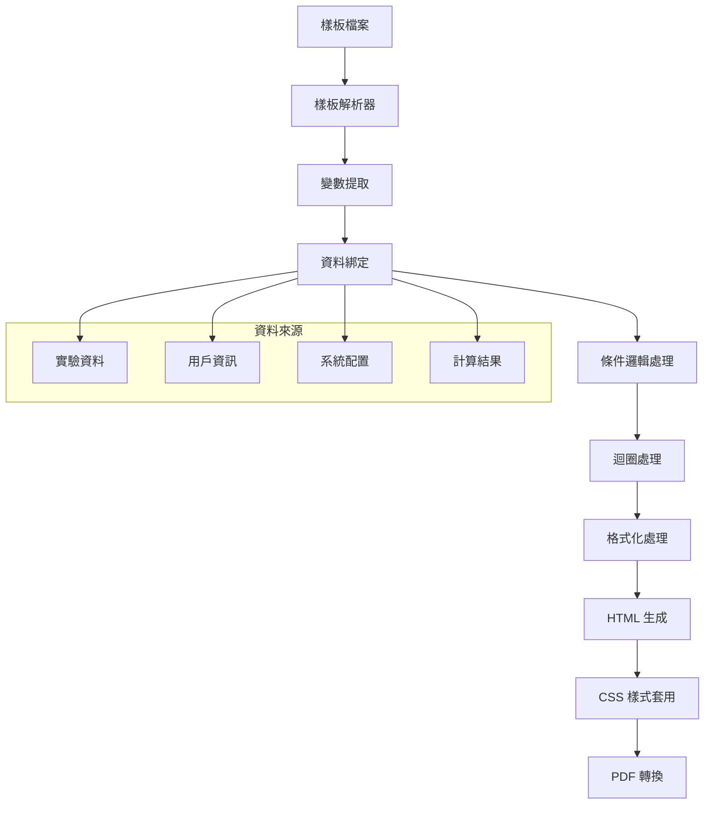

# 報告產生器模組設計文件 (MDD)

## 文件資訊
- **模組名稱**: ReportGeneratorModule (報告產生器模組)
- **文件版本**: v1.0
- **建立日期**: 2025/05/30
- **最後更新**: 2025/05/30
- **階段標記**: [MVP]

## 1. 模組概述

### 1.1 模組目標
提供高效、靈活的報告生成系統，支援多種報告格式和樣板，自動套用企業識別和標準化格式，確保報告的專業性和一致性。

### 1.2 業務價值
- 自動化報告生成流程
- 確保報告格式標準化和一致性
- 提升報告生成效率和品質
- 支援企業品牌識別統一應用
- 減少人工排版和格式化工作

### 1.3 模組邊界
**包含功能**:
- 報告樣板管理
- 動態內容填充
- PDF 格式匯出
- 企業識別套用
- 批量報告處理

**不包含功能**:
- Word 格式匯出 (Phase 1)
- Excel 格式匯出 (Phase 1)
- 進階圖表生成 (Phase 2)
- 多語系報告 (Phase 3)

## 2. 功能需求

### 2.1 核心功能列表

#### 2.1.1 樣板管理功能
- **F001**: 報告樣板設計與配置
- **F002**: 樣板版本控制
- **F003**: 樣板預覽與測試
- **F004**: 樣板分類管理

#### 2.1.2 內容生成功能
- **F005**: 動態資料填充
- **F006**: 圖表和圖片處理
- **F007**: 表格自動生成
- **F008**: 計算欄位處理

#### 2.1.3 格式化功能
- **F009**: 企業識別套用
- **F010**: 頁面佈局管理
- **F011**: 字體和樣式控制
- **F012**: 頁首頁尾處理

#### 2.1.4 輸出功能
- **F013**: PDF 生成與優化
- **F014**: 浮水印和安全設定
- **F015**: 批量報告生成
- **F016**: 報告品質檢查

### 2.2 報告生成流程

#### 2.2.1 主要生成流程


#### 2.2.2 樣板渲染引擎


## 3. 技術設計

### 3.1 資料模型

#### 3.1.1 報告樣板實體
**參考 SOT**: [`docs/master_data_model.md`](../master_data_model.md) - 5.1 report_templates (報告模板表)

```typescript
interface ReportTemplate {
  id: bigint;                    // 報告模板唯一識別碼 (BIGSERIAL)
  name: string;                  // 模板名稱 (VARCHAR(100), UNIQUE)
  version: string;               // 版本號 (VARCHAR(20))
  description?: string;          // 模板描述 (TEXT)
  templateContent: string;       // 模板內容 (TEXT)
  templateVariables: object;     // 模板變數 (JSONB)
  formatType: string;            // 格式類型 (VARCHAR(20))
  status: string;                // 模板狀態 (VARCHAR(20))
  createdBy: bigint;             // 建立者 ID (BIGINT, 參照 users.id)
  createdAt: Date;               // 建立時間 (TIMESTAMP WITH TIME ZONE)
  updatedAt: Date;               // 更新時間 (TIMESTAMP WITH TIME ZONE)
}

// 格式類型枚舉 (與 SOT 保持一致)
enum FormatType {
  PDF = 'pdf',
  DOCX = 'docx',
  XLSX = 'xlsx'
}

// 模板狀態枚舉 (與 SOT 保持一致)
enum TemplateStatus {
  ACTIVE = 'active',
  INACTIVE = 'inactive',
  DRAFT = 'draft'
}
  variables: TemplateVariable[];
}
```

#### 3.1.2 測試報告實體
**參考 SOT**: [`docs/master_data_model.md`](../master_data_model.md) - 5.2 test_reports (測試報告表)

```typescript
interface TestReport {
  id: bigint;                    // 測試報告唯一識別碼 (BIGSERIAL)
  testCaseId: bigint;            // 檢驗案例 ID (BIGINT, 參照 test_cases.id)
  reportTemplateId: bigint;      // 報告模板 ID (BIGINT, 參照 report_templates.id)
  reportNumber: string;          // 報告編號 (VARCHAR(50), UNIQUE)
  title: string;                 // 報告標題 (VARCHAR(200))
  status: string;                // 報告狀態 (VARCHAR(20))
  formatType: string;            // 格式類型 (VARCHAR(20))
  filePath?: string;             // 檔案路徑 (TEXT)
  fileSize?: bigint;             // 檔案大小 (BIGINT)
  checksum?: string;             // 檔案校驗和 (VARCHAR(64))
  generatedBy: bigint;           // 生成者 ID (BIGINT, 參照 users.id)
  generatedAt?: Date;            // 生成時間 (TIMESTAMP WITH TIME ZONE)
  publishedAt?: Date;            // 發布時間 (TIMESTAMP WITH TIME ZONE)
  createdAt: Date;               // 建立時間 (TIMESTAMP WITH TIME ZONE)
  updatedAt: Date;               // 更新時間 (TIMESTAMP WITH TIME ZONE)
  deletedAt?: Date;              // 刪除時間 (TIMESTAMP WITH TIME ZONE, 軟刪除)
}

// 報告狀態枚舉 (與 SOT 保持一致)
enum ReportStatus {
  PENDING = 'pending',
  GENERATING = 'generating',
  COMPLETED = 'completed',
  FAILED = 'failed',
  PUBLISHED = 'published',
  ARCHIVED = 'archived'
}

#### 3.1.3 樣板變數定義
```typescript
interface TemplateVariable {
  name: string;
  type: VariableType;
  source: DataSource;
  path: string;                 // JSON 路徑
  defaultValue?: any;
  formatter?: string;           // 格式化函數名稱
  required: boolean;
  description: string;
}

enum VariableType {
  TEXT = 'text',
  NUMBER = 'number',
  DATE = 'date',
  BOOLEAN = 'boolean',
  IMAGE = 'image',
  TABLE = 'table',
  CHART = 'chart',
  CALCULATED = 'calculated'
}

enum DataSource {
  RECORD_DATA = 'record_data',
  USER_INFO = 'user_info',
  SYSTEM_CONFIG = 'system_config',
  CALCULATED = 'calculated'
}
```

### 3.2 核心服務設計

#### 3.2.1 報告生成服務
```typescript
class ReportGeneratorService {
  // 生成單一報告
  async generateReport(dataRecordId: string, templateId: string, options?: GenerationOptions): Promise<ReportInstance>;
  
  // 批量生成報告
  async generateBatchReports(requests: BatchGenerationRequest[]): Promise<BatchGenerationResult>;
  
  // 預覽報告
  async previewReport(dataRecordId: string, templateId: string): Promise<PreviewResult>;
  
  // 重新生成報告
  async regenerateReport(reportId: string): Promise<ReportInstance>;
  
  // 獲取報告狀態
  async getReportStatus(reportId: string): Promise<ReportStatus>;
}
```

#### 3.2.2 樣板管理服務
```typescript
class TemplateManagementService {
  // 建立樣板
  async createTemplate(template: CreateTemplateRequest): Promise<ReportTemplate>;
  
  // 更新樣板
  async updateTemplate(templateId: string, updates: UpdateTemplateRequest): Promise<ReportTemplate>;
  
  // 獲取樣板
  async getTemplate(templateId: string, version?: string): Promise<ReportTemplate>;
  
  // 驗證樣板
  async validateTemplate(templateContent: string, config: TemplateConfig): Promise<ValidationResult>;
  
  // 測試樣板
  async testTemplate(templateId: string, testData: Record<string, any>): Promise<TestResult>;
}
```

#### 3.2.3 渲染引擎服務
```typescript
class RenderingEngineService {
  // 渲染 HTML
  async renderHTML(template: ReportTemplate, data: Record<string, any>): Promise<string>;
  
  // 生成 PDF
  async generatePDF(html: string, config: TemplateConfig): Promise<Buffer>;
  
  // 處理圖表
  async renderChart(chartConfig: ChartConfig, data: any[]): Promise<string>;
  
  // 處理表格
  async renderTable(tableConfig: TableConfig, data: any[]): Promise<string>;
  
  // 套用企業識別
  async applyBranding(html: string, brandingConfig: BrandingConfig): Promise<string>;
}
```

### 3.3 樣板引擎設計

#### 3.3.1 Handlebars 樣板系統
```typescript
class TemplateEngine {
  private handlebars: typeof Handlebars;
  
  constructor() {
    this.handlebars = Handlebars.create();
    this.registerHelpers();
  }
  
  // 註冊自訂 Helper
  private registerHelpers(): void {
    // 日期格式化
    this.handlebars.registerHelper('formatDate', (date: Date, format: string) => {
      return moment(date).format(format);
    });
    
    // 數值格式化
    this.handlebars.registerHelper('formatNumber', (number: number, decimals: number = 2) => {
      return number.toFixed(decimals);
    });
    
    // 條件判斷
    this.handlebars.registerHelper('ifEquals', function(arg1: any, arg2: any, options: any) {
      return (arg1 === arg2) ? options.fn(this) : options.inverse(this);
    });
    
    // 表格生成
    this.handlebars.registerHelper('table', (data: any[], columns: string[]) => {
      return this.generateTable(data, columns);
    });
    
    // 圖表生成
    this.handlebars.registerHelper('chart', (type: string, data: any[], options: any) => {
      return this.generateChart(type, data, options);
    });
  }
  
  // 編譯樣板
  async compileTemplate(templateContent: string): Promise<HandlebarsTemplateDelegate> {
    return this.handlebars.compile(templateContent);
  }
  
  // 渲染樣板
  async renderTemplate(template: HandlebarsTemplateDelegate, data: Record<string, any>): Promise<string> {
    return template(data);
  }
}
```

#### 3.3.2 樣板範例
```handlebars
<!DOCTYPE html>
<html>
<head>
    <meta charset="UTF-8">
    <title>{{reportTitle}}</title>
    <style>
        {{{styleSheet}}}
    </style>
</head>
<body>
    <!-- 頁首 -->
    <header class="report-header">
        <div class="company-logo">
            
        </div>
        <div class="report-info">
            <h1>{{reportTitle}}</h1>
            <p>報告編號: {{reportNumber}}</p>
            <p>生成日期: {{formatDate generatedDate 'YYYY-MM-DD'}}</p>
        </div>
    </header>
    
    <!-- 主要內容 -->
    <main class="report-content">
        <!-- 基本資訊 -->
        <section class="basic-info">
            <h2>基本資訊</h2>
            <table class="info-table">
                <tr>
                    <td>樣本名稱:</td>
                    <td>{{sampleName}}</td>
                </tr>
                <tr>
                    <td>檢驗日期:</td>
                    <td>{{formatDate inspectionDate 'YYYY-MM-DD'}}</td>
                </tr>
                <tr>
                    <td>檢驗人員:</td>
                    <td>{{inspector.name}}</td>
                </tr>
            </table>
        </section>
        
        <!-- 檢驗結果 -->
        <section class="test-results">
            <h2>檢驗結果</h2>
            {{#if testResults}}
                {{{table testResults 'parameter,result,unit,standard,status'}}}
            {{else}}
                <p>無檢驗結果資料</p>
            {{/if}}
        </section>
        
        <!-- 圖表 -->
        {{#if chartData}}
        <section class="charts">
            <h2>數據分析</h2>
            {{{chart 'line' chartData chartOptions}}}
        </section>
        {{/if}}
        
        <!-- 結論 -->
        <section class="conclusion">
            <h2>檢驗結論</h2>
            <p>{{conclusion}}</p>
            
            {{#ifEquals status 'passed'}}
                <div class="status-passed">✓ 檢驗合格</div>
            {{else}}
                <div class="status-failed">✗ 檢驗不合格</div>
            {{/ifEquals}}
        </section>
    </main>
    
    <!-- 頁尾 -->
    <footer class="report-footer">
        <div class="signature-section">
            <div class="signature">
                <p>檢驗人員: ________________</p>
                <p>{{inspector.name}}</p>
            </div>
            <div class="signature">
                <p>審核人員: ________________</p>
                <p>{{reviewer.name}}</p>
            </div>
        </div>
        <div class="footer-info">
            <p>本報告僅對送檢樣本負責</p>
            <p>頁碼: <span class="page-number"></span> / <span class="total-pages"></span></p>
        </div>
    </footer>
</body>
</html>
```

### 3.4 PDF 生成設計

#### 3.4.1 Puppeteer PDF 生成
```typescript
class PDFGeneratorService {
  private browser: Browser;
  
  async initialize(): Promise<void> {
    this.browser = await puppeteer.launch({
      headless: true,
      args: ['--no-sandbox', '--disable-setuid-sandbox']
    });
  }
  
  async generatePDF(html: string, config: PDFConfig): Promise<Buffer> {
    const page = await this.browser.newPage();
    
    try {
      // 設定頁面內容
      await page.setContent(html, { waitUntil: 'networkidle0' });
      
      // 設定 PDF 選項
      const pdfOptions: PDFOptions = {
        format: config.pageSize,
        landscape: config.orientation === 'landscape',
        margin: config.margins,
        printBackground: true,
        displayHeaderFooter: true,
        headerTemplate: config.headerTemplate,
        footerTemplate: config.footerTemplate
      };
      
      // 生成 PDF
      const pdfBuffer = await page.pdf(pdfOptions);
      
      return pdfBuffer;
    } finally {
      await page.close();
    }
  }
  
  async addWatermark(pdfBuffer: Buffer, watermarkConfig: WatermarkConfig): Promise<Buffer> {
    // 使用 PDF-lib 添加浮水印
    const pdfDoc = await PDFDocument.load(pdfBuffer);
    const pages = pdfDoc.getPages();
    
    for (const page of pages) {
      page.drawText(watermarkConfig.text, {
        x: watermarkConfig.x,
        y: watermarkConfig.y,
        size: watermarkConfig.fontSize,
        color: rgb(0.8, 0.8, 0.8),
        opacity: watermarkConfig.opacity
      });
    }
    
    return await pdfDoc.save();
  }
}
```

#### 3.4.2 圖表生成服務
```typescript
class ChartGeneratorService {
  async generateChart(type: ChartType, data: any[], options: ChartOptions): Promise<string> {
    const canvas = createCanvas(options.width, options.height);
    const ctx = canvas.getContext('2d');
    
    const chartConfig = {
      type: type,
      data: data,
      options: {
        ...options,
        animation: false,
        responsive: false
      }
    };
    
    const chart = new Chart(ctx, chartConfig);
    
    // 返回 base64 圖片
    return canvas.toDataURL();
  }
  
  async generateTable(data: any[], columns: string[]): Promise<string> {
    let html = '<table class="data-table">';
    
    // 表頭
    html += '<thead><tr>';
    columns.forEach(column => {
      html += `<th>${column}</th>`;
    });
    html += '</tr></thead>';
    
    // 表身
    html += '<tbody>';
    data.forEach(row => {
      html += '<tr>';
      columns.forEach(column => {
        html += `<td>${row[column] || ''}</td>`;
      });
      html += '</tr>';
    });
    html += '</tbody></table>';
    
    return html;
  }
}
```

## 4. API 接口設計

### 4.1 報告生成 API

**POST /api/reports/generate**
```typescript
interface GenerateReportRequest {
  dataRecordId: string;
  templateId: string;
  templateVersion?: string;
  parameters?: Record<string, any>;
  options?: GenerationOptions;
}

interface GenerateReportResponse {
  success: boolean;
  data: {
    reportId: string;
    status: ReportStatus;
    estimatedTime?: number;
  };
}
```

**GET /api/reports/:id/status**
```typescript
interface ReportStatusResponse {
  success: boolean;
  data: {
    reportId: string;
    status: ReportStatus;
    progress?: number;
    downloadUrl?: string;
    errorMessage?: string;
  };
}
```

**GET /api/reports/:id/download**
```typescript
// 直接返回 PDF 檔案流
// Content-Type: application/pdf
// Content-Disposition: attachment; filename="report.pdf"
```

### 4.2 樣板管理 API

**GET /api/templates**
```typescript
interface TemplatesResponse {
  success: boolean;
  data: {
    templates: ReportTemplate[];
    total: number;
    categories: string[];
  };
}
```

**POST /api/templates**
```typescript
interface CreateTemplateRequest {
  name: string;
  description: string;
  category: string;
  templateType: TemplateType;
  templateContent: string;
  styleSheet: string;
  configuration: TemplateConfig;
}

interface CreateTemplateResponse {
  success: boolean;
  data: {
    templateId: string;
    version: string;
  };
}
```

**POST /api/templates/:id/preview**
```typescript
interface PreviewTemplateRequest {
  testData: Record<string, any>;
}

interface PreviewTemplateResponse {
  success: boolean;
  data: {
    previewUrl: string;
    expiresAt: Date;
  };
}
```

## 5. 效能優化

### 5.1 生成效能優化
- **樣板快取**: 編譯後的樣板快取
- **並行處理**: 批量報告並行生成
- **資源池**: Puppeteer 瀏覽器實例池
- **增量渲染**: 大型報告分段渲染

### 5.2 儲存優化
- **檔案壓縮**: PDF 檔案壓縮
- **CDN 分發**: 報告檔案 CDN 加速
- **分層儲存**: 熱門報告快速存取
- **自動清理**: 過期報告自動清理

### 5.3 記憶體優化
- **流式處理**: 大型資料流式處理
- **垃圾回收**: 及時釋放資源
- **記憶體監控**: 記憶體使用監控
- **限制並發**: 控制同時生成數量

## 6. 安全考量

### 6.1 樣板安全
- **內容過濾**: 防止惡意 HTML/CSS
- **沙盒執行**: 樣板在沙盒環境執行
- **權限控制**: 樣板存取權限控制
- **版本管理**: 樣板變更追蹤

### 6.2 資料安全
- **敏感資料**: 敏感資料遮罩處理
- **存取控制**: 報告下載權限控制
- **加密儲存**: 報告檔案加密儲存
- **稽核日誌**: 完整的存取日誌

### 6.3 檔案安全
- **病毒掃描**: 生成檔案病毒檢測
- **檔案驗證**: 檔案完整性驗證
- **安全下載**: 安全的檔案下載機制
- **時效控制**: 下載連結時效控制

## 7. 測試策略

### 7.1 單元測試
- **樣板引擎**: 樣板編譯和渲染測試
- **PDF 生成**: PDF 生成功能測試
- **圖表生成**: 各種圖表類型測試
- **格式化**: 資料格式化函數測試

### 7.2 整合測試
- **完整流程**: 端到端報告生成測試
- **批量處理**: 批量生成效能測試
- **錯誤處理**: 各種錯誤情況測試
- **相容性**: 不同瀏覽器相容性測試

### 7.3 效能測試
- **生成速度**: 報告生成時間測試
- **並發處理**: 高並發生成測試
- **記憶體使用**: 記憶體洩漏測試
- **檔案大小**: 生成檔案大小測試

## 8. 部署配置

### 8.1 環境變數
```bash
# PDF 生成配置
PUPPETEER_EXECUTABLE_PATH=/usr/bin/chromium
PDF_GENERATION_TIMEOUT=30000
PDF_MAX_CONCURRENT=5

# 檔案儲存配置
REPORT_STORAGE_PATH=/reports
REPORT_TEMP_PATH=/tmp/reports
REPORT_RETENTION_DAYS=365

# 樣板配置
TEMPLATE_CACHE_SIZE=100
TEMPLATE_CACHE_TTL=3600
```

### 8.2 資料庫 Schema
```sql
-- 報告樣板表
CREATE TABLE report_templates (
  id UUID PRIMARY KEY DEFAULT gen_random_uuid(),
  name VARCHAR(255) NOT NULL,
  version VARCHAR(50) NOT NULL,
  description TEXT,
  category VARCHAR(100),
  template_type VARCHAR(50) NOT NULL,
  template_content TEXT NOT NULL,
  style_sheet TEXT,
  configuration JSONB NOT NULL,
  is_active BOOLEAN DEFAULT true,
  created_by UUID NOT NULL,
  created_at TIMESTAMP DEFAULT NOW(),
  updated_at TIMESTAMP DEFAULT NOW(),
  UNIQUE(name, version)
);

-- 報告實例表
CREATE TABLE report_instances (
  id UUID PRIMARY KEY DEFAULT gen_random_uuid(),
  template_id UUID NOT NULL REFERENCES report_templates(id),
  template_version VARCHAR(50) NOT NULL,
  data_record_id UUID NOT NULL,
  status VARCHAR(50) DEFAULT 'pending',
  file_name VARCHAR(255),
  file_path VARCHAR(500),
  file_size BIGINT,
  generated_by UUID NOT NULL,
  generated_at TIMESTAMP DEFAULT NOW(),
  parameters JSONB,
  metadata JSONB,
  error_message TEXT
);

-- 索引
CREATE INDEX idx_report_instances_record ON report_instances(data_record_id);
CREATE INDEX idx_report_instances_status ON report_instances(status);
CREATE INDEX idx_report_instances_generated_by ON report_instances(generated_by);
```

## 9. 監控與維運

### 9.1 監控指標
- **生成成功率**: 成功生成 / 總生成請求
- **平均生成時間**: 報告生成平均耗時
- **檔案大小分布**: 生成檔案大小統計
- **樣板使用率**: 各樣板使用頻率
- **錯誤率**: 生成失敗率統計

### 9.2 告警規則
- **生成失敗**: 生成失敗率 > 5%
- **生成緩慢**: 平均生成時間 > 30 秒
- **儲存空間**: 報告儲存使用率 > 80%
- **記憶體洩漏**: 記憶體使用持續增長

### 9.3 日誌記錄
```typescript
interface ReportGenerationLog {
  timestamp: Date;
  event: 'generation_start' | 'generation_complete' | 'generation_failed';
  reportId: string;
  templateId: string;
  dataRecordId: string;
  userId: string;
  duration?: number;
  fileSize?: number;
  errorCode?: string;
  metadata?: Record<string, any>;
}
```

## 10. 模組接口定義

### 10.1 對外提供的接口

#### 10.1.1 報告生成接口
**接口名稱**: `POST /api/reports/generate`
**用途**: 接收來自流程引擎的報告生成請求
**調用方**: 流程引擎模組

基於 [`docs/architecture/module_interaction_analysis.md`](../architecture/module_interaction_analysis.md) 中的接口 5：

```typescript
interface GenerateReportRequest {
  dataRecordId: string;
  templateId: string;
  workflowInstanceId: string;
  generationOptions: {
    format: 'pdf';
    includeRawData: boolean;
    includeCharts: boolean;
    watermark?: string;
  };
  metadata: {
    approvedBy: string;
    approvalDate: Date;
    reportType: 'standard' | 'detailed' | 'summary';
  };
}

interface GenerateReportResponse {
  success: boolean;
  data: {
    reportId: string;
    estimatedCompletionTime: Date;
    status: 'queued' | 'generating';
  };
}
```

#### 10.1.2 報告下載接口
**接口名稱**: `GET /api/reports/:reportId/download`
**用途**: 提供報告檔案下載服務
**調用方**: 客戶入口模組、前端介面

```typescript
interface ReportDownloadResponse {
  success: boolean;
  data: {
    downloadUrl: string;
    fileName: string;
    fileSize: number;
    expiresAt: Date;
    contentType: string;
  };
}
```

#### 10.1.3 報告狀態查詢接口
**接口名稱**: `GET /api/reports/:reportId/status`
**用途**: 查詢報告生成狀態
**調用方**: 流程引擎、前端介面

```typescript
interface ReportStatusResponse {
  success: boolean;
  data: {
    reportId: string;
    status: 'queued' | 'generating' | 'completed' | 'failed';
    progress: number;
    estimatedTimeRemaining?: number;
    errorMessage?: string;
    completedAt?: Date;
  };
}
```

### 10.2 依賴的外部接口

#### 10.2.1 用戶認證模組接口
**依賴接口**: `POST /api/auth/verify-permission`
**用途**: 驗證報告生成和存取權限
**調用場景**: 報告生成前、報告下載前的權限檢查

```typescript
interface ReportPermissionRequest {
  userId: string;
  resource: 'reports';
  action: 'generate' | 'read' | 'download';
  context: {
    reportId?: string;
    dataRecordId?: string;
    templateId?: string;
  };
}
```

#### 10.2.2 數據輸入模組接口
**依賴接口**: `GET /api/data/records/:id`
**用途**: 獲取用於報告生成的實驗數據
**調用場景**: 報告生成時獲取數據內容

```typescript
interface ReportDataRequest {
  recordId: string;
  includeAttachments: boolean;
  includeValidationResults: boolean;
}
```

#### 10.2.3 流程引擎接口
**依賴接口**: `POST /api/workflow/events/report-completed`
**用途**: 報告生成完成後通知流程引擎
**調用場景**: 報告生成成功或失敗時

基於 [`docs/architecture/module_interaction_analysis.md`](../architecture/module_interaction_analysis.md) 中的接口 6：

```typescript
interface ReportCompletedEvent {
  workflowInstanceId: string;
  reportId: string;
  reportUrl: string;
  fileSize: number;
  generationTime: number;       // 生成耗時(秒)
  status: 'completed' | 'failed';
  errorMessage?: string;
}
```

#### 10.2.4 客戶入口接口
**依賴接口**: `POST /api/customer-portal/reports/publish`
**用途**: 報告生成完成後發布到客戶入口
**調用場景**: 報告生成成功後自動發布

基於 [`docs/architecture/module_interaction_analysis.md`](../architecture/module_interaction_analysis.md) 中的接口 8：

```typescript
interface PublishReportRequest {
  reportId: string;
  customerId: string;
  reportMetadata: {
    title: string;
    reportNumber: string;
    sampleName: string;
    testDate: Date;
    expirationDate?: Date;        // 報告有效期
  };
  accessSettings: {
    maxDownloads: number;
    accessDuration: number;       // 存取有效期(小時)
    requiresPassword: boolean;
  };
}
```

#### 10.2.5 審計日誌模組接口
**依賴接口**: `POST /api/audit/log`
**用途**: 記錄所有報告生成操作的審計日誌
**調用頻率**: 每次報告生成、下載、發布操作

```typescript
interface ReportAuditLogRequest {
  eventType: 'user_action' | 'system_event';
  category: 'data_access' | 'data_modification';
  userId?: string;
  resource: 'reports';
  action: 'generate' | 'download' | 'publish' | 'delete';
  details: {
    entityType: 'report';
    entityId: string;
    dataRecordId: string;
    workflowInstanceId: string;
    templateId: string;
    reportMetadata: {
      fileName: string;
      fileSize: number;
      format: string;
      generationTime?: number;
    };
  };
  result: 'success' | 'failure';
  severity: 'info' | 'warning' | 'error';
}
```

## 11. 依賴關係

### 11.1 直接依賴的核心模組
根據 [`docs/architecture/system_architecture.md`](../architecture/system_architecture.md) 中的模組依賴圖：

1. **用戶認證模組 (UserAuthModule)**
   - **依賴原因**: 驗證報告生成和存取權限
   - **交互接口**: `POST /api/auth/verify-permission`
   - **調用場景**: 報告生成前、報告下載前的權限檢查
   - **依賴強度**: 強依賴（所有操作都需要權限驗證）

2. **數據輸入模組 (DataInputModule)**
   - **依賴原因**: 獲取用於報告生成的實驗數據
   - **交互接口**: `GET /api/data/records/:id`
   - **調用場景**: 報告生成時獲取數據內容
   - **依賴強度**: 強依賴（報告的核心數據來源）

3. **客戶入口 (CustomerPortalModule)**
   - **依賴原因**: 報告生成完成後發布到客戶入口
   - **交互接口**: `POST /api/customer-portal/reports/publish`
   - **調用場景**: 報告生成成功後自動發布
   - **依賴強度**: 強依賴（核心業務流程）

4. **審計日誌模組 (AuditLogModule)**
   - **依賴原因**: 記錄所有報告操作的完整追蹤
   - **交互接口**: `POST /api/audit/log`
   - **調用場景**: 報告生成、下載、發布等操作
   - **依賴強度**: 強依賴（合規要求）

### 11.2 被依賴的模組

1. **流程引擎 (WorkflowEngineModule)**
   - **依賴接口**: `POST /api/reports/generate`
   - **依賴原因**: 審核通過後觸發報告生成

2. **客戶入口 (CustomerPortalModule)**
   - **依賴接口**: `GET /api/reports/:reportId/download`
   - **依賴原因**: 客戶下載報告檔案

### 11.3 技術基礎設施依賴
- **PostgreSQL**: 報告中繼資料、樣板配置儲存
- **MinIO/S3**: 報告檔案物件儲存
- **Redis**: 樣板快取、報告生成狀態快取
- **puppeteer**: PDF 生成引擎
- **handlebars**: 樣板渲染引擎

### 11.4 外部服務依賴
- **圖表服務**: 動態圖表生成
- **檔案轉換服務**: 多格式報告支援
- **浮水印服務**: 報告安全標記

## 11. 未來擴展

### 11.1 Phase 1 擴展
- **Word 匯出**: DOCX 格式支援
- **Excel 匯出**: XLSX 格式支援
- **進階圖表**: 更多圖表類型
- **樣板編輯器**: 視覺化樣板編輯

### 11.2 Phase 2 擴展
- **協作編輯**: 多人協作編輯樣板
- **版本比較**: 樣板版本差異比較
- **A/B 測試**: 樣板效果測試
- **自動優化**: 基於使用情況自動優化

### 11.3 長期規劃
- **AI 輔助**: AI 輔助樣板設計
- **多語系**: 多語系報告支援
- **區塊鏈**: 報告完整性區塊鏈驗證
- **雲端列印**: 雲端列印服務整合

## 12. 風險評估

### 12.1 技術風險
| 風險項目 | 風險等級 | 影響 | 緩解策略 |
|---------|---------|------|----------|
| PDF 生成失敗 | 中 | 報告無法產出 | 錯誤重試、備用方案 |
| 記憶體洩漏 | 中 | 系統效能下降 | 資源監控、定期重啟 |
| 樣板錯誤 | 中 | 報告格式錯誤 | 樣板驗證、測試機制 |
| 檔案損壞 | 低 | 報告不可用 | 校驗和驗證、備份 |

### 12.2 業務風險
| 風險項目 | 風險等級 | 影響 | 緩解策略 |
|---------|---------|------|----------|
| 格式變更 | 中 | 樣板需要更新 | 版本管理、向後相容 |
| 效能問題 | 中 | 用戶體驗差 | 效能監控、優化 |
| 儲存成本 | 低 | 營運成本增加 | 自動清理、壓縮 |

## 13. 驗收標準 (Acceptance Criteria)

### 13.1 報告生成功能驗收標準

#### AC-REPORT-001: 報告生成觸發 (F001)
**Given** 流程引擎觸發報告生成請求
**When** 系統接收報告生成任務
**Then**
- 報告生成任務在 1 秒內建立完成
- 正確載入對應的報告樣板
- 獲取完整的數據記錄和審核資訊
- 設定報告生成狀態為 "processing"
- 記錄報告生成開始事件
- 預估報告生成完成時間

#### AC-REPORT-002: 樣板渲染處理 (F002)
**Given** 系統開始生成報告
**When** 執行樣板渲染
**Then**
- 正確載入 Handlebars 樣板
- 數據綁定準確無誤
- 支援條件邏輯和迴圈結構
- 處理空值和異常數據
- 樣板渲染在 5 秒內完成
- 生成的 HTML 格式正確

#### AC-REPORT-003: PDF 生成處理 (F003)
**Given** HTML 樣板渲染完成
**When** 轉換為 PDF 格式
**Then**
- PDF 生成在 10 秒內完成
- PDF 格式符合 A4 標準
- 頁面佈局正確無錯位
- 圖片和圖表正確嵌入
- 中文字體正確顯示
- PDF 檔案大小合理 (< 10MB)
- 支援多頁報告

### 13.2 樣板管理功能驗收標準

#### AC-REPORT-004: 樣板配置管理 (F004)
**Given** 管理員配置報告樣板
**When** 樣板配置生效
**Then**
- 樣板語法驗證通過
- 支援企業識別元素配置
- 樣板版本正確管理
- 樣板變更歷史完整記錄
- 新樣板不影響進行中的報告生成
- 樣板預覽功能正常

#### AC-REPORT-005: 動態內容處理 (F005)
**Given** 報告包含動態內容
**When** 處理動態數據
**Then**
- 正確處理數值計算和格式化
- 支援日期時間格式化
- 條件顯示邏輯正確執行
- 數據表格正確生成
- 圖表數據正確渲染
- 處理數據缺失情況

### 13.3 企業識別功能驗收標準

#### AC-REPORT-006: 企業識別套用 (F006)
**Given** 報告需要套用企業識別
**When** 生成報告
**Then**
- 公司 Logo 正確顯示
- 企業色彩方案正確套用
- 字體樣式符合企業規範
- 頁首頁尾格式統一
- 浮水印正確添加
- 企業聯絡資訊準確

#### AC-REPORT-007: 報告編號管理 (F007)
**Given** 生成新報告
**When** 分配報告編號
**Then**
- 報告編號唯一且連續
- 編號格式符合企業規範
- 支援不同類型的編號規則
- 編號與報告正確關聯
- 編號歷史可追蹤
- 支援編號重置和調整

### 13.4 檔案管理功能驗收標準

#### AC-REPORT-008: 報告檔案儲存 (F008)
**Given** 報告生成完成
**When** 儲存報告檔案
**Then**
- 檔案正確上傳到物件儲存
- 檔案路徑和 URL 正確生成
- 檔案中繼資料完整記錄
- 檔案完整性校驗通過
- 檔案存取權限正確設定
- 支援檔案版本管理

#### AC-REPORT-009: 報告下載服務 (F009)
**Given** 客戶請求下載報告
**When** 提供下載服務
**Then**
- 下載連結安全且有時效性
- 下載速度 > 1MB/s
- 支援斷點續傳
- 下載次數正確統計
- 下載日誌完整記錄
- 檔案完整性保證

### 13.5 整合功能驗收標準

#### AC-REPORT-010: 工作流程整合
**Given** 報告生成完成
**When** 通知工作流程引擎
**Then**
- 正確調用工作流程回調 API
- 報告資訊完整傳遞
- 工作流程狀態正確更新
- 觸發客戶通知流程
- 整合過程無資料遺失

#### AC-REPORT-011: 客戶入口整合
**Given** 報告需要發布到客戶入口
**When** 執行報告發布
**Then**
- 正確調用客戶入口 API
- 報告中繼資料完整傳遞
- 存取權限正確設定
- 發布狀態正確更新
- 客戶可正常存取報告

### 13.6 效能與可靠性驗收標準

#### AC-REPORT-012: 生成效能要求
**Given** 系統處於正常負載狀態
**When** 生成報告
**Then**
- 簡單報告生成時間 < 10 秒
- 複雜報告生成時間 < 30 秒
- 支援同時 5 個報告生成任務
- 記憶體使用合理 (< 1GB per task)
- CPU 使用率 < 80%

#### AC-REPORT-013: 錯誤處理與恢復
**Given** 報告生成過程中發生錯誤
**When** 錯誤被檢測到
**Then**
- 錯誤被正確捕獲和記錄
- 提供明確的錯誤診斷資訊
- 支援自動重試機制 (最多 3 次)
- 失敗報告不影響其他任務
- 錯誤通知及時發送給相關人員

#### AC-REPORT-014: 資源管理
**Given** 系統長時間運行
**When** 進行資源管理
**Then**
- 無記憶體洩漏問題
- 臨時檔案正確清理
- 資源使用監控有效
- 支援優雅的服務重啟
- 系統穩定性良好

### 13.7 品質與合規驗收標準

#### AC-REPORT-015: 報告品質保證
**Given** 生成的報告
**When** 進行品質檢查
**Then**
- 報告內容準確完整
- 格式符合專業標準
- 無拼寫和語法錯誤
- 數據計算結果正確
- 圖表清晰易讀
- 符合行業規範要求

#### AC-REPORT-016: 安全性要求
**Given** 報告包含敏感資料
**When** 進行安全檢查
**Then**
- 報告存取需要身份驗證
- 敏感資料適當保護
- 報告傳輸加密
- 存取日誌完整記錄
- 符合資料保護法規
- 支援報告過期自動刪除

## 14. 結論

報告產生器模組是系統輸出的關鍵組件，通過靈活的樣板系統和高效的 PDF 生成引擎，能夠產出專業、標準化的檢驗報告。模組化的設計和豐富的擴展性為未來的格式支援和功能增強提供了良好的基礎。

關鍵設計優勢：
1. **靈活性**: 可配置的樣板系統支援多樣化需求
2. **專業性**: 企業識別和標準化格式確保報告品質
3. **效能**: 優