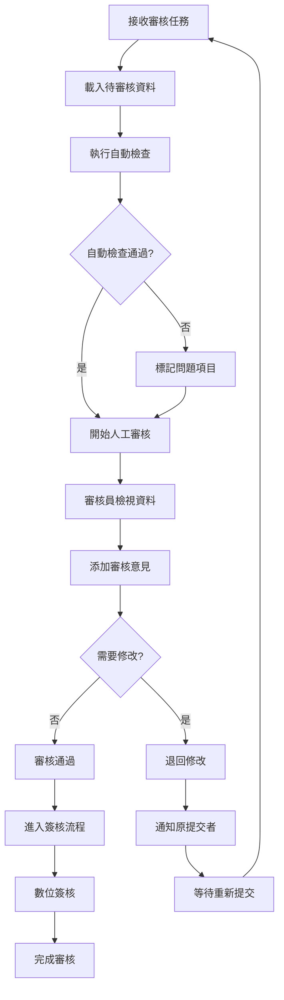
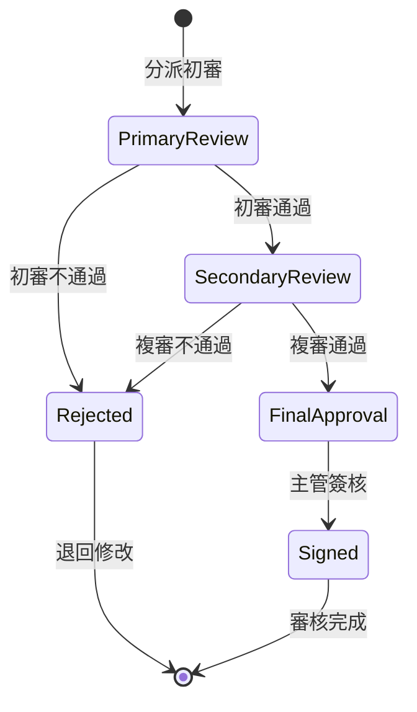

# 審核與簽核系統模組設計文件 (MDD)

## 文件資訊
- **模組名稱**: ReviewSystemModule (審核與簽核系統模組)
- **文件版本**: v1.0
- **建立日期**: 2025/05/30
- **最後更新**: 2025/05/30
- **階段標記**: [MVP]

## 1. 模組概述

### 1.1 模組目標
提供完整的審核和簽核功能，確保檢驗報告的品質和準確性，建立可追溯的審核流程，支援多層級審核和數位簽核機制。

### 1.2 業務價值
- 確保報告品質和準確性
- 建立標準化審核流程
- 提供完整的審核追蹤記錄
- 支援數位簽核和法律效力
- 提升審核效率和透明度

### 1.3 模組邊界
**包含功能**:
- 審核任務管理
- 意見註記系統
- 差異檢查機制
- 數位簽核功能
- 審核歷史追蹤

**不包含功能**:
- 並行審核 (Phase 1)
- 外部審核員 (Phase 2)
- 高級數位簽章 (Phase 2)

## 2. 功能需求

### 2.1 核心功能列表

#### 2.1.1 審核管理功能
- **F001**: 審核任務分派與管理
- **F002**: 審核狀態追蹤
- **F003**: 審核期限管理
- **F004**: 審核結果記錄

#### 2.1.2 意見註記功能
- **F005**: 文字意見註記
- **F006**: 標記和高亮
- **F007**: 附件和截圖
- **F008**: 意見分類管理

#### 2.1.3 差異檢查功能
- **F009**: 資料一致性檢查
- **F010**: 版本比較
- **F011**: 異常值檢測
- **F012**: 自動化檢查規則

#### 2.1.4 簽核功能
- **F013**: 數位簽核
- **F014**: 簽核權限驗證
- **F015**: 簽核記錄管理
- **F016**: 簽核狀態追蹤

### 2.2 審核流程設計

#### 2.2.1 主要審核流程


#### 2.2.2 多層級審核


## 3. 技術設計

### 3.1 資料模型

#### 3.1.1 審核任務實體
**參考 SOT**: [`docs/master_data_model.md`](../master_data_model.md) - 4.1 review_tasks (審核任務表)

```typescript
interface ReviewTask {
  id: bigint;                    // 審核任務唯一識別碼 (BIGSERIAL)
  workflowTaskId: bigint;        // 工作流程任務 ID (BIGINT, 參照 workflow_tasks.id)
  dataRecordId: bigint;          // 數據記錄 ID (BIGINT, 參照 data_records.id)
  reviewerId: bigint;            // 審核員 ID (BIGINT, 參照 users.id)
  reviewType: string;            // 審核類型 (VARCHAR(50))
  status: string;                // 審核狀態 (VARCHAR(20))
  priority: string;              // 優先級 (VARCHAR(20))
  assignedAt: Date;              // 分配時間 (TIMESTAMP WITH TIME ZONE)
  dueDate?: Date;                // 到期時間 (TIMESTAMP WITH TIME ZONE)
  startedAt?: Date;              // 開始時間 (TIMESTAMP WITH TIME ZONE)
  completedAt?: Date;            // 完成時間 (TIMESTAMP WITH TIME ZONE)
  createdAt: Date;               // 建立時間 (TIMESTAMP WITH TIME ZONE)
  updatedAt: Date;               // 更新時間 (TIMESTAMP WITH TIME ZONE)
}

// 審核類型枚舉 (與 SOT 保持一致)
enum ReviewType {
  DATA_REVIEW = 'data_review',
  REPORT_REVIEW = 'report_review',
  FINAL_APPROVAL = 'final_approval'
}

// 審核狀態枚舉 (與 SOT 保持一致)
enum ReviewStatus {
  PENDING = 'pending',
  IN_PROGRESS = 'in_progress',
  COMPLETED = 'completed',
  REJECTED = 'rejected',
  ESCALATED = 'escalated'
}
```

#### 3.1.2 審核意見實體
**參考 SOT**: [`docs/master_data_model.md`](../master_data_model.md) - 4.2 review_comments (審核評論表)

```typescript
interface ReviewComment {
  id: bigint;                    // 審核評論唯一識別碼 (BIGSERIAL)
  reviewTaskId: bigint;          // 審核任務 ID (BIGINT, 參照 review_tasks.id)
  reviewerId: bigint;            // 審核員 ID (BIGINT, 參照 users.id)
  commentType: string;           // 評論類型 (VARCHAR(50))
  content: string;               // 評論內容 (TEXT)
  fieldPath?: string;            // 欄位路徑 (VARCHAR(255))
  severity: string;              // 嚴重程度 (VARCHAR(20))
  status: string;                // 評論狀態 (VARCHAR(20))
  parentCommentId?: bigint;      // 父評論 ID (BIGINT, 參照 review_comments.id)
  createdAt: Date;               // 建立時間 (TIMESTAMP WITH TIME ZONE)
  updatedAt: Date;               // 更新時間 (TIMESTAMP WITH TIME ZONE)
  deletedAt?: Date;              // 刪除時間 (TIMESTAMP WITH TIME ZONE, 軟刪除)
}

// 評論類型枚舉 (與 SOT 保持一致)
enum CommentType {
  GENERAL = 'general',
  DATA_ERROR = 'data_error',
  FORMAT_ISSUE = 'format_issue',
  CALCULATION_ERROR = 'calculation_error',
  SUGGESTION = 'suggestion'
}

// 嚴重程度枚舉 (與 SOT 保持一致)
enum CommentSeverity {
  INFO = 'info',
  WARNING = 'warning',
  ERROR = 'error',
  CRITICAL = 'critical'
}
```

#### 3.1.3 數位簽章實體
**參考 SOT**: [`docs/master_data_model.md`](../master_data_model.md) - 4.3 digital_signatures (數位簽章表)

```typescript
interface DigitalSignature {
  id: bigint;                    // 數位簽章唯一識別碼 (BIGSERIAL)
  reviewTaskId: bigint;          // 審核任務 ID (BIGINT, 參照 review_tasks.id)
  signerId: bigint;              // 簽章者 ID (BIGINT, 參照 users.id)
  signatureType: string;         // 簽章類型 (VARCHAR(50))
  signatureData: string;         // 簽章數據 (TEXT)
  certificateInfo?: string;      // 憑證資訊 (TEXT)
  signedAt: Date;                // 簽章時間 (TIMESTAMP WITH TIME ZONE)
  ipAddress: string;             // IP 位址 (VARCHAR(45))
  userAgent: string;             // 用戶代理 (VARCHAR(500))
  createdAt: Date;               // 建立時間 (TIMESTAMP WITH TIME ZONE)
}

// 簽章類型枚舉 (與 SOT 保持一致)
enum SignatureType {
  DIGITAL_SIGNATURE = 'digital_signature',
  ELECTRONIC_SIGNATURE = 'electronic_signature',
  APPROVAL_STAMP = 'approval_stamp'
}
```

### 3.2 核心服務設計

#### 3.2.1 審核管理服務
```typescript
class ReviewManagementService {
  // 建立審核任務
  async createReviewTask(dataRecordId: string, reviewType: ReviewType): Promise<ReviewTask>;
  
  // 分派審核任務
  async assignReviewTask(taskId: string, reviewerId: string): Promise<void>;
  
  // 開始審核
  async startReview(taskId: string, reviewerId: string): Promise<ReviewSession>;
  
  // 完成審核
  async completeReview(taskId: string, result: ReviewResult): Promise<void>;
  
  // 退回修改
  async rejectReview(taskId: string, comments: ReviewComment[]): Promise<void>;
  
  // 獲取審核任務列表
  async getReviewTasks(reviewerId: string, status?: ReviewStatus): Promise<ReviewTask[]>;
}
```

#### 3.2.2 意見管理服務
```typescript
class CommentManagementService {
  // 添加審核意見
  async addComment(reviewTaskId: string, comment: CreateCommentRequest): Promise<ReviewComment>;
  
  // 更新意見狀態
  async updateCommentStatus(commentId: string, status: CommentStatus): Promise<void>;
  
  // 回覆意見
  async replyToComment(commentId: string, reply: string): Promise<ReviewComment>;
  
  // 獲取意見列表
  async getComments(reviewTaskId: string): Promise<ReviewComment[]>;
  
  // 解決意見
  async resolveComment(commentId: string, resolution: string): Promise<void>;
}
```

#### 3.2.3 差異檢查服務
```typescript
class DifferenceCheckService {
  // 執行自動檢查
  async performAutomaticChecks(dataRecordId: string): Promise<CheckResult[]>;
  
  // 資料一致性檢查
  async checkDataConsistency(data: Record<string, any>): Promise<ConsistencyResult>;
  
  // 計算值驗證
  async validateCalculations(data: Record<string, any>): Promise<ValidationResult>;
  
  // 範圍檢查
  async checkValueRanges(data: Record<string, any>): Promise<RangeCheckResult>;
  
  // 比較版本差異
  async compareVersions(originalId: string, modifiedId: string): Promise<DifferenceReport>;
}
```

#### 3.2.4 數位簽核服務
```typescript
class DigitalSignatureService {
  // 建立數位簽章
  async createSignature(dataRecordId: string, signerId: string): Promise<SignatureRecord>;
  
  // 驗證簽章
  async verifySignature(signatureId: string): Promise<VerificationResult>;
  
  // 獲取簽章資訊
  async getSignatureInfo(dataRecordId: string): Promise<SignatureRecord[]>;
  
  // 撤銷簽章
  async revokeSignature(signatureId: string, reason: string): Promise<void>;
  
  // 批量簽核
  async batchSign(dataRecordIds: string[], signerId: string): Promise<SignatureRecord[]>;
}
```

### 3.3 自動檢查規則引擎

#### 3.3.1 檢查規則定義
```typescript
interface CheckRule {
  id: string;
  name: string;
  description: string;
  category: string;
  ruleType: RuleType;
  condition: string;           // JavaScript 表達式
  severity: CommentSeverity;
  isActive: boolean;
  parameters: Record<string, any>;
}

enum RuleType {
  RANGE_CHECK = 'range_check',
  CONSISTENCY_CHECK = 'consistency_check',
  CALCULATION_CHECK = 'calculation_check',
  FORMAT_CHECK = 'format_check',
  BUSINESS_RULE = 'business_rule'
}

class CheckRuleEngine {
  // 執行檢查規則
  async executeRules(data: Record<string, any>, rules: CheckRule[]): Promise<CheckResult[]> {
    const results: CheckResult[] = [];
    
    for (const rule of rules) {
      if (!rule.isActive) continue;
      
      try {
        const result = await this.executeRule(rule, data);
        if (!result.passed) {
          results.push(result);
        }
      } catch (error) {
        console.error(`規則執行失敗: ${rule.name}`, error);
      }
    }
    
    return results;
  }
  
  private async executeRule(rule: CheckRule, data: Record<string, any>): Promise<CheckResult> {
    const context = {
      data,
      parameters: rule.parameters,
      // 提供檢查函數
      isInRange: (value: number, min: number, max: number) => value >= min && value <= max,
      isValidFormat: (value: string, pattern: string) => new RegExp(pattern).test(value),
      calculatePercentage: (part: number, total: number) => (part / total) * 100
    };
    
    const vm = new VM({
      timeout: 1000,
      sandbox: context
    });
    
    const passed = vm.run(rule.condition);
    
    return {
      ruleId: rule.id,
      ruleName: rule.name,
      passed,
      severity: rule.severity,
      message: passed ? '檢查通過' : `檢查失敗: ${rule.description}`
    };
  }
}
```

### 3.4 API 接口設計
**參考 SOT**: [`docs/api_specification.md`](../api_specification.md) - 4.4 審核系統 API

#### 3.4.1 審核任務 API

**POST /api/v1/internal/review/tasks**
```typescript
// 請求 (內部 API，由工作流程引擎調用)
interface CreateReviewTaskRequest {
  dataRecordId: string;
  workflowInstanceId: string;
  reviewType: string;          // 'data_review', 'report_review', 'final_approval'
  assignedTo?: string;
  dueDate?: string;            // ISO 8601 格式
  priority: string;            // 'low', 'medium', 'high', 'critical'
  metadata?: {
    sampleType?: string;
    submitterName?: string;
    submissionDate?: string;
  };
}

// 回應 (遵循標準響應格式)
interface CreateReviewTaskResponse {
  success: boolean;
  data: {
    taskId: string;
    status: string;
    assignedTo: string;
  };
  meta: {
    timestamp: string;
    version: string;
    requestId: string;
  };
}
```

**GET /api/v1/review/tasks/{taskId}**
```typescript
// 回應
interface GetReviewTaskResponse {
  success: boolean;
  data: ReviewTask;            // 完整的審核任務物件
  meta: {
    timestamp: string;
    version: string;
    requestId: string;
  };
}
```

**POST /api/v1/review/tasks/{taskId}/submit**
```typescript
// 請求
interface SubmitReviewResultRequest {
  result: string;              // 'approved', 'rejected', 'requires_modification'
  comments?: WorkflowTaskCommentInput[];
  digitalSignature?: DigitalSignatureInput;
}

interface WorkflowTaskCommentInput {
  type: string;
  content: string;
  fieldPath?: string;
  severity?: string;
}

interface DigitalSignatureInput {
  signatureData: string;       // Base64 encoded signature or cryptographic hash
  certificateInfo?: string;    // Information about the signing certificate
}

// 回應
interface SubmitReviewResponse {
  success: boolean;
  data: {
    taskId: string;
    status: string;
    submittedAt: string;
  };
  meta: {
    timestamp: string;
    version: string;
    requestId: string;
  };
}
```

#### 3.4.2 審核評論 API

**POST /api/v1/review/tasks/{taskId}/comments**
```typescript
// 請求
interface AddReviewCommentRequest {
  commentType: string;
  content: string;
  fieldPath?: string;
  severity?: string;
  parentCommentId?: string;    // 用於回覆評論
}

// 回應
interface AddCommentResponse {
  success: boolean;
  data: {
    commentId: string;
    createdAt: string;
  };
  meta: {
    timestamp: string;
    version: string;
    requestId: string;
  };
}
```

**GET /api/v1/review/tasks/{taskId}/comments**
```typescript
// 回應
interface GetCommentsResponse {
  success: boolean;
  data: ReviewComment[];       // 評論列表
  meta: {
    timestamp: string;
    version: string;
    requestId: string;
  };
}
```

#### 3.4.3 數位簽章 API (內部使用)

**POST /api/v1/internal/review/digital-signatures**
```typescript
// 請求 (內部 API)
interface CreateDigitalSignatureRequest {
  reviewTaskId: string;
  signerId: string;
  signatureType: string;       // 'digital_signature', 'electronic_signature', 'approval_stamp'
  signatureData: string;
  certificateInfo?: string;
}

// 回應
interface CreateSignatureResponse {
  success: boolean;
  data: {
    signatureId: string;
    signedAt: string;
  };
  meta: {
    timestamp: string;
    version: string;
    requestId: string;
  };
}
```

**GET /api/v1/review/digital-signatures/{signatureId}/verify**
```typescript
// 回應
interface VerifySignatureResponse {
  success: boolean;
  data: {
    isValid: boolean;
    signatureInfo: DigitalSignature;
    verificationDetails: {
      certificateValid: boolean;
      timestampValid: boolean;
      dataIntegrity: boolean;
    };
  };
  meta: {
    timestamp: string;
    version: string;
    requestId: string;
  };
}
```

## 4. 前端設計

### 4.1 審核界面組件

#### 4.1.1 審核工作台
```typescript
interface ReviewWorkbenchProps {
  taskId: string;
  onComplete: (result: ReviewResult) => void;
  onReject: (comments: ReviewComment[]) => void;
}

const ReviewWorkbench: React.FC<ReviewWorkbenchProps> = ({
  taskId,
  onComplete,
  onReject
}) => {
  const [reviewData, setReviewData] = useState<ReviewData | null>(null);
  const [comments, setComments] = useState<ReviewComment[]>([]);
  const [checkResults, setCheckResults] = useState<CheckResult[]>([]);
  
  // 載入審核資料
  useEffect(() => {
    loadReviewData(taskId).then(data => {
      setReviewData(data.dataRecord);
      setComments(data.previousComments);
      setCheckResults(data.checkResults);
    });
  }, [taskId]);
  
  return (
    <div className="review-workbench">
      <ReviewHeader task={reviewData?.task} />
      
      <div className="review-content">
        <div className="data-panel">
          <DataViewer data={reviewData?.data} />
          <CheckResultsPanel results={checkResults} />
        </div>
        
        <div className="comments-panel">
          <CommentsViewer comments={comments} />
          <CommentEditor onAddComment={handleAddComment} />
        </div>
      </div>
      
      <ReviewActions
        onApprove={() => onComplete({ result: 'approved' })}
        onReject={() => onReject(comments)}
      />
    </div>
  );
};
```

#### 4.1.2 意見註記組件
```typescript
interface CommentEditorProps {
  fieldPath?: string;
  onAddComment: (comment: CreateCommentRequest) => void;
}

const CommentEditor: React.FC<CommentEditorProps> = ({
  fieldPath,
  onAddComment
}) => {
  const [commentForm] = Form.useForm();
  
  const handleSubmit = async (values: any) => {
    const comment: CreateCommentRequest = {
      reviewTaskId: values.taskId,
      fieldPath: fieldPath || values.fieldPath,
      commentType: values.type,
      content: values.content,
      severity: values.severity
    };
    
    onAddComment(comment);
    commentForm.resetFields();
  };
  
  return (
    <Form form={commentForm} onFinish={handleSubmit}>
      <Form.Item name="type" label="意見類型">
        <Select>
          <Option value="general">一般意見</Option>
          <Option value="data_error">資料錯誤</Option>
          <Option value="format_issue">格式問題</Option>
          <Option value="suggestion">建議</Option>
        </Select>
      </Form.Item>
      
      <Form.Item name="severity" label="嚴重程度">
        <Select>
          <Option value="info">資訊</Option>
          <Option value="warning">警告</Option>
          <Option value="error">錯誤</Option>
          <Option value="critical">嚴重</Option>
        </Select>
      </Form.Item>
      
      <Form.Item name="content" label="意見內容">
        <TextArea rows={4} placeholder="請輸入審核意見..." />
      </Form.Item>
      
      <Form.Item>
        <Button type="primary" htmlType="submit">
          添加意見
        </Button>
      </Form.Item>
    </Form>
  );
};
```

### 4.2 數位簽核組件

#### 4.2.1 簽核界面
```typescript
interface DigitalSignatureProps {
  dataRecordId: string;
  onSigned: (signature: SignatureRecord) => void;
}

const DigitalSignature: React.FC<DigitalSignatureProps> = ({
  dataRecordId,
  onSigned
}) => {
  const [isSigningModalVisible, setIsSigningModalVisible] = useState(false);
  const [pin, setPin] = useState('');
  const [isLoading, setIsLoading] = useState(false);
  
  const handleSign = async () => {
    setIsLoading(true);
    try {
      const signature = await createDigitalSignature({
        dataRecordId,
        signatureType: 'digital_signature',
        pin
      });
      
      onSigned(signature);
      setIsSigningModalVisible(false);
      message.success('簽核成功');
    } catch (error) {
      message.error('簽核失敗');
    } finally {
      setIsLoading(false);
    }
  };
  
  return (
    <>
      <Button 
        type="primary" 
        icon={<SafetyCertificateOutlined />}
        onClick={() => setIsSigningModalVisible(true)}
      >
        數位簽核
      </Button>
      
      <Modal
        title="數位簽核"
        visible={isSigningModalVisible}
        onOk={handleSign}
        onCancel={() => setIsSigningModalVisible(false)}
        confirmLoading={isLoading}
      >
        <div className="signature-form">
          <p>請輸入簽核密碼以完成數位簽章：</p>
          <Input.Password
            placeholder="簽核密碼"
            value={pin}
            onChange={(e) => setPin(e.target.value)}
          />
          
          <div className="signature-info">
            <p><strong>簽核人：</strong>{getCurrentUser().name}</p>
            <p><strong>簽核時間：</strong>{new Date().toLocaleString()}</p>
            <p><strong>文件：</strong>檢驗報告 #{dataRecordId}</p>
          </div>
        </div>
      </Modal>
    </>
  );
};
```

## 5. 安全考量

### 5.1 簽核安全
- **身份驗證**: 強化的簽核身份驗證
- **密碼保護**: 簽核密碼加密儲存
- **時間戳**: 可信時間戳服務
- **完整性**: 資料完整性驗證

### 5.2 審核安全
- **權限控制**: 細粒度審核權限
- **資料隔離**: 審核資料存取隔離
- **操作記錄**: 完整的審核操作日誌
- **敏感資料**: 敏感意見加密儲存

### 5.3 合規性
- **法律效力**: 符合電子簽章法規
- **稽核追蹤**: 完整的稽核軌跡
- **資料保留**: 符合法規的資料保留
- **證據保全**: 法律證據保全機制

## 6. 效能優化

### 6.1 審核效能
- **並行處理**: 多任務並行審核
- **快取策略**: 審核資料快取
- **增量載入**: 大型資料增量載入
- **背景處理**: 自動檢查背景執行

### 6.2 簽核效能
- **批量簽核**: 支援批量簽核操作
- **非同步處理**: 簽核過程非同步處理
- **快取驗證**: 簽章驗證結果快取
- **壓縮儲存**: 簽章資料壓縮儲存

## 7. 測試策略

### 7.1 功能測試
- **審核流程**: 完整審核流程測試
- **意見管理**: 意見添加和解決測試
- **簽核功能**: 數位簽核和驗證測試
- **權限控制**: 各種權限場景測試

### 7.2 安全測試
- **簽章安全**: 簽章偽造和篡改測試
- **權限測試**: 越權操作測試
- **資料安全**: 敏感資料洩露測試
- **合規測試**: 法規合規性測試

## 8. 部署配置

### 8.1 環境變數
```bash
# 審核配置
REVIEW_TIMEOUT_HOURS=48
REVIEW_ESCALATION_ENABLED=true
AUTO_CHECK_ENABLED=true

# 簽核配置
SIGNATURE_ALGORITHM=RSA-SHA256
SIGNATURE_KEY_SIZE=2048
TIMESTAMP_SERVER_URL=http://timestamp.server.com

# 安全配置
SIGNATURE_PIN_ENCRYPTION_KEY=your-encryption-key
AUDIT_LOG_RETENTION_DAYS=2555
```

### 8.2 資料庫 Schema
```sql
-- 審核任務表
CREATE TABLE review_tasks (
  id UUID PRIMARY KEY DEFAULT gen_random_uuid(),
  data_record_id UUID NOT NULL,
  workflow_instance_id UUID NOT NULL,
  review_type VARCHAR(50) NOT NULL,
  review_level INTEGER DEFAULT 1,
  status VARCHAR(50) DEFAULT 'pending',
  assigned_to UUID NOT NULL,
  assigned_at TIMESTAMP DEFAULT NOW(),
  due_date TIMESTAMP NOT NULL,
  started_at TIMESTAMP,
  completed_at TIMESTAMP,
  priority INTEGER DEFAULT 5,
  metadata JSONB
);

-- 審核意見表
CREATE TABLE review_comments (
  id UUID PRIMARY KEY DEFAULT gen_random_uuid(),
  review_task_id UUID NOT NULL REFERENCES review_tasks(id) ON DELETE CASCADE,
  field_path VARCHAR(500),
  comment_type VARCHAR(50) NOT NULL,
  content TEXT NOT NULL,
  severity VARCHAR(20) NOT NULL,
  status VARCHAR(20) DEFAULT 'open',
  created_by UUID NOT NULL,
  created_at TIMESTAMP DEFAULT NOW(),
  resolved_by UUID,
  resolved_at TIMESTAMP
);

-- 簽核記錄表
CREATE TABLE signature_records (
  id UUID PRIMARY KEY DEFAULT gen_random_uuid(),
  data_record_id UUID NOT NULL,
  signed_by UUID NOT NULL,
  signed_at TIMESTAMP DEFAULT NOW(),
  signature_type VARCHAR(50) NOT NULL,
  signature_data TEXT NOT NULL,
  certificate_info JSONB,
  ip_address INET,
  user_agent TEXT,
  is_valid BOOLEAN DEFAULT true
);

-- 索引
CREATE INDEX idx_review_tasks_assigned ON review_tasks(assigned_to, status);
CREATE INDEX idx_review_tasks_due_date ON review_tasks(due_date) WHERE status IN ('pending', 'in_progress');
CREATE INDEX idx_review_comments_task ON review_comments(review_task_id);
CREATE INDEX idx_signature_records_data_record ON signature_records(data_record_id);
```

## 9. 監控與維運

### 9.1 監控指標
- **審核完成率**: 按時完成審核的比例
- **平均審核時間**: 審核任務平均處理時間
- **意見解決率**: 審核意見解決比例
- **簽核成功率**: 數位簽核成功比例

### 9.2 告警規則
- **審核逾期**: 審核任務超過期限
- **積壓任務**: 待審核任務過多
- **簽核失敗**: 簽核失敗率過高
- **系統異常**: 審核系統異常

## 10. 模組接口定義

### 10.1 對外提供的接口

#### 10.1.1 建立審核任務接口
**接口名稱**: `POST /api/review/tasks`
**用途**: 接收來自流程引擎的審核任務建立請求
**調用方**: 流程引擎模組

基於 [`docs/architecture/module_interaction_analysis.md`](../architecture/module_interaction_analysis.md) 中的接口 3：

```typescript
interface CreateReviewTaskRequest {
  dataRecordId: string;
  workflowInstanceId: string;
  reviewType: 'data_review' | 'report_review' | 'final_approval';
  assignedTo?: string;            // 可選的指定審核員
  dueDate: Date;
  priority: 'low' | 'medium' | 'high' | 'critical';
  metadata: {
    sampleType: string;
    submitterName: string;
    submissionDate: Date;
  };
}

interface CreateReviewTaskResponse {
  success: boolean;
  data: {
    taskId: string;
    assignedTo: string;
    estimatedDuration: number;    // 預估審核時間(分鐘)
  };
}
```

#### 10.1.2 審核任務查詢接口
**接口名稱**: `GET /api/review/tasks/:taskId`
**用途**: 提供審核任務詳細資訊查詢
**調用方**: 前端介面、流程引擎

```typescript
interface ReviewTaskResponse {
  success: boolean;
  data: {
    task: ReviewTask;
    dataRecord: DataRecord;
    reviewHistory: ReviewHistory[];
    attachments: FileAttachment[];
  };
}
```

#### 10.1.3 審核員工作負載查詢接口
**接口名稱**: `GET /api/review/reviewers/workload`
**用途**: 提供審核員工作負載資訊供任務分派參考
**調用方**: 流程引擎模組

```typescript
interface ReviewerWorkloadResponse {
  success: boolean;
  data: {
    reviewers: Array<{
      reviewerId: string;
      name: string;
      currentTasks: number;
      avgCompletionTime: number;
      specialties: string[];
      availability: 'available' | 'busy' | 'unavailable';
    }>;
  };
}
```

### 10.2 依賴的外部接口

#### 10.2.1 用戶認證模組接口
**依賴接口**: `POST /api/auth/verify-permission`
**用途**: 驗證審核員的審核權限
**調用場景**: 審核任務分派、審核操作前的權限檢查

```typescript
interface ReviewPermissionRequest {
  userId: string;
  resource: 'review_tasks';
  action: 'read' | 'review' | 'approve' | 'reject' | 'assign';
  context: {
    taskId?: string;
    reviewType?: string;
    dataRecordId?: string;
  };
}
```

#### 10.2.2 數據輸入模組接口
**依賴接口**: `GET /api/data/records/:id`
**用途**: 獲取待審核的數據記錄詳細資訊
**調用場景**: 審核任務建立時、審核員查看數據時

```typescript
interface DataRecordRequest {
  recordId: string;
  includeAttachments: boolean;
  includeHistory: boolean;
}
```

#### 10.2.3 流程引擎接口
**依賴接口**: `POST /api/workflow/tasks/:taskId/complete`
**用途**: 審核完成後通知流程引擎
**調用場景**: 審核員完成審核任務時

基於 [`docs/architecture/module_interaction_analysis.md`](../architecture/module_interaction_analysis.md) 中的接口 4：

```typescript
interface CompleteReviewRequest {
  result: 'approved' | 'rejected' | 'requires_modification';
  comments: ReviewComment[];
  nextAction?: 'generate_report' | 'return_for_modification' | 'escalate';
  metadata: {
    reviewDuration: number;       // 實際審核時間
    issuesFound: number;
    criticalIssues: number;
  };
}
```

#### 10.2.4 通知模組接口
**依賴接口**: `POST /api/notifications`
**用途**: 發送審核相關通知
**調用場景**: 任務分派、審核完成、逾期提醒等

```typescript
interface ReviewNotificationRequest {
  type: 'task_assigned' | 'review_completed' | 'review_overdue' | 'escalation_required';
  recipientId: string;
  templateId: string;
  templateData: {
    taskId: string;
    dataRecordId: string;
    reviewerName?: string;
    dueDate?: Date;
    reviewResult?: string;
    actionUrl: string;
  };
  priority: 'low' | 'medium' | 'high';
}
```

#### 10.2.5 審計日誌模組接口
**依賴接口**: `POST /api/audit/log`
**用途**: 記錄所有審核操作的審計日誌
**調用頻率**: 每次審核操作、任務狀態變更

```typescript
interface ReviewAuditLogRequest {
  eventType: 'user_action';
  category: 'data_access' | 'workflow_operation';
  userId: string;
  resource: 'review_tasks';
  action: 'create' | 'assign' | 'review' | 'approve' | 'reject' | 'escalate';
  details: {
    entityType: 'review_task';
    entityId: string;
    dataRecordId: string;
    workflowInstanceId: string;
    reviewResult?: string;
    reviewComments?: string;
    oldValues?: Record<string, any>;
    newValues?: Record<string, any>;
  };
  result: 'success' | 'failure';
  severity: 'info' | 'warning' | 'error';
}
```

## 11. 依賴關係

### 11.1 直接依賴的核心模組
根據 [`docs/architecture/system_architecture.md`](../architecture/system_architecture.md) 中的模組依賴圖：

1. **用戶認證模組 (UserAuthModule)**
   - **依賴原因**: 驗證審核員身份和審核權限
   - **交互接口**: `POST /api/auth/verify-permission`
   - **調用場景**: 審核任務分派、審核操作前的權限檢查
   - **依賴強度**: 強依賴（所有審核操作都需要權限驗證）

2. **數據輸入模組 (DataInputModule)**
   - **依賴原因**: 獲取待審核的數據記錄詳細資訊
   - **交互接口**: `GET /api/data/records/:id`
   - **調用場景**: 審核任務建立時、審核員查看數據時
   - **依賴強度**: 強依賴（審核的核心數據來源）

3. **流程引擎 (WorkflowEngineModule)**
   - **依賴原因**: 審核完成後推進工作流程
   - **交互接口**: `POST /api/workflow/tasks/:taskId/complete`
   - **調用場景**: 審核員完成審核任務時
   - **依賴強度**: 強依賴（核心業務流程）

4. **通知模組 (NotificationModule)**
   - **依賴原因**: 發送審核相關通知
   - **交互接口**: `POST /api/notifications`
   - **調用場景**: 任務分派、審核完成、逾期提醒等
   - **依賴強度**: 強依賴（用戶體驗必需）

5. **審計日誌模組 (AuditLogModule)**
   - **依賴原因**: 記錄所有審核操作的完整追蹤
   - **交互接口**: `POST /api/audit/log`
   - **調用場景**: 所有審核操作和狀態變更
   - **依賴強度**: 強依賴（合規要求）

### 11.2 被依賴的模組

1. **流程引擎 (WorkflowEngineModule)**
   - **依賴接口**: `POST /api/review/tasks`
   - **依賴原因**: 建立新的審核任務

2. **流程引擎 (WorkflowEngineModule)**
   - **依賴接口**: `GET /api/review/reviewers/workload`
   - **依賴原因**: 智能任務分派時查詢審核員工作負載

### 11.3 技術基礎設施依賴
- **PostgreSQL**: 審核任務、審核歷史、審核規則儲存
- **Redis**: 審核員工作負載快取、任務狀態快取
- **crypto**: 數位簽章加密和驗證
- **vm2**: 安全的審核規則執行環境

### 11.4 外部服務依賴
- **數位簽章服務**: 審核結果的法律效力保證
- **時間戳服務**: 審核時間的可信記錄

## 11. 驗收標準 (Acceptance Criteria)

### 11.1 審核任務管理功能驗收標準

#### AC-REVIEW-001: 審核任務建立 (F001)
**Given** 流程引擎觸發審核任務建立
**When** 系統建立新的審核任務
**Then**
- 審核任務在 1 秒內建立完成
- 正確關聯數據記錄和工作流程實例
- 根據審核規則自動分派給適當的審核員
- 設定合理的審核截止日期
- 任務狀態初始化為 "pending"
- 發送任務分派通知給審核員
- 記錄任務建立事件到審計日誌

#### AC-REVIEW-002: 智能任務分派 (F002)
**Given** 系統需要分派審核任務
**When** 執行任務分派邏輯
**Then**
- 考慮審核員的專業領域匹配度
- 評估審核員當前工作負載
- 檢查審核員的可用性狀態
- 避免利益衝突 (不分派給原數據建立者)
- 分派決策在 2 秒內完成
- 分派結果可追蹤和調整
- 支援手動重新分派功能

#### AC-REVIEW-003: 審核任務查詢 (F003)
**Given** 審核員登入系統
**When** 查詢待審核任務列表
**Then**
- 任務列表在 1 秒內載入完成
- 正確顯示任務優先級和截止日期
- 支援任務篩選 (狀態、類型、日期範圍)
- 支援任務排序 (優先級、截止日期、建立時間)
- 顯示任務基本資訊 (樣本名稱、提交者、類型)
- 任務數量統計準確

### 11.2 審核流程功能驗收標準

#### AC-REVIEW-004: 數據審核檢查 (F004)
**Given** 審核員開始審核數據記錄
**When** 執行數據審核檢查
**Then**
- 完整載入數據記錄和相關附件
- 自動執行預設的審核規則檢查
- 標示潛在的數據異常或錯誤
- 提供數據完整性驗證結果
- 支援與歷史數據的比較
- 審核檢查結果清晰呈現
- 檢查過程可中斷和恢復

#### AC-REVIEW-005: 審核意見記錄 (F005)
**Given** 審核員發現需要修正的問題
**When** 記錄審核意見
**Then**
- 支援多種意見類型 (錯誤、建議、疑問)
- 可標記具體的數據欄位或區域
- 支援富文本格式的意見內容
- 可附加參考文件或圖片
- 意見自動關聯到審核員身份
- 意見時間戳準確記錄
- 支援意見的修改和刪除

#### AC-REVIEW-006: 審核決策執行 (F006)
**Given** 審核員完成審核檢查
**When** 做出審核決策
**Then**
- 支援三種決策結果 (通過、拒絕、需修正)
- 拒絕或需修正必須提供具體原因
- 審核決策不可撤銷 (確保審核完整性)
- 自動計算審核耗時
- 觸發相應的後續流程
- 通知相關人員審核結果
- 更新工作流程狀態

### 11.3 數位簽核功能驗收標準

#### AC-REVIEW-007: 數位簽章生成 (F007)
**Given** 審核員確認通過審核
**When** 執行數位簽核
**Then**
- 使用審核員的數位憑證進行簽章
- 簽章包含審核員身份資訊
- 簽章包含準確的時間戳
- 簽章具有法律效力
- 簽章資料加密儲存
- 簽章過程不可中斷或篡改
- 生成簽章驗證碼

#### AC-REVIEW-008: 簽章驗證機制 (F008)
**Given** 需要驗證數位簽章的有效性
**When** 執行簽章驗證
**Then**
- 驗證簽章的完整性
- 確認簽章者身份
- 檢查簽章時間的有效性
- 驗證憑證的有效期
- 檢查憑證撤銷狀態
- 驗證結果明確可靠
- 驗證過程可追蹤

### 11.4 審核規則引擎驗收標準

#### AC-REVIEW-009: 規則配置管理 (F009)
**Given** 管理員配置審核規則
**When** 規則配置生效
**Then**
- 規則語法驗證通過
- 規則邏輯無衝突
- 支援複雜的條件表達式
- 規則版本正確管理
- 規則變更歷史完整記錄
- 新規則不影響進行中的審核
- 規則執行效能良好

#### AC-REVIEW-010: 自動規則執行 (F010)
**Given** 審核過程中觸發規則檢查
**When** 執行自動規則
**Then**
- 規則執行在 500ms 內完成
- 規則結果準確可靠
- 規則執行過程可追蹤
- 異常規則有適當的錯誤處理
- 規則結果清晰呈現給審核員
- 支援規則結果的人工覆蓋

### 11.5 整合功能驗收標準

#### AC-REVIEW-011: 工作流程整合
**Given** 審核任務完成
**When** 通知工作流程引擎
**Then**
- 正確調用工作流程 API
- 審核結果完整傳遞
- 工作流程狀態正確更新
- 觸發下一階段流程
- 整合過程無資料遺失
- 異常情況有重試機制

#### AC-REVIEW-012: 通知系統整合
**Given** 審核狀態發生變更
**When** 發送相關通知
**Then**
- 正確識別通知接收者
- 通知內容準確完整
- 通知發送及時 (< 5 分鐘)
- 支援多種通知類型
- 通知發送成功率 > 95%
- 失敗通知有重試機制

### 11.6 效能與可靠性驗收標準

#### AC-REVIEW-013: 系統效能要求
**Given** 系統處於正常負載狀態
**When** 執行審核相關操作
**Then**
- 任務列表載入時間 < 1 秒
- 數據記錄載入時間 < 2 秒
- 審核規則執行時間 < 500ms
- 數位簽核時間 < 3 秒
- 支援同時 20 位審核員操作

#### AC-REVIEW-014: 資料完整性保障
**Given** 審核過程中處理資料
**When** 發生異常情況
**Then**
- 審核狀態保持一致性
- 審核歷史完整保存
- 數位簽章不可篡改
- 並發審核無資料衝突
- 系統故障不影響已完成的審核

#### AC-REVIEW-015: 安全性要求
**Given** 審核涉及敏感資料
**When** 進行安全檢查
**Then**
- 所有審核操作需要身份驗證
- 敏感資料傳輸加密
- 審核權限嚴格控制
- 操作日誌完整記錄
- 防止未授權存取
- 符合資料保護法規

### 11.7 用戶體驗驗收標準

#### AC-REVIEW-016: 審核介面易用性
**Given** 審核員使用審核介面
**When** 進行審核操作
**Then**
- 介面佈局清晰直觀
- 重要資訊突出顯示
- 操作流程符合習慣
- 支援鍵盤快捷鍵
- 錯誤提示清晰具體
- 幫助文件易於存取

#### AC-REVIEW-017: 審核效率優化
**Given** 審核員進行日常審核工作
**When** 使用系統功能
**Then**
- 常用功能易於存取
- 支援批量操作
- 提供審核範本和快捷輸入
- 自動儲存審核進度
- 支援審核工作的中斷和恢復
- 提供審核效率統計

## 12. 結論

審核與簽核系統模組是確保檢驗報告品質的關鍵組件，通過完善的審核流程和安全的數位簽核機制，能夠有效保障報告的準確性和法律效力。模組化的設計和豐富的功能為未來的審核流程優化提供了良好的基礎。

關鍵設計特點：
1. **完整性**: 涵蓋審核全流程的功能設計
2. **安全性**: 強化的數位簽核和權限控制
3. **可追溯性**: 完整的審核歷史和操作記錄
4. **靈活性**: 可配置的審核規則和流程

通過本模組的實施，系統將具備專業級的審核和簽核能力，確保檢驗報告的品質和合規性。