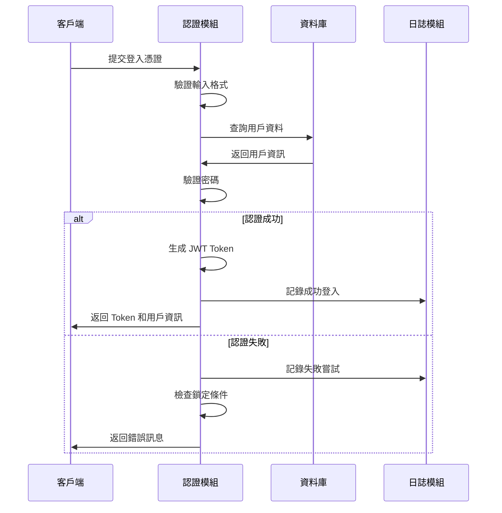
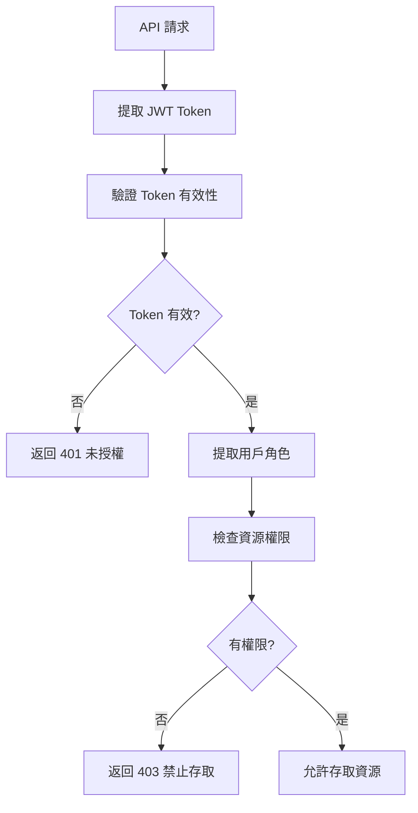

# 用戶認證與權限管理模組設計文件 (MDD)

## 文件資訊
- **模組名稱**: UserAuthModule (用戶認證與權限管理模組)
- **文件版本**: v1.0
- **建立日期**: 2025/05/30
- **最後更新**: 2025/05/30
- **階段標記**: [MVP]

## 1. 模組概述

### 1.1 模組目標
提供安全、可靠的用戶認證和細粒度的權限控制機制，確保系統資源的安全存取和用戶身份的有效驗證。

### 1.2 業務價值
- 保護系統資源免受未授權存取
- 提供角色基礎的權限管理
- 支援多種認證方式
- 確保合規性和稽核要求

### 1.3 模組邊界
**包含功能**:
- 用戶認證 (登入/登出)
- JWT Token 管理
- 角色權限控制
- 會話管理
- 密碼安全策略

**不包含功能**:
- 用戶註冊 (由管理員建立)
- 社交媒體登入 (Phase 2)
- 多因子認證 (Phase 1)

## 2. 功能需求

### 2.1 核心功能列表

#### 2.1.1 用戶認證功能
- **F001**: 用戶登入驗證
- **F002**: 用戶登出處理
- **F003**: JWT Token 生成與驗證
- **F004**: 會話狀態管理
- **F005**: 密碼驗證與加密

#### 2.1.2 權限管理功能
- **F006**: 角色定義與管理
- **F007**: 權限分配與檢查
- **F008**: 資源存取控制
- **F009**: 權限中介層實現

#### 2.1.3 安全功能
- **F010**: 密碼強度驗證
- **F011**: 登入失敗鎖定
- **F012**: 會話超時處理
- **F013**: 安全日誌記錄

### 2.2 詳細功能規格

#### 2.2.1 用戶登入流程 (F001)


**輸入**:
- 用戶名稱/Email
- 密碼
- 可選的記住我選項

**輸出**:
- JWT Access Token
- Refresh Token
- 用戶基本資訊
- 權限列表

**驗證規則**:
- 用戶名稱/Email 格式驗證
- 密碼長度和複雜度檢查
- 帳號狀態檢查 (啟用/停用)
- 登入失敗次數檢查

#### 2.2.2 權限檢查機制 (F007)


**權限檢查層級**:
1. **Token 層級**: 驗證 JWT Token 有效性
2. **用戶層級**: 檢查用戶狀態和角色
3. **資源層級**: 檢查特定資源存取權限
4. **操作層級**: 檢查特定操作權限

## 3. 技術設計

### 3.1 資料模型

#### 3.1.1 用戶實體 (User Entity)
**參考 SOT**: [`docs/master_data_model.md`](../master_data_model.md) - 3.1.1 users (用戶表)

```typescript
interface User {
  id: bigint;                    // 用戶唯一識別碼 (BIGSERIAL)
  username: string;              // 用戶名稱 (VARCHAR(50), UNIQUE)
  email: string;                 // 電子郵件 (VARCHAR(255), UNIQUE)
  passwordHash: string;          // 密碼雜湊值 (VARCHAR(255))
  fullName: string;              // 完整姓名 (VARCHAR(100))
  phone?: string;                // 電話號碼 (VARCHAR(20), 可選)
  isActive: boolean;             // 帳戶狀態 (BOOLEAN, 軟刪除標記)
  createdAt: Date;               // 建立時間 (TIMESTAMP WITH TIME ZONE)
  updatedAt: Date;               // 更新時間 (TIMESTAMP WITH TIME ZONE)
  deletedAt?: Date;              // 刪除時間 (TIMESTAMP WITH TIME ZONE, 軟刪除)
}
```

#### 3.1.2 角色實體 (Role Entity)
**參考 SOT**: [`docs/master_data_model.md`](../master_data_model.md) - 3.1.2 roles (角色表)

```typescript
interface Role {
  id: bigint;                    // 角色唯一識別碼 (BIGSERIAL)
  name: string;                  // 角色名稱 (VARCHAR(50), UNIQUE)
  description?: string;          // 角色描述 (VARCHAR(255))
  permissions: object;           // 權限列表 (JSONB, JSON 陣列格式)
  isActive: boolean;             // 角色狀態 (BOOLEAN, 是否啟用)
  createdAt: Date;               // 建立時間 (TIMESTAMP WITH TIME ZONE)
  updatedAt: Date;               // 更新時間 (TIMESTAMP WITH TIME ZONE)
}
```

#### 3.1.3 用戶角色關聯實體 (UserRole Entity)
**參考 SOT**: [`docs/master_data_model.md`](../master_data_model.md) - 3.1.3 user_roles (用戶角色關聯表)

```typescript
interface UserRole {
  id: bigint;                    // 關聯唯一識別碼 (BIGSERIAL)
  userId: bigint;                // 用戶 ID (BIGINT, 參照 users.id)
  roleId: bigint;                // 角色 ID (BIGINT, 參照 roles.id)
  assignedAt: Date;              // 分配時間 (TIMESTAMP WITH TIME ZONE)
  assignedBy: bigint;            // 分配者 ID (BIGINT, 參照 users.id)
  expiresAt?: Date;              // 過期時間 (TIMESTAMP WITH TIME ZONE, 可選)
}
```

### 3.2 API 接口設計

#### 3.2.1 認證相關 API
**參考 SOT**: [`docs/api_specification.md`](../api_specification.md) - 4.1 用戶認證模組 API

**POST /api/v1/auth/login**
```typescript
// 請求
interface LoginRequest {
  username: string;              // 用戶名稱或電子郵件
  password: string;              // 密碼
  rememberMe?: boolean;          // 可選，是否記住登入狀態
}

// 回應 (遵循標準響應格式)
interface LoginResponse {
  success: boolean;
  data: {
    accessToken: string;
    refreshToken: string;
    expiresIn: number;           // Access token 有效期 (秒)
    user: {
      id: string;
      username: string;
      email: string;
      fullName: string;
      roles: string[];           // 角色列表
      permissions: string[];     // 權限列表
    };
  };
  meta: {
    timestamp: string;
    version: string;
    requestId: string;
  };
}
```

**POST /api/v1/auth/refresh**
```typescript
// 請求
interface RefreshRequest {
  refreshToken: string;
}

// 回應
interface RefreshResponse {
  success: boolean;
  data: {
    accessToken: string;
    expiresIn: number;
  };
  meta: {
    timestamp: string;
    version: string;
    requestId: string;
  };
}
```

**POST /api/v1/auth/logout**
```typescript
// 請求 (Header: Authorization: Bearer {accessToken})
// 無請求體

// 回應
interface LogoutResponse {
  success: boolean;
  meta: {
    timestamp: string;
    version: string;
    requestId: string;
  };
}
```

#### 3.2.2 權限相關 API
**參考 SOT**: [`docs/api_specification.md`](../api_specification.md) - 4.1.4 權限驗證

**POST /api/v1/internal/auth/verify-permission**
```typescript
// 請求 (內部 API，模組間通信使用)
interface VerifyPermissionRequest {
  userId: string;
  resource: string;              // 如 'data_records', 'review_tasks', 'reports'
  action: string;                // 如 'create', 'read', 'update', 'delete', 'approve'
  context?: {
    recordId?: string;
    departmentId?: string;
    [key: string]: any;
  };
}

// 回應
interface VerifyPermissionResponse {
  success: boolean;
  data: {
    hasPermission: boolean;
    permissions: string[];
    restrictions?: {
      timeRestriction?: string;
      ipRestriction?: string[];
      [key: string]: any;
    };
  };
  meta: {
    timestamp: string;
    version: string;
    requestId: string;
  };
}
```

### 3.3 核心類別設計

#### 3.3.1 認證服務 (AuthService)
```typescript
class AuthService {
  // 用戶登入
  async login(credentials: LoginCredentials): Promise<AuthResult>;
  
  // 用戶登出
  async logout(refreshToken: string): Promise<void>;
  
  // 刷新 Token
  async refreshToken(refreshToken: string): Promise<TokenPair>;
  
  // 驗證 Token
  async verifyToken(token: string): Promise<TokenPayload>;
  
  // 密碼驗證
  async verifyPassword(password: string, hash: string, salt: string): Promise<boolean>;
  
  // 生成密碼雜湊
  async hashPassword(password: string): Promise<{hash: string, salt: string}>;
}
```

#### 3.3.2 權限服務 (PermissionService)
```typescript
class PermissionService {
  // 檢查用戶權限
  async checkPermission(userId: string, resource: string, action: string): Promise<boolean>;
  
  // 獲取用戶權限列表
  async getUserPermissions(userId: string): Promise<Permission[]>;
  
  // 獲取角色權限
  async getRolePermissions(roleId: string): Promise<Permission[]>;
  
  // 權限中介層
  createPermissionMiddleware(resource: string, action: string): Middleware;
}
```

#### 3.3.3 JWT 服務 (JWTService)
```typescript
class JWTService {
  // 生成 Access Token
  generateAccessToken(payload: TokenPayload): string;
  
  // 生成 Refresh Token
  generateRefreshToken(userId: string): string;
  
  // 驗證 Token
  verifyToken(token: string): TokenPayload;
  
  // 解碼 Token (不驗證)
  decodeToken(token: string): TokenPayload | null;
}
```

### 3.4 中介層設計

#### 3.4.1 認證中介層
```typescript
const authMiddleware = async (req: Request, res: Response, next: NextFunction) => {
  try {
    const token = extractTokenFromHeader(req.headers.authorization);
    if (!token) {
      return res.status(401).json({ error: 'Token required' });
    }
    
    const payload = await jwtService.verifyToken(token);
    const user = await userService.findById(payload.userId);
    
    if (!user || user.status !== UserStatus.ACTIVE) {
      return res.status(401).json({ error: 'Invalid user' });
    }
    
    req.user = user;
    next();
  } catch (error) {
    return res.status(401).json({ error: 'Invalid token' });
  }
};
```

#### 3.4.2 權限檢查中介層
```typescript
const requirePermission = (resource: string, action: string) => {
  return async (req: Request, res: Response, next: NextFunction) => {
    try {
      const hasPermission = await permissionService.checkPermission(
        req.user.id,
        resource,
        action
      );
      
      if (!hasPermission) {
        return res.status(403).json({ error: 'Insufficient permissions' });
      }
      
      next();
    } catch (error) {
      return res.status(500).json({ error: 'Permission check failed' });
    }
  };
};
```

## 4. 安全考量

### 4.1 密碼安全
- **雜湊演算法**: bcrypt (cost factor: 12)
- **鹽值**: 每個密碼使用唯一隨機鹽值
- **密碼策略**: 最少 8 字元，包含大小寫字母、數字
- **密碼歷史**: 防止重複使用最近 5 次密碼

### 4.2 Token 安全
- **Access Token**: 短期有效 (15 分鐘)
- **Refresh Token**: 長期有效 (7 天)，可撤銷
- **Token 儲存**: Refresh Token 儲存在 Redis
- **Token 輪換**: 每次刷新時更新 Refresh Token

### 4.3 會話安全
- **會話超時**: 無操作 30 分鐘自動登出
- **並行會話**: 限制同一用戶最多 3 個活躍會話
- **IP 綁定**: 可選的 IP 位址綁定檢查
- **設備追蹤**: 記錄登入設備資訊

### 4.4 攻擊防護
- **暴力破解**: 5 次失敗後鎖定 15 分鐘
- **CSRF 防護**: SameSite Cookie 設定
- **XSS 防護**: 輸入驗證和輸出編碼
- **SQL 注入**: 參數化查詢和 ORM 使用

## 5. 效能考量

### 5.1 快取策略
- **用戶資訊**: Redis 快取 30 分鐘
- **權限資訊**: Redis 快取 1 小時
- **角色資訊**: Redis 快取 24 小時
- **失敗嘗試**: Redis 計數器

### 5.2 資料庫優化
- **索引設計**: username, email 唯一索引
- **查詢優化**: 避免 N+1 查詢問題
- **連接池**: 適當的連接池配置
- **讀寫分離**: 讀取操作使用從庫

### 5.3 Token 優化
- **Token 大小**: 最小化 Payload 大小
- **驗證快取**: 短期 Token 驗證結果快取
- **批量驗證**: 支援批量權限檢查
- **非同步處理**: 非關鍵操作非同步執行

## 6. 錯誤處理

### 6.1 錯誤分類
```typescript
enum AuthErrorCode {
  INVALID_CREDENTIALS = 'INVALID_CREDENTIALS',
  ACCOUNT_LOCKED = 'ACCOUNT_LOCKED',
  ACCOUNT_DISABLED = 'ACCOUNT_DISABLED',
  TOKEN_EXPIRED = 'TOKEN_EXPIRED',
  TOKEN_INVALID = 'TOKEN_INVALID',
  INSUFFICIENT_PERMISSIONS = 'INSUFFICIENT_PERMISSIONS',
  PASSWORD_POLICY_VIOLATION = 'PASSWORD_POLICY_VIOLATION'
}
```

### 6.2 錯誤回應格式
```typescript
interface AuthErrorResponse {
  success: false;
  error: {
    code: AuthErrorCode;
    message: string;
    details?: any;
    timestamp: string;
  };
}
```

### 6.3 錯誤處理策略
- **敏感資訊**: 避免洩露敏感錯誤詳情
- **統一格式**: 使用統一的錯誤回應格式
- **日誌記錄**: 記錄所有認證相關錯誤
- **用戶友善**: 提供用戶友善的錯誤訊息

## 7. 測試策略

### 7.1 單元測試
- **服務層測試**: 認證邏輯、權限檢查
- **工具函數測試**: 密碼雜湊、Token 生成
- **中介層測試**: 認證和權限中介層
- **覆蓋率目標**: 90% 以上

### 7.2 整合測試
- **API 端點測試**: 完整的認證流程
- **資料庫整合**: 用戶和權限資料操作
- **快取整合**: Redis 快取功能
- **第三方整合**: OAuth 提供者 (未來)

### 7.3 安全測試
- **滲透測試**: 常見攻擊向量測試
- **負載測試**: 高併發認證請求
- **壓力測試**: 系統極限測試
- **安全掃描**: 自動化安全漏洞掃描

## 8. 部署配置

### 8.1 環境變數
```bash
# JWT 配置
JWT_SECRET=your-secret-key
JWT_ACCESS_EXPIRES_IN=15m
JWT_REFRESH_EXPIRES_IN=7d

# 密碼配置
BCRYPT_ROUNDS=12
PASSWORD_MIN_LENGTH=8

# 安全配置
MAX_LOGIN_ATTEMPTS=5
LOCKOUT_DURATION=15m
SESSION_TIMEOUT=30m

# Redis 配置
REDIS_URL=redis://localhost:6379
REDIS_KEY_PREFIX=auth:
```

### 8.2 資料庫遷移
**參考 SOT**: [`docs/master_data_model.md`](../master_data_model.md) - 3.1 用戶管理模組

```sql
-- 用戶表 (遵循 SOT 數據模型)
CREATE TABLE users (
  id BIGSERIAL PRIMARY KEY,
  username VARCHAR(50) NOT NULL UNIQUE,
  email VARCHAR(255) NOT NULL UNIQUE,
  password_hash VARCHAR(255) NOT NULL,
  full_name VARCHAR(100) NOT NULL,
  phone VARCHAR(20),
  is_active BOOLEAN NOT NULL DEFAULT TRUE,
  created_at TIMESTAMP WITH TIME ZONE NOT NULL DEFAULT NOW(),
  updated_at TIMESTAMP WITH TIME ZONE NOT NULL DEFAULT NOW(),
  deleted_at TIMESTAMP WITH TIME ZONE
);

-- 角色表 (遵循 SOT 數據模型)
CREATE TABLE roles (
  id BIGSERIAL PRIMARY KEY,
  name VARCHAR(50) NOT NULL UNIQUE,
  description VARCHAR(255),
  permissions JSONB NOT NULL DEFAULT '[]',
  is_active BOOLEAN NOT NULL DEFAULT TRUE,
  created_at TIMESTAMP WITH TIME ZONE NOT NULL DEFAULT NOW(),
  updated_at TIMESTAMP WITH TIME ZONE NOT NULL DEFAULT NOW()
);

-- 用戶角色關聯表 (遵循 SOT 數據模型)
CREATE TABLE user_roles (
  id BIGSERIAL PRIMARY KEY,
  user_id BIGINT NOT NULL REFERENCES users(id),
  role_id BIGINT NOT NULL REFERENCES roles(id),
  assigned_at TIMESTAMP WITH TIME ZONE NOT NULL DEFAULT NOW(),
  assigned_by BIGINT NOT NULL REFERENCES users(id),
  expires_at TIMESTAMP WITH TIME ZONE,
  UNIQUE(user_id, role_id)
);

-- 索引策略 (遵循 SOT 索引設計)
CREATE INDEX idx_users_is_active ON users(is_active);
CREATE INDEX idx_users_created_at ON users(created_at);
CREATE INDEX idx_roles_is_active ON roles(is_active);
CREATE INDEX idx_user_roles_user_id ON user_roles(user_id);
CREATE INDEX idx_user_roles_role_id ON user_roles(role_id);
CREATE INDEX idx_user_roles_expires_at ON user_roles(expires_at);

-- 觸發器設定 (自動更新 updated_at)
CREATE OR REPLACE FUNCTION update_updated_at_column()
RETURNS TRIGGER AS $$
BEGIN
    NEW.updated_at = NOW();
    RETURN NEW;
END;
$$ language 'plpgsql';

CREATE TRIGGER update_users_updated_at BEFORE UPDATE ON users
    FOR EACH ROW EXECUTE FUNCTION update_updated_at_column();

CREATE TRIGGER update_roles_updated_at BEFORE UPDATE ON roles
    FOR EACH ROW EXECUTE FUNCTION update_updated_at_column();
  locked_until TIMESTAMP,
  created_at TIMESTAMP DEFAULT NOW(),
  updated_at TIMESTAMP DEFAULT NOW()
);

-- 角色表
CREATE TABLE roles (
  id UUID PRIMARY KEY DEFAULT gen_random_uuid(),
  name VARCHAR(50) UNIQUE NOT NULL,
  display_name VARCHAR(100) NOT NULL,
  description TEXT,
  is_active BOOLEAN DEFAULT true,
  created_at TIMESTAMP DEFAULT NOW(),
  updated_at TIMESTAMP DEFAULT NOW()
);

-- 權限表
CREATE TABLE permissions (
  id UUID PRIMARY KEY DEFAULT gen_random_uuid(),
  resource VARCHAR(100) NOT NULL,
  action VARCHAR(50) NOT NULL,
  conditions JSONB,
  description TEXT,
  UNIQUE(resource, action)
);

-- 角色權限關聯表
CREATE TABLE role_permissions (
  role_id UUID REFERENCES roles(id) ON DELETE CASCADE,
  permission_id UUID REFERENCES permissions(id) ON DELETE CASCADE,
  PRIMARY KEY (role_id, permission_id)
);
```

## 9. 監控與維運

### 9.1 監控指標
- **認證成功率**: 成功登入 / 總登入嘗試
- **認證回應時間**: 平均認證處理時間
- **失敗登入率**: 失敗登入 / 總登入嘗試
- **鎖定帳號數**: 被鎖定的帳號數量
- **活躍會話數**: 當前活躍會話數量

### 9.2 告警規則
- **高失敗率**: 失敗率 > 10% 持續 5 分鐘
- **回應時間**: 平均回應時間 > 2 秒
- **大量鎖定**: 1 小時內鎖定帳號 > 10 個
- **異常登入**: 異常時間或地點的登入

### 9.3 日誌記錄
```typescript
// 認證事件日誌
interface AuthLog {
  timestamp: Date;
  event: 'login' | 'logout' | 'token_refresh' | 'permission_check';
  userId?: string;
  username?: string;
  ipAddress: string;
  userAgent: string;
  success: boolean;
  errorCode?: string;
  resource?: string;
  action?: string;
}
```

## 10. 未來擴展

### 10.1 Phase 1 擴展
- **多因子認證**: SMS、Email、TOTP
- **細粒度權限**: 資料級權限控制
- **權限繼承**: 角色階層和權限繼承
- **動態權限**: 基於條件的動態權限

### 10.2 Phase 2 擴展
- **OAuth 整合**: Google、Microsoft 登入
- **SAML 支援**: 企業級 SSO 整合
- **權限審計**: 權限變更追蹤和審計
- **自動化權限**: 基於職位的自動權限分配

### 10.3 長期規劃
- **零信任架構**: 持續驗證和最小權限
- **AI 安全**: 異常行為檢測和自動回應
- **聯邦認證**: 跨系統認證和授權
- **生物識別**: 指紋、人臉識別整合

## 11. 模組接口定義

### 11.1 對外提供的接口

基於 [`docs/architecture/module_interaction_analysis.md`](../architecture/module_interaction_analysis.md) 中的接口 9，本模組對外提供以下核心接口：

#### 11.1.1 權限驗證服務接口
**接口名稱**: `POST /api/auth/verify-permission`
**用途**: 為其他模組提供統一的權限驗證服務
**調用方**: 數據輸入模組、流程引擎、審核系統、報告產生器、客戶入口

```typescript
// 請求格式
interface VerifyPermissionRequest {
  userId: string;
  resource: string;             // 如 'data_records', 'review_tasks', 'reports'
  action: string;               // 如 'create', 'read', 'update', 'delete', 'approve'
  context?: {
    recordId?: string;
    departmentId?: string;
    [key: string]: any;
  };
}

// 回應格式
interface VerifyPermissionResponse {
  success: boolean;
  data: {
    hasPermission: boolean;
    permissions: string[];       // 用戶擁有的相關權限列表
    restrictions?: {
      timeRestriction?: string;
      ipRestriction?: string[];
      [key: string]: any;
    };
  };
}
```

#### 11.1.2 用戶資訊查詢接口
**接口名稱**: `GET /api/auth/user/:userId`
**用途**: 提供用戶基本資訊查詢
**調用方**: 所有需要用戶資訊的模組

```typescript
interface UserInfoResponse {
  success: boolean;
  data: {
    id: string;
    username: string;
    email: string;
    role: {
      id: string;
      name: string;
      displayName: string;
    };
    status: UserStatus;
    lastLoginAt?: Date;
  };
}
```

### 11.2 依賴的外部接口

#### 11.2.1 審計日誌模組接口
**依賴接口**: `POST /api/audit/log`
**用途**: 記錄所有認證相關的操作和安全事件
**調用頻率**: 每次登入、登出、權限檢查、安全事件

```typescript
// 認證相關的審計日誌記錄
interface AuthAuditLogRequest {
  eventType: 'user_action' | 'security_event';
  category: 'authentication';
  userId?: string;
  sessionId?: string;
  resource: 'auth_system';
  action: 'login' | 'logout' | 'permission_check' | 'failed_login' | 'account_locked';
  details: {
    ipAddress?: string;
    userAgent?: string;
    loginMethod?: string;
    failureReason?: string;
    [key: string]: any;
  };
  result: 'success' | 'failure';
  severity: 'info' | 'warning' | 'error' | 'critical';
}
```

## 12. 依賴關係

### 12.1 直接依賴的核心模組
根據 [`docs/architecture/system_architecture.md`](../architecture/system_architecture.md) 中的模組依賴圖：

1. **審計日誌模組 (AuditLogModule)**
   - **依賴原因**: 記錄所有認證和權限相關操作
   - **交互接口**: `POST /api/audit/log`
   - **調用場景**: 用戶登入/登出、權限檢查、安全事件
   - **依賴強度**: 強依賴（認證操作必須記錄）

### 12.2 被依賴的模組
本模組作為基礎認證服務，被以下模組依賴：

1. **數據輸入模組 (DataInputModule)**
   - **依賴接口**: `POST /api/auth/verify-permission`
   - **依賴原因**: 驗證研究員的數據輸入權限

2. **流程引擎 (WorkflowEngineModule)**
   - **依賴接口**: `POST /api/auth/verify-permission`
   - **依賴原因**: 驗證工作流程操作權限

3. **審核系統 (ReviewSystemModule)**
   - **依賴接口**: `POST /api/auth/verify-permission`
   - **依賴原因**: 驗證審核人員權限

4. **報告產生器 (ReportGeneratorModule)**
   - **依賴接口**: `POST /api/auth/verify-permission`
   - **依賴原因**: 驗證報告生成和存取權限

5. **客戶入口 (CustomerPortalModule)**
   - **依賴接口**: `POST /api/auth/verify-permission`
   - **依賴原因**: 驗證客戶存取權限

### 12.3 技術基礎設施依賴
- **PostgreSQL**: 用戶、角色、權限資料儲存
- **Redis**: 會話管理、權限快取、失敗嘗試計數
- **bcrypt**: 密碼雜湊和驗證
- **jsonwebtoken**: JWT Token 生成和驗證

### 12.4 外部服務依賴
- **SMTP 服務**: 安全通知郵件發送（透過通知模組）
- **時間同步服務**: Token 過期時間計算

## 12. 風險評估

### 12.1 安全風險
| 風險項目 | 風險等級 | 影響 | 緩解策略 |
|---------|---------|------|----------|
| 密碼洩露 | 高 | 帳號被盜用 | 強密碼策略、雜湊儲存 |
| Token 洩露 | 高 | 未授權存取 | 短期 Token、定期輪換 |
| 暴力破解 | 中 | 帳號被破解 | 失敗鎖定、驗證碼 |
| 會話劫持 | 中 | 身份冒用 | HTTPS、安全 Cookie |

### 12.2 技術風險
| 風險項目 | 風險等級 | 影響 | 緩解策略 |
|---------|---------|------|----------|
| Redis 故障 | 中 | 會話遺失 | 主從複製、持久化 |
| 效能瓶頸 | 中 | 回應緩慢 | 快取優化、負載均衡 |
| 資料庫故障 | 高 | 服務中斷 | 備份恢復、高可用性 |

## 13. 驗收標準 (Acceptance Criteria)

### 13.1 用戶認證功能驗收標準

#### AC-AUTH-001: 用戶登入驗證 (F001)
**Given** 用戶在登入頁面輸入有效的用戶名稱和密碼
**When** 點擊登入按鈕
**Then**
- 系統在 2 秒內完成身份驗證
- 返回有效的 JWT Access Token (15分鐘有效期)
- 返回 Refresh Token (7天有效期)
- 返回用戶基本資訊 (id, username, email, fullName)
- 返回用戶角色列表和權限列表
- 記錄成功登入日誌 (包含時間戳、IP位址、用戶代理)

**Given** 用戶輸入無效的登入憑證
**When** 嘗試登入
**Then**
- 系統返回 401 未授權錯誤
- 錯誤訊息不洩露敏感資訊 ("用戶名稱或密碼錯誤")
- 記錄失敗登入嘗試 (包含嘗試的用戶名稱、IP位址、時間戳)
- 失敗計數器遞增

#### AC-AUTH-002: 帳戶鎖定機制 (F011)
**Given** 用戶連續 5 次登入失敗
**When** 第 6 次嘗試登入
**Then**
- 帳戶被鎖定 15 分鐘
- 返回 423 鎖定錯誤狀態碼
- 錯誤訊息說明鎖定原因和解鎖時間
- 記錄帳戶鎖定事件到安全日誌
- 可選發送安全警告郵件給用戶

#### AC-AUTH-003: JWT Token 管理 (F003)
**Given** 用戶持有有效的 Access Token
**When** 使用 Token 存取受保護資源
**Then**
- Token 驗證在 100ms 內完成
- 成功提取用戶身份資訊
- 允許存取授權資源

**Given** Access Token 已過期
**When** 使用過期 Token 存取資源
**Then**
- 返回 401 Token 過期錯誤
- 提示使用 Refresh Token 更新
- 不允許存取受保護資源

#### AC-AUTH-004: Token 刷新機制 (F003)
**Given** 用戶持有有效的 Refresh Token
**When** 請求刷新 Access Token
**Then**
- 生成新的 Access Token (15分鐘有效期)
- 生成新的 Refresh Token (7天有效期，Token 輪換)
- 舊的 Refresh Token 立即失效
- 更新 Redis 中的 Token 記錄

### 13.2 權限管理功能驗收標準

#### AC-AUTH-005: 角色權限檢查 (F007)
**Given** 用戶具有特定角色和權限
**When** 嘗試存取需要特定權限的資源
**Then**
- 權限檢查在 50ms 內完成
- 正確識別用戶角色
- 準確驗證資源存取權限
- 記錄權限檢查結果到審計日誌

**Given** 用戶沒有足夠權限存取資源
**When** 嘗試存取受限資源
**Then**
- 返回 403 禁止存取錯誤
- 錯誤訊息說明權限不足
- 記錄未授權存取嘗試
- 不洩露受保護資源的詳細資訊

#### AC-AUTH-006: 權限中介層功能 (F009)
**Given** API 端點配置了權限中介層
**When** 用戶請求存取該端點
**Then**
- 自動驗證 JWT Token 有效性
- 自動檢查用戶權限
- 在權限驗證通過後允許請求繼續
- 在權限驗證失敗時阻止請求並返回適當錯誤

### 13.3 安全功能驗收標準

#### AC-AUTH-007: 密碼安全策略 (F010)
**Given** 用戶設定新密碼
**When** 提交密碼變更請求
**Then**
- 密碼長度至少 8 字元
- 包含大寫字母、小寫字母、數字
- 不與最近 5 次使用的密碼重複
- 使用 bcrypt 演算法 (cost factor: 12) 進行雜湊
- 生成唯一隨機鹽值

#### AC-AUTH-008: 會話管理 (F004, F012)
**Given** 用戶已登入系統
**When** 無操作超過 30 分鐘
**Then**
- 會話自動過期
- 用戶需要重新登入
- 清除客戶端 Token
- 記錄會話超時事件

**Given** 用戶同時在多個設備登入
**When** 活躍會話數量檢查
**Then**
- 限制同一用戶最多 3 個活躍會話
- 超過限制時自動登出最舊的會話
- 記錄會話管理事件

#### AC-AUTH-009: 安全日誌記錄 (F013)
**Given** 發生任何認證相關事件
**When** 事件觸發
**Then**
- 記錄完整的事件詳情 (時間戳、用戶ID、IP位址、用戶代理、事件類型)
- 日誌格式符合標準 (JSON 格式)
- 敏感資訊 (如密碼) 不記錄到日誌
- 日誌具有完整性保護機制

### 13.4 效能與可靠性驗收標準

#### AC-AUTH-010: 認證效能要求
**Given** 系統處於正常負載狀態
**When** 執行認證相關操作
**Then**
- 登入驗證回應時間 < 2 秒
- Token 驗證回應時間 < 100ms
- 權限檢查回應時間 < 50ms
- 支援同時 50 個認證請求無效能衰減

#### AC-AUTH-011: 快取機制效能
**Given** 啟用 Redis 快取
**When** 查詢用戶資訊和權限
**Then**
- 用戶資訊快取命中率 > 80%
- 權限資訊快取命中率 > 90%
- 快取查詢回應時間 < 10ms
- 快取資料與資料庫保持一致性

### 13.5 整合與相容性驗收標準

#### AC-AUTH-012: 模組間整合
**Given** 其他模組需要驗證用戶身份或權限
**When** 調用認證模組的內部 API
**Then**
- 內部 API 回應時間 < 100ms
- 返回標準化的用戶身份資訊
- 權限驗證結果準確可靠
- 支援批量權限檢查 (效能優化)

#### AC-AUTH-013: 錯誤處理與恢復
**Given** 認證服務遇到異常情況
**When** 異常發生
**Then**
- 返回標準化的錯誤回應格式
- 錯誤訊息對用戶友善且不洩露敏感資訊
- 記錄詳細的錯誤日誌供技術人員診斷
- 系統能自動恢復或優雅降級

#### AC-AUTH-014: 資料一致性
**Given** 用戶資料或權限發生變更
**When** 變更操作執行
**Then**
- 資料庫事務確保資料一致性
- 快取資料及時更新或失效
- 相關模組能獲得最新的用戶狀態
- 並發操作不會導致資料不一致

## 14. 結論

用戶認證與權限管理模組是整個系統的安全基石，本設計在確保安全性的同時，兼顧了效能和可擴展性。通過分層的安全策略和完善的監控機制，能夠有效保護系統資源並提供良好的用戶體驗。

關鍵設計原則：
1. **安全優先**: 採用業界最佳實踐
2. **效能考量**: 合理的快取和優化策略
3. **可擴展性**: 為未來功能擴展預留空間
4. **可維護性**: 清晰的模組邊界和介面設計

通過本模組的實施，系統將具備企業級的安全保障能力，為業務功能的安全運行提供堅實的基礎。