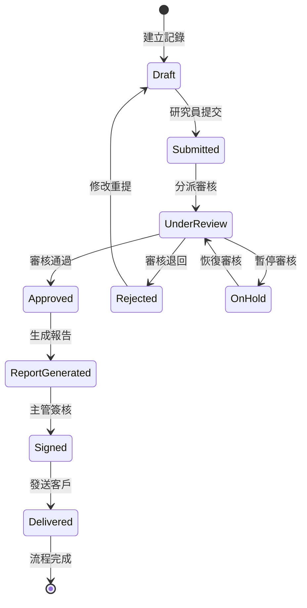
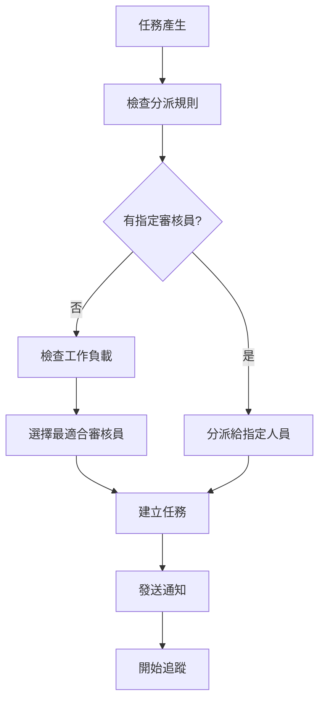

# 流程引擎模組設計文件 (MDD)

## 文件資訊
- **模組名稱**: WorkflowEngineModule (流程引擎模組)
- **文件版本**: v1.0
- **建立日期**: 2025/05/30
- **最後更新**: 2025/05/30
- **階段標記**: [MVP]

## 1. 模組概述

### 1.1 模組目標
提供靈活、可配置的業務流程管理引擎，自動化檢驗流程的狀態轉換、任務分派和流程追蹤，確保業務流程的標準化和可追溯性。

### 1.2 業務價值
- 自動化業務流程管理
- 確保流程標準化和一致性
- 提供完整的流程追蹤和稽核
- 支援靈活的流程配置和調整
- 提升流程執行效率

### 1.3 模組邊界
**包含功能**:
- 狀態機管理
- 任務自動分派
- 流程追蹤與監控
- 事件觸發機制
- 流程配置管理

**不包含功能**:
- 複雜的並行流程 (Phase 1)
- 動態流程修改 (Phase 1)
- 外部系統整合 (Phase 2)

## 2. 功能需求

### 2.1 核心功能列表

#### 2.1.1 流程管理功能
- **F001**: 流程定義與配置
- **F002**: 狀態機實現
- **F003**: 流程實例管理
- **F004**: 流程版本控制

#### 2.1.2 任務管理功能
- **F005**: 任務自動分派
- **F006**: 任務狀態追蹤
- **F007**: 任務超時處理
- **F008**: 任務重新分派

#### 2.1.3 事件處理功能
- **F009**: 事件監聽與觸發
- **F010**: 條件判斷引擎
- **F011**: 自動化動作執行
- **F012**: 事件日誌記錄

### 2.2 檢驗流程狀態定義

#### 2.2.1 主要流程狀態


#### 2.2.2 狀態轉換規則
```typescript
enum WorkflowState {
  DRAFT = 'draft',
  SUBMITTED = 'submitted',
  UNDER_REVIEW = 'under_review',
  ON_HOLD = 'on_hold',
  APPROVED = 'approved',
  REJECTED = 'rejected',
  REPORT_GENERATED = 'report_generated',
  SIGNED = 'signed',
  DELIVERED = 'delivered',
  COMPLETED = 'completed'
}

interface StateTransition {
  from: WorkflowState;
  to: WorkflowState;
  condition?: string;
  requiredRole?: string;
  autoTrigger?: boolean;
  actions?: WorkflowAction[];
}
```

### 2.3 任務分派邏輯

#### 2.3.1 分派策略


#### 2.3.2 負載均衡算法
```typescript
interface ReviewerWorkload {
  reviewerId: string;
  currentTasks: number;
  averageCompletionTime: number;
  specializations: string[];
  availability: boolean;
}

class TaskAssignmentService {
  // 智能分派算法
  async assignReviewer(task: WorkflowTask): Promise<string> {
    const availableReviewers = await this.getAvailableReviewers(task.category);
    const workloads = await this.getReviewerWorkloads(availableReviewers);
    
    // 考慮因素：工作負載、專業領域、歷史效能
    const scores = workloads.map(workload => ({
      reviewerId: workload.reviewerId,
      score: this.calculateAssignmentScore(workload, task)
    }));
    
    return scores.sort((a, b) => b.score - a.score)[0].reviewerId;
  }
}
```

## 3. 技術設計

### 3.1 資料模型

#### 3.1.1 流程定義實體
**參考 SOT**: [`docs/master_data_model.md`](../master_data_model.md) - 3.3.1 workflow_definitions (工作流程定義表)

```typescript
interface WorkflowDefinition {
  id: bigint;                    // 工作流程定義唯一識別碼 (BIGSERIAL)
  name: string;                  // 工作流程名稱 (VARCHAR(100), UNIQUE)
  version: string;               // 版本號 (VARCHAR(20))
  description?: string;          // 工作流程描述 (TEXT)
  definition: object;            // 工作流程定義 (JSONB)
  status: string;                // 狀態 (VARCHAR(20))
  createdBy: bigint;             // 建立者 ID (BIGINT, 參照 users.id)
  createdAt: Date;               // 建立時間 (TIMESTAMP WITH TIME ZONE)
  updatedAt: Date;               // 更新時間 (TIMESTAMP WITH TIME ZONE)
}
```

#### 3.1.2 流程實例實體
**參考 SOT**: [`docs/master_data_model.md`](../master_data_model.md) - 3.3.2 workflow_instances (工作流程實例表)

```typescript
interface WorkflowInstance {
  id: bigint;                    // 工作流程實例唯一識別碼 (BIGSERIAL)
  workflowDefinitionId: bigint;  // 工作流程定義 ID (BIGINT, 參照 workflow_definitions.id)
  testCaseId: bigint;            // 檢驗案例 ID (BIGINT, 參照 test_cases.id)
  currentState: string;          // 當前狀態 (VARCHAR(50))
  stateData: object;             // 狀態數據 (JSONB)
  status: string;                // 實例狀態 (VARCHAR(20))
  initiatedBy: bigint;           // 發起者 ID (BIGINT, 參照 users.id)
  startedAt: Date;               // 開始時間 (TIMESTAMP WITH TIME ZONE)
  completedAt?: Date;            // 完成時間 (TIMESTAMP WITH TIME ZONE)
  createdAt: Date;               // 建立時間 (TIMESTAMP WITH TIME ZONE)
  updatedAt: Date;               // 更新時間 (TIMESTAMP WITH TIME ZONE)
}

// 實例狀態枚舉 (與 SOT 保持一致)
enum InstanceStatus {
  ACTIVE = 'active',
  COMPLETED = 'completed',
  SUSPENDED = 'suspended',
  TERMINATED = 'terminated'
}
```

#### 3.1.3 任務實體
```typescript
interface WorkflowTask {
  id: string;
  instanceId: string;
  definitionId: string;
#### 3.1.3 工作流程任務實體
**參考 SOT**: [`docs/master_data_model.md`](../master_data_model.md) - 3.3.3 workflow_tasks (工作流程任務表)

```typescript
interface WorkflowTask {
  id: bigint;                    // 工作流程任務唯一識別碼 (BIGSERIAL)
  workflowInstanceId: bigint;    // 工作流程實例 ID (BIGINT, 參照 workflow_instances.id)
  taskType: string;              // 任務類型 (VARCHAR(50))
  taskName: string;              // 任務名稱 (VARCHAR(100))
  description?: string;          // 任務描述 (TEXT)
  status: string;                // 任務狀態 (VARCHAR(20))
  priority: string;              // 優先級 (VARCHAR(20))
  assignedTo?: bigint;           // 分配給 (BIGINT, 參照 users.id)
  assignedBy?: bigint;           // 分配者 (BIGINT, 參照 users.id)
  taskData: object;              // 任務數據 (JSONB)
  assignedAt?: Date;             // 分配時間 (TIMESTAMP WITH TIME ZONE)
  dueDate?: Date;                // 到期時間 (TIMESTAMP WITH TIME ZONE)
  startedAt?: Date;              // 開始時間 (TIMESTAMP WITH TIME ZONE)
  completedAt?: Date;            // 完成時間 (TIMESTAMP WITH TIME ZONE)
  createdAt: Date;               // 建立時間 (TIMESTAMP WITH TIME ZONE)
  updatedAt: Date;               // 更新時間 (TIMESTAMP WITH TIME ZONE)
}

// 任務狀態枚舉 (與 SOT 保持一致)
enum TaskStatus {
  PENDING = 'pending',
  ASSIGNED = 'assigned',
  IN_PROGRESS = 'in_progress',
  COMPLETED = 'completed',
  FAILED = 'failed',
  CANCELLED = 'cancelled'
}

// 任務類型枚舉 (與 SOT 保持一致)
enum TaskType {
  HUMAN_TASK = 'human_task',
  SYSTEM_TASK = 'system_task',
  NOTIFICATION_TASK = 'notification_task'
}
```

### 3.2 核心服務設計

#### 3.2.1 流程引擎服務
```typescript
class WorkflowEngineService {
  // 啟動流程實例
  async startWorkflow(definitionId: string, entityId: string, startedBy: string): Promise<WorkflowInstance>;
  
  // 執行狀態轉換
  async executeTransition(instanceId: string, targetState: WorkflowState, userId: string): Promise<void>;
  
  // 完成任務
  async completeTask(taskId: string, result: TaskResult, userId: string): Promise<void>;
  
  // 暫停流程
  async suspendWorkflow(instanceId: string, reason: string): Promise<void>;
  
  // 恢復流程
  async resumeWorkflow(instanceId: string): Promise<void>;
  
  // 終止流程
  async terminateWorkflow(instanceId: string, reason: string): Promise<void>;
}
```

#### 3.2.2 任務管理服務
```typescript
class TaskManagementService {
  // 建立任務
  async createTask(taskDefinition: TaskDefinition, instanceId: string): Promise<WorkflowTask>;
  
  // 分派任務
  async assignTask(taskId: string, assigneeId: string): Promise<void>;
  
  // 重新分派任務
  async reassignTask(taskId: string, newAssigneeId: string, reason: string): Promise<void>;
  
  // 獲取用戶任務列表
  async getUserTasks(userId: string, status?: TaskStatus): Promise<WorkflowTask[]>;
  
  // 處理任務超時
  async handleTaskTimeout(taskId: string): Promise<void>;
}
```

#### 3.2.3 事件處理服務
```typescript
class WorkflowEventService {
  // 註冊事件監聽器
  registerEventListener(eventType: string, handler: EventHandler): void;
  
  // 觸發事件
  async triggerEvent(event: WorkflowEvent): Promise<void>;
  
  // 執行條件判斷
  async evaluateCondition(condition: string, context: Record<string, any>): Promise<boolean>;
  
  // 執行自動化動作
  async executeAction(action: WorkflowAction, context: Record<string, any>): Promise<void>;
}
```

### 3.3 API 接口設計

#### 3.3.1 流程管理 API

#### 3.3.1 流程管理 API
**參考 SOT**: [`docs/api_specification.md`](../api_specification.md) - 4.3 工作流程引擎 API

**POST /api/v1/workflow/instances**
```typescript
// 請求 (遵循 SOT API 規格)
interface StartWorkflowRequest {
  definitionId: string;
  entityId: string;
  entityType: string;              // 如 'data_record', 'test_case'
  variables?: WorkflowVariables;
}

interface WorkflowVariables {
  submitterId?: string;
  sampleType?: string;
  urgencyLevel?: string;           // 'normal', 'urgent', 'critical'
  specialInstructions?: string;
}

// 回應 (遵循標準響應格式)
interface StartWorkflowResponse {
  success: boolean;
  data: {
    instanceId: string;
    currentState: string;
    status: string;
  };
  meta: {
    timestamp: string;
    version: string;
    requestId: string;
  };
}
```

**POST /api/v1/workflow/tasks/{taskId}/complete**
```typescript
// 請求
interface CompleteWorkflowTaskRequest {
  result: string;                  // 'approved', 'rejected', 'requires_modification'
  comments?: WorkflowTaskCommentInput[];
  nextAction?: string;
  metadata?: {
    reviewDuration?: number;
    issuesFound?: number;
    criticalIssues?: number;
  };
}

interface WorkflowTaskCommentInput {
  type: string;
  content: string;
  fieldPath?: string;
  severity?: string;
}

// 回應
interface CompleteTaskResponse {
  success: boolean;
  data: {
    taskId: string;
    status: string;
    completedAt: string;
    nextState?: string;
  };
  meta: {
    timestamp: string;
    version: string;
    requestId: string;
  };
}
```

**GET /api/v1/workflow/tasks/my-tasks**
```typescript
// 查詢參數
interface GetMyTasksQuery {
  status?: string;                 // 可選，任務狀態篩選
  priority?: string;               // 可選，優先級篩選
  page?: number;                   // 可選，預設: 1
  pageSize?: number;               // 可選，預設: 20
}

// 回應 (分頁格式)
interface GetMyTasksResponse {
  success: boolean;
  data: WorkflowTask[];
  meta: {
    pagination: {
      page: number;
      pageSize: number;
      totalItems: number;
      totalPages: number;
      hasNext: boolean;
      hasPrev: boolean;
    };
    timestamp: string;
    version: string;
    requestId: string;
  };
}
  variables?: Record<string, any>;
}

interface StartWorkflowResponse {
  success: boolean;
  data: {
    instanceId: string;
    currentState: WorkflowState;
    tasks: WorkflowTask[];
  };
}
```

**PUT /api/workflow/instances/:id/transition**
```typescript
interface TransitionRequest {
  targetState: WorkflowState;
  comment?: string;
  variables?: Record<string, any>;
}

interface TransitionResponse {
  success: boolean;
  data: {
    instanceId: string;
    previousState: WorkflowState;
    currentState: WorkflowState;
    newTasks: WorkflowTask[];
  };
}
```

#### 3.3.2 任務管理 API

**GET /api/workflow/tasks/my-tasks**
```typescript
interface MyTasksResponse {
  success: boolean;
  data: {
    tasks: WorkflowTask[];
    total: number;
    pending: number;
    overdue: number;
  };
}
```

**PUT /api/workflow/tasks/:id/complete**
```typescript
interface CompleteTaskRequest {
  result: TaskResult;
  comment?: string;
  attachments?: string[];
}

interface CompleteTaskResponse {
  success: boolean;
  data: {
    taskId: string;
    instanceId: string;
    nextState?: WorkflowState;
    nextTasks: WorkflowTask[];
  };
}
```

### 3.4 規則引擎設計

#### 3.4.1 業務規則定義
```typescript
interface BusinessRule {
  id: string;
  name: string;
  description: string;
  condition: string;          // JavaScript 表達式
  actions: RuleAction[];
  priority: number;
  isActive: boolean;
}

interface RuleAction {
  type: ActionType;
  parameters: Record<string, any>;
}

enum ActionType {
  ASSIGN_TASK = 'assign_task',
  SEND_NOTIFICATION = 'send_notification',
  UPDATE_VARIABLE = 'update_variable',
  TRIGGER_WEBHOOK = 'trigger_webhook',
  ESCALATE_TASK = 'escalate_task'
}
```

#### 3.4.2 條件評估引擎
```typescript
class RuleEngine {
  // 評估條件
  async evaluateCondition(condition: string, context: Record<string, any>): Promise<boolean> {
    // 安全的 JavaScript 表達式評估
    const vm = new VM({
      timeout: 1000,
      sandbox: {
        ...context,
        // 提供安全的內建函數
        now: () => new Date(),
        daysBetween: (date1: Date, date2: Date) => Math.abs(date1.getTime() - date2.getTime()) / (1000 * 60 * 60 * 24)
      }
    });
    
    return vm.run(condition);
  }
  
  // 執行規則動作
  async executeActions(actions: RuleAction[], context: Record<string, any>): Promise<void> {
    for (const action of actions) {
      await this.executeAction(action, context);
    }
  }
}
```

## 4. 流程配置範例

### 4.1 檢驗流程配置
```json
{
  "id": "inspection_workflow_v1",
  "name": "檢驗流程",
  "version": "1.0",
  "states": [
    "draft", "submitted", "under_review", "approved", 
    "rejected", "report_generated", "signed", "delivered"
  ],
  "transitions": [
    {
      "from": "draft",
      "to": "submitted",
      "condition": "data.isComplete === true",
      "requiredRole": "researcher",
      "actions": [
        {
          "type": "create_task",
          "parameters": {
            "taskType": "review_task",
            "assignmentRule": "auto_assign"
          }
        }
      ]
    },
    {
      "from": "submitted",
      "to": "under_review",
      "autoTrigger": true,
      "actions": [
        {
          "type": "assign_reviewer",
          "parameters": {
            "strategy": "load_balance"
          }
        },
        {
          "type": "send_notification",
          "parameters": {
            "template": "review_assigned",
            "recipients": ["assigned_reviewer"]
          }
        }
      ]
    }
  ],
  "tasks": [
    {
      "id": "review_task",
      "name": "審核任務",
      "type": "human_task",
      "assignmentRule": {
        "type": "auto_assign",
        "criteria": ["workload", "specialization"]
      },
      "timeoutDuration": 172800000,
      "requiredRole": "reviewer"
    }
  ]
}
```

### 4.2 任務超時處理
```typescript
class TimeoutHandler {
  async handleTaskTimeout(task: WorkflowTask): Promise<void> {
    const escalationRules = await this.getEscalationRules(task.type);
    
    for (const rule of escalationRules) {
      if (await this.evaluateEscalationCondition(rule.condition, task)) {
        await this.executeEscalationAction(rule.action, task);
        break;
      }
    }
  }
  
  private async executeEscalationAction(action: EscalationAction, task: WorkflowTask): Promise<void> {
    switch (action.type) {
      case 'reassign':
        await this.reassignToSupervisor(task);
        break;
      case 'notify_manager':
        await this.notifyManager(task);
        break;
      case 'extend_deadline':
        await this.extendDeadline(task, action.parameters.extension);
        break;
    }
  }
}
```

## 5. 效能優化

### 5.1 流程執行優化
- **非同步處理**: 狀態轉換非同步執行
- **批量操作**: 批量任務建立和更新
- **快取策略**: 流程定義和規則快取
- **索引優化**: 任務查詢索引優化

### 5.2 任務分派優化
- **預計算**: 審核員工作負載預計算
- **快取分派**: 分派結果短期快取
- **並行處理**: 多任務並行分派
- **負載監控**: 即時負載監控

### 5.3 事件處理優化
- **事件佇列**: 使用訊息佇列處理事件
- **批量處理**: 事件批量處理
- **優先級**: 事件優先級處理
- **錯誤重試**: 失敗事件自動重試

## 6. 監控與維運

### 6.1 流程監控指標
- **流程完成率**: 完成流程 / 啟動流程
- **平均處理時間**: 各狀態平均停留時間
- **任務超時率**: 超時任務 / 總任務數
- **流程瓶頸**: 識別流程瓶頸環節

### 6.2 任務監控指標
- **任務分派時間**: 任務建立到分派的時間
- **任務完成時間**: 任務分派到完成的時間
- **審核員工作負載**: 各審核員當前任務數
- **任務重新分派率**: 重新分派 / 總分派數

### 6.3 告警規則
- **流程停滯**: 流程在某狀態停留超過閾值
- **任務積壓**: 待處理任務數量過多
- **審核員過載**: 單個審核員任務數過多
- **系統錯誤**: 流程執行錯誤率過高

## 7. 測試策略

### 7.1 單元測試
- **狀態機**: 狀態轉換邏輯測試
- **規則引擎**: 條件評估和動作執行
- **任務分派**: 分派算法測試
- **事件處理**: 事件觸發和處理

### 7.2 整合測試
- **完整流程**: 端到端流程執行測試
- **並發處理**: 多流程並發執行測試
- **錯誤恢復**: 異常情況恢復測試
- **效能測試**: 大量流程和任務測試

### 7.3 業務測試
- **流程場景**: 各種業務場景測試
- **角色權限**: 不同角色操作測試
- **時間處理**: 超時和截止日期測試
- **資料一致性**: 流程資料一致性測試

## 8. 部署配置

### 8.1 環境變數
```bash
# 流程引擎配置
WORKFLOW_TIMEOUT_CHECK_INTERVAL=300000
WORKFLOW_MAX_CONCURRENT_INSTANCES=1000
WORKFLOW_TASK_TIMEOUT_DEFAULT=172800000

# 任務分派配置
TASK_ASSIGNMENT_STRATEGY=load_balance
TASK_REASSIGNMENT_THRESHOLD=3
TASK_ESCALATION_ENABLED=true

# 事件處理配置
EVENT_QUEUE_SIZE=10000
EVENT_BATCH_SIZE=100
EVENT_RETRY_ATTEMPTS=3
```

### 8.2 資料庫 Schema
```sql
-- 流程定義表
CREATE TABLE workflow_definitions (
  id UUID PRIMARY KEY DEFAULT gen_random_uuid(),
  name VARCHAR(255) NOT NULL,
  version VARCHAR(50) NOT NULL,
  description TEXT,
  category VARCHAR(100),
  configuration JSONB NOT NULL,
  is_active BOOLEAN DEFAULT true,
  created_at TIMESTAMP DEFAULT NOW(),
  updated_at TIMESTAMP DEFAULT NOW(),
  UNIQUE(name, version)
);

-- 流程實例表
CREATE TABLE workflow_instances (
  id UUID PRIMARY KEY DEFAULT gen_random_uuid(),
  definition_id UUID NOT NULL REFERENCES workflow_definitions(id),
  definition_version VARCHAR(50) NOT NULL,
  entity_id UUID NOT NULL,
  entity_type VARCHAR(100) NOT NULL,
  current_state VARCHAR(50) NOT NULL,
  status VARCHAR(50) DEFAULT 'active',
  started_at TIMESTAMP DEFAULT NOW(),
  completed_at TIMESTAMP,
  started_by UUID NOT NULL,
  metadata JSONB,
  variables JSONB
);

-- 任務表
CREATE TABLE workflow_tasks (
  id UUID PRIMARY KEY DEFAULT gen_random_uuid(),
  instance_id UUID NOT NULL REFERENCES workflow_instances(id) ON DELETE CASCADE,
  definition_id UUID NOT NULL,
  name VARCHAR(255) NOT NULL,
  type VARCHAR(50) NOT NULL,
  status VARCHAR(50) DEFAULT 'pending',
  assigned_to UUID,
  assigned_at TIMESTAMP,
  due_date TIMESTAMP,
  completed_at TIMESTAMP,
  completed_by UUID,
  priority INTEGER DEFAULT 5,
  data JSONB,
  result JSONB,
  created_at TIMESTAMP DEFAULT NOW()
);

-- 索引
CREATE INDEX idx_workflow_instances_entity ON workflow_instances(entity_id, entity_type);
CREATE INDEX idx_workflow_instances_state ON workflow_instances(current_state);
CREATE INDEX idx_workflow_tasks_assigned ON workflow_tasks(assigned_to, status);
CREATE INDEX idx_workflow_tasks_due_date ON workflow_tasks(due_date) WHERE status IN ('assigned', 'in_progress');
```

## 9. 模組接口定義

### 9.1 對外提供的接口

#### 9.1.1 工作流程啟動接口
**接口名稱**: `POST /api/workflow/instances`
**用途**: 接收來自數據輸入模組的工作流程啟動請求
**調用方**: 數據輸入模組

基於 [`docs/architecture/module_interaction_analysis.md`](../architecture/module_interaction_analysis.md) 中的接口 1：

```typescript
interface StartWorkflowRequest {
  definitionId: string;           // 檢驗流程定義ID
  entityId: string;               // 數據記錄ID
  entityType: 'data_record';
  variables: {
    submitterId: string;          // 提交者ID
    sampleType: string;           // 樣本類型
    urgencyLevel: 'normal' | 'urgent' | 'critical';
    specialInstructions?: string;
  };
}

interface StartWorkflowResponse {
  success: boolean;
  data: {
    instanceId: string;
    currentState: 'submitted';
    assignedTasks: WorkflowTask[];
  };
}
```

#### 9.1.2 任務完成接口
**接口名稱**: `POST /api/workflow/tasks/:taskId/complete`
**用途**: 接收來自審核系統的任務完成通知
**調用方**: 審核系統模組

基於 [`docs/architecture/module_interaction_analysis.md`](../architecture/module_interaction_analysis.md) 中的接口 4：

```typescript
interface CompleteReviewRequest {
  result: 'approved' | 'rejected' | 'requires_modification';
  comments: ReviewComment[];
  nextAction?: 'generate_report' | 'return_for_modification' | 'escalate';
  metadata: {
    reviewDuration: number;       // 實際審核時間
    issuesFound: number;
    criticalIssues: number;
  };
}

interface CompleteTaskResponse {
  success: boolean;
  data: {
    instanceId: string;
    newState: WorkflowState;
    nextTasks: WorkflowTask[];
  };
}
```

#### 9.1.3 報告完成事件接口
**接口名稱**: `POST /api/workflow/events/report-completed`
**用途**: 接收來自報告產生器的報告完成事件
**調用方**: 報告產生器模組

基於 [`docs/architecture/module_interaction_analysis.md`](../architecture/module_interaction_analysis.md) 中的接口 6：

```typescript
interface ReportCompletedEvent {
  workflowInstanceId: string;
  reportId: string;
  reportUrl: string;
  fileSize: number;
  generationTime: number;       // 生成耗時(秒)
  status: 'completed' | 'failed';
  errorMessage?: string;
}
```

### 9.2 依賴的外部接口

#### 9.2.1 用戶認證模組接口
**依賴接口**: `POST /api/auth/verify-permission`
**用途**: 驗證用戶的工作流程操作權限
**調用場景**: 工作流程狀態變更、任務分派前的權限檢查

```typescript
interface WorkflowPermissionRequest {
  userId: string;
  resource: 'workflow_instances' | 'workflow_tasks';
  action: 'create' | 'read' | 'update' | 'assign' | 'complete';
  context: {
    instanceId?: string;
    taskId?: string;
    workflowType?: string;
  };
}
```

#### 9.2.2 數據輸入模組接口
**依賴接口**: `PUT /api/data/records/:id/status`
**用途**: 根據工作流程狀態更新數據記錄狀態
**調用場景**: 工作流程狀態變更時同步更新數據狀態

基於 [`docs/architecture/module_interaction_analysis.md`](../architecture/module_interaction_analysis.md) 中的接口 2：

```typescript
interface UpdateDataStatusRequest {
  status: 'draft' | 'submitted' | 'under_review' | 'approved' | 'rejected';
  workflowInstanceId: string;
  updatedBy: string;
  comment?: string;
}
```

#### 9.2.3 審核系統接口
**依賴接口**: `POST /api/review/tasks`
**用途**: 為審核系統建立新的審核任務
**調用場景**: 工作流程進入審核階段時

基於 [`docs/architecture/module_interaction_analysis.md`](../architecture/module_interaction_analysis.md) 中的接口 3：

```typescript
interface CreateReviewTaskRequest {
  dataRecordId: string;
  workflowInstanceId: string;
  reviewType: 'data_review' | 'report_review' | 'final_approval';
  assignedTo?: string;            // 可選的指定審核員
  dueDate: Date;
  priority: 'low' | 'medium' | 'high' | 'critical';
  metadata: {
    sampleType: string;
    submitterName: string;
    submissionDate: Date;
  };
}
```

#### 9.2.4 報告產生器接口
**依賴接口**: `POST /api/reports/generate`
**用途**: 審核通過後觸發報告生成
**調用場景**: 工作流程進入報告生成階段時

基於 [`docs/architecture/module_interaction_analysis.md`](../architecture/module_interaction_analysis.md) 中的接口 5：

```typescript
interface GenerateReportRequest {
  dataRecordId: string;
  templateId: string;
  workflowInstanceId: string;
  generationOptions: {
    format: 'pdf';
    includeRawData: boolean;
    includeCharts: boolean;
    watermark?: string;
  };
  metadata: {
    approvedBy: string;
    approvalDate: Date;
    reportType: 'standard' | 'detailed' | 'summary';
  };
}
```

#### 9.2.5 通知模組接口
**依賴接口**: `POST /api/notifications`
**用途**: 發送各種工作流程相關通知
**調用場景**: 任務分派、狀態變更、截止日期提醒等

基於 [`docs/architecture/module_interaction_analysis.md`](../architecture/module_interaction_analysis.md) 中的接口 7：

```typescript
interface SendWorkflowNotificationRequest {
  type: 'task_assigned' | 'review_required' | 'report_ready' | 'deadline_reminder';
  recipientId: string;
  templateId: string;
  templateData: {
    workflowInstanceId: string;
    taskId?: string;
    reportId?: string;
    sampleName: string;
    dueDate?: Date;
    actionUrl: string;
    [key: string]: any;
  };
  priority: 'low' | 'medium' | 'high';
  scheduledAt?: Date;             // 可選的排程發送時間
}
```

#### 9.2.6 審計日誌模組接口
**依賴接口**: `POST /api/audit/log`
**用途**: 記錄所有工作流程操作的審計日誌
**調用頻率**: 每次狀態變更、任務分派、任務完成等操作

```typescript
interface WorkflowAuditLogRequest {
  eventType: 'user_action' | 'system_event';
  category: 'workflow_operation';
  userId?: string;
  resource: 'workflow_instances' | 'workflow_tasks';
  action: 'create' | 'state_change' | 'task_assign' | 'task_complete' | 'escalate';
  details: {
    entityType: 'workflow_instance' | 'workflow_task';
    entityId: string;
    oldValues?: Record<string, any>;
    newValues?: Record<string, any>;
    workflowInstanceId: string;
    taskId?: string;
    stateTransition?: {
      from: string;
      to: string;
    };
  };
  result: 'success' | 'failure';
  severity: 'info' | 'warning' | 'error';
}
```

## 10. 依賴關係

### 10.1 直接依賴的核心模組
根據 [`docs/architecture/system_architecture.md`](../architecture/system_architecture.md) 中的模組依賴圖：

1. **用戶認證模組 (UserAuthModule)**
   - **依賴原因**: 驗證工作流程操作權限和用戶角色
   - **交互接口**: `POST /api/auth/verify-permission`
   - **調用場景**: 工作流程啟動、任務分派、狀態變更前的權限檢查
   - **依賴強度**: 強依賴（所有操作都需要權限驗證）

2. **審核系統 (ReviewSystemModule)**
   - **依賴原因**: 建立和管理審核任務
   - **交互接口**: `POST /api/review/tasks`
   - **調用場景**: 工作流程進入審核階段時建立審核任務
   - **依賴強度**: 強依賴（核心業務流程）

3. **報告產生器 (ReportGeneratorModule)**
   - **依賴原因**: 觸發報告生成流程
   - **交互接口**: `POST /api/reports/generate`
   - **調用場景**: 審核通過後觸發報告生成
   - **依賴強度**: 強依賴（核心業務流程）

4. **通知模組 (NotificationModule)**
   - **依賴原因**: 發送工作流程相關通知
   - **交互接口**: `POST /api/notifications`
   - **調用場景**: 任務分派、狀態變更、提醒通知
   - **依賴強度**: 強依賴（用戶體驗必需）

5. **審計日誌模組 (AuditLogModule)**
   - **依賴原因**: 記錄所有工作流程操作的完整追蹤
   - **交互接口**: `POST /api/audit/log`
   - **調用場景**: 所有工作流程狀態變更和操作
   - **依賴強度**: 強依賴（合規要求）

### 10.2 被依賴的模組

1. **數據輸入模組 (DataInputModule)**
   - **依賴接口**: `POST /api/workflow/instances`
   - **依賴原因**: 數據提交後啟動檢驗工作流程

2. **審核系統 (ReviewSystemModule)**
   - **依賴接口**: `POST /api/workflow/tasks/:taskId/complete`
   - **依賴原因**: 審核完成後通知工作流程引擎

3. **報告產生器 (ReportGeneratorModule)**
   - **依賴接口**: `POST /api/workflow/events/report-completed`
   - **依賴原因**: 報告生成完成後通知工作流程引擎

### 10.3 技術基礎設施依賴
- **PostgreSQL**: 工作流程實例、任務、狀態歷史儲存
- **Redis**: 工作流程狀態快取、任務佇列
- **Bull Queue**: 非同步任務處理和排程
- **node-cron**: 定時任務調度（超時檢查、提醒等）

### 10.4 外部服務依賴
- **規則引擎**: 複雜業務規則評估
- **排程服務**: 定時任務和提醒管理

## 10. 風險評估

### 10.1 技術風險
| 風險項目 | 風險等級 | 影響 | 緩解策略 |
|---------|---------|------|----------|
| 流程死鎖 | 中 | 流程停滯 | 死鎖檢測、超時處理 |
| 效能瓶頸 | 中 | 系統緩慢 | 非同步處理、快取優化 |
| 資料不一致 | 高 | 流程錯誤 | 事務管理、一致性檢查 |
| 規則衝突 | 中 | 邏輯錯誤 | 規則驗證、優先級管理 |

### 10.2 業務風險
| 風險項目 | 風險等級 | 影響 | 緩解策略 |
|---------|---------|------|----------|
| 流程變更 | 中 | 系統適應性 | 版本管理、向後相容 |
| 任務積壓 | 中 | 效率下降 | 負載監控、自動擴展 |
| 人員變動 | 中 | 任務分派問題 | 動態分派、備用機制 |

## 11. 驗收標準 (Acceptance Criteria)

### 11.1 工作流程管理功能驗收標準

#### AC-WORKFLOW-001: 工作流程啟動 (F001)
**Given** 數據輸入模組提交完整的檢驗數據
**When** 觸發工作流程啟動
**Then**
- 工作流程實例在 1 秒內建立完成
- 正確識別檢驗類型並載入對應流程定義
- 初始狀態設定為 "submitted"
- 自動分派第一個審核任務給適當的審核人員
- 記錄工作流程啟動事件到審計日誌
- 發送任務分派通知給審核人員

#### AC-WORKFLOW-002: 狀態轉換管理 (F002)
**Given** 工作流程處於特定狀態
**When** 觸發狀態轉換事件
**Then**
- 驗證狀態轉換的合法性 (符合狀態機定義)
- 狀態轉換在 500ms 內完成
- 更新工作流程實例狀態
- 記錄狀態變更歷史 (包含時間戳、觸發者、原因)
- 觸發相關的後續動作 (任務建立、通知發送等)
- 更新相關模組的資料狀態

#### AC-WORKFLOW-003: 流程定義管理 (F003)
**Given** 管理員配置新的流程定義
**When** 流程定義生效
**Then**
- 流程定義格式驗證通過
- 狀態機邏輯無衝突或死鎖
- 新流程定義版本正確管理
- 現有流程實例不受影響
- 支援流程定義的熱更新

### 11.2 任務管理功能驗收標準

#### AC-WORKFLOW-004: 任務自動分派 (F004)
**Given** 工作流程需要建立新任務
**When** 執行任務分派邏輯
**Then**
- 根據負載平衡算法選擇最適合的執行者
- 考慮用戶角色、權限、專業領域、當前工作量
- 任務分派在 2 秒內完成
- 分派結果記錄到任務歷史
- 自動發送任務通知給被分派者
- 設定適當的任務優先級和截止日期

#### AC-WORKFLOW-005: 任務狀態管理 (F005)
**Given** 任務執行者操作任務
**When** 任務狀態發生變更
**Then**
- 任務狀態正確更新 (pending → in_progress → completed/rejected)
- 狀態變更時間戳準確記錄
- 相關工作流程狀態同步更新
- 任務完成時觸發下一階段流程
- 任務被拒絕時正確處理回退邏輯

#### AC-WORKFLOW-006: 任務超時處理 (F006)
**Given** 任務設定了截止日期
**When** 任務超過截止日期未完成
**Then**
- 系統自動檢測任務超時 (每小時檢查一次)
- 發送超時提醒通知給任務執行者
- 超時 24 小時後自動升級給主管
- 記錄超時事件到審計日誌
- 支援手動延期和重新分派

### 11.3 規則引擎功能驗收標準

#### AC-WORKFLOW-007: 業務規則評估 (F007)
**Given** 工作流程需要進行決策
**When** 觸發規則引擎評估
**Then**
- 規則評估在 200ms 內完成
- 正確載入適用的業務規則
- 規則評估結果準確可靠
- 支援複雜的條件邏輯 (AND, OR, NOT)
- 規則評估過程可追蹤和調試

#### AC-WORKFLOW-008: 動態路由決策 (F008)
**Given** 工作流程到達決策點
**When** 執行路由決策
**Then**
- 根據業務規則正確選擇下一步驟
- 支援條件分支和並行路徑
- 路由決策邏輯清晰可追蹤
- 異常情況有適當的預設路徑
- 決策結果記錄到工作流程歷史

### 11.4 整合功能驗收標準

#### AC-WORKFLOW-009: 審核系統整合
**Given** 工作流程進入審核階段
**When** 建立審核任務
**Then**
- 正確調用審核系統 API
- 審核任務資訊完整傳遞
- 審核完成後正確接收回調
- 審核結果正確更新工作流程狀態
- 整合過程無資料遺失

#### AC-WORKFLOW-010: 報告產生器整合
**Given** 審核通過需要生成報告
**When** 觸發報告生成
**Then**
- 正確調用報告產生器 API
- 報告生成參數完整傳遞
- 報告生成完成後接收通知
- 工作流程狀態正確更新為已完成
- 客戶通知正確觸發

#### AC-WORKFLOW-011: 通知模組整合
**Given** 工作流程狀態發生變更
**When** 需要發送通知
**Then**
- 正確識別通知接收者
- 通知內容準確且完整
- 通知發送成功率 > 95%
- 支援多種通知類型 (任務分派、狀態變更、提醒等)
- 通知發送失敗有重試機制

### 11.5 效能與可靠性驗收標準

#### AC-WORKFLOW-012: 系統效能要求
**Given** 系統處於正常負載狀態
**When** 執行工作流程操作
**Then**
- 工作流程啟動時間 < 1 秒
- 狀態轉換回應時間 < 500ms
- 任務分派時間 < 2 秒
- 規則評估時間 < 200ms
- 支援同時 100 個活躍工作流程實例

#### AC-WORKFLOW-013: 並發處理能力
**Given** 多個工作流程同時執行
**When** 系統處理並發請求
**Then**
- 無資料競爭和死鎖問題
- 狀態更新的原子性保證
- 任務分派無重複或遺漏
- 系統資源使用合理
- 並發效能線性擴展

#### AC-WORKFLOW-014: 錯誤處理與恢復
**Given** 工作流程執行過程中發生錯誤
**When** 錯誤被檢測到
**Then**
- 錯誤被正確捕獲和記錄
- 工作流程狀態保持一致性
- 支援手動干預和修復
- 錯誤不影響其他工作流程實例
- 提供明確的錯誤診斷資訊

### 11.6 監控與維運驗收標準

#### AC-WORKFLOW-015: 監控指標收集
**Given** 工作流程引擎正常運行
**When** 收集監控指標
**Then**
- 活躍工作流程數量準確統計
- 平均處理時間正確計算
- 任務完成率統計準確
- 錯誤率監控有效
- 效能指標即時更新

#### AC-WORKFLOW-016: 告警機制
**Given** 系統監控指標異常
**When** 觸發告警條件
**Then**
- 告警及時觸發 (< 5 分鐘)
- 告警資訊詳細且準確
- 告警級別正確分類
- 支援告警升級機制
- 告警解除自動通知

#### AC-WORKFLOW-017: 審計追蹤
**Given** 工作流程執行任何操作
**When** 操作完成
**Then**
- 所有操作完整記錄到審計日誌
- 日誌包含完整的上下文資訊
- 敏感資料適當保護
- 日誌查詢效能良好
- 支援合規性報告生成

## 12. 結論

流程引擎模組是系統自動化的核心，通過靈活的狀態機設計和智能的任務分派機制，能夠有效管理複雜的業務流程。模組化的設計和豐富的配置選項為未來的流程優化和擴展提供了良好的基礎。

關鍵設計特點：
1. **靈活性**: 可配置的流程定義和規則引擎
2. **可靠性**: 完善的錯誤處理和恢復機制
3. **效能**: 非同步處理和智能快取策略
4. **可擴展性**: 模組化設計支援功能擴展

通過本模組的實施，系統將具備強大的流程自動化能力，大幅提升業務流程的執行效率和管理水平。