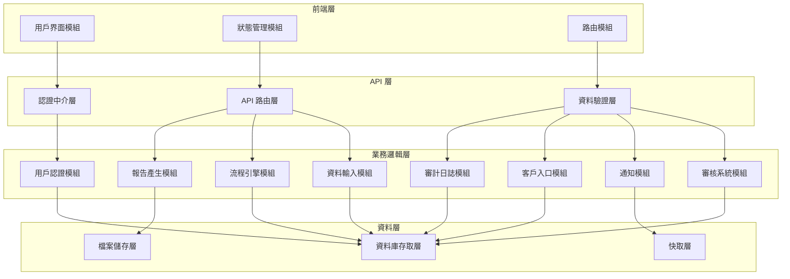
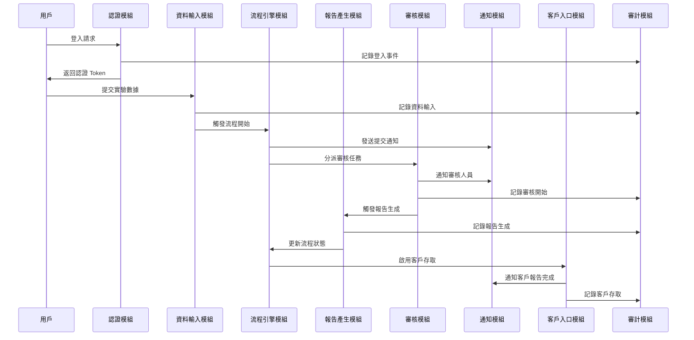
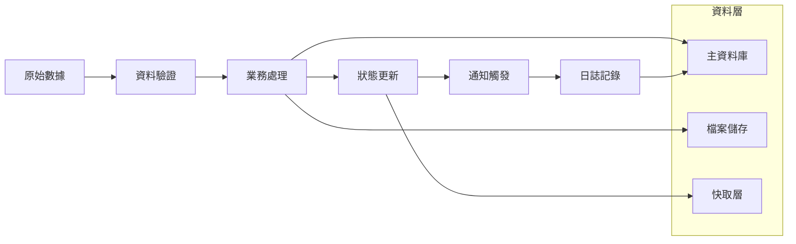

# MVP 總體技術框架文件

## 文件資訊
- **專案名稱**: Hwayo 檢驗流程線上化系統 MVP
- **文件版本**: v1.0
- **建立日期**: 2025/05/30
- **最後更新**: 2025/05/30

## 1. 技術架構概述

### 1.1 整體架構風格
採用 **模組化單體架構 (Modular Monolith)**，為未來微服務化預留擴展空間。

**選擇理由**:
- MVP 階段降低部署複雜度
- 團隊協作效率高
- 便於快速迭代和除錯
- 為後續微服務拆分奠定基礎

### 1.2 技術棧選擇

#### 1.2.1 前端技術棧
- **框架**: React 18 + TypeScript
- **狀態管理**: Redux Toolkit
- **UI 組件庫**: Ant Design
- **路由**: React Router v6
- **HTTP 客戶端**: Axios
- **建置工具**: Vite

#### 1.2.2 後端技術棧
- **運行環境**: Node.js 18 LTS
- **框架**: Express.js + TypeScript
- **ORM**: Prisma
- **資料庫**: PostgreSQL 15
- **認證**: JWT + Passport.js
- **檔案處理**: Multer + Sharp
- **PDF 生成**: Puppeteer

#### 1.2.3 基礎設施
- **容器化**: Docker + Docker Compose
- **反向代理**: Nginx
- **快取**: Redis
- **檔案儲存**: MinIO (S3 相容)
- **監控**: Prometheus + Grafana
- **日誌**: Winston + ELK Stack

## 2. 核心模組列表

### 2.1 模組架構圖



### 2.2 核心模組職責

#### 2.2.1 用戶認證與權限管理模組 (UserAuthModule)
**主要職責**:
- 用戶登入/登出管理
- JWT Token 生成與驗證
- 角色基礎權限控制 (RBAC)
- 會話管理

**核心功能**:
- OAuth2/SSO 整合
- 密碼安全策略
- 權限中介層
- 用戶資料管理

**技術考量**:
- 使用 Passport.js 統一認證策略
- JWT 無狀態認證
- Redis 會話儲存
- bcrypt 密碼加密

#### 2.2.2 實驗數據輸入介面模組 (DataInputModule)
**主要職責**:
- 動態表單生成與管理
- 資料驗證與清理
- 檔案上傳處理
- 草稿儲存機制

**核心功能**:
- 自訂欄位表單系統
- 多種資料類型支援
- 檔案上傳與預覽
- 自動儲存功能

**技術考量**:
- JSON Schema 表單驗證
- Multer 檔案處理
- Sharp 圖片處理
- 分塊上傳支援

#### 2.2.3 流程引擎模組 (WorkflowEngineModule)
**主要職責**:
- 業務流程狀態管理
- 任務自動分派
- 流程追蹤與監控
- 規則引擎執行

**核心功能**:
- 狀態機實現
- 任務佇列管理
- 自動通知觸發
- 流程歷史記錄

**技術考量**:
- 狀態模式設計
- Bull Queue 任務佇列
- 事件驅動架構
- 資料庫事務管理

#### 2.2.4 報告產生器模組 (ReportGeneratorModule)
**主要職責**:
- 報告樣板管理
- 動態內容填充
- 多格式匯出
- 企業識別套用

**核心功能**:
- 樣板引擎
- PDF 生成
- 數據視覺化
- 批量報告處理

**技術考量**:
- Handlebars 樣板引擎
- Puppeteer PDF 生成
- Chart.js 圖表生成
- 非同步處理佇列

#### 2.2.5 審核與簽核系統模組 (ReviewSystemModule)
**主要職責**:
- 審核流程管理
- 意見註記系統
- 差異檢查機制
- 數位簽核

**核心功能**:
- 多層審核支援
- 版本比較
- 審核意見管理
- 簽核記錄追蹤

**技術考量**:
- 版本控制演算法
- 數位簽章實現
- 審核狀態機
- 並行審核處理

#### 2.2.6 通知與提醒模組 (NotificationModule)
**主要職責**:
- 多通道通知發送
- 通知模板管理
- 提醒排程系統
- 通知歷史追蹤

**核心功能**:
- Email 通知
- 系統內通知
- 排程提醒
- 通知偏好設定

**技術考量**:
- Nodemailer Email 發送
- WebSocket 即時通知
- Cron 排程任務
- 通知佇列管理

#### 2.2.7 客戶入口模組 (CustomerPortalModule)
**主要職責**:
- 客戶認證管理
- 報告安全存取
- 歷史記錄查詢
- 下載權限控制

**核心功能**:
- 安全連結生成
- 報告下載管理
- 存取日誌記錄
- 客戶資料管理

**技術考量**:
- 時效性 Token 機制
- 檔案存取控制
- 下載限制實現
- 客戶隔離設計

#### 2.2.8 審計與日誌模組 (AuditLogModule)
**主要職責**:
- 操作行為記錄
- 系統事件追蹤
- 合規性報告
- 資料變更歷史

**核心功能**:
- 全面操作日誌
- 資料變更追蹤
- 系統事件記錄
- 合規性檢查

**技術考量**:
- 事件溯源模式
- 非同步日誌寫入
- 日誌分級管理
- 長期儲存策略

## 3. 模組間交互設計

### 3.1 核心交互流程



### 3.2 資料流向設計



## 4. 技術決策記錄

### 4.1 架構決策

#### 4.1.1 選擇模組化單體架構
**決策**: 採用模組化單體架構而非微服務架構  
**理由**:
- MVP 階段需要快速交付
- 團隊規模適中，單體架構便於協作
- 降低部署和維運複雜度
- 為未來微服務化預留設計空間

**風險**: 模組間耦合度可能增加  
**緩解**: 嚴格模組邊界定義，使用依賴注入

#### 4.1.2 選擇 TypeScript
**決策**: 前後端統一使用 TypeScript  
**理由**:
- 型別安全提高程式碼品質
- 更好的 IDE 支援和重構能力
- 團隊學習成本相對較低
- 便於大型專案維護

**風險**: 編譯時間增加  
**緩解**: 使用增量編譯和快取策略

#### 4.1.3 選擇 PostgreSQL
**決策**: 使用 PostgreSQL 作為主資料庫  
**理由**:
- 強大的 ACID 特性
- 豐富的資料類型支援
- 優秀的 JSON 支援
- 成熟的生態系統

**風險**: 學習曲線相對較陡  
**緩解**: 使用 Prisma ORM 簡化操作

### 4.2 技術選型決策

#### 4.2.1 前端框架選擇
**決策**: React + TypeScript  
**考量因素**:
- 團隊熟悉度高
- 生態系統成熟
- 組件化開發效率
- 社群支援豐富

**替代方案**: Vue.js, Angular  
**選擇理由**: React 在企業級應用中表現穩定

#### 4.2.2 後端框架選擇
**決策**: Express.js + TypeScript  
**考量因素**:
- 輕量級且靈活
- 中介層生態豐富
- 團隊熟悉度高
- 便於快速開發

**替代方案**: NestJS, Fastify  
**選擇理由**: Express 簡單直接，適合 MVP 快速開發

## 5. 非功能性需求

### 5.1 效能需求
- **回應時間**: API 回應時間 < 2 秒
- **併發用戶**: 支援 50 個併發用戶
- **吞吐量**: 1000 requests/minute
- **檔案上傳**: 支援 100MB 檔案上傳

### 5.2 可用性需求
- **系統可用性**: 99% (MVP 階段)
- **恢復時間**: RTO < 4 小時
- **資料恢復**: RPO < 1 小時
- **維護視窗**: 每週 2 小時

### 5.3 安全性需求
- **認證**: JWT + 雙因子認證 (可選)
- **授權**: 角色基礎存取控制
- **資料加密**: 傳輸層 TLS 1.3
- **稽核**: 完整操作日誌記錄

### 5.4 擴展性需求
- **水平擴展**: 支援負載均衡
- **垂直擴展**: 支援資源動態調整
- **模組化**: 便於功能模組獨立部署
- **API 版本**: 支援 API 版本管理

## 6. 開發規範

### 6.1 程式碼規範
- **命名**: 駝峰命名法 (camelCase)
- **檔案結構**: 模組化目錄結構
- **註釋**: JSDoc 格式註釋
- **格式化**: Prettier + ESLint

### 6.2 Git 工作流程
- **分支策略**: Git Flow
- **提交訊息**: Conventional Commits
- **程式碼審查**: Pull Request 必須審查
- **自動化**: CI/CD 流程整合

### 6.3 測試策略
- **單元測試**: Jest + Testing Library
- **整合測試**: Supertest
- **端到端測試**: Playwright
- **覆蓋率**: 最低 80%

## 7. 部署架構

### 7.1 容器化策略
```yaml
# docker-compose.yml 結構
services:
  frontend:
    build: ./frontend
    ports: ["3000:3000"]
  
  backend:
    build: ./backend
    ports: ["8000:8000"]
    depends_on: [database, redis]
  
  database:
    image: postgres:15
    volumes: ["postgres_data:/var/lib/postgresql/data"]
  
  redis:
    image: redis:7-alpine
    
  nginx:
    image: nginx:alpine
    ports: ["80:80", "443:443"]
```

### 7.2 環境配置
- **開發環境**: Docker Compose 本地部署
- **測試環境**: 雲端容器服務
- **生產環境**: Kubernetes 或 Docker Swarm

## 8. 監控與維運

### 8.1 監控指標
- **應用效能**: 回應時間、錯誤率、吞吐量
- **系統資源**: CPU、記憶體、磁碟、網路
- **業務指標**: 用戶活躍度、功能使用率
- **安全指標**: 登入失敗次數、異常存取

### 8.2 日誌管理
- **應用日誌**: 結構化 JSON 格式
- **存取日誌**: Nginx 存取日誌
- **錯誤日誌**: 錯誤堆疊追蹤
- **稽核日誌**: 用戶操作記錄

### 8.3 告警機制
- **即時告警**: 系統異常、效能下降
- **業務告警**: 關鍵流程失敗
- **安全告警**: 異常登入、權限濫用
- **容量告警**: 資源使用率過高

## 9. 風險評估與緩解

### 9.1 技術風險
| 風險項目 | 風險等級 | 影響 | 緩解策略 |
|---------|---------|------|----------|
| 技術棧學習曲線 | 中 | 開發進度延遲 | 提供培訓、技術分享 |
| 第三方依賴風險 | 中 | 功能受限 | 選擇成熟穩定的套件 |
| 效能瓶頸 | 高 | 用戶體驗差 | 效能測試、監控告警 |
| 資料遺失 | 高 | 業務中斷 | 多層備份、災備演練 |

### 9.2 業務風險
| 風險項目 | 風險等級 | 影響 | 緩解策略 |
|---------|---------|------|----------|
| 用戶接受度低 | 中 | 採用率不佳 | 用戶培訓、反饋收集 |
| 需求變更頻繁 | 中 | 開發計劃混亂 | 敏捷開發、版本控制 |
| 合規性問題 | 高 | 法律風險 | 合規性檢查、專家諮詢 |

## 10. 後續規劃

### 10.1 Phase 1 擴展計劃
- 進階權限管理
- 多格式報告匯出
- 動態表單配置
- 效能優化

### 10.2 Phase 2 擴展計劃
- 客戶送件線上化
- 樣本追蹤系統
- 進階通知功能
- 行動端支援

### 10.3 Phase 3 擴展計劃
- AI 智能化功能
- 多語系支援
- 微服務架構遷移
- 國際化部署

## 11. 結論

本 MVP 技術框架採用現代化的技術棧，在確保快速交付的同時，為未來的擴展和演進預留了充分的空間。通過模組化設計和清晰的架構邊界，系統具備良好的可維護性和可擴展性。

關鍵成功因素：
1. 團隊對技術棧的熟悉度
2. 嚴格的程式碼品質控制
3. 完善的測試和監控體系
4. 持續的效能優化和安全加固

通過本框架的實施，預期能夠在 3-4 個月內交付一個穩定、可用的 MVP 系統，為後續的功能擴展奠定堅實的技術基礎。