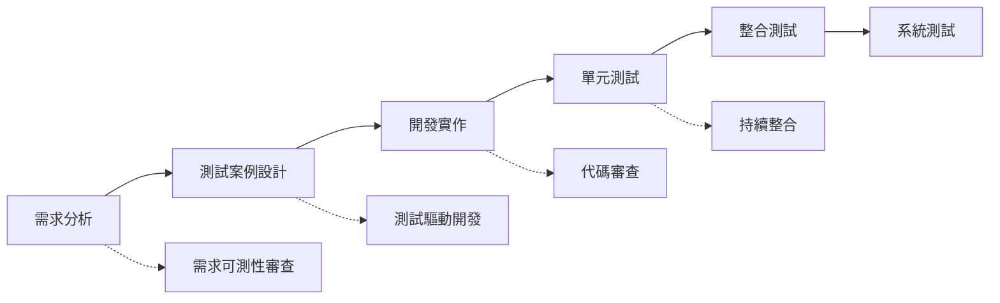
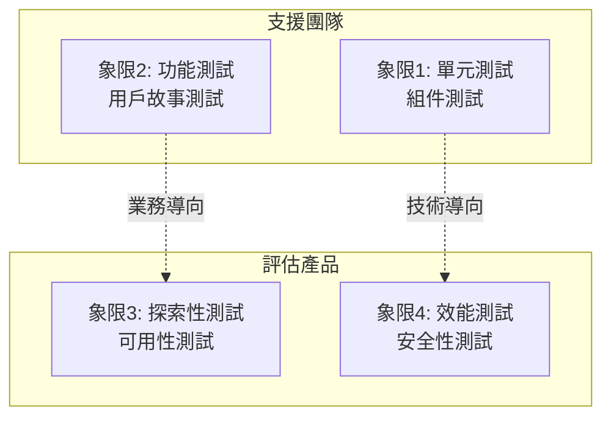
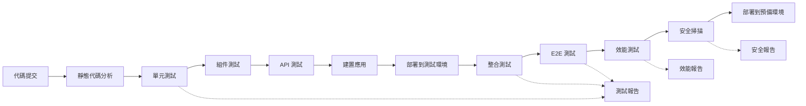
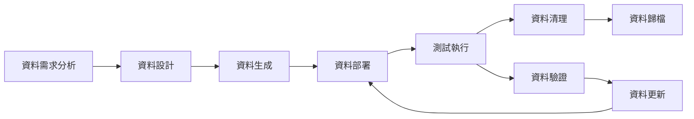
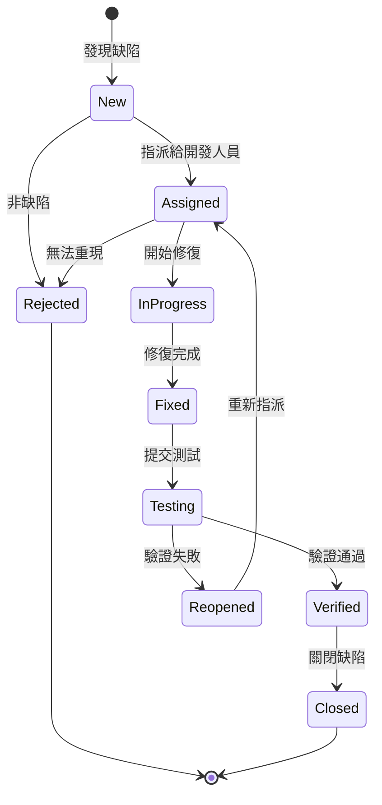
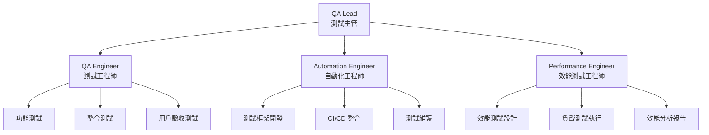
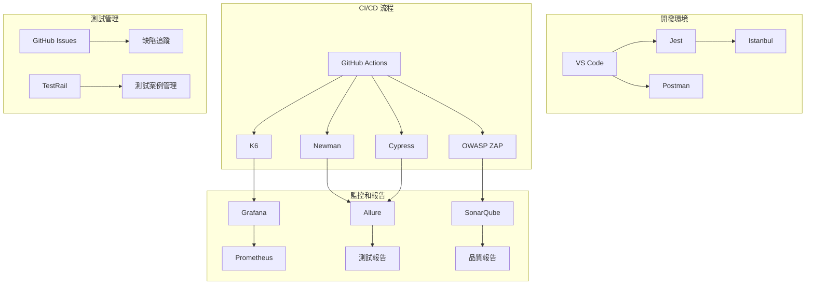

# Hwayo 專案總體測試策略

## 文件資訊
- **文件名稱**: Hwayo 檢驗流程線上化系統 - 總體測試策略
- **建立日期**: 2025/05/31
- **階段**: 子任務 6.1 - 完善總體測試策略
- **狀態**: 已完成
- **維護責任**: QA 團隊 + 開發團隊
- **版本**: v1.0
- **參考文件**: 
  - [`planning/project_development_dod_guide.md`](../planning/project_development_dod_guide.md)
  - [`planning/productBrief.md`](../planning/productBrief.md)
  - [`docs/mvp_definition.md`](../mvp_definition.md)
  - [`docs/architecture/system_architecture.md`](../architecture/system_architecture.md)
  - [`docs/hwayo_project_development_guidelines.md`](../hwayo_project_development_guidelines.md)

---

## 1. 引言

### 1.1 測試策略的目的
本測試策略文件旨在為 Hwayo 檢驗流程線上化系統提供全面、系統性的測試指導方針，確保：
- 系統功能符合業務需求和用戶期望
- 系統品質達到生產環境部署標準
- 測試活動與開發流程有效整合
- 風險得到有效識別和控制

### 1.2 適用範圍
本策略適用於 Hwayo 專案的所有測試活動，包括：
- MVP 階段的核心功能測試
- 後續階段的功能擴展測試
- 系統整合與端到端測試
- 非功能性測試（效能、安全性、可用性等）

### 1.3 適用讀者
- QA 工程師和測試團隊
- 開發工程師（前端、後端、全端）
- DevOps 工程師
- 專案經理和產品經理
- 技術領導和架構師

### 1.4 專案質量目標概述
基於 [`docs/mvp_definition.md`](../mvp_definition.md) 中定義的成功標準：

**功能性目標**:
- 所有核心用戶故事均能正常執行
- 系統能處理完整的檢驗流程（輸入 → 審核 → 發送）
- 報告產生功能正常運作

**效能目標**:
- 系統回應時間 < 3 秒
- 支援同時 10 位用戶操作
- 系統可用性 > 95%

**品質目標**:
- 零資料遺失
- 審核流程完整性 100%
- 用戶滿意度 > 80%

**業務目標**:
- 內部用戶採用率 > 90%
- 報告產出時間縮短 > 25%
- 錯誤率降低 > 30%

---

## 2. 測試方法論

### 2.1 測試左移 (Shift-Left Testing) 理念

**核心原則**:
- 在開發生命週期的早期階段引入測試活動
- 開發人員參與測試設計和執行
- 持續整合中包含自動化測試
- 需求階段就開始測試案例設計

**實踐方法**:


**具體實施**:
1. **需求階段**: 審查需求的可測性，定義驗收標準
2. **設計階段**: 設計可測試的架構，定義測試接口
3. **開發階段**: 實施測試驅動開發 (TDD)，編寫單元測試
4. **整合階段**: 持續整合中執行自動化測試

### 2.2 風險驅動測試 (Risk-Based Testing)

**風險評估矩陣**:
| 風險類別 | 影響程度 | 發生機率 | 風險等級 | 測試重點 |
|---------|---------|---------|---------|---------|
| 資料遺失 | 高 | 中 | 高 | 資料完整性測試、備份恢復測試 |
| 審核流程錯誤 | 高 | 中 | 高 | 工作流程測試、狀態轉換測試 |
| 安全漏洞 | 高 | 低 | 中 | 安全性測試、滲透測試 |
| 效能瓶頸 | 中 | 中 | 中 | 負載測試、壓力測試 |
| 使用者體驗 | 中 | 低 | 低 | 可用性測試、介面測試 |

**風險應對策略**:
- **高風險**: 優先測試，多重驗證，自動化回歸測試
- **中風險**: 重點測試，定期驗證
- **低風險**: 基本測試，抽樣驗證

### 2.3 敏捷測試原則

**核心原則**:
1. **協作優於流程**: 測試人員與開發人員緊密協作
2. **工作軟體優於詳盡文檔**: 重視可執行的測試而非冗長的測試計劃
3. **客戶協作優於合約談判**: 與業務用戶共同定義驗收標準
4. **回應變化優於遵循計劃**: 根據反饋快速調整測試策略

**敏捷測試象限**:


---

## 3. 測試層次與類型

### 3.1 單元測試 (Unit Testing)

**範圍與職責**:
- 測試個別函數、方法、類別的功能正確性
- 驗證業務邏輯的正確實作
- 確保代碼變更不會破壞現有功能

**工具與框架**:
- **後端**: Jest + TypeScript
- **前端**: Jest + React Testing Library
- **Mock 工具**: Jest Mock, Sinon.js

**覆蓋率目標**:
- **代碼覆蓋率**: ≥ 80%
- **分支覆蓋率**: ≥ 75%
- **函數覆蓋率**: ≥ 90%

**測試範例**:
```typescript
// 業務邏輯單元測試範例
describe('ReportCalculationService', () => {
  it('should calculate total amount with discount correctly', () => {
    const service = new ReportCalculationService();
    const items = [
      { amount: 1000, quantity: 2 },
      { amount: 500, quantity: 1 }
    ];
    const discountRate = 0.1;
    
    const result = service.calculateTotalWithDiscount(items, discountRate);
    
    expect(result).toBe(2250); // (1000*2 + 500*1) * 0.9
  });
});
```

### 3.2 組件測試 (Component Testing)

**定義與範圍**:
- 測試單一模組或組件的完整功能
- 驗證模組內部各層次的協作
- 包含模組的 API 接口測試

**與單元測試的區別**:
| 特性 | 單元測試 | 組件測試 |
|------|---------|---------|
| 測試範圍 | 單一函數/方法 | 完整模組/組件 |
| 依賴處理 | Mock 所有依賴 | 使用真實的內部依賴 |
| 測試重點 | 邏輯正確性 | 組件整合 |
| 執行速度 | 快 | 中等 |

**測試策略**:
- 每個核心模組都需要組件測試
- 重點測試模組的公開 API
- 驗證模組的錯誤處理機制

### 3.3 API 接口測試 (API Testing)

**測試策略**:
基於 [`docs/api_specification.yaml`](../api_specification.yaml) 進行全面的 API 測試

**測試工具**:
- **開發階段**: Postman + Newman
- **自動化測試**: Supertest (Node.js)
- **效能測試**: Artillery, K6

**測試覆蓋範圍**:
1. **功能測試**:
   - 正常請求回應驗證
   - 參數驗證和錯誤處理
   - 資料格式和結構驗證

2. **安全測試**:
   - 認證和授權驗證
   - 輸入驗證和注入攻擊防護
   - 敏感資料保護

3. **效能測試**:
   - 回應時間測試
   - 併發請求處理
   - 資源使用監控

**自動化程度**: 90% 以上的 API 端點需要自動化測試

### 3.4 整合測試 (Integration Testing)

**測試策略**:
基於 [`docs/architecture/system_architecture.md`](../architecture/system_architecture.md) 中的模組依賴關係進行整合測試

**測試重點**:
1. **模組間交互**:
   - 用戶認證模組與其他模組的整合
   - 流程引擎與各業務模組的協作
   - 通知模組與外部服務的整合

2. **資料流驗證**:
   - 跨模組的資料傳遞正確性
   - 資料一致性和完整性
   - 事務處理的正確性

3. **外部服務整合**:
   - 資料庫連接和操作
   - 檔案儲存服務整合
   - Email/SMS 服務整合

**測試環境**: 使用 [`docs/environment_configs/staging_env_sot.md`](../environment_configs/staging_env_sot.md) 定義的測試環境

### 3.5 系統測試 (System Testing) / 端到端測試 (End-to-End Testing)

**測試範圍**:
驗證完整的業務流程，基於 [`docs/user_flows/core_user_flows.md`](../user_flows/core_user_flows.md) 中定義的核心用戶流程

**核心測試場景**:
1. **完整檢驗流程**:
   ```
   研究員登入 → 輸入實驗數據 → 提交審核 → 
   審核人員審核 → 報告生成 → 客戶接收報告
   ```

2. **異常處理流程**:
   ```
   審核退回 → 研究員修改 → 重新提交 → 
   再次審核 → 最終核准
   ```

3. **並行處理場景**:
   - 多個檢驗案例同時處理
   - 多用戶同時操作
   - 系統負載下的穩定性

**測試工具**:
- **Web 自動化**: Cypress, Playwright
- **API 自動化**: Postman + Newman
- **資料驗證**: 自定義腳本

### 3.6 使用者驗收測試 (UAT - User Acceptance Testing)

**測試流程**:
1. **準備階段**:
   - 準備測試環境和測試資料
   - 培訓業務用戶測試方法
   - 準備測試案例和驗收標準

2. **執行階段**:
   - 業務用戶執行真實業務場景
   - 記錄問題和改善建議
   - 驗證業務需求滿足程度

3. **驗收階段**:
   - 評估測試結果
   - 確認系統可接受性
   - 簽署驗收文件

**參與者**:
- **主要用戶**: 研究員、審核人員
- **次要用戶**: 管理員、客戶代表
- **支援團隊**: QA 工程師、產品經理

**測試環境**: 使用接近生產環境的測試環境

---

## 4. 非功能性測試

### 4.1 效能測試 (Performance Testing)

**測試目標**:
基於 [`docs/mvp_definition.md`](../mvp_definition.md) 中定義的效能標準

**測試指標**:
- **回應時間**: < 3 秒（平均）
- **併發用戶**: 支援 10 位同時用戶
- **系統可用性**: > 95%
- **資源使用率**: CPU < 70%, Memory < 80%

**測試類型**:
1. **負載測試**: 正常負載下的系統表現
2. **壓力測試**: 超出正常負載的系統行為
3. **容量測試**: 系統最大處理能力
4. **穩定性測試**: 長時間運行的穩定性

**測試工具**:
- **API 效能**: K6, Artillery
- **Web 效能**: Lighthouse, WebPageTest
- **資料庫效能**: pgbench (PostgreSQL)
- **監控工具**: Grafana + Prometheus

**測試場景**:
```yaml
scenarios:
  normal_load:
    users: 10
    duration: "30m"
    description: "正常業務負載"
  
  peak_load:
    users: 25
    duration: "15m"
    description: "尖峰時段負載"
  
  stress_test:
    users: 50
    duration: "10m"
    description: "壓力測試"
```

### 4.2 安全性測試 (Security Testing)

**測試策略**:
基於 OWASP Top 10 和 [`docs/hwayo_project_development_guidelines.md`](../hwayo_project_development_guidelines.md) 中的安全指南

**OWASP Top 10 防範測試**:
1. **注入攻擊**: SQL 注入、NoSQL 注入、命令注入
2. **身份驗證破解**: 弱密碼、會話管理漏洞
3. **敏感資料暴露**: 資料加密、傳輸安全
4. **XML 外部實體**: XXE 攻擊防護
5. **存取控制破解**: 權限繞過、垂直/水平權限提升
6. **安全配置錯誤**: 預設配置、錯誤頁面資訊洩露
7. **跨站腳本攻擊**: XSS 防護
8. **不安全的反序列化**: 物件注入攻擊
9. **已知漏洞組件**: 依賴庫安全掃描
10. **日誌和監控不足**: 安全事件記錄

**測試工具**:
- **自動化掃描**: OWASP ZAP, Burp Suite
- **依賴庫掃描**: npm audit, Snyk
- **靜態代碼分析**: SonarQube, ESLint Security
- **滲透測試**: 手動測試 + 專業工具

**關注點**:
- 檢驗資料的機密性保護
- 客戶報告的存取控制
- 審核流程的完整性保護
- 系統操作的可追蹤性

### 4.3 可用性測試 (Usability Testing)

**測試方法**:
1. **任務導向測試**: 用戶完成特定任務的效率和滿意度
2. **探索性測試**: 用戶自由探索系統功能
3. **比較測試**: 與現有紙本流程的比較

**測試目標**:
- 用戶滿意度 > 80%
- 任務完成率 > 95%
- 錯誤率 < 5%
- 學習時間 < 2 小時

**測試場景**:
基於 [`docs/ui_prototypes/mvp_detailed_prototypes.md`](../ui_prototypes/mvp_detailed_prototypes.md) 中的界面設計

**評估指標**:
- **效率**: 任務完成時間
- **效果**: 任務完成率和準確性
- **滿意度**: 用戶主觀評價
- **學習性**: 新用戶上手難度

### 4.4 兼容性測試 (Compatibility Testing)

**瀏覽器兼容性**:
- **主要支援**: Chrome 90+, Firefox 88+, Safari 14+
- **次要支援**: Edge 90+
- **行動裝置**: iOS Safari, Android Chrome

**作業系統兼容性**:
- **桌面**: Windows 10+, macOS 11+, Ubuntu 20.04+
- **行動**: iOS 14+, Android 10+

**解析度支援**:
- **桌面**: 1366x768 ~ 2560x1440
- **平板**: 768x1024 ~ 1024x1366
- **手機**: 375x667 ~ 414x896

---

## 5. 測試自動化策略

### 5.1 自動化測試範圍和目標

**自動化測試金字塔**:
```
        /\
       /  \     E2E Tests (10%)
      /____\    手動執行為主，關鍵流程自動化
     /      \   
    /        \  Integration Tests (20%)
   /          \ API 測試、模組整合測試
  /____________\
 /              \ Unit Tests (70%)
/________________\ 高覆蓋率，快速反饋
```

**自動化目標**:
- **單元測試**: 100% 自動化，覆蓋率 ≥ 80%
- **API 測試**: 90% 自動化
- **整合測試**: 80% 自動化
- **E2E 測試**: 關鍵流程 100% 自動化，其他 30% 自動化

### 5.2 自動化測試框架和工具選擇

**技術棧對應的測試框架**:

**後端測試**:
```yaml
unit_testing:
  framework: "Jest"
  language: "TypeScript"
  coverage_tool: "Istanbul"

api_testing:
  framework: "Supertest + Jest"
  documentation: "Postman Collections"
  automation: "Newman"

integration_testing:
  framework: "Jest + Testcontainers"
  database: "PostgreSQL Test Instance"
  external_services: "Mock Services"
```

**前端測試**:
```yaml
unit_testing:
  framework: "Jest + React Testing Library"
  component_testing: "Storybook"
  snapshot_testing: "Jest Snapshots"

e2e_testing:
  framework: "Cypress"
  alternative: "Playwright"
  visual_testing: "Percy, Chromatic"
```

**跨平台測試**:
```yaml
api_automation:
  tool: "Postman + Newman"
  ci_integration: true
  reporting: "HTML + JUnit XML"

performance_testing:
  tool: "K6"
  monitoring: "Grafana + InfluxDB"
  alerting: "Slack, Email"
```

### 5.3 CI/CD 流程中自動化測試的整合

**持續整合流程**:


**測試階段定義**:
1. **快速反饋階段** (< 5 分鐘):
   - 靜態代碼分析
   - 單元測試
   - 基本組件測試

2. **完整驗證階段** (< 30 分鐘):
   - API 測試
   - 整合測試
   - 關鍵 E2E 測試

3. **深度測試階段** (< 2 小時):
   - 完整 E2E 測試
   - 效能測試
   - 安全掃描

**失敗處理策略**:
- 快速反饋階段失敗：阻止合併
- 完整驗證階段失敗：阻止部署
- 深度測試階段失敗：警告但不阻止

---

## 6. 測試環境策略

### 6.1 各測試階段所需的環境

**環境層級定義**:
基於 [`docs/environment_configs/`](../environment_configs/) 下的 SOT 文件

**開發環境** ([`development_env_sot.md`](../environment_configs/development_env_sot.md)):
- **用途**: 開發人員本地測試、單元測試、組件測試
- **特性**: 快速啟動、完整功能、模擬外部服務
- **資料**: 最小化測試資料集

**測試環境** ([`staging_env_sot.md`](../environment_configs/staging_env_sot.md)):
- **用途**: 整合測試、API 測試、E2E 測試、UAT
- **特性**: 接近生產環境配置、穩定的測試資料
- **資料**: 脫敏的生產資料副本 + 標準測試資料集

**預備環境** (Staging):
- **用途**: 效能測試、安全測試、最終驗收測試
- **特性**: 生產環境的完整複製
- **資料**: 完整的測試資料集、效能測試資料

**生產環境** ([`production_env_sot.md`](../environment_configs/production_env_sot.md)):
- **用途**: 冒煙測試、監控驗證、熱修復驗證
- **特性**: 真實的生產配置和資料
- **限制**: 僅限非破壞性測試

### 6.2 測試數據管理策略

**測試資料分類**:
1. **靜態參考資料**: 用戶角色、權限配置、系統參數
2. **動態業務資料**: 檢驗案例、報告範本、客戶資料
3. **大量測試資料**: 效能測試用的大量記錄
4. **邊界測試資料**: 極值、特殊字符、異常格式

**資料生成策略**:
```yaml
data_generation:
  static_data:
    method: "SQL Scripts"
    version_control: true
    environment: "all"
  
  dynamic_data:
    method: "Factory Pattern + Faker.js"
    reset_frequency: "每次測試執行"
    environment: "development, testing"
  
  performance_data:
    method: "Data Generation Scripts"
    volume: "10K+ records"
    environment: "staging"
  
  production_like_data:
    method: "Data Masking + Anonymization"
    source: "production backup"
    environment: "staging"
```

**資料管理原則**:
- **資料隔離**: 不同測試案例使用獨立資料
- **資料重置**: 每次測試執行前重置到已知狀態
- **資料保護**: 敏感資料脫敏處理
- **資料版本**: 測試資料與代碼版本同步管理

**測試資料生命週期**:


---

## 7. 缺陷管理流程

### 7.1 缺陷報告工具和模板

**缺陷管理工具**: GitHub Issues / Jira

**缺陷報告模板**:
```markdown
## 缺陷基本資訊
- **缺陷ID**: [自動生成]
- **發現日期**: [YYYY-MM-DD]
- **發現人員**: [姓名]
- **測試環境**: [開發/測試/預備/生產]
- **瀏覽器/版本**: [如適用]

## 缺陷分類
- **嚴重性**: [Critical/High/Medium/Low]
- **優先級**: [P1/P2/P3/P4]
- **缺陷類型**: [功能/介面/效能/安全/相容性]
- **影響模組**: [模組名稱]

## 缺陷描述
### 預期行為
[描述系統應該如何運作]

### 實際行為
[描述實際觀察到的行為]

### 重現步驟
1. [步驟1]
2. [步驟2]
3. [步驟3]

### 測試資料
[相關的測試資料或輸入]

## 附加資訊
- **截圖/影片**: [如適用]
- **日誌檔案**: [相關錯誤日誌]
- **相關需求**: [需求文件連結]
- **備註**: [其他相關資訊]
```

### 7.2 缺陷生命週期 (狀態、流轉)

**缺陷狀態定義**:


**狀態流轉規則**:
| 當前狀態 | 可轉換狀態 | 操作人員 | 必要條件 |
|---------|-----------|---------|---------|
| New | Assigned, Rejected | QA Lead, PM | 缺陷確認 |
| Assigned | InProgress, Rejected | Developer | 開始修復 |
| InProgress | Fixed | Developer | 修復完成 |
| Fixed | Testing | Developer | 提交測試 |
| Testing | Verified, Reopened | QA Engineer | 驗證結果 |
| Reopened | Assigned | QA Lead | 重新分析 |
| Verified | Closed | QA Lead | 確認修復 |

### 7.3 缺陷優先級和嚴重性定義

**嚴重性 (Severity) 定義**:
| 等級 | 定義 | 範例 | 修復時間 |
|------|------|------|---------|
| Critical | 系統無法使用，核心功能完全失效 | 無法登入、資料庫連接失敗、系統當機 | 4 小時內 |
| High | 核心功能受到嚴重影響 | 報告無法生成、審核流程中斷、資料遺失 | 24 小時內 |
| Medium | 一般功能問題，有替代方案 | 介面顯示錯誤、次要功能異常、效能下降 | 3 個工作日內 |
| Low | 輕微問題，不影響主要功能 | 文字錯誤、介面美觀問題、非關鍵提示 | 下個版本修復 |

**優先級 (Priority) 定義**:
| 等級 | 定義 | 考量因素 |
|------|------|---------|
| P1 | 立即修復 | 影響生產環境、阻止發布、安全漏洞 |
| P2 | 高優先級 | 影響核心功能、用戶體驗嚴重下降 |
| P3 | 中優先級 | 一般功能問題、可接受的影響 |
| P4 | 低優先級 | 改善建議、非關鍵問題 |

### 7.4 缺陷分析和根本原因分析 (RCA) 的方法

**RCA 觸發條件**:
- Critical 或 High 嚴重性的缺陷
- 重複出現的缺陷模式
- 生產環境的緊急問題
- 客戶投訴的問題

**RCA 分析方法**:
1. **5 Why 分析法**:
   ```
   問題: 報告生成失敗
   Why 1: 為什麼報告生成失敗？ → 模板引擎拋出異常
   Why 2: 為什麼模板引擎拋出異常？ → 資料格式不正確
   Why 3: 為什麼資料格式不正確？ → 資料驗證規則不完整
   Why 4: 為什麼資料驗證規則不完整？ → 需求分析時遺漏邊界條件
   Why 5: 為什麼需求分析時遺漏邊界條件？ → 缺乏系統性的需求審查流程
   ```

2. **魚骨圖分析法**:
   ```mermaid
   graph LR
       A[缺陷問題] --> B[人員因素]
       A --> C[流程因素]
       A --> D[技術因素]
       A --> E[環境因素]
       
       B --> B1[技能不足]
       B --> B2[溝通不良]
       C --> C1[測試不充分]
       C --> C2[代碼審查遺漏]
       D --> D1[架構設計缺陷]
       D --> D2[第三方庫問題]
       E --> E1[環境配置錯誤]
       E --> E2[資料不一致]
   ```

**改善措施追蹤**:
- 識別根本原因後制定改善計劃
- 指派責任人和完成時間
- 定期追蹤改善措施執行狀況
- 驗證改善效果

---

## 8. 測試團隊角色與職責

### 8.1 測試團隊組織架構



### 8.2 角色職責定義

**QA Lead (測試主管)**:
- 制定和維護測試策略
- 協調測試活動和資源分配
- 與開發團隊和產品團隊協作
- 測試風險評估和管理
- 測試報告和質量度量

**QA Engineer (測試工程師)**:
- 設計和執行功能測試案例
- 執行手動測試和探索性測試
- 缺陷發現、報告和追蹤
- 用戶驗收測試支援
- 測試文檔維護

**Automation Engineer (自動化工程師)**:
- 設計和開發自動化測試框架
- 實作和維護自動化測試案例
- CI/CD 流程中的測試整合
- 測試工具選型和評估
- 自動化測試報告分析

**Performance Engineer (效能測試工程師)**:
- 效能測試策略制定
- 效能測試環境準備
- 負載和壓力測試執行
- 效能瓶頸分析和優化建議
- 效能監控和告警設置

**Developer (開發工程師) - 測試相關職責**:
- 單元測試編寫和維護
- 組件測試實作
- 測試驅動開發 (TDD) 實踐
- 代碼審查中的測試覆蓋檢查
- 缺陷修復和驗證

---

## 9. 測試度量與報告

### 9.1 關鍵測試指標 (KPIs)

**測試覆蓋率指標**:
| 指標名稱 | 目標值 | 計算方式 | 監控頻率 |
|---------|-------|---------|---------|
| 代碼覆蓋率 | ≥ 80% | 已測試代碼行數 / 總代碼行數 | 每次建置 |
| 需求覆蓋率 | 100% | 已測試需求數 / 總需求數 | 每個 Sprint |
| API 覆蓋率 | ≥ 90% | 已測試 API 端點 / 總 API 端點 | 每次發布 |
| 用戶故事覆蓋率 | 100% | 已測試用戶故事 / 總用戶故事 | 每個 Sprint |

**缺陷相關指標**:
| 指標名稱 | 目標值 | 計算方式 | 監控頻率 |
|---------|-------|---------|---------|
| 缺陷密度 | < 2 個/KLOC | 缺陷總數 / 代碼千行數 | 每個版本 |
| 缺陷修復率 | > 95% | 已修復缺陷 / 發現缺陷總數 | 每週 |
| 缺陷重開率 | < 10% | 重開缺陷數 / 已關閉缺陷數 | 每週 |
| 缺陷逃逸率 | < 5% | 生產環境發現缺陷 / 總缺陷數 | 每個版本 |

**測試效率指標**:
| 指標名稱 | 目標值 | 計算方式 | 監控頻率 |
|---------|-------|---------|---------|
| 測試執行效率 | > 90% | 通過測試案例 / 執行測試案例 | 每次測試 |
| 自動化率 | > 70% | 自動化測試案例 / 總測試案例 | 每個 Sprint |
| 測試環境可用性 | > 95% | 環境正常時間 / 總時間 | 每日 |
| 平均缺陷修復時間 | < 2 天 | 總修復時間 / 缺陷數量 | 每週 |

### 9.2 測試報告的頻率和內容

**日報 (Daily Test Report)**:
- **頻率**: 每個工作日
- **內容**:
  - 當日測試執行摘要
  - 新發現缺陷統計
  - 測試環境狀態
  - 阻礙問題和風險

**週報 (Weekly Test Report)**:
- **頻率**: 每週五
- **內容**:
  - 週測試活動總結
  - 測試進度與計劃對比
  - 缺陷趨勢分析
  - 測試覆蓋率統計
  - 下週測試計劃

**Sprint 報告 (Sprint Test Report)**:
- **頻率**: 每個 Sprint 結束
- **內容**:
  - Sprint 測試目標達成情況
  - 用戶故事驗收狀態
  - 缺陷統計和分析
  - 測試度量指標
  - 改善建議

**發布報告 (Release Test Report)**:
- **頻率**: 每次版本發布
- **內容**:
  - 發布準備度評估
  - 完整測試覆蓋率報告
  - 風險評估和緩解措施
  - 已知問題和限制
  - 發布建議

**測試報告模板**:
```markdown
# Hwayo 專案測試報告

## 報告基本資訊
- **報告類型**: [日報/週報/Sprint報告/發布報告]
- **報告期間**: [開始日期] ~ [結束日期]
- **報告人**: [姓名]
- **報告日期**: [YYYY-MM-DD]

## 測試執行摘要
### 測試活動概覽
- **計劃測試案例**: [數量]
- **執行測試案例**: [數量]
- **通過測試案例**: [數量]
- **失敗測試案例**: [數量]
- **測試執行率**: [百分比]

### 缺陷統計
| 嚴重性 | 新增 | 修復 | 重開 | 未解決 |
|-------|------|------|------|-------|
| Critical | 0 | 0 | 0 | 0 |
| High | 2 | 1 | 0 | 1 |
| Medium | 5 | 3 | 1 | 2 |
| Low | 3 | 2 | 0 | 1 |

## 測試覆蓋率
- **代碼覆蓋率**: [百分比]
- **需求覆蓋率**: [百分比]
- **API 覆蓋率**: [百分比]

## 風險和問題
### 當前風險
1. [風險描述] - [影響程度] - [緩解措施]

### 阻礙問題
1. [問題描述] - [影響] - [解決方案]

## 下期計劃
- [下期測試重點]
- [需要關注的領域]
- [資源需求]
```

---

## 10. 測試工具

### 10.1 測試工具清單

**開發階段測試工具**:
| 工具類別 | 工具名稱 | 用途 | 授權類型 |
|---------|---------|------|---------|
| 單元測試 | Jest | JavaScript/TypeScript 單元測試 | 開源 |
| 前端測試 | React Testing Library | React 組件測試 | 開源 |
| API 測試 | Postman | API 開發和測試 | 免費/付費 |
| API 自動化 | Newman | Postman 集合自動化執行 | 開源 |
| 代碼覆蓋率 | Istanbul/NYC | 代碼覆蓋率分析 | 開源 |

**整合測試工具**:
| 工具類別 | 工具名稱 | 用途 | 授權類型 |
|---------|---------|------|---------|
| E2E 測試 | Cypress | 端到端自動化測試 | 開源 |
| E2E 測試 | Playwright | 跨瀏覽器自動化測試 | 開源 |
| 容器測試 | Testcontainers | 整合測試環境管理 | 開源 |
| 資料庫測試 | pgTAP | PostgreSQL 測試框架 | 開源 |

**效能測試工具**:
| 工具類別 | 工具名稱 | 用途 | 授權類型 |
|---------|---------|------|---------|
| 負載測試 | K6 | 現代負載測試工具 | 開源 |
| 壓力測試 | Artillery | 高效能負載測試 | 開源 |
| 監控 | Grafana | 效能監控和視覺化 | 開源 |
| 指標收集 | Prometheus | 指標收集和存儲 | 開源 |

**安全測試工具**:
| 工具類別 | 工具名稱 | 用途 | 授權類型 |
|---------|---------|------|---------|
| 漏洞掃描 | OWASP ZAP | Web 應用安全掃描 | 開源 |
| 依賴掃描 | npm audit | Node.js 依賴漏洞掃描 | 內建 |
| 靜態分析 | SonarQube | 代碼品質和安全分析 | 開源/付費 |
| 滲透測試 | Burp Suite | 專業 Web 安全測試 | 付費 |

**測試管理工具**:
| 工具類別 | 工具名稱 | 用途 | 授權類型 |
|---------|---------|------|---------|
| 缺陷管理 | GitHub Issues | 問題追蹤和管理 | 免費/付費 |
| 測試案例管理 | TestRail | 測試案例和執行管理 | 付費 |
| CI/CD | GitHub Actions | 持續整合和部署 | 免費/付費 |
| 報告 | Allure | 測試報告生成 | 開源 |

### 10.2 工具整合架構



---

## 11. 總結

### 11.1 測試策略核心要點

本測試策略為 Hwayo 檢驗流程線上化系統提供了全面的測試指導方針，核心要點包括：

1. **全面覆蓋**: 從單元測試到端到端測試的完整測試層次
2. **風險導向**: 基於業務風險優先安排測試資源
3. **自動化優先**: 高度自動化的測試執行和報告
4. **持續整合**: 測試活動與開發流程緊密整合
5. **品質保證**: 明確的品質目標和度量指標

### 11.2 成功關鍵因素

**技術因素**:
- 選擇合適的測試工具和框架
- 建立穩定可靠的測試環境
- 實施有效的測試自動化
- 建立完善的監控和報告機制

**流程因素**:
- 測試左移的有效實施
- 風險驅動的測試優先級
- 敏捷測試實踐的落實
- 持續改善的文化建立

**人員因素**:
- 測試團隊的專業能力
- 開發團隊的測試意識
- 跨團隊的有效協作
- 持續學習和技能提升

### 11.3 持續改善機制

**定期評估**:
- 每個 Sprint 結束後評估測試效果
- 每個版本發布後分析測試覆蓋率
- 定期檢討測試策略的適用性

**指標驅動改善**:
- 基於測試度量指標識別改善機會
- 分析缺陷趨勢和根本原因
- 優化測試流程和工具使用

**知識分享**:
- 定期舉辦測試技術分享會
- 建立測試最佳實踐知識庫
- 跨專案的測試經驗交流

### 11.4 下一步行動

1. **立即行動** (1-2 週):
   - 設置基本的測試環境
   - 建立核心測試工具鏈
   - 開始單元測試的編寫

2. **短期目標** (1 個月):
   - 完成測試框架的建立
   - 實施基本的 CI/CD 整合
   - 開始 API 測試的自動化

3. **中期目標** (2-3 個月):
   - 建立完整的 E2E 測試套件
   - 實施效能和安全測試
   - 建立測試報告和監控系統

4. **長期目標** (6 個月以上):
   - 達到目標測試覆蓋率
   - 建立成熟的測試文化
   - 持續優化測試效率和效果

---

## 12. 附錄

### 12.1 相關文件連結

**專案核心文件**:
- [`planning/productBrief.md`](../planning/productBrief.md) - 專案簡報與背景
- [`docs/mvp_definition.md`](../mvp_definition.md) - MVP 定義與範圍
- [`docs/architecture/system_architecture.md`](../architecture/system_architecture.md) - 系統架構設計

**開發相關文件**:
- [`docs/hwayo_project_development_guidelines.md`](../hwayo_project_development_guidelines.md) - 開發指南
- [`docs/api_specification.yaml`](../api_specification.yaml) - API 規格定義
- [`docs/master_data_model.md`](../master_data_model.md) - 資料模型定義

**環境配置文件**:
- [`docs/environment_configs/development_env_sot.md`](../environment_configs/development_env_sot.md) - 開發環境配置
- [`docs/environment_configs/staging_env_sot.md`](../environment_configs/staging_env_sot.md) - 測試環境配置
- [`docs/environment_configs/production_env_sot.md`](../environment_configs/production_env_sot.md) - 生產環境配置

### 12.2 測試策略版本歷史

| 版本 | 日期 | 變更內容 | 變更人 |
|------|------|---------|-------|
| v1.0 | 2025/05/31 | 初始版本建立 | Architect |

### 12.3 審核和批准

| 角色 | 姓名 | 簽名 | 日期 |
|------|------|------|------|
| QA Lead | [待填入] | [待簽名] | [待填入] |
| Tech Lead | [待填入] | [待簽名] | [待填入] |
| Project Manager | [待填入] | [待簽名] | [待填入] |

---

*本文件為 Hwayo 專案總體測試策略的正式版本，所有測試活動應遵循本策略的指導原則。如有疑問或建議，請聯繫 QA 團隊。*