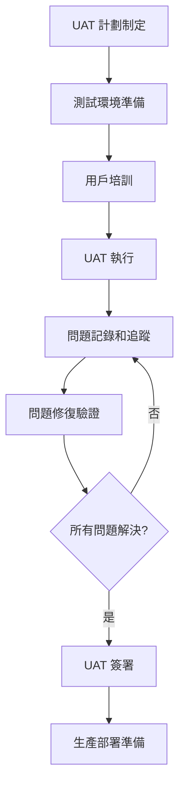

# Hwayo 專案驗證階段測試計劃

## 文件資訊
- **文件名稱**: Hwayo 檢驗流程線上化系統 - 驗證階段測試計劃
- **建立日期**: 2025/05/31
- **階段**: 子任務 6.2 - 細化各階段測試計劃
- **狀態**: 已完成
- **維護責任**: QA 團隊 + 業務團隊
- **版本**: v1.0
- **參考文件**: 
  - [`docs/test-plan/overall_test_strategy.md`](overall_test_strategy.md)
  - [`docs/mvp_definition.md`](../mvp_definition.md)
  - [`docs/user_flows/core_user_flows.md`](../user_flows/core_user_flows.md)
  - [`docs/environment_configs/staging_env_sot.md`](../environment_configs/staging_env_sot.md)
  - [`docs/ui_prototypes/mvp_detailed_prototypes.md`](../ui_prototypes/mvp_detailed_prototypes.md)
  - [`planning/project_development_dod_guide.md`](../../planning/project_development_dod_guide.md)

---

## 1. 引言

### 1.1 目的
本文件定義 Hwayo 專案驗證階段的詳細測試計劃，確保：
- 系統功能完全符合業務需求和用戶期望
- 端到端業務流程能夠順暢執行
- 系統效能滿足生產環境要求
- 安全性達到企業級標準
- 用戶體驗符合可用性要求

### 1.2 範圍
本計劃涵蓋驗證階段的以下測試活動：
- **功能測試 (Functional Testing)**: 基於 MVP 功能和用戶故事的完整功能驗證
- **端到端測試 (End-to-End Testing)**: 核心業務流程的完整驗證
- **使用者驗收測試 (UAT)**: 業務用戶的實際使用驗證
- **效能測試 (Performance Testing)**: 系統效能和負載能力驗證
- **安全性測試 (Security Testing)**: 系統安全性和資料保護驗證

### 1.3 測試環境
基於 [`docs/environment_configs/staging_env_sot.md`](../environment_configs/staging_env_sot.md) 定義的預生產環境配置。

---

## 2. 功能測試 (Functional Testing)

### 2.1 範圍 (基於 MVP 功能和用戶故事)

**測試範圍** (基於 [`docs/mvp_definition.md`](../mvp_definition.md)):

#### 2.1.1 核心用戶故事驗證
基於 [`docs/user_flows/core_user_flows.md`](../user_flows/core_user_flows.md) 中定義的用戶流程：

**研究員用戶故事**:
```gherkin
Feature: 研究員資料輸入和提交
  As a 研究員
  I want to 輸入實驗資料並提交審核
  So that 我可以完成檢驗流程

  Scenario: 成功提交實驗資料
    Given 我已登入系統
    When 我填寫完整的實驗資料表單
    And 我點擊提交按鈕
    Then 系統應該顯示提交成功訊息
    And 資料應該進入待審核狀態
    And 我應該收到提交確認通知

  Scenario: 資料驗證失敗
    Given 我已登入系統
    When 我填寫不完整的實驗資料表單
    And 我點擊提交按鈕
    Then 系統應該顯示驗證錯誤訊息
    And 表單應該保持在編輯狀態
    And 錯誤欄位應該被標示出來
```

**審核人員用戶故事**:
```gherkin
Feature: 審核人員審核流程
  As an 審核人員
  I want to 審核提交的實驗資料
  So that 我可以確保資料品質和合規性

  Scenario: 成功核准審核
    Given 我已登入系統
    And 有待審核的實驗資料
    When 我查看實驗資料詳情
    And 我點擊核准按鈕
    And 我填寫審核意見
    Then 系統應該更新資料狀態為已核准
    And 研究員應該收到核准通知
    And 系統應該觸發報告生成流程

  Scenario: 退回修改
    Given 我已登入系統
    And 有待審核的實驗資料
    When 我查看實驗資料詳情
    And 我發現資料有問題
    And 我點擊退回按鈕
    And 我填寫退回原因
    Then 系統應該更新資料狀態為待修改
    And 研究員應該收到退回通知
    And 退回原因應該顯示在資料詳情中
```

**客戶用戶故事**:
```gherkin
Feature: 客戶報告查看
  As a 客戶
  I want to 查看和下載檢驗報告
  So that 我可以獲得檢驗結果

  Scenario: 成功查看報告
    Given 我已登入客戶入口
    And 我的檢驗報告已完成
    When 我進入報告列表頁面
    Then 我應該看到我的報告列表
    And 我可以點擊查看報告詳情
    And 我可以下載 PDF 格式的報告
```

#### 2.1.2 系統管理功能
```gherkin
Feature: 系統管理功能
  As an 系統管理員
  I want to 管理用戶和系統配置
  So that 我可以維護系統正常運作

  Scenario: 用戶管理
    Given 我已以管理員身份登入
    When 我進入用戶管理頁面
    Then 我可以查看所有用戶列表
    And 我可以新增、編輯、停用用戶
    And 我可以分配用戶角色和權限

  Scenario: 系統配置
    Given 我已以管理員身份登入
    When 我進入系統配置頁面
    Then 我可以修改系統參數
    And 我可以配置通知設定
    And 我可以管理報告模板
```

### 2.2 測試案例設計方法 (例如等價類劃分、邊界值分析)

#### 2.2.1 等價類劃分
```yaml
input_validation_equivalence_classes:
  email_field:
    valid_class: "符合 RFC 5322 標準的電子郵件格式"
    invalid_class_1: "缺少 @ 符號"
    invalid_class_2: "缺少域名部分"
    invalid_class_3: "包含非法字符"
    
  password_field:
    valid_class: "8-128 字符，包含大小寫字母、數字、特殊符號"
    invalid_class_1: "少於 8 字符"
    invalid_class_2: "超過 128 字符"
    invalid_class_3: "缺少必要字符類型"
    
  data_amount_field:
    valid_class: "0.01 - 999999.99"
    invalid_class_1: "負數"
    invalid_class_2: "零"
    invalid_class_3: "超過最大值"
    invalid_class_4: "非數字格式"
```

#### 2.2.2 邊界值分析
```yaml
boundary_value_analysis:
  user_input_limits:
    - field: "實驗標題"
      min_length: 1
      max_length: 200
      test_values: [0, 1, 2, 199, 200, 201]
      
    - field: "實驗描述"
      min_length: 10
      max_length: 2000
      test_values: [9, 10, 11, 1999, 2000, 2001]
      
    - field: "數值資料"
      min_value: 0.01
      max_value: 999999.99
      test_values: [0.00, 0.01, 0.02, 999999.98, 999999.99, 1000000.00]
      
  system_limits:
    - parameter: "同時上傳檔案數量"
      max_files: 10
      test_values: [9, 10, 11]
      
    - parameter: "檔案大小限制"
      max_size_mb: 50
      test_values: [49, 50, 51]
```

#### 2.2.3 狀態轉換測試
```yaml
workflow_state_transitions:
  data_record_states:
    - from: "草稿"
      to: ["提交審核", "刪除"]
      invalid_transitions: ["已核准", "已退回", "報告生成中"]
      
    - from: "待審核"
      to: ["已核准", "已退回"]
      invalid_transitions: ["草稿", "刪除"]
      
    - from: "已核准"
      to: ["報告生成中"]
      invalid_transitions: ["草稿", "待審核", "已退回"]
      
    - from: "已退回"
      to: ["提交審核", "刪除"]
      invalid_transitions: ["已核准", "報告生成中"]
```

### 2.3 手動與自動化測試的分配

#### 2.3.1 自動化測試範圍 (70%)
```yaml
automated_test_categories:
  api_functional_tests:
    coverage: "90%"
    tools: ["Supertest", "Jest"]
    focus: "API 端點功能驗證"
    
  ui_regression_tests:
    coverage: "60%"
    tools: ["Cypress", "Playwright"]
    focus: "核心用戶流程自動化"
    
  data_validation_tests:
    coverage: "95%"
    tools: ["Jest", "Custom Validators"]
    focus: "輸入驗證和資料完整性"
    
  integration_tests:
    coverage: "80%"
    tools: ["Testcontainers", "Docker Compose"]
    focus: "模組間整合驗證"
```

#### 2.3.2 手動測試範圍 (30%)
```yaml
manual_test_categories:
  exploratory_testing:
    focus: "發現未預期的問題和改善機會"
    time_allocation: "每個功能模組 4 小時"
    
  usability_testing:
    focus: "用戶體驗和介面易用性"
    participants: "實際業務用戶"
    
  edge_case_testing:
    focus: "複雜業務場景和異常情況"
    scenarios: "基於實際業務經驗設計"
    
  cross_browser_testing:
    focus: "不同瀏覽器和裝置的兼容性"
    coverage: "主要支援的瀏覽器和解析度"
```

---

## 3. 端到端測試 (End-to-End Testing)

### 3.1 核心業務流程的端到端驗證場景

#### 3.1.1 完整檢驗流程場景
```yaml
scenario_1_happy_path:
  name: "完整檢驗流程 - 正常路徑"
  description: "從資料輸入到報告交付的完整流程"
  
  steps:
    1. "研究員登入系統"
    2. "創建新的實驗資料記錄"
    3. "填寫完整的實驗資料"
    4. "上傳相關檔案"
    5. "提交審核"
    6. "系統發送通知給審核人員"
    7. "審核人員登入系統"
    8. "查看待審核資料"
    9. "審核並核准資料"
    10. "系統觸發報告生成"
    11. "報告生成完成"
    12. "系統通知客戶報告已完成"
    13. "客戶登入客戶入口"
    14. "查看並下載報告"
    
  expected_results:
    - "所有步驟順利完成"
    - "資料狀態正確轉換"
    - "通知及時發送"
    - "報告內容正確"
    - "審計日誌完整記錄"
    
  test_data:
    - "標準實驗資料集"
    - "常見檔案格式"
    - "正常業務參數"
```

#### 3.1.2 異常處理流程場景
```yaml
scenario_2_rejection_path:
  name: "審核退回處理流程"
  description: "資料被退回後的修改和重新提交流程"
  
  steps:
    1. "研究員提交實驗資料"
    2. "審核人員審核並退回"
    3. "研究員收到退回通知"
    4. "研究員查看退回原因"
    5. "研究員修改資料"
    6. "研究員重新提交"
    7. "審核人員重新審核"
    8. "審核人員核准資料"
    9. "流程繼續進行"
    
  expected_results:
    - "退回原因清楚顯示"
    - "修改歷史被記錄"
    - "重新提交流程正常"
    - "最終成功完成流程"

scenario_3_concurrent_processing:
  name: "並行處理場景"
  description: "多個檢驗案例同時處理"
  
  steps:
    1. "多個研究員同時提交資料"
    2. "多個審核人員同時處理"
    3. "系統並行生成多個報告"
    4. "客戶同時存取不同報告"
    
  expected_results:
    - "系統穩定處理並行請求"
    - "資料隔離正確"
    - "效能符合要求"
    - "無資料競爭問題"
```

#### 3.1.3 系統整合場景
```yaml
scenario_4_external_integration:
  name: "外部系統整合驗證"
  description: "與外部服務的整合功能驗證"
  
  integrations:
    email_service:
      test_scenarios:
        - "通知郵件發送"
        - "郵件模板正確性"
        - "發送失敗重試機制"
        
    file_storage:
      test_scenarios:
        - "檔案上傳和下載"
        - "檔案權限控制"
        - "檔案備份和恢復"
        
    database_operations:
      test_scenarios:
        - "資料一致性"
        - "事務處理"
        - "備份和恢復"
```

### 3.2 測試數據準備

#### 3.2.1 測試資料策略
```yaml
test_data_management:
  data_categories:
    baseline_data:
      description: "標準業務場景資料"
      volume: "100 個完整的檢驗案例"
      characteristics: "涵蓋所有主要業務類型"
      
    edge_case_data:
      description: "邊界和異常情況資料"
      volume: "50 個特殊案例"
      characteristics: "極值、異常格式、特殊字符"
      
    performance_data:
      description: "效能測試資料"
      volume: "1000+ 個記錄"
      characteristics: "大量資料、複雜關聯"
      
    security_data:
      description: "安全測試資料"
      volume: "惡意輸入樣本集"
      characteristics: "SQL 注入、XSS、CSRF 測試向量"
```

#### 3.2.2 資料準備腳本
```typescript
// e2e-test-data-setup.ts
export class E2ETestDataSetup {
  async setupBaselineData() {
    // 創建測試用戶
    const users = await this.createTestUsers([
      { role: 'researcher', count: 5 },
      { role: 'reviewer', count: 3 },
      { role: 'customer', count: 10 },
      { role: 'admin', count: 1 }
    ]);
    
    // 創建測試實驗資料
    const experiments = await this.createTestExperiments(100);
    
    // 建立測試關聯
    await this.establishTestRelationships(users, experiments);
    
    return { users, experiments };
  }
  
  async setupPerformanceData() {
    // 大量資料準備
    const largeDataSet = await this.generateLargeDataSet(1000);
    return largeDataSet;
  }
  
  async cleanupTestData() {
    // 測試後清理
    await this.removeTestData();
  }
}
```

### 3.3 環境要求 (通常是 Staging 環境，連結到 Staging 環境 SOT)

**環境配置** (基於 [`docs/environment_configs/staging_env_sot.md`](../environment_configs/staging_env_sot.md)):

```yaml
staging_environment_requirements:
  infrastructure:
    application_servers: "2 個負載平衡的應用伺服器"
    database: "PostgreSQL 15 主從複製"
    cache: "Redis 7.x 叢集"
    file_storage: "AWS S3 相容的物件儲存"
    
  network_configuration:
    load_balancer: "Nginx 反向代理"
    ssl_certificate: "有效的 SSL 憑證"
    domain: "staging.hwayo.com"
    
  monitoring_and_logging:
    application_logs: "集中化日誌收集"
    performance_monitoring: "APM 工具監控"
    error_tracking: "錯誤追蹤和告警"
    
  data_configuration:
    database_size: "接近生產環境規模的測試資料"
    backup_strategy: "每日自動備份"
    data_masking: "敏感資料遮罩處理"
```

**環境驗證檢查清單**:
```yaml
pre_test_environment_checks:
  system_health:
    - "所有服務正常運行"
    - "資料庫連接正常"
    - "外部服務整合正常"
    
  data_integrity:
    - "測試資料完整載入"
    - "資料關聯正確建立"
    - "權限設定正確"
    
  performance_baseline:
    - "系統回應時間正常"
    - "資源使用率在正常範圍"
    - "網路延遲可接受"
```

---

## 4. 使用者驗收測試 (UAT)

### 4.1 UAT 流程、參與者、職責

#### 4.1.1 UAT 流程


#### 4.1.2 參與者和職責
```yaml
uat_participants:
  business_users:
    researchers:
      count: 3
      responsibilities:
        - "執行資料輸入和提交流程測試"
        - "驗證實驗資料管理功能"
        - "測試用戶介面易用性"
        
    reviewers:
      count: 2
      responsibilities:
        - "執行審核流程測試"
        - "驗證審核工具和功能"
        - "測試審核決策流程"
        
    customers:
      count: 2
      responsibilities:
        - "測試客戶入口功能"
        - "驗證報告查看和下載"
        - "評估客戶體驗"
        
    administrators:
      count: 1
      responsibilities:
        - "測試系統管理功能"
        - "驗證用戶和權限管理"
        - "測試系統配置功能"
        
  support_team:
    qa_engineers:
      count: 2
      responsibilities:
        - "協助用戶執行測試"
        - "記錄和追蹤問題"
        - "驗證問題修復"
        
    product_manager:
      count: 1
      responsibilities:
        - "協調 UAT 流程"
        - "評估業務需求滿足程度"
        - "做出驗收決策"
        
    technical_lead:
      count: 1
      responsibilities:
        - "提供技術支援"
        - "評估技術問題"
        - "協調問題修復"
```

### 4.2 驗收標準 (連結到相關文檔)

#### 4.2.1 功能驗收標準
基於 [`docs/mvp_definition.md`](../mvp_definition.md) 中定義的成功標準：

```yaml
functional_acceptance_criteria:
  core_user_stories:
    completion_rate: "> 95%"
    description: "所有核心用戶故事必須能夠成功執行"
    
  data_integrity:
    accuracy_rate: "100%"
    description: "資料輸入、處理、儲存的完整性"
    
  workflow_completeness:
    process_completion: "100%"
    description: "完整檢驗流程能夠順利完成"
    
  report_generation:
    success_rate: "> 98%"
    description: "報告生成功能穩定可靠"
```

#### 4.2.2 效能驗收標準
```yaml
performance_acceptance_criteria:
  response_time:
    target: "< 3 秒"
    measurement: "平均頁面載入時間"
    
  concurrent_users:
    target: "10 位同時用戶"
    measurement: "系統穩定支援的並行用戶數"
    
  system_availability:
    target: "> 95%"
    measurement: "UAT 期間系統可用性"
    
  data_processing:
    target: "< 5 分鐘"
    measurement: "報告生成時間"
```

#### 4.2.3 可用性驗收標準
```yaml
usability_acceptance_criteria:
  user_satisfaction:
    target: "> 80%"
    measurement: "用戶滿意度調查結果"
    
  task_completion_rate:
    target: "> 95%"
    measurement: "用戶能夠獨立完成任務的比例"
    
  error_rate:
    target: "< 5%"
    measurement: "用戶操作錯誤率"
    
  learning_curve:
    target: "< 2 小時"
    measurement: "新用戶上手時間"
```

### 4.3 反饋收集與處理機制

#### 4.3.1 反饋收集方法
```yaml
feedback_collection_methods:
  structured_feedback:
    method: "標準化問卷調查"
    frequency: "每個測試會話結束後"
    content:
      - "功能完整性評估"
      - "易用性評分"
      - "效能滿意度"
      - "改善建議"
      
  unstructured_feedback:
    method: "開放式訪談"
    frequency: "每週一次"
    content:
      - "使用體驗分享"
      - "問題和困難點"
      - "功能需求建議"
      
  real_time_feedback:
    method: "測試過程中即時記錄"
    tools: "問題追蹤系統"
    content:
      - "功能缺陷"
      - "效能問題"
      - "介面問題"
```

#### 4.3.2 反饋處理流程
```yaml
feedback_processing_workflow:
  collection_phase:
    duration: "2 週"
    activities:
      - "收集所有用戶反饋"
      - "分類和優先級排序"
      - "初步分析和評估"
      
  analysis_phase:
    duration: "1 週"
    activities:
      - "深入分析反饋內容"
      - "識別共同問題和趨勢"
      - "制定改善計劃"
      
  implementation_phase:
    duration: "2-4 週"
    activities:
      - "實施高優先級改善"
      - "修復關鍵問題"
      - "更新文檔和培訓材料"
      
  validation_phase:
    duration: "1 週"
    activities:
      - "驗證改善效果"
      - "確認問題解決"
      - "獲得用戶確認"
```

---

## 5. 效能測試 (Performance Testing)

### 5.1 測試目標與範圍 (例如關鍵 API、核心流程)

#### 5.1.1 測試目標
基於 [`docs/test-plan/overall_test_strategy.md`](overall_test_strategy.md) 中定義的效能標準：

```yaml
performance_test_objectives:
  response_time_goals:
    api_endpoints: "< 1 秒"
    page_load_time: "< 3 秒"
    report_generation: "< 5 分鐘"
    
  throughput_goals:
    concurrent_users: "10 位同時用戶"
    api_requests_per_minute: "> 1000"
    data_processing_rate: "> 100 記錄/分鐘"
    
  resource_utilization_goals:
    cpu_usage: "< 70%"
    memory_usage: "< 80%"
    disk_io: "< 80%"
    network_bandwidth: "< 60%"
    
  stability_goals:
    system_uptime: "> 99.5%"
    error_rate: "< 1%"
    recovery_time: "< 5 分鐘"
```

#### 5.1.2 測試範圍
```yaml
performance_test_scope:
  critical_apis:
    authentication:
      endpoints:
        - "POST /auth/login"
        - "POST /auth/refresh"
      target_response_time: "< 500ms"
      
    data_operations:
      endpoints:
        - "POST /data-records"
        - "GET /data-records"
        - "PUT /data-records/{id}"
      target_response_time: "< 1000ms"
      
    workflow_operations:
      endpoints:
        - "PUT /workflows/{id}/transition"
        - "GET /workflows/{id}/history"
      target_response_time: "< 800ms"
      
    report_generation:
      endpoints:
        - "POST /reports/generate"
        - "GET /reports/{id}/download"
      target_response_time: "< 2000ms"
      
  core_business_processes:
    data_submission_flow:
      description: "從資料輸入到提交完成"
      target_completion_time: "< 30 秒"
      
    review_process_flow:
      description: "從審核開始到決策完成"
      target_completion_time: "< 60 秒"
      
    report_generation_flow:
      description: "從觸發到報告完成"
      target_completion_time: "< 5 分鐘"
```

### 5.2 效能指標 (例如併發用戶數、響應時間、吞吐量)

#### 5.2.1 關鍵效能指標 (KPIs)
```yaml
performance_kpis:
  response_time_metrics:
    average_response_time:
      target: "< 1 秒"
      measurement: "所有 API 請求的平均回應時間"
      
    95th_percentile_response_time:
      target: "< 3 秒"
      measurement: "95% 的請求在此時間內完成"
      
    99th_percentile_response_time:
      target: "< 5 秒"
      measurement: "99% 的請求在此時間內完成"
      
  throughput_metrics:
    requests_per_second:
      target: "> 50 RPS"
      measurement: "系統每秒處理的請求數"
      
    transactions_per_minute:
TPM"
      measurement: "系統每分鐘完成的業務交易數"
      
    concurrent_user_capacity:
      target: "10 位同時用戶"
      measurement: "系統穩定支援的並行用戶數"
      
  resource_utilization_metrics:
    cpu_utilization:
      target: "< 70%"
      measurement: "平均 CPU 使用率"
      
    memory_utilization:
      target: "< 80%"
      measurement: "平均記憶體使用率"
      
    database_performance:
      target: "< 100ms"
      measurement: "平均資料庫查詢時間"
```

#### 5.2.2 效能監控指標
```yaml
monitoring_metrics:
  application_metrics:
    - "HTTP 請求回應時間分佈"
    - "API 端點錯誤率"
    - "資料庫連接池使用率"
    - "快取命中率"
    
  infrastructure_metrics:
    - "伺服器 CPU 和記憶體使用率"
    - "網路 I/O 和磁碟 I/O"
    - "資料庫效能指標"
    - "負載平衡器指標"
    
  business_metrics:
    - "用戶會話持續時間"
    - "業務流程完成率"
    - "報告生成成功率"
    - "用戶操作錯誤率"
```

### 5.3 測試場景 (例如負載測試、壓力測試、穩定性測試)

#### 5.3.1 負載測試場景
```yaml
load_testing_scenarios:
  normal_business_load:
    description: "模擬正常業務負載"
    concurrent_users: 10
    duration: "30 分鐘"
    ramp_up_time: "5 分鐘"
    user_behavior:
      - "登入系統 (10%)"
      - "瀏覽資料 (30%)"
      - "輸入資料 (25%)"
      - "審核操作 (20%)"
      - "報告查看 (15%)"
      
  peak_business_load:
    description: "模擬業務尖峰負載"
    concurrent_users: 25
    duration: "15 分鐘"
    ramp_up_time: "3 分鐘"
    user_behavior:
      - "集中資料提交 (40%)"
      - "批量審核操作 (35%)"
      - "報告下載 (25%)"
      
  sustained_load:
    description: "長時間穩定負載測試"
    concurrent_users: 8
    duration: "2 小時"
    ramp_up_time: "10 分鐘"
    focus: "系統穩定性和記憶體洩漏檢測"
```

#### 5.3.2 壓力測試場景
```yaml
stress_testing_scenarios:
  user_capacity_stress:
    description: "測試最大用戶承載能力"
    max_concurrent_users: 50
    increment: 5
    duration_per_level: "10 分鐘"
    break_condition: "錯誤率 > 5% 或回應時間 > 10 秒"
    
  data_volume_stress:
    description: "大量資料處理壓力測試"
    test_scenarios:
      - "單次上傳大檔案 (50MB)"
      - "批量資料匯入 (1000 筆記錄)"
      - "並行報告生成 (10 個報告)"
      
  api_endpoint_stress:
    description: "API 端點壓力測試"
    target_endpoints:
      - "/data-records (POST)"
      - "/workflows/{id}/transition (PUT)"
      - "/reports/generate (POST)"
    request_rate: "100 RPS"
    duration: "10 分鐘"
```

#### 5.3.3 穩定性測試場景
```yaml
stability_testing_scenarios:
  endurance_test:
    description: "長期運行穩定性測試"
    duration: "24 小時"
    concurrent_users: 5
    monitoring_focus:
      - "記憶體使用趨勢"
      - "資料庫連接洩漏"
      - "檔案描述符使用"
      - "錯誤率變化"
      
  recovery_test:
    description: "故障恢復測試"
    test_scenarios:
      - "資料庫連接中斷恢復"
      - "外部服務不可用處理"
      - "伺服器重啟後恢復"
      - "網路延遲和中斷處理"
      
  resource_exhaustion_test:
    description: "資源耗盡測試"
    test_scenarios:
      - "磁碟空間不足處理"
      - "記憶體不足處理"
      - "資料庫連接池耗盡"
      - "檔案描述符耗盡"
```

### 5.4 工具選擇 (例如 JMeter, k6)

#### 5.4.1 主要效能測試工具
```yaml
performance_testing_tools:
  primary_tool:
    name: "K6"
    reasons:
      - "JavaScript 腳本易於維護"
      - "優秀的 CI/CD 整合"
      - "詳細的效能指標"
      - "支援複雜場景模擬"
    
    usage_examples:
      load_test_script: |
        import http from 'k6/http';
        import { check, sleep } from 'k6';
        
        export let options = {
          stages: [
            { duration: '5m', target: 10 },
            { duration: '30m', target: 10 },
            { duration: '5m', target: 0 },
          ],
        };
        
        export default function() {
          let response = http.post('https://staging.hwayo.com/api/v1/auth/login', {
            email: 'test@hwayo.com',
            password: 'password123'
          });
          
          check(response, {
            'login successful': (r) => r.status === 200,
            'response time < 1s': (r) => r.timings.duration < 1000,
          });
          
          sleep(1);
        }
        
  secondary_tool:
    name: "Apache JMeter"
    reasons:
      - "GUI 介面適合複雜場景設計"
      - "豐富的插件生態系統"
      - "詳細的報告功能"
      - "支援多種協議"
    
    usage_scenarios:
      - "複雜的用戶行為模擬"
      - "多協議整合測試"
      - "詳細的效能分析"
      
  monitoring_tools:
    application_monitoring:
      - "Grafana + Prometheus"
      - "New Relic APM"
      - "Application Insights"
      
    infrastructure_monitoring:
      - "Grafana + InfluxDB"
      - "CloudWatch (AWS)"
      - "Azure Monitor"
```

#### 5.4.2 工具整合架構
```yaml
performance_testing_architecture:
  test_execution:
    - "K6 腳本執行效能測試"
    - "JMeter 執行複雜場景測試"
    - "CI/CD 管道自動觸發測試"
    
  data_collection:
    - "K6 輸出指標到 InfluxDB"
    - "應用程式指標收集到 Prometheus"
    - "基礎設施指標收集到監控系統"
    
  visualization:
    - "Grafana 儀表板即時監控"
    - "測試報告自動生成"
    - "告警系統異常通知"
    
  reporting:
    - "HTML 格式詳細報告"
    - "趨勢分析和比較"
    - "效能基準建立"
```

### 5.5 環境要求

**效能測試環境配置** (基於 [`docs/environment_configs/staging_env_sot.md`](../environment_configs/staging_env_sot.md)):

```yaml
performance_test_environment:
  infrastructure_requirements:
    application_tier:
      - "2 個應用伺服器 (4 vCPU, 8GB RAM)"
      - "負載平衡器配置"
      - "自動擴展停用 (固定資源測試)"
      
    database_tier:
      - "PostgreSQL 15 (8 vCPU, 16GB RAM)"
      - "SSD 儲存 (高 IOPS)"
      - "連接池配置優化"
      
    cache_tier:
      - "Redis 7.x (2 vCPU, 4GB RAM)"
      - "持久化配置"
      - "叢集模式"
      
  network_configuration:
    bandwidth: "1 Gbps"
    latency: "< 10ms (內部網路)"
    load_balancer: "Nginx (優化配置)"
    
  monitoring_setup:
    metrics_collection: "每 5 秒收集一次"
    log_aggregation: "集中化日誌收集"
    alerting: "即時告警配置"
```

---

## 6. 安全性測試 (Security Testing)

### 6.1 測試範圍 (例如身份驗證、授權、輸入驗證、API 安全)

#### 6.1.1 身份驗證安全測試
```yaml
authentication_security_tests:
  password_security:
    test_scenarios:
      - "弱密碼檢測"
      - "密碼複雜度要求驗證"
      - "密碼歷史檢查"
      - "帳戶鎖定機制"
      - "暴力破解防護"
      
  session_management:
    test_scenarios:
      - "會話 Token 安全性"
      - "會話過期處理"
      - "並行會話控制"
      - "會話固定攻擊防護"
      - "安全登出功能"
      
  multi_factor_authentication:
    test_scenarios:
      - "MFA 設定和驗證"
      - "備用驗證方法"
      - "MFA 繞過嘗試"
      - "設備信任機制"
```

#### 6.1.2 授權和存取控制測試
```yaml
authorization_security_tests:
  role_based_access_control:
    test_scenarios:
      - "角色權限正確性"
      - "權限提升嘗試"
      - "跨用戶資料存取"
      - "管理員權限濫用"
      
  api_authorization:
    test_scenarios:
      - "API 端點權限驗證"
      - "JWT Token 驗證"
      - "API 金鑰管理"
      - "跨域請求控制"
      
  data_access_control:
    test_scenarios:
      - "資料隔離驗證"
      - "敏感資料存取控制"
      - "檔案下載權限"
      - "報告存取權限"
```

#### 6.1.3 輸入驗證和資料安全測試
```yaml
input_validation_security_tests:
  injection_attacks:
    test_scenarios:
      - "SQL 注入攻擊"
      - "NoSQL 注入攻擊"
      - "命令注入攻擊"
      - "LDAP 注入攻擊"
      
  cross_site_scripting:
    test_scenarios:
      - "反射型 XSS"
      - "儲存型 XSS"
      - "DOM 型 XSS"
      - "XSS 過濾器繞過"
      
  data_validation:
    test_scenarios:
      - "檔案上傳安全性"
      - "檔案類型驗證"
      - "檔案大小限制"
      - "惡意檔案檢測"
```

#### 6.1.4 API 安全測試
```yaml
api_security_tests:
  api_authentication:
    test_scenarios:
      - "API 金鑰驗證"
      - "OAuth 2.0 流程"
      - "JWT Token 安全性"
      - "API 版本控制安全"
      
  api_rate_limiting:
    test_scenarios:
      - "請求頻率限制"
      - "API 配額管理"
      - "DDoS 攻擊防護"
      - "異常流量檢測"
      
  api_data_security:
    test_scenarios:
      - "敏感資料傳輸加密"
      - "API 回應資料過濾"
      - "錯誤訊息資訊洩露"
      - "API 文檔安全性"
```

### 6.2 測試方法 (例如滲透測試初步規劃、漏洞掃描)

#### 6.2.1 自動化漏洞掃描
```yaml
automated_vulnerability_scanning:
  web_application_scanning:
    tools: ["OWASP ZAP", "Burp Suite Professional"]
    scan_types:
      - "被動掃描 (Passive Scanning)"
      - "主動掃描 (Active Scanning)"
      - "認證掃描 (Authenticated Scanning)"
      
    scan_coverage:
      - "所有 Web 頁面和 API 端點"
      - "表單和輸入欄位"
      - "檔案上傳功能"
      - "認證和會話管理"
      
  dependency_scanning:
    tools: ["npm audit", "Snyk", "OWASP Dependency Check"]
    scan_targets:
      - "前端依賴庫"
      - "後端依賴庫"
      - "容器映像檔"
      - "作業系統套件"
      
  infrastructure_scanning:
    tools: ["Nessus", "OpenVAS", "Nmap"]
    scan_targets:
      - "網路服務和埠"
      - "作業系統漏洞"
      - "網路配置"
      - "SSL/TLS 配置"
```

#### 6.2.2 手動滲透測試規劃
```yaml
manual_penetration_testing:
  reconnaissance_phase:
    activities:
      - "資訊收集和偵察"
      - "攻擊面分析"
      - "技術棧識別"
      - "潛在入口點識別"
      
  vulnerability_assessment:
    focus_areas:
      - "業務邏輯漏洞"
      - "權限提升路徑"
      - "資料洩露風險"
      - "會話管理弱點"
      
  exploitation_testing:
    test_scenarios:
      - "模擬真實攻擊場景"
      - "多步驟攻擊鏈"
      - "橫向移動測試"
      - "資料竊取模擬"
      
  post_exploitation:
    activities:
      - "持久化機制測試"
      - "權限維持測試"
      - "痕跡清除測試"
      - "影響評估"
```

### 6.3 工具選擇 (例如 OWASP ZAP)

#### 6.3.1 主要安全測試工具
```yaml
security_testing_tools:
  primary_scanning_tool:
    name: "OWASP ZAP"
    capabilities:
      - "自動化漏洞掃描"
      - "手動測試支援"
      - "API 安全測試"
      - "CI/CD 整合"
      
    usage_configuration:
      scan_policies:
        - "OWASP Top 10 掃描"
        - "API 安全掃描"
        - "認證繞過測試"
        
      automation_setup:
        - "Jenkins 插件整合"
        - "命令列自動化"
        - "報告自動生成"
        
  secondary_tools:
    burp_suite:
      usage: "深度手動測試"
      features:
        - "進階掃描引擎"
        - "自定義攻擊載荷"
        - "詳細的漏洞分析"
        
    dependency_scanners:
      npm_audit:
        usage: "Node.js 依賴掃描"
        integration: "package.json 自動掃描"
        
      snyk:
        usage: "全面依賴安全掃描"
        features:
          - "漏洞資料庫更新"
          - "修復建議"
          - "許可證合規檢查"
          
  specialized_tools:
    sqlmap:
      usage: "SQL 注入專項測試"
      scenarios: "資料庫安全驗證"
      
    nikto:
      usage: "Web 伺服器掃描"
      scenarios: "伺服器配置安全檢查"
```

#### 6.3.2 工具整合和自動化
```yaml
security_testing_automation:
  ci_cd_integration:
    pipeline_stages:
      - "靜態代碼安全分析 (SAST)"
      - "依賴庫漏洞掃描"
      - "容器映像檔安全掃描"
      - "動態應用安全測試 (DAST)"
      
    automation_scripts:
      zap_automation: |
        # ZAP 自動化掃描腳本
        docker run -v $(pwd):/zap/wrk/:rw \
          -t owasp/zap2docker-stable zap-baseline.py \
          -t https://staging.hwayo.com \
          -g gen.conf \
          -r zap-report.html
          
      dependency_scan: |
        # 依賴庫安全掃描
        npm audit --audit-level moderate
        snyk test --severity-threshold=medium
        
  reporting_integration:
    report_formats:
      - "HTML 詳細報告"
      - "JSON 機器可讀格式"
      - "SARIF 標準格式"
      - "PDF 執行摘要"
      
    alert_mechanisms:
      - "Slack 通知"
      - "Email 報告"
      - "Jira 票證創建"
      - "GitHub 安全告警"
```

### 6.4 關注 OWASP Top 10 風險

#### 6.4.1 OWASP Top 10 2021 測試覆蓋
```yaml
owasp_top_10_testing:
  A01_broken_access_control:
    test_scenarios:
      - "垂直權限提升測試"
      - "水平權限提升測試"
      - "直接物件參考漏洞"
      - "強制瀏覽測試"
      
    specific_tests:
      - "修改 URL 參數存取其他用戶資料"
      - "繞過前端權限控制"
      - "API 端點權限驗證"
      
  A02_cryptographic_failures:
    test_scenarios:
      - "敏感資料傳輸加密"
      - "靜態資料加密"
      - "密碼儲存安全性"
      - "加密演算法強度"
      
    specific_tests:
      - "HTTPS 配置檢查"
      - "資料庫加密驗證"
      - "密碼雜湊演算法檢查"
      
  A03_injection:
    test_scenarios:
      - "SQL 注入攻擊"
      - "NoSQL 注入攻擊"
      - "命令注入攻擊"
      - "LDAP 注入攻擊"
      
    specific_tests:
      - "參數化查詢驗證"
      - "輸入驗證機制"
      - "輸出編碼檢查"
      
  A04_insecure_design:
    test_scenarios:
      - "業務邏輯漏洞"
      - "工作流程安全性"
      - "威脅建模驗證"
      - "安全控制設計"
      
    specific_tests:
      - "審核流程繞過嘗試"
      - "業務規則違反測試"
      - "狀態轉換安全性"
      
  A05_security_misconfiguration:
    test_scenarios:
      - "預設配置檢查"
      - "錯誤頁面資訊洩露"
      - "不必要的功能啟用"
      - "安全標頭配置"
      
    specific_tests:
      - "HTTP 安全標頭檢查"
      - "錯誤處理機制"
      - "管理介面暴露檢查"
      
  A06_vulnerable_components:
    test_scenarios:
      - "過時組件識別"
      - "已知漏洞檢查"
      - "組件許可證合規"
      - "供應鏈安全"
      
    specific_tests:
      - "npm audit 掃描"
      - "容器映像檔漏洞掃描"
      - "第三方庫安全檢查"
      
  A07_identification_failures:
    test_scenarios:
      - "會話管理漏洞"
      - "認證繞過嘗試"
      - "密碼政策檢查"
      - "帳戶鎖定機制"
      
    specific_tests:
      - "會話固定攻擊"
      - "暴力破解防護"
      - "多重認證測試"
      
  A08_software_integrity_failures:
    test_scenarios:
      - "代碼完整性驗證"
      - "更新機制安全性"
      - "CI/CD 管道安全"
      - "軟體供應鏈"
      
    specific_tests:
      - "代碼簽名驗證"
      - "依賴庫完整性"
      - "部署流程安全"
      
  A09_logging_monitoring_failures:
    test_scenarios:
      - "安全事件記錄"
      - "日誌完整性"
      - "監控告警機制"
      - "事件回應能力"
      
    specific_tests:
      - "登入失敗記錄"
      - "權限變更記錄"
      - "異常活動檢測"
      
  A10_server_side_request_forgery:
    test_scenarios:
      - "SSRF 攻擊防護"
      - "內部服務存取"
      - "URL 驗證機制"
      - "網路隔離檢查"
      
    specific_tests:
      - "內部 IP 存取嘗試"
      - "雲端元資料存取"
      - "檔案協議存取嘗試"
```

---

## 7. 測試執行計劃

### 7.1 測試階段和時程安排
```yaml
validation_testing_schedule:
  phase_1_functional_testing:
    duration: "2 週"
    parallel_activities:
      - "功能測試執行"
      - "API 測試自動化"
      - "UI 測試案例執行"
      
  phase_2_integration_testing:
    duration: "1 週"
    activities:
      - "端到端測試執行"
      - "系統整合驗證"
      - "資料流測試"
      
  phase_3_performance_testing:
    duration: "1 週"
    activities:
      - "負載測試執行"
      - "壓力測試執行"
      - "效能調優"
      
  phase_4_security_testing:
    duration: "1 週"
    activities:
      - "自動化安全掃描"
      - "手動滲透測試"
      - "安全問題修復"
      
  phase_5_uat:
    duration: "2 週"
    activities:
      - "用戶培訓"
      - "UAT 執行"
      - "反饋收集和處理"
```

### 7.2 測試環境管理
```yaml
test_environment_management:
  environment_preparation:
    - "測試資料準備和載入"
    - "環境配置驗證"
    - "監控工具設定"
    
  environment_maintenance:
    - "每日環境健康檢查"
    - "測試資料重置"
    - "效能基準監控"
    
  environment_cleanup:
    - "測試完成後資料清理"
    - "環境重置"
    - "資源釋放"
```

---

## 8. 測試報告與度量

### 8.1 測試報告結構
```yaml
validation_test_reporting:
  daily_reports:
    content:
      - "測試執行進度"
      - "發現問題統計"
      - "環境狀態報告"
      
  weekly_reports:
    content:
      - "測試覆蓋率分析"
      - "問題趨勢分析"
      - "效能指標趨勢"
      
  final_validation_report:
    content:
      - "驗收標準達成情況"
      - "風險評估和建議"
      - "生產部署準備度評估"
```

### 8.2 關鍵度量指標
```yaml
validation_metrics:
  quality_metrics:
    - "缺陷密度"
    - "測試覆蓋率"
    - "驗收標準達成率"
    
  performance_metrics:
    - "回應時間趨勢"
    - "系統穩定性指標"
    - "資源使用效率"
    
  security_metrics:
    - "漏洞發現和修復率"
    - "安全掃描覆蓋率"
    - "合規性檢查結果"
```

---

## 9. 風險管理

### 9.1 測試風險識別
```yaml
validation_testing_risks:
  schedule_risks:
    - "測試環境不穩定導致延遲"
    - "關鍵缺陷修復時間過長"
    - "UAT 用戶可用性限制"
    
  quality_risks:
    - "測試覆蓋不足"
    - "效能問題發現過晚"
    - "安全漏洞遺漏"
    
  resource_risks:
    - "測試人員技能不足"
    - "測試工具限制"
    - "測試資料準備困難"
```

### 9.2 風險緩解措施
```yaml
risk_mitigation_strategies:
  proactive_measures:
    - "提前準備備用測試環境"
    - "建立快速問題修復流程"
    - "培訓備用測試人員"
    
  contingency_plans:
    - "關鍵路徑測試優先執行"
    - "自動化測試加速執行"
    - "外部專家支援計劃"
```

---

## 10. 附錄

### 10.1 測試案例範本
詳細的測試案例設計範本和範例。

### 10.2 測試資料規格
標準測試資料的結構定義和準備指南。

### 10.3 工具配置指南
各種測試工具的詳細配置說明和最佳實踐。
      target: "> 100