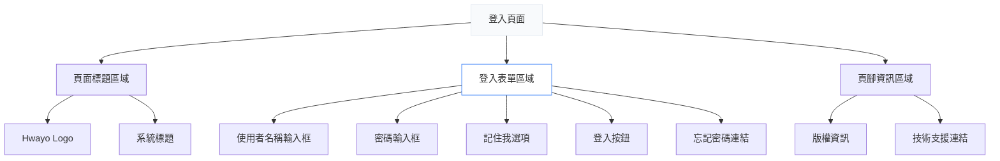
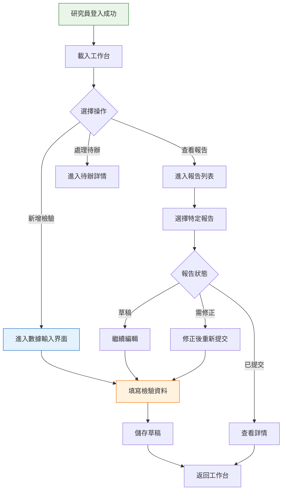
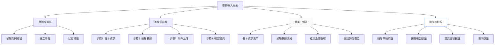
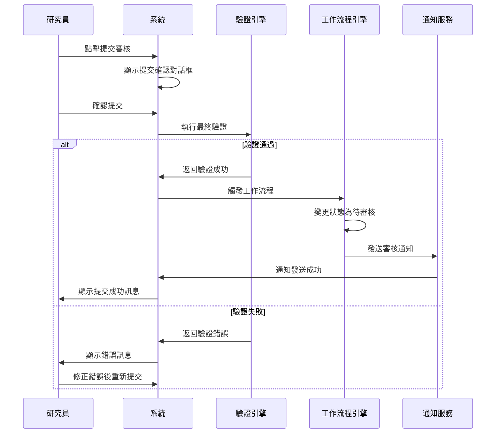
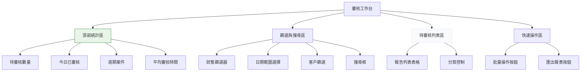
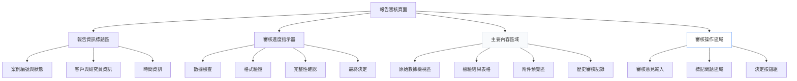
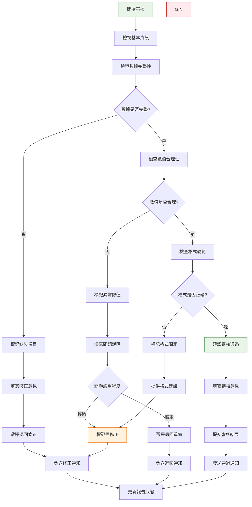
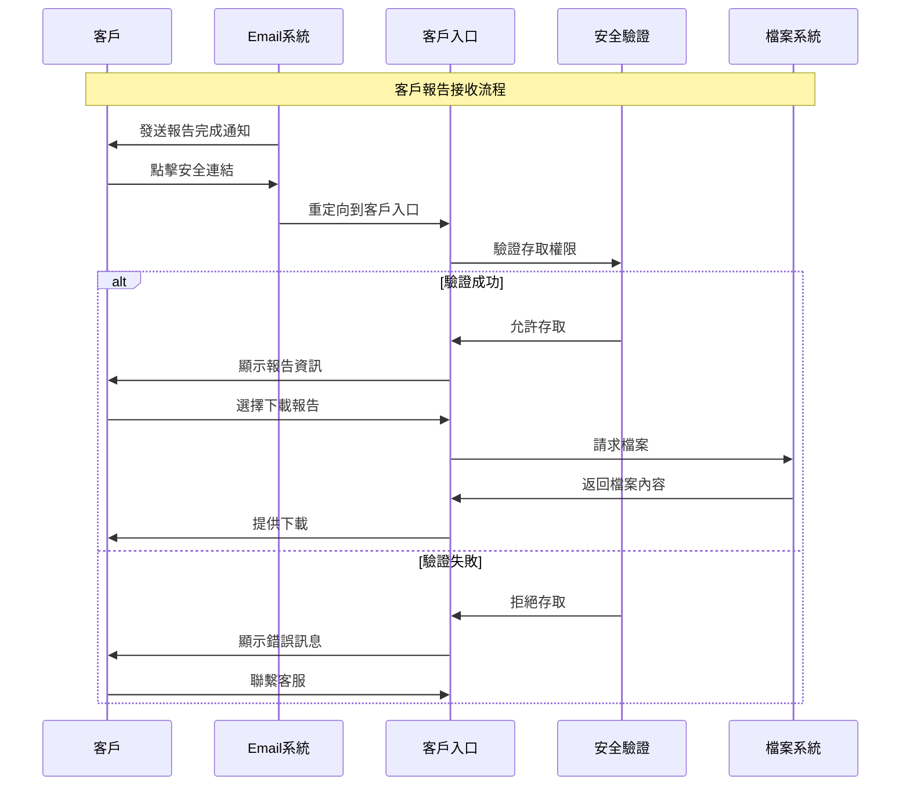
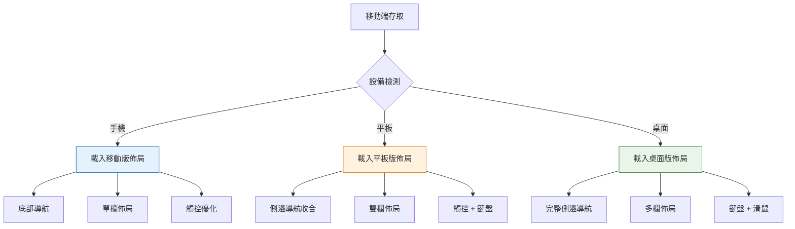
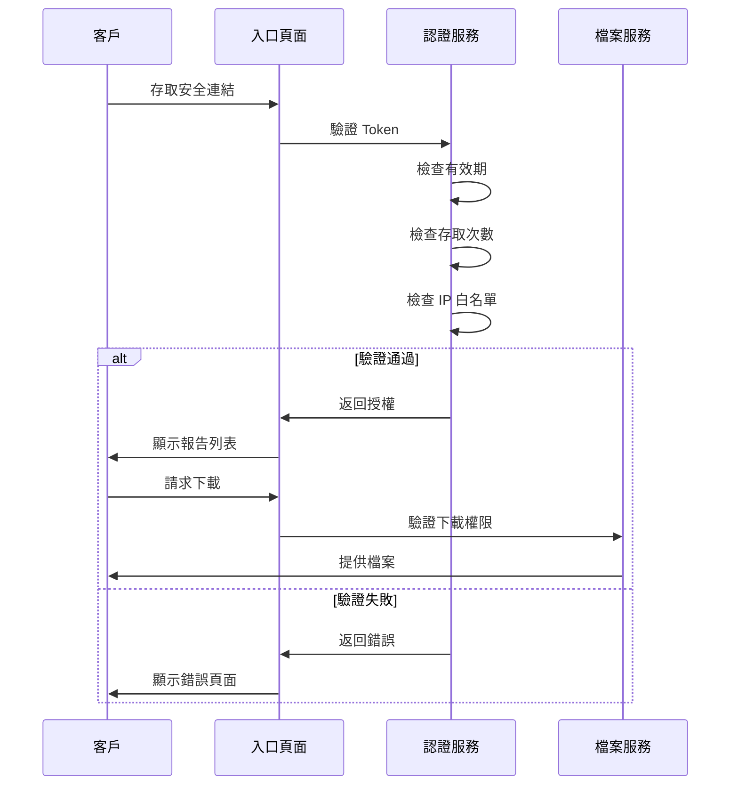

# Hwayo MVP 界面原型設計

## 文件資訊
- **文件名稱**: MVP 詳細界面原型
- **建立日期**: 2025/05/31
- **階段**: 子任務 4.3 - 細化界面原型並進行評審
- **狀態**: 設計完成，待評審
- **參考文件**: 
  - [`docs/user_flows/core_user_flows.md`](../user_flows/core_user_flows.md)
  - [`docs/mvp_definition.md`](../mvp_definition.md)
  - [`planning/productBrief.md`](../../planning/productBrief.md)

## 1. 原型設計概述

### 1.1 設計原則
- **用戶中心設計**: 以用戶角色和工作流程為核心
- **一致性**: 統一的視覺語言和交互模式
- **可用性**: 直觀易用，減少學習成本
- **響應式**: 支援桌面和平板設備
- **可訪問性**: 符合基本無障礙設計標準

### 1.2 技術規格
- **保真度**: 中高保真原型
- **設計工具**: Markdown + Mermaid + HTML 原型片段
- **瀏覽器支援**: Chrome, Firefox, Safari, Edge (最新版本)
- **解析度**: 1920x1080 (主要), 1366x768 (次要)

### 1.3 色彩與視覺系統

```css
/* 主要色彩系統 */
:root {
  /* 主色調 - 專業藍 */
  --primary-color: #2563eb;
  --primary-light: #3b82f6;
  --primary-dark: #1d4ed8;
  
  /* 次要色調 - 中性灰 */
  --secondary-color: #64748b;
  --secondary-light: #94a3b8;
  --secondary-dark: #475569;
  
  /* 狀態色彩 */
  --success-color: #10b981;
  --warning-color: #f59e0b;
  --error-color: #ef4444;
  --info-color: #06b6d4;
  
  /* 背景色彩 */
  --bg-primary: #ffffff;
  --bg-secondary: #f8fafc;
  --bg-tertiary: #f1f5f9;
  
  /* 文字色彩 */
  --text-primary: #0f172a;
  --text-secondary: #475569;
  --text-muted: #94a3b8;
  
  /* 邊框色彩 */
  --border-color: #e2e8f0;
  --border-focus: #3b82f6;
}
```

## 2. 研究員界面原型

### 2.1 登入與工作台界面

#### 2.1.1 登入頁面佈局



#### 2.1.2 登入頁面 HTML 原型

```html
<!DOCTYPE html>
<html lang="zh-TW">
<head>
    <meta charset="UTF-8">
    <meta name="viewport" content="width=device-width, initial-scale=1.0">
    <title>Hwayo 檢驗系統 - 登入</title>
    <style>
        body {
            font-family: 'Segoe UI', Tahoma, Geneva, Verdana, sans-serif;
            background: linear-gradient(135deg, #667eea 0%, #764ba2 100%);
            margin: 0;
            padding: 0;
            min-height: 100vh;
            display: flex;
            align-items: center;
            justify-content: center;
        }
        
        .login-container {
            background: white;
            border-radius: 12px;
            box-shadow: 0 20px 25px -5px rgba(0, 0, 0, 0.1);
            padding: 2rem;
            width: 100%;
            max-width: 400px;
        }
        
        .logo-section {
            text-align: center;
            margin-bottom: 2rem;
        }
        
        .logo {
            width: 80px;
            height: 80px;
            background: #2563eb;
            border-radius: 50%;
            margin: 0 auto 1rem;
            display: flex;
            align-items: center;
            justify-content: center;
            color: white;
            font-size: 2rem;
            font-weight: bold;
        }
        
        .form-group {
            margin-bottom: 1.5rem;
        }
        
        .form-label {
            display: block;
            margin-bottom: 0.5rem;
            color: #374151;
            font-weight: 500;
        }
        
        .form-input {
            width: 100%;
            padding: 0.75rem;
            border: 2px solid #e5e7eb;
            border-radius: 8px;
            font-size: 1rem;
            transition: border-color 0.2s;
        }
        
        .form-input:focus {
            outline: none;
            border-color: #3b82f6;
        }
        
        .login-btn {
            width: 100%;
            background: #2563eb;
            color: white;
            padding: 0.75rem;
            border: none;
            border-radius: 8px;
            font-size: 1rem;
            font-weight: 500;
            cursor: pointer;
            transition: background-color 0.2s;
        }
        
        .login-btn:hover {
            background: #1d4ed8;
        }
    </style>
</head>
<body>
    <div class="login-container">
        <div class="logo-section">
            <div class="logo">H</div>
            <h1 style="margin: 0; color: #1f2937;">Hwayo 檢驗系統</h1>
            <p style="color: #6b7280; margin: 0.5rem 0 0 0;">請登入您的帳戶</p>
        </div>
        
        <form>
            <div class="form-group">
                <label class="form-label" for="username">使用者名稱</label>
                <input type="text" id="username" class="form-input" placeholder="請輸入使用者名稱">
            </div>
            
            <div class="form-group">
                <label class="form-label" for="password">密碼</label>
                <input type="password" id="password" class="form-input" placeholder="請輸入密碼">
            </div>
            
            <div class="form-group" style="display: flex; align-items: center; justify-content: space-between;">
                <label style="display: flex; align-items: center; color: #6b7280;">
                    <input type="checkbox" style="margin-right: 0.5rem;"> 記住我
                </label>
                <a href="#" style="color: #2563eb; text-decoration: none;">忘記密碼？</a>
            </div>
            
            <button type="submit" class="login-btn">登入</button>
        </form>
        
        <div style="text-align: center; margin-top: 2rem; color: #9ca3af; font-size: 0.875rem;">
            © 2025 Hwayo. 版權所有
        </div>
    </div>
</body>
</html>
```

#### 2.1.3 研究員工作台佈局

| 區域 | 元素 | 功能描述 |
|------|------|----------|
| **頂部導航欄** | Logo + 系統名稱 | 品牌識別 |
| | 用戶資訊下拉選單 | 個人設定、登出 |
| | 通知圖示 | 顯示未讀通知數量 |
| **側邊導航** | 工作台 | 主要工作區域 |
| | 我的報告 | 查看所有報告狀態 |
| | 新增檢驗 | 建立新檢驗案例 |
| | 歷史記錄 | 查看操作歷史 |
| **主要內容區** | 快速操作卡片 | 常用功能快捷入口 |
| | 待辦事項列表 | 需要處理的任務 |
| | 最近報告 | 最近編輯的報告 |
| | 統計資訊 | 個人工作統計 |

#### 2.1.4 工作台交互流程



### 2.2 數據輸入表單界面

#### 2.2.1 表單佈局結構



#### 2.2.2 表單欄位規格

| 欄位分類 | 欄位名稱 | 類型 | 必填 | 驗證規則 |
|----------|----------|------|------|----------|
| **基本資訊** | 客戶名稱 | 下拉選單 | ✓ | 從客戶清單選擇 |
| | 檢驗類型 | 單選按鈕 | ✓ | 預定義檢驗類型 |
| | 樣本編號 | 文字輸入 | ✓ | 唯一性檢查 |
| | 收樣日期 | 日期選擇器 | ✓ | 不可未來日期 |
| | 檢驗日期 | 日期選擇器 | ✓ | 不可早於收樣日期 |
| **檢驗數據** | 檢驗項目 | 多選框 | ✓ | 至少選擇一項 |
| | 數值結果 | 數字輸入 | ✓ | 數值範圍驗證 |
| | 單位 | 下拉選單 | ✓ | 標準單位清單 |
| | 檢驗方法 | 下拉選單 | ✓ | 標準方法清單 |
| | 儀器設備 | 下拉選單 | ✓ | 設備清單 |
| **附件資料** | 原始數據檔案 | 檔案上傳 | ○ | PDF, Excel, 圖片格式 |
| | 檢驗照片 | 圖片上傳 | ○ | JPG, PNG 格式 |
| | 其他附件 | 檔案上傳 | ○ | 多種格式支援 |

#### 2.2.3 數據輸入表單 HTML 原型

```html
<!DOCTYPE html>
<html lang="zh-TW">
<head>
    <meta charset="UTF-8">
    <meta name="viewport" content="width=device-width, initial-scale=1.0">
    <title>Hwayo - 數據輸入</title>
    <style>
        * {
            margin: 0;
            padding: 0;
            box-sizing: border-box;
        }
        
        body {
            font-family: 'Segoe UI', Tahoma, Geneva, Verdana, sans-serif;
            background-color: #f8fafc;
            color: #0f172a;
        }
        
        .header {
            background: white;
            border-bottom: 1px solid #e2e8f0;
            padding: 1rem 2rem;
            display: flex;
            justify-content: space-between;
            align-items: center;
        }
        
        .progress-bar {
            background: white;
            padding: 1rem 2rem;
            border-bottom: 1px solid #e2e8f0;
        }
        
        .progress-steps {
            display: flex;
            justify-content: space-between;
            max-width: 600px;
            margin: 0 auto;
        }
        
        .step {
            display: flex;
            align-items: center;
            flex: 1;
        }
        
        .step-number {
            width: 32px;
            height: 32px;
            border-radius: 50%;
            background: #e2e8f0;
            color: #64748b;
            display: flex;
            align-items: center;
            justify-content: center;
            font-weight: 600;
            margin-right: 0.5rem;
        }
        
        .step.active .step-number {
            background: #2563eb;
            color: white;
        }
        
        .step.completed .step-number {
            background: #10b981;
            color: white;
        }
        
        .main-content {
            max-width: 1200px;
            margin: 2rem auto;
            padding: 0 2rem;
        }
        
        .form-card {
            background: white;
            border-radius: 12px;
            box-shadow: 0 1px 3px rgba(0, 0, 0, 0.1);
            padding: 2rem;
            margin-bottom: 2rem;
        }
        
        .form-section {
            margin-bottom: 2rem;
        }
        
        .section-title {
            font-size: 1.25rem;
            font-weight: 600;
            color: #1f2937;
            margin-bottom: 1rem;
            padding-bottom: 0.5rem;
            border-bottom: 2px solid #e5e7eb;
        }
        
        .form-row {
            display: grid;
            grid-template-columns: repeat(auto-fit, minmax(300px, 1fr));
            gap: 1rem;
            margin-bottom: 1rem;
        }
        
        .form-group {
            display: flex;
            flex-direction: column;
        }
        
        .form-label {
            font-weight: 500;
            color: #374151;
            margin-bottom: 0.5rem;
        }
        
        .required {
            color: #ef4444;
        }
        
        .form-input, .form-select, .form-textarea {
            padding: 0.75rem;
            border: 2px solid #e5e7eb;
            border-radius: 8px;
            font-size: 1rem;
            transition: border-color 0.2s;
        }
        
        .form-input:focus, .form-select:focus, .form-textarea:focus {
            outline: none;
            border-color: #3b82f6;
        }
        
        .file-upload-area {
            border: 2px dashed #d1d5db;
            border-radius: 8px;
            padding: 2rem;
            text-align: center;
            background: #f9fafb;
            transition: border-color 0.2s;
        }
        
        .file-upload-area:hover {
            border-color: #3b82f6;
        }
        
        .data-table {
            width: 100%;
            border-collapse: collapse;
            margin-top: 1rem;
        }
        
        .data-table th,
        .data-table td {
            padding: 0.75rem;
            text-align: left;
            border-bottom: 1px solid #e5e7eb;
        }
        
        .data-table th {
            background: #f8fafc;
            font-weight: 600;
            color: #374151;
        }
        
        .action-buttons {
            display: flex;
            justify-content: flex-end;
            gap: 1rem;
            padding: 2rem;
            background: white;
            border-top: 1px solid #e2e8f0;
            position: sticky;
            bottom: 0;
        }
        
        .btn {
            padding: 0.75rem 1.5rem;
            border: none;
            border-radius: 8px;
            font-size: 1rem;
            font-weight: 500;
            cursor: pointer;
            transition: all 0.2s;
        }
        
        .btn-primary {
            background: #2563eb;
            color: white;
        }
        
        .btn-primary:hover {
            background: #1d4ed8;
        }
        
        .btn-secondary {
            background: #6b7280;
            color: white;
        }
        
        .btn-outline {
            background: transparent;
            color: #374151;
            border: 2px solid #d1d5db;
        }
    </style>
</head>
<body>
    <div class="header">
        <div>
            <h1>檢驗數據輸入</h1>
            <p style="color: #6b7280;">案例編號: HW-2025-001</p>
        </div>
        <div style="display: flex; align-items: center; gap: 1rem;">
            <span style="color: #10b981; font-weight: 500;">● 草稿</span>
            <span style="color: #6b7280;">最後儲存: 2025/05/31 14:30</span>
        </div>
    </div>
    
    <div class="progress-bar">
        <div class="progress-steps">
            <div class="step active">
                <div class="step-number">1</div>
                <span>基本資訊</span>
            </div>
            <div class="step">
                <div class="step-number">2</div>
                <span>檢驗數據</span>
            </div>
            <div class="step">
                <div class="step-number">3</div>
                <span>附件上傳</span>
            </div>
            <div class="step">
                <div class="step-number">4</div>
                <span>確認提交</span>
            </div>
        </div>
    </div>
    
    <div class="main-content">
        <div class="form-card">
            <div class="form-section">
                <h2 class="section-title">基本資訊</h2>
                <div class="form-row">
                    <div class="form-group">
                        <label class="form-label">客戶名稱 <span class="required">*</span></label>
                        <select class="form-select">
                            <option>請選擇客戶</option>
                            <option>台灣製藥股份有限公司</option>
                            <option>健康生技有限公司</option>
                            <option>優質藥品企業</option>
                        </select>
                    </div>
                    <div class="form-group">
                        <label class="form-label">檢驗類型 <span class="required">*</span></label>
                        <select class="form-select">
                            <option>請選擇檢驗類型</option>
                            <option>原料藥檢驗</option>
                            <option>製劑檢驗</option>
                            <option>微生物檢驗</option>
                            <option>重金屬檢驗</option>
                        </select>
                    </div>
                </div>
                
                <div class="form-row">
                    <div class="form-group">
                        <label class="form-label">樣本編號 <span class="required">*</span></label>
                        <input type="text" class="form-input" placeholder="請輸入樣本編號">
                    </div>
                    <div class="form-group">
                        <label class="form-label">收樣日期 <span class="required">*</span></label>
                        <input type="date" class="form-input">
                    </div>
                </div>
                
                <div class="form-row">
                    <div class="form-group">
                        <label class="form-label">檢驗日期 <span class="required">*</span></label>
                        <input type="date" class="form-input">
                    </div>
                    <div class="form-group">
                        <label class="form-label">負責研究員</label>
                        <input type="text" class="form-input" value="王小明" readonly>
                    </div>
                </div>
            </div>
            
            <div class="form-section">
                <h2 class="section-title">檢驗數據</h2>
                <table class="data-table">
                    <thead>
                        <tr>
                            <th>檢驗項目</th>
                            <th>檢驗方法</th>
                            <th>結果值</th>
                            <th>單位</th>
                            <th>規格範圍</th>
                            <th>判定</th>
                            <th>操作</th>
                        </tr>
                    </thead>
                    <tbody>
                        <tr>
                            <td>含量測定</td>
                            <td>HPLC</td>
                            <td><input type="number" class="form-input" style="width: 100px;" placeholder="數值"></td>
                            <td>%</td>
                            <td>98.0-102.0</td>
                            <td><span style="color: #10b981;">符合</span></td>
                            <td><button class="btn btn-outline" style="padding: 0.25rem 0.5rem;">刪除</button></td>
                        </tr>
                        <tr>
                            <td>水分</td>
                            <td>Karl Fischer</td>
                            <td><input type="number" class="form-input" style="width: 100px;" placeholder="數值"></td>
                            <td>%</td>
                            <td>≤ 0.5</td>
                            <td><span style="color: #f59e0b;">待確認</span></td>
                            <td><button class="btn btn-outline" style="padding: 0.25rem 0.5rem;">刪除</button></td>
                        </tr>
                    </tbody>
                </table>
                <button class="btn btn-outline" style="margin-top: 1rem;">+ 新增檢驗項目</button>
            </div>
            
            <div class="form-section">
                <h2 class="section-title">附件上傳</h2>
                <div class="file-upload-area">
                    <div style="font-size: 3rem; color: #d1d5db; margin-bottom: 1rem;">📁</div>
                    <p style="font-weight: 500; margin-bottom: 0.5rem;">拖拽檔案到此處或點擊上傳</p>
                    <p style="color: #6b7280; font-size: 0.875rem;">支援 PDF, Excel, 圖片格式，單檔最大 10MB</p>
                    <button class="btn btn-outline" style="margin-top: 1rem;">選擇檔案</button>
                </div>
            </div>
            
            <div class="form-section">
                <h2 class="section-title">備註說明</h2>
                <div class="form-group">
                    <label class="form-label">檢驗備註</label>
                    <textarea class="form-textarea" rows="4" placeholder="請輸入檢驗過程中的特殊說明或注意事項"></textarea>
                </div>
            </div>
        </div>
    </div>
    
    <div class="action-buttons">
        <button class="btn btn-outline">取消</button>
        <button class="btn btn-secondary">儲存草稿</button>
        <button class="btn btn-outline">預覽報告</button>
        <button class="btn btn-primary">提交審核</button>
    </div>
</body>
</html>
```

### 2.3 報告提交確認界面

#### 2.3.1 提交確認流程



#### 2.3.2 提交確認對話框規格

| 元素 | 內容 | 功能 |
|------|------|------|
| **標題** | 確認提交報告 | 明確操作意圖 |
| **檢查清單** | 必填欄位完整性檢查 | 自動驗證 |
| | 數據合理性檢查 | 範圍驗證 |
| | 附件完整性檢查 | 檔案驗證 |
| **警告訊息** | 提交後無法直接修改 | 操作提醒 |
| | 將自動分派給審核人員 | 流程說明 |
| **操作按鈕** | 取消 | 返回編輯 |
| | 確認提交 | 執行提交 |

## 3. 審核人員界面原型

### 3.1 審核工作台界面

#### 3.1.1 工作台佈局結構



#### 3.1.2 審核工作台 HTML 原型

```html
<!DOCTYPE html>
<html lang="zh-TW">
<head>
    <meta charset="UTF-8">
    <meta name="viewport" content="width=device-width, initial-scale=1.0">
    <title>Hwayo - 審核工作台</title>
    <style>
        * {
            margin: 0;
            padding: 0;
            box-sizing: border-box;
        }
        
        body {
            font-family: 'Segoe UI', Tahoma, Geneva, Verdana, sans-serif;
            background-color: #f8fafc;
            color: #0f172a;
        }
        
        .header {
            background: white;
            border-bottom: 1px solid #e2e8f0;
            padding: 1rem 2rem;
            display: flex;
            justify-content: space-between;
            align-items: center;
        }
        
        .stats-grid {
            display: grid;
            grid-template-columns: repeat(auto-fit, minmax(250px, 1fr));
            gap: 1rem;
            padding: 2rem;
        }
        
        .stat-card {
            background: white;
            border-radius: 12px;
            padding: 1.5rem;
            box-shadow: 0 1px 3px rgba(0, 0, 0, 0.1);
            border-left: 4px solid #2563eb;
        }
        
        .stat-card.warning {
            border-left-color: #f59e0b;
        }
        
        .stat-card.success {
            border-left-color: #10b981;
        }
        
        .stat-card.info {
            border-left-color: #06b6d4;
        }
        
        .stat-number {
            font-size: 2rem;
            font-weight: 700;
            color: #1f2937;
            margin-bottom: 0.5rem;
        }
        
        .stat-label {
            color: #6b7280;
            font-size: 0.875rem;
        }
        
        .filters-section {
            background: white;
            padding: 1.5rem 2rem;
            border-bottom: 1px solid #e2e8f0;
            display: flex;
            gap: 1rem;
            align-items: center;
            flex-wrap: wrap;
        }
        
        .filter-group {
            display: flex;
            flex-direction: column;
            gap: 0.25rem;
        }
        
        .filter-label {
            font-size: 0.75rem;
            color: #6b7280;
            font-weight: 500;
        }
        
        .filter-select, .filter-input {
            padding: 0.5rem;
            border: 1px solid #d1d5db;
            border-radius: 6px;
            font-size: 0.875rem;
        }
        
        .search-box {
            flex: 1;
            min-width: 300px;
        }
        
        .search-input {
            width: 100%;
            padding: 0.75rem;
            border: 1px solid #d1d5db;
            border-radius: 8px;
            font-size: 1rem;
        }
        
        .main-content {
            padding: 2rem;
        }
        
        .table-container {
            background: white;
            border-radius: 12px;
            box-shadow: 0 1px 3px rgba(0, 0, 0, 0.1);
            overflow: hidden;
        }
        
        .table-header {
            padding: 1rem 1.5rem;
            border-bottom: 1px solid #e5e7eb;
            display: flex;
            justify-content: space-between;
            align-items: center;
        }
        
        .reports-table {
            width: 100%;
            border-collapse: collapse;
        }
        
        .reports-table th,
        .reports-table td {
            padding: 1rem 1.5rem;
            text-align: left;
            border-bottom: 1px solid #f3f4f6;
        }
        
        .reports-table th {
            background: #f8fafc;
            font-weight: 600;
            color: #374151;
            font-size: 0.875rem;
        }
        
        .reports-table tr:hover {
            background: #f9fafb;
        }
        
        .status-badge {
            padding: 0.25rem 0.75rem;
            border-radius: 9999px;
            font-size: 0.75rem;
            font-weight: 500;
        }
        
        .status-pending {
            background: #fef3c7;
            color: #92400e;
        }
        
        .status-review {
            background: #dbeafe;
            color: #1e40af;
        }
        
        .status-urgent {
            background: #fee2e2;
            color: #991b1b;
        }
        
        .priority-high {
            color: #dc2626;
            font-weight: 600;
        }
        
        .priority-normal {
            color: #059669;
        }
        
        .action-btn {
            padding: 0.5rem 1rem;
            border: none;
            border-radius: 6px;
            font-size: 0.875rem;
            font-weight: 500;
            cursor: pointer;
            transition: all 0.2s;
        }
        
        .btn-primary {
            background: #2563eb;
            color: white;
        }
        
        .btn-primary:hover {
            background: #1d4ed8;
        }
        
        .btn-outline {
            background: transparent;
            color: #374151;
            border: 1px solid #d1d5db;
        }
        
        .pagination {
            padding: 1rem 1.5rem;
            border-top: 1px solid #e5e7eb;
            display: flex;
            justify-content: space-between;
            align-items: center;
        }
    </style>
</head>
<body>
    <div class="header">
        <div>
            <h1>審核工作台</h1>
            <p style="color: #6b7280;">歡迎回來，李審核員</p>
        </div>
        <div style="display: flex; align-items: center; gap: 1rem;">
            <span style="color: #6b7280;">最後更新: 2025/05/31 14:35</span>
            <button class="action-btn btn-outline">🔄 重新整理</button>
        </div>
    </div>
    
    <div class="stats-grid">
        <div class="stat-card">
            <div class="stat-number">12</div>
            <div class="stat-label">待審核報告</div>
        </div>
        <div class="stat-card success">
            <div class="stat-number">8</div>
            <div class="stat-label">今日已審核</div>
        </div>
        <div class="stat-card warning">
            <div class="stat-number">3</div>
            <div class="stat-label">逾期案件</div>
        </div>
        <div class="stat-card info">
            <div class="stat-number">2.3</div>
            <div class="stat-label">平均審核時間 (小時)</div>
        </div>
    </div>
    
    <div class="filters-section">
        <div class="filter-group">
            <label class="filter-label">狀態</label>
            <select class="filter-select">
                <option>全部狀態</option>
                <option>待審核</option>
                <option>審核中</option>
                <option>需修正</option>
                <option>已完成</option>
            </select>
        </div>
        
        <div class="filter-group">
            <label class="filter-label">優先級</label>
            <select class="filter-select">
                <option>全部優先級</option>
                <option>高</option>
                <option>中</option>
                <option>低</option>
            </select>
        </div>
        
        <div class="filter-group">
            <label class="filter-label">客戶</label>
            <select class="filter-select">
                <option>全部客戶</option>
                <option>台灣製藥股份有限公司</option>
                <option>健康生技有限公司</option>
                <option>優質藥品企業</option>
            </select>
        </div>
        
        <div class="filter-group">
            <label class="filter-label">提交日期</label>
            <input type="date" class="filter-input">
        </div>
        
        <div class="search-box">
            <input type="text" class="search-input" placeholder="搜尋案例編號、客戶名稱或研究員...">
        </div>
    </div>
    
    <div class="main-content">
        <div class="table-container">
            <div class="table-header">
                <h2>待審核報告列表</h2>
                <div style="display: flex; gap: 0.5rem;">
                    <button class="action-btn btn-outline">批量操作</button>
                    <button class="action-btn btn-outline">匯出報表</button>
                </div>
            </div>
            
            <table class="reports-table">
                <thead>
                    <tr>
                        <th><input type="checkbox"></th>
                        <th>案例編號</th>
                        <th>客戶名稱</th>
                        <th>檢驗類型</th>
                        <th>研究員</th>
                        <th>提交時間</th>
                        <th>優先級</th>
                        <th>狀態</th>
                        <th>剩餘時間</th>
                        <th>操作</th>
                    </tr>
                </thead>
                <tbody>
                    <tr>
                        <td><input type="checkbox"></td>
                        <td><strong>HW-2025-001</strong></td>
                        <td>台灣製藥股份有限公司</td>
                        <td>原料藥檢驗</td>
                        <td>王小明</td>
                        <td>2025/05/31 09:30</td>
                        <td><span class="priority-high">高</span></td>
                        <td><span class="status-badge status-pending">待審核</span></td>
                        <td style="color: #dc2626;">2小時</td>
                        <td>
                            <button class="action-btn btn-primary">開始審核</button>
                        </td>
                    </tr>
                    <tr>
                        <td><input type="checkbox"></td>
                        <td><strong>HW-2025-002</strong></td>
                        <td>健康生技有限公司</td>
                        <td>製劑檢驗</td>
                        <td>陳小華</td>
                        <td>2025/05/31 11:15</td>
                        <td><span class="priority-normal">中</span></td>
                        <td><span class="status-badge status-review">審核中</span></td>
                        <td style="color: #059669;">6小時</td>
                        <td>
                            <button class="action-btn btn-outline">繼續審核</button>
                        </td>
                    </tr>
                    <tr>
                        <td><input type="checkbox"></td>
                        <td><strong>HW-2025-003</strong></td>
                        <td>優質藥品企業</td>
                        <td>微生物檢驗</td>
                        <td>林小美</td>
                        <td>2025/05/30 16:45</td>
                        <td><span class="priority-high">高</span></td>
                        <td><span class="status-badge status-urgent">逾期</span></td>
                        <td style="color: #dc2626;">-4小時</td>
                        <td>
                            <button class="action-btn btn-primary">緊急審核</button>
                        </td>
                    </tr>
                </tbody>
            </table>
            
            <div class="pagination">
                <div style="color: #6b7280; font-size: 0.875rem;">
                    顯示 1-10 筆，共 25 筆記錄
                </div>
                <div style="display: flex; gap: 0.5rem;">
                    <button class="action-btn btn-outline">上一頁</button>
                    <button class="action-btn btn-primary">1</button>
                    <button class="action-btn btn-outline">2</button>
                    <button class="action-btn btn-outline">3</button>
                    <button class="action-btn btn-outline">下一頁</button>
                </div>
            </div>
        </div>
    </div>
</body>
</html>
```

### 3.2 報告審核詳細界面

#### 3.2.1 審核界面佈局



#### 3.2.2 審核決策流程



### 3.3 簽核發送界面

#### 3.3.1 簽核流程界面規格

| 區域 | 元素 | 功能描述 |
|------|------|----------|
| **報告預覽區** | PDF 預覽器 | 顯示最終報告內容 |
| | 頁面導航 | 翻頁控制 |
| | 縮放控制 | 調整顯示大小 |
| **簽核資訊區** | 簽核人員資訊 | 顯示當前簽核人 |
| | 簽核時間戳 | 自動記錄時間 |
| | 數位簽章預覽 | 顯示簽章樣式 |
| **最終檢查區** | 檢查清單 | 必要項目確認 |
| | 客戶資訊確認 | 收件人驗證 |
| | 發送方式選擇 | Email/入口網站 |
| **操作按鈕區** | 返回修改 | 回到審核階段 |
| | 執行簽核 | 完成簽核流程 |

## 4. 客戶界面原型

### 4.1 客戶入口安全存取界面

#### 4.1.1 安全存取流程



#### 4.1.2 客戶入口 HTML 原型

```html
<!DOCTYPE html>
<html lang="zh-TW">
<head>
    <meta charset="UTF-8">
    <meta name="viewport" content="width=device-width, initial-scale=1.0">
    <title>Hwayo - 客戶報告入口</title>
    <style>
        * {
            margin: 0;
            padding: 0;
            box-sizing: border-box;
        }
        
        body {
            font-family: 'Segoe UI', Tahoma, Geneva, Verdana, sans-serif;
            background: linear-gradient(135deg, #667eea 0%, #764ba2 100%);
            min-height: 100vh;
            display: flex;
            align-items: center;
            justify-content: center;
            padding: 1rem;
        }
        
        .portal-container {
            background: white;
            border-radius: 16px;
            box-shadow: 0 25px 50px -12px rgba(0, 0, 0, 0.25);
            padding: 2rem;
            width: 100%;
            max-width: 800px;
        }
        
        .header-section {
            text-align: center;
            margin-bottom: 2rem;
            padding-bottom: 1.5rem;
            border-bottom: 1px solid #e5e7eb;
        }
        
        .company-logo {
            width: 80px;
            height: 80px;
            background: #2563eb;
            border-radius: 50%;
            margin: 0 auto 1rem;
            display: flex;
            align-items: center;
            justify-content: center;
            color: white;
            font-size: 2rem;
            font-weight: bold;
        }
        
        .welcome-section {
            background: #f8fafc;
            border-radius: 12px;
            padding: 1.5rem;
            margin-bottom: 2rem;
        }
        
        .report-card {
            background: white;
            border: 1px solid #e5e7eb;
            border-radius: 12px;
            padding: 1.5rem;
            margin-bottom: 1rem;
            transition: all 0.2s;
        }
        
        .report-card:hover {
            box-shadow: 0 4px 6px -1px rgba(0, 0, 0, 0.1);
            border-color: #3b82f6;
        }
        
        .report-header {
            display: flex;
            justify-content: space-between;
            align-items: flex-start;
            margin-bottom: 1rem;
        }
        
        .report-title {
            font-size: 1.125rem;
            font-weight: 600;
            color: #1f2937;
            margin-bottom: 0.25rem;
        }
        
        .report-id {
            color: #6b7280;
            font-size: 0.875rem;
        }
        
        .status-badge {
            padding: 0.25rem 0.75rem;
            border-radius: 9999px;
            font-size: 0.75rem;
            font-weight: 500;
            background: #dcfce7;
            color: #166534;
        }
        
        .report-details {
            display: grid;
            grid-template-columns: repeat(auto-fit, minmax(200px, 1fr));
            gap: 1rem;
            margin-bottom: 1.5rem;
        }
        
        .detail-item {
            display: flex;
            flex-direction: column;
        }
        
        .detail-label {
            font-size: 0.75rem;
            color: #6b7280;
            font-weight: 500;
            margin-bottom: 0.25rem;
        }
        
        .detail-value {
            color: #1f2937;
            font-weight: 500;
        }
        
        .action-buttons {
            display: flex;
            gap: 1rem;
            flex-wrap: wrap;
        }
        
        .btn {
            padding: 0.75rem 1.5rem;
            border: none;
            border-radius: 8px;
            font-size: 0.875rem;
            font-weight: 500;
            cursor: pointer;
            transition: all 0.2s;
            text-decoration: none;
            display: inline-flex;
            align-items: center;
            gap: 0.5rem;
        }
        
        .btn-primary {
            background: #2563eb;
            color: white;
        }
        
        .btn-primary:hover {
            background: #1d4ed8;
        }
        
        .btn-outline {
            background: transparent;
            color: #374151;
            border: 1px solid #d1d5db;
        }
        
        .btn-outline:hover {
            background: #f9fafb;
        }
        
        .security-info {
            background: #eff6ff;
            border: 1px solid #bfdbfe;
            border-radius: 8px;
            padding: 1rem;
            margin-top: 2rem;
        }
        
        .security-title {
            font-weight: 600;
            color: #1e40af;
            margin-bottom: 0.5rem;
            display: flex;
            align-items: center;
            gap: 0.5rem;
        }
        
        .security-text {
            color: #1e40af;
            font-size: 0.875rem;
            line-height: 1.5;
        }
        
        .footer-section {
            text-align: center;
            margin-top: 2rem;
            padding-top: 1.5rem;
            border-top: 1px solid #e5e7eb;
            color: #6b7280;
            font-size: 0.875rem;
        }
    </style>
</head>
<body>
    <div class="portal-container">
        <div class="header-section">
            <div class="company-logo">H</div>
            <h1 style="color: #1f2937; margin-bottom: 0.5rem;">Hwayo 檢驗報告</h1>
            <p style="color: #6b7280;">安全報告下載入口</p>
        </div>
        
        <div class="welcome-section">
            <h2 style="color: #1f2937; margin-bottom: 0.5rem;">歡迎，台灣製藥股份有限公司</h2>
            <p style="color: #6b7280;">您的檢驗報告已完成，請查看並下載以下報告。</p>
        </div>
        
        <div class="report-card">
            <div class="report-header">
                <div>
                    <div class="report-title">原料藥檢驗報告</div>
                    <div class="report-id">案例編號: HW-2025-001</div>
                </div>
                <div class="status-badge">已完成</div>
            </div>
            
            <div class="report-details">
                <div class="detail-item">
                    <div class="detail-label">檢驗類型</div>
                    <div class="detail-value">原料藥檢驗</div>
                </div>
                <div class="detail-item">
                    <div class="detail-label">樣本編號</div>
                    <div class="detail-value">SP-2025-001</div>
                </div>
                <div class="detail-item">
                    <div class="detail-label">完成日期</div>
                    <div class="detail-value">2025/05/31</div>
                </div>
                <div class="detail-item">
                    <div class="detail-label">檔案大小</div>
                    <div class="detail-value">2.3 MB</div>
                </div>
            </div>
            
            <div class="action-buttons">
                <button class="btn btn-outline">📄 線上預覽</button>
                <button class="btn btn-primary">⬇️ 下載 PDF</button>
                <button class="btn btn-outline">📧 轉發郵件</button>
            </div>
        </div>
        
        <div class="security-info">
            <div class="security-title">
                🔒 安全提醒
            </div>
            <div class="security-text">
                • 此連結僅供您的公司使用，請勿轉發給他人<br>
                • 連結將在 30 天後自動失效<br>
                • 如有任何問題，請聯繫我們的客服團隊
            </div>
        </div>
        
        <div class="footer-section">
            <p>© 2025 Hwayo. 版權所有 | 客服電話: (02) 1234-5678</p>
        </div>
    </div>
</body>
</html>
```

### 4.2 報告下載與預覽界面

#### 4.2.1 預覽界面規格

| 區域 | 元素 | 功能描述 |
|------|------|----------|
| **工具列** | 下載按鈕 | 下載 PDF 檔案 |
| | 列印按鈕 | 直接列印報告 |
| | 縮放控制 | 調整顯示比例 |
| | 頁面導航 | 翻頁控制 |
| **預覽區域** | PDF 檢視器 | 內嵌 PDF 顯示 |
| | 載入指示器 | 顯示載入狀態 |
| **側邊資訊** | 報告摘要 | 關鍵資訊摘要 |
| | 下載歷史 | 下載記錄 |

## 5. 響應式設計考量

### 5.1 斷點設計

| 設備類型 | 螢幕寬度 | 佈局調整 |
|----------|----------|----------|
| **桌面** | ≥ 1200px | 完整佈局，側邊導航展開 |
| **平板** | 768px - 1199px | 緊湊佈局，側邊導航收合 |
| **手機** | < 768px | 堆疊佈局，底部導
航 |

### 5.2 移動端適配策略



## 6. 可用性與無障礙設計

### 6.1 鍵盤導航支援

| 功能 | 快捷鍵 | 描述 |
|------|--------|------|
| **通用導航** | Tab | 順序導航 |
| | Shift + Tab | 反向導航 |
| | Enter | 確認操作 |
| | Esc | 取消/關閉 |
| **表單操作** | Ctrl + S | 儲存草稿 |
| | Ctrl + Enter | 提交表單 |
| | F1 | 說明資訊 |
| **列表操作** | ↑/↓ | 上下選擇 |
| | Space | 選取/取消選取 |
| | Ctrl + A | 全選 |

### 6.2 螢幕閱讀器支援

```html
<!-- 語義化標記範例 -->
<main role="main" aria-label="檢驗數據輸入">
  <section aria-labelledby="basic-info-heading">
    <h2 id="basic-info-heading">基本資訊</h2>
    
    <div class="form-group">
      <label for="customer-select" class="required">
        客戶名稱
        <span aria-label="必填欄位">*</span>
      </label>
      <select 
        id="customer-select" 
        aria-required="true"
        aria-describedby="customer-help">
        <option value="">請選擇客戶</option>
      </select>
      <div id="customer-help" class="sr-only">
        從下拉選單中選擇客戶名稱
      </div>
    </div>
  </section>
</main>
```

## 7. 效能優化考量

### 7.1 載入效能

| 優化項目 | 實施策略 | 預期效果 |
|----------|----------|----------|
| **圖片優化** | WebP 格式 + 懶載入 | 減少 60% 圖片載入時間 |
| **CSS 優化** | 關鍵 CSS 內聯 | 首屏渲染時間 < 1.5s |
| **JavaScript** | 代碼分割 + 預載入 | 互動就緒時間 < 2s |
| **字體載入** | font-display: swap | 避免文字閃爍 |

### 7.2 互動效能

```css
/* 高效能動畫 */
.smooth-transition {
  transition: transform 0.2s ease-out, opacity 0.2s ease-out;
  will-change: transform, opacity;
}

/* GPU 加速 */
.hardware-accelerated {
  transform: translateZ(0);
  backface-visibility: hidden;
}

/* 減少重排重繪 */
.optimized-layout {
  contain: layout style paint;
}
```

## 8. 瀏覽器兼容性

### 8.1 支援矩陣

| 瀏覽器 | 版本 | 支援程度 | 備註 |
|--------|------|----------|------|
| **Chrome** | 90+ | 完全支援 | 主要測試瀏覽器 |
| **Firefox** | 88+ | 完全支援 | 次要測試瀏覽器 |
| **Safari** | 14+ | 完全支援 | macOS/iOS 支援 |
| **Edge** | 90+ | 完全支援 | Windows 預設 |
| **IE 11** | - | 不支援 | 已停止支援 |

### 8.2 降級策略

```css
/* CSS 特性檢測 */
@supports (display: grid) {
  .modern-layout {
    display: grid;
    grid-template-columns: repeat(auto-fit, minmax(300px, 1fr));
  }
}

@supports not (display: grid) {
  .fallback-layout {
    display: flex;
    flex-wrap: wrap;
  }
}
```

## 9. 安全性考量

### 9.1 前端安全措施

| 安全項目 | 實施方式 | 防護目標 |
|----------|----------|----------|
| **XSS 防護** | 內容安全政策 (CSP) | 防止腳本注入 |
| **CSRF 防護** | CSRF Token 驗證 | 防止跨站請求偽造 |
| **敏感資料** | 前端不儲存敏感資訊 | 防止資料洩露 |
| **檔案上傳** | 類型與大小限制 | 防止惡意檔案 |

### 9.2 客戶入口安全



## 10. 測試策略

### 10.1 功能測試清單

#### 研究員界面測試
- [ ] 登入功能正常
- [ ] 數據輸入表單驗證
- [ ] 檔案上傳功能
- [ ] 草稿儲存與載入
- [ ] 報告提交流程
- [ ] 錯誤處理機制

#### 審核人員界面測試
- [ ] 工作台數據顯示
- [ ] 篩選與搜尋功能
- [ ] 審核流程操作
- [ ] 批量操作功能
- [ ] 簽核發送流程
- [ ] 通知機制

#### 客戶界面測試
- [ ] 安全連結存取
- [ ] 報告列表顯示
- [ ] 下載功能
- [ ] 預覽功能
- [ ] 權限控制
- [ ] 錯誤處理

### 10.2 跨瀏覽器測試

```javascript
// 自動化測試範例
describe('Hwayo MVP 界面測試', () => {
  test('研究員登入流程', async () => {
    await page.goto('/login');
    await page.fill('#username', 'researcher01');
    await page.fill('#password', 'password123');
    await page.click('.login-btn');
    
    await expect(page).toHaveURL('/dashboard');
    await expect(page.locator('h1')).toContainText('工作台');
  });
  
  test('數據輸入表單驗證', async () => {
    await page.goto('/data-input');
    await page.click('.btn-primary');
    
    await expect(page.locator('.error-message')).toBeVisible();
    await expect(page.locator('.required-field')).toHaveClass(/error/);
  });
});
```

## 11. 實施建議

### 11.1 開發優先級

1. **第一階段 (核心功能)**
   - 登入與認證系統
   - 研究員數據輸入界面
   - 基本的審核工作台

2. **第二階段 (完整流程)**
   - 完整審核流程界面
   - 簽核發送功能
   - 客戶入口基本功能

3. **第三階段 (優化增強)**
   - 響應式設計完善
   - 無障礙功能增強
   - 效能優化

### 11.2 技術實施建議

#### 前端技術棧
```json
{
  "framework": "React 18+ 或 Vue 3+",
  "styling": "Tailwind CSS + CSS Modules",
  "stateManagement": "Redux Toolkit 或 Pinia",
  "routing": "React Router 或 Vue Router",
  "formHandling": "React Hook Form 或 VeeValidate",
  "testing": "Jest + Testing Library",
  "bundler": "Vite 或 Webpack 5"
}
```

#### 開發工具
```json
{
  "codeQuality": "ESLint + Prettier",
  "typeChecking": "TypeScript",
  "accessibility": "axe-core",
  "performance": "Lighthouse CI",
  "e2eTest": "Playwright 或 Cypress"
}
```

### 11.3 設計系統建立

```css
/* 設計 Token 系統 */
:root {
  /* 間距系統 */
  --space-xs: 0.25rem;
  --space-sm: 0.5rem;
  --space-md: 1rem;
  --space-lg: 1.5rem;
  --space-xl: 2rem;
  
  /* 字體系統 */
  --font-size-xs: 0.75rem;
  --font-size-sm: 0.875rem;
  --font-size-base: 1rem;
  --font-size-lg: 1.125rem;
  --font-size-xl: 1.25rem;
  
  /* 陰影系統 */
  --shadow-sm: 0 1px 2px rgba(0, 0, 0, 0.05);
  --shadow-md: 0 4px 6px rgba(0, 0, 0, 0.1);
  --shadow-lg: 0 10px 15px rgba(0, 0, 0, 0.1);
}
```

## 12. 評審與迭代

### 12.1 評審檢查清單

#### 設計一致性
- [ ] 色彩使用符合設計系統
- [ ] 字體與間距一致
- [ ] 交互模式統一
- [ ] 圖示風格一致

#### 用戶體驗
- [ ] 操作流程順暢
- [ ] 錯誤提示清晰
- [ ] 載入狀態明確
- [ ] 回饋機制完整

#### 技術可行性
- [ ] 實施複雜度合理
- [ ] 效能要求可達成
- [ ] 瀏覽器兼容性確認
- [ ] 安全性要求滿足

### 12.2 用戶測試計劃

| 測試階段 | 參與者 | 測試內容 | 成功標準 |
|----------|--------|----------|----------|
| **內部測試** | 開發團隊 | 功能完整性 | 100% 功能正常 |
| **Alpha 測試** | 內部用戶 | 實際工作流程 | 90% 任務完成率 |
| **Beta 測試** | 外部用戶 | 真實使用場景 | 80% 用戶滿意度 |

## 13. 結論

本界面原型設計文件提供了 Hwayo MVP 系統的完整界面設計方案，涵蓋：

### 13.1 設計成果
- **5 個核心用戶故事**的完整界面原型
- **3 種用戶角色**的專屬界面設計
- **中高保真度**的視覺與交互設計
- **響應式設計**支援多種設備

### 13.2 技術特色
- 結合 **Mermaid 流程圖** + **表格佈局** + **HTML 原型**
- 完整的 **CSS 設計系統**
- 詳細的 **交互流程設計**
- 全面的 **可用性考量**

### 13.3 實施準備
- 明確的 **開發優先級**
- 詳細的 **技術建議**
- 完整的 **測試策略**
- 系統性的 **評審流程**

此原型設計為後續的前端開發提供了堅實的基礎，確保 MVP 系統能夠滿足用戶需求並提供優秀的使用體驗。

---

**下一步行動**：
1. 與團隊成員評審此原型設計
2. 收集用戶反饋並進行必要調整
3. 確定技術實施方案
4. 開始前端開發工作

**評審聯繫人**：架構師 Roo  
**文件版本**：v1.0  
**最後更新**：2025/05/31