# Hwayo 核心使用者流程設計

## 文件資訊
- **文件名稱**: 核心使用者流程設計
- **建立日期**: 2025/05/30
- **階段**: 子任務 3.3 - 細化核心使用者流程
- **狀態**: 已完成
- **參考文件**: 
  - [`docs/mvp_definition.md`](../mvp_definition.md)
  - [`planning/productBrief.md`](../../planning/productBrief.md)
  - [`docs/architecture/system_architecture.md`](../architecture/system_architecture.md)

## 1. 流程設計概述

### 1.1 設計原則
- **用戶中心**: 以用戶角色和需求為核心設計流程
- **系統一致性**: 確保流程與系統架構設計一致
- **異常處理**: 涵蓋正常路徑、異常路徑和邊界條件
- **可追蹤性**: 每個步驟都有明確的系統響應和狀態變更

### 1.2 涵蓋範圍
本文件針對 [`docs/mvp_definition.md`](../mvp_definition.md) 中定義的 5 個核心用戶故事設計詳細流程：
- **US-001**: 研究員資料輸入
- **US-002**: 研究員報告提交
- **US-003**: 審核人員審核報告
- **US-004**: 審核人員簽核發送
- **US-005**: 客戶報告接收

## 2. 研究員核心流程

### 2.1 US-001: 研究員資料輸入流程

#### 2.1.1 正常路徑流程圖

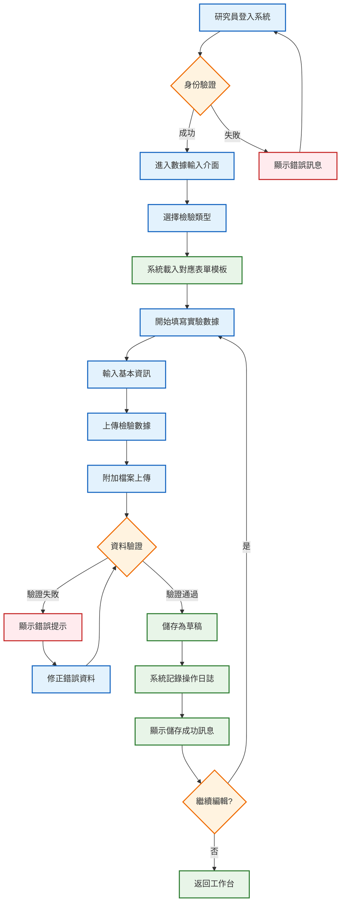

#### 2.1.2 異常路徑處理

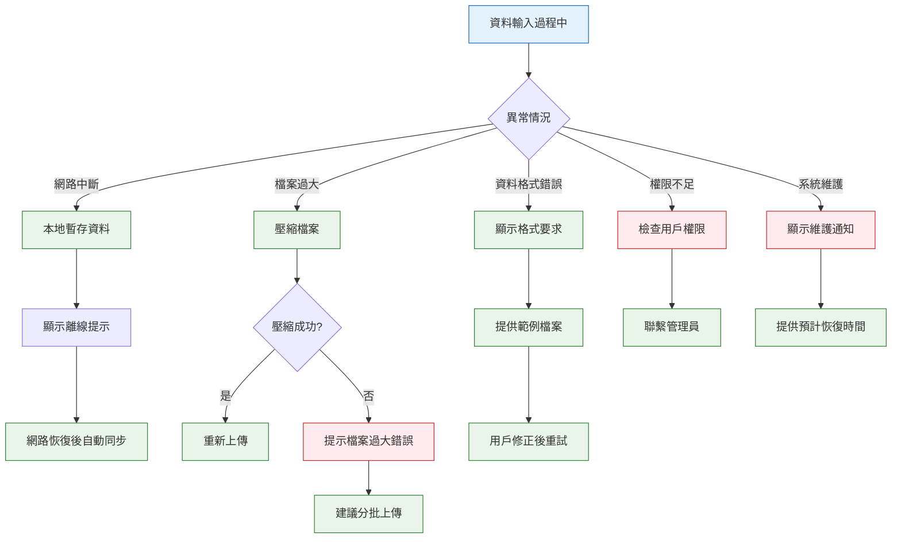

### 2.2 US-002: 研究員報告提交流程

#### 2.2.1 完整提交流程

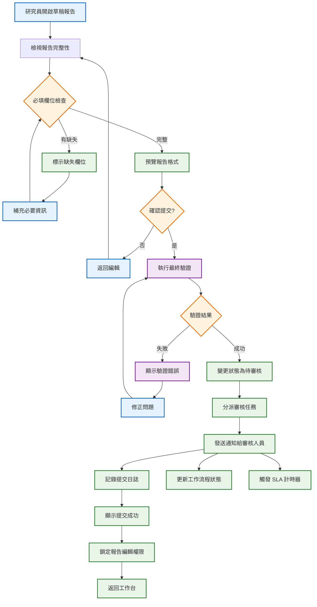

## 3. 審核人員核心流程

### 3.1 US-003: 審核人員審核報告流程

#### 3.1.1 審核主流程

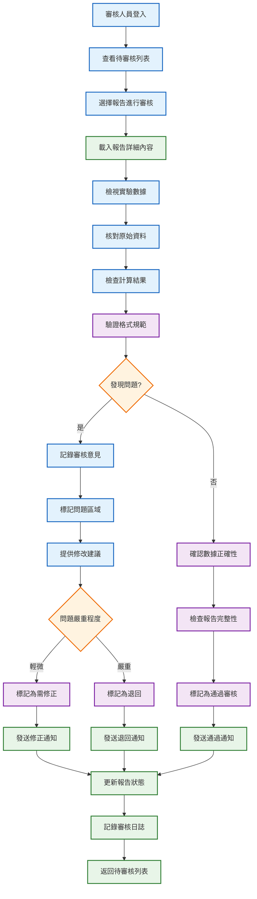

#### 3.1.2 審核決策分支流程

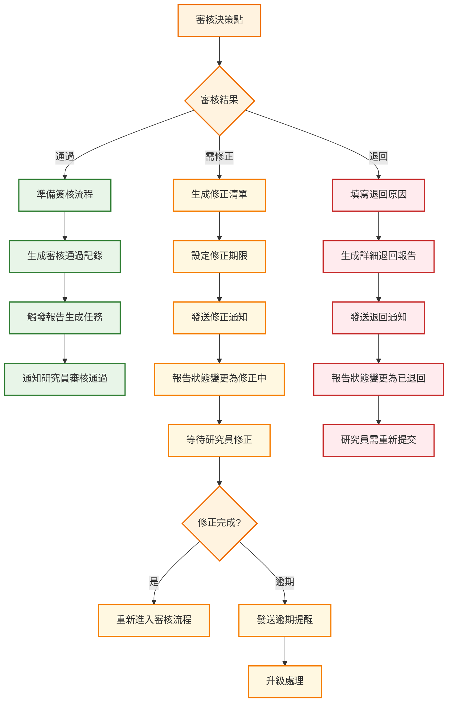

### 3.2 US-004: 審核人員簽核發送流程

#### 3.2.1 簽核發送主流程

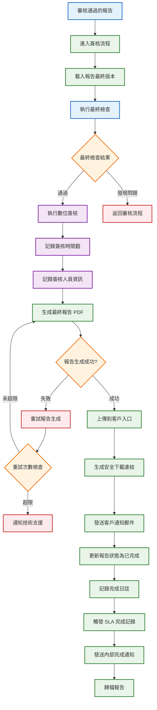

## 4. 客戶核心流程

### 4.1 US-005: 客戶報告接收流程

#### 4.1.1 客戶接收主流程

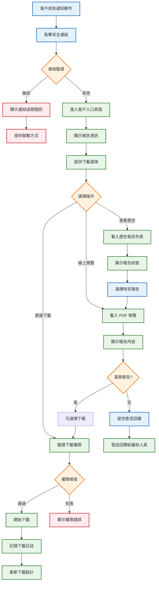

#### 4.1.2 客戶入口安全機制

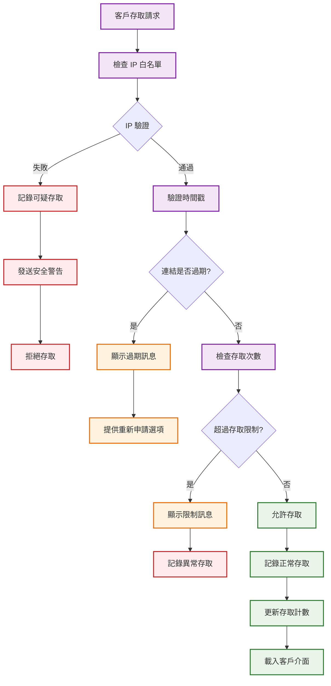

## 5. 跨角色整合流程

### 5.1 完整檢驗流程整合圖

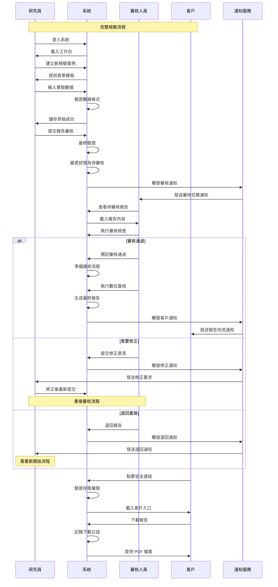

### 5.2 異常處理整合流程

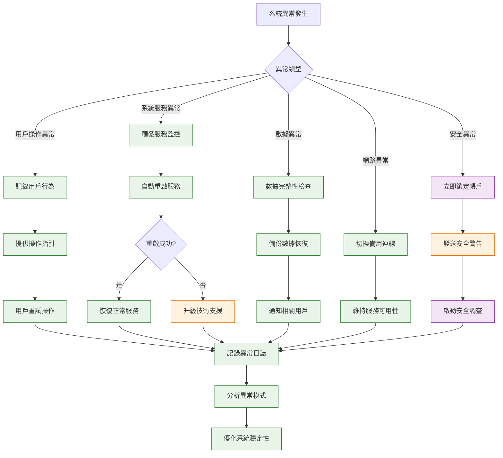

## 6. 邊界條件與特殊情況

### 6.1 系統負載邊界處理

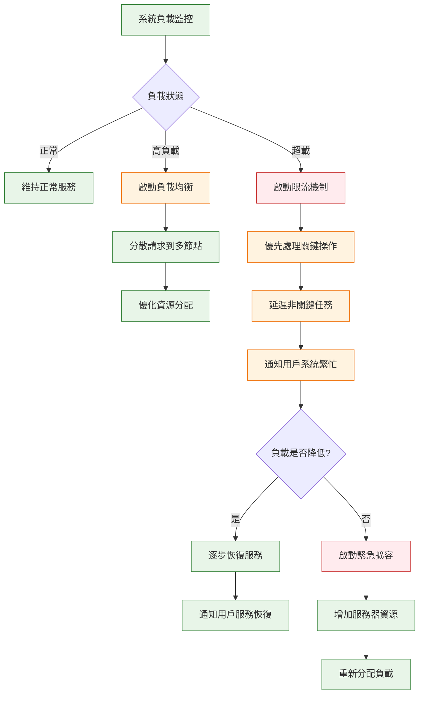

### 6.2 數據一致性保障

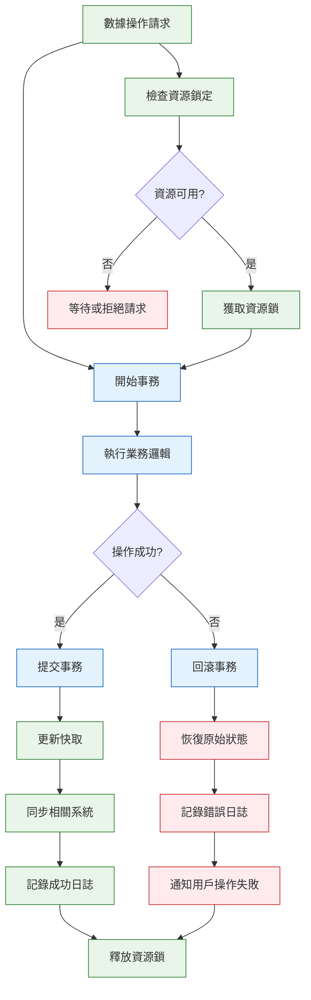

## 7. 效能與可用性考量

### 7.1 系統回應時間優化

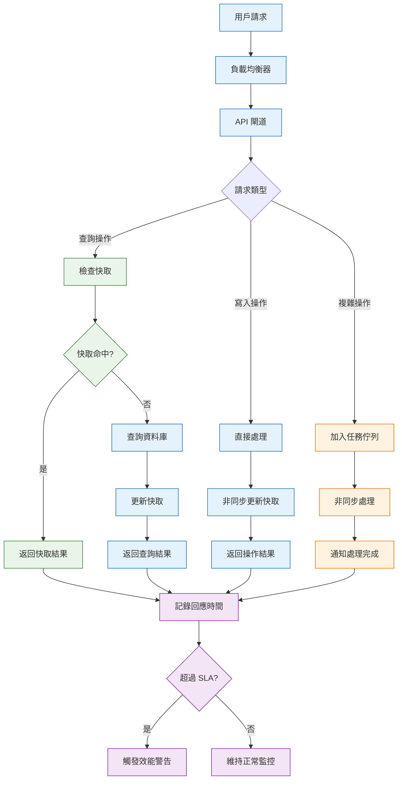

## 8. 總結

### 8.1 流程設計特點

1. **完整性**: 涵蓋所有核心用戶故事的詳細流程
2. **一致性**: 與系統架構設計保持一致
3. **健壯性**: 包含異常處理和邊界條件
4. **可追蹤性**: 每個步驟都有明確的日誌記錄
5. **用戶友好**: 考慮用戶體驗和操作便利性

### 8.2 關鍵設計決策

1. **狀態管理**: 使用明確的狀態轉換確保流程可控
2. **權限控制**: 在每個關鍵節點進行權限驗證
3. **通知機制**: 及時通知相關用戶流程進展
4. **錯誤處理**: 提供清晰的錯誤訊息和恢復路徑
5. **效能優化**: 使用快取和非同步處理提升用戶體驗

### 8.3 實施建議

1. **分階段實施**: 優先實現正常路徑，再完善異常處理
2. **用戶測試**: 與實際用戶進行流程驗證和優化
3. **監控機制**: 建立完整的流程監控和分析
4. **持續改進**: 基於用戶回饋持續優化流程設計

這些使用者流程設計為 Hwayo 檢驗管理系統的開發提供了詳細的指引，確保系統能夠滿足各類用戶的實際需求，同時保持高效、穩定的運行。