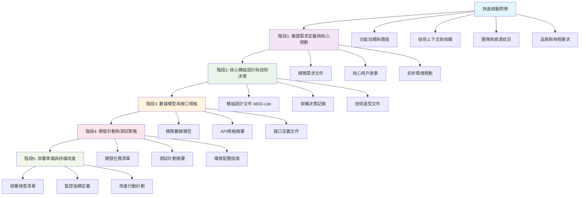
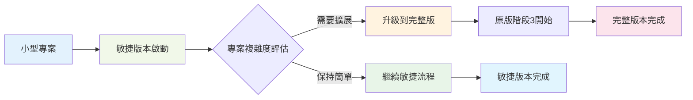

# 專案開發 DoD 指南 - 敏捷版本

## 概覽

本指南是針對小型專案和快速迭代開發的精簡版本，基於完整的 [`project_development_dod_guide_new.md`](project_development_dod_guide_new.md) 進行優化，融入了敏捷開發的核心理念，提供具體且可操作的指導原則。本指南旨在簡化複雜流程，同時保持必要的完整性，確保生成的規劃文件既實用又高效。

**適用範圍**：小型專案、單一功能模組、快速原型開發、MVP 驗證

**核心原則**：
- **快速啟動**：通過精簡的問卷快速定義專案範圍和目標
- **精簡流程**：將原版7階段合併為5個高效階段
- **多個精簡 SOT 文件**：保持關注點分離，但大幅簡化內容
- **無縫銜接**：可獨立使用，亦可作為完整版的起點，根據專案需求動態調整深度

## 快速啟動問卷

快速啟動問卷旨在替代原版複雜的市場分析階段，通過8-10個核心問題快速定義專案範圍和目標。以下為問卷內容：

1. **功能核心定義**：這個功能/模組的主要目標是什麼？它為誰解決什麼核心問題？
2. **價值與成功標準**：如何衡量這個功能是否成功？有哪些關鍵指標？
3. **技術上下文**：這個功能需要與哪些現有系統/服務/API進行交互？
4. **依賴與限制**：有哪些已知的技術依賴、時程限制或資源約束？
5. **用戶交互方式**：主要的用戶交互界面是什麼？（Web UI、API、CLI等）
6. **數據處理需求**：涉及哪些主要的數據類型和處理邏輯？
7. **品質要求**：對效能、安全性、可用性有什麼特殊要求？
8. **團隊與技能**：開發團隊的規模和技術棧偏好是什麼？
9. **部署環境**：預期的部署環境和基礎設施是什麼？
10. **後續擴展**：是否有已知的未來擴展需求需要在設計時考慮？

**問卷處理機制**：問卷回應將被整理為功能定義文件，作為後續階段的基礎輸入。

## 整體流程架構

## 5階段精簡流程

### 階段1：敏捷需求定義與核心規劃

**目標**：基於快速啟動問卷，快速建立清晰的功能定義和初步規劃。

**主要活動**：
- 處理問卷回應，生成功能定義文件
- 創建核心用戶故事和驗收標準
- 初步識別技術風險和依賴

**產出物**：
- `docs/agile/function_definition.md` (功能定義文件)
- `docs/agile/user_stories.md` (用戶故事集)
- `docs/required_development_documents.md` (開發文件清單)

**DoD 標準**：
- 功能定義文件已完成並經過初步審核
- 至少包含3-5個核心用戶故事及其驗收標準
- 已識別主要技術風險點並記錄

### 階段2：核心模組設計與技術決策

**目標**：設計核心模組架構並做出關鍵技術決策。

**主要活動**：
- 模組職責劃分和接口設計
- 關鍵技術選型和架構決策
- 識別核心依賴和風險點

**產出物**：
- `docs/agile/module_design_lite.md` (精簡模組設計)
- `docs/agile/tech_decisions.md` (技術決策記錄)
- `docs/agile/architecture_overview.md` (架構概覽)

**DoD 標準**：
- 模組設計文件已完成，包含主要模組的職責和接口定義
- 技術決策記錄至少包含2-3個關鍵決策及其理由
- 架構概覽圖已繪製並嵌入文件

### 階段3：數據模型與接口規格

**目標**：定義核心數據結構和關鍵接口規格。

**主要活動**：
- 設計核心數據模型
- 定義關鍵API接口
- 建立數據流和交互規格

**產出物**：
- `docs/agile/data_model_lite.md` (精簡數據模型)
- `docs/agile/api_spec_summary.md` (API規格摘要)
- `docs/agile/interface_definitions.md` (接口定義)

**DoD 標準**：
- 數據模型文件已完成，包含主要實體和關係
- API規格摘要至少包含3-5個核心端點的定義
- 接口定義文件已完成並與模組設計一致

### 階段4：開發計劃與測試策略

**目標**：制定具體的開發計劃和測試策略。

**主要活動**：
- 任務分解和優先級排序
- 測試策略和驗收標準定義
- 環境配置和工具鏈準備

**產出物**：
- `docs/agile/development_tasks.md` (開發任務清單)
- `docs/agile/test_strategy_lite.md` (精簡測試策略)
- `docs/agile/env_config_guide.md` (環境配置指南)

**DoD 標準**：
- 開發任務清單已完成，包含至少5-10個具體任務及其優先級
- 測試策略已定義，包含單元測試和集成測試的基本要求
- 環境配置指南已完成並可操作

### 階段5：部署準備與持續改進

**目標**：準備部署並建立持續改進機制。

**主要活動**：
- 部署流程和檢查清單
- 監控指標和告警設置
- 回顧和改進計劃

**產出物**：
- `docs/agile/deployment_checklist.md` (部署檢查清單)
- `docs/agile/monitoring_metrics.md` (監控指標)
- `docs/agile/improvement_plan.md` (改進行動計劃)

**DoD 標準**：
- 部署檢查清單已完成，包含至少5個關鍵檢查項
- 監控指標已定義，至少包含2-3個核心指標
- 改進行動計劃已制定，包含初步回顧結果和改進建議

## 與原版無縫銜接機制

本敏捷版本設計為與完整版 DoD 指南無縫銜接，可根據專案複雜度動態調整深度：

**銜接流程**：
1. **初始評估**：在階段1完成後，根據專案規模和複雜度決定是否繼續使用敏捷版本
2. **動態升級**：若專案需求增長，可從階段2或3開始切換到完整版流程
3. **文件映射**：敏捷版本產出物可直接映射到完整版對應階段，無需重做

## 核心優勢與改進點

**相較於原版的優勢**：
1. **啟動速度**：從複雜的市場分析縮短到10分鐘問卷
2. **文件精簡**：SOT文件數量減少60%，內容聚焦核心
3. **決策效率**：關鍵決策點從21個減少到12個
4. **實施靈活**：可根據專案需要動態調整深度
5. **學習曲線**：新團隊成員可在1小時內掌握流程

**保持的核心價值**：
- SOT導向的資訊管理
- 迭代驗證和持續改進
- 環境意識和部署考量
- 團隊協作和知識沉澱

## 使用指南與範例

**使用步驟**：
1. **啟動問卷**：團隊成員或產品負責人完成快速啟動問卷
2. **階段執行**：按照5階段流程逐步執行，產出對應文件
3. **迭代反饋**：在每個階段結束時進行簡短回顧，調整後續計劃
4. **動態調整**：根據專案進展決定是否升級到完整版流程

**範例場景**：一個小型Web應用功能開發
- 階段1：完成問卷，定義功能目標為“用戶登錄模組”，成功標準為“支持email登錄，響應時間<2秒”
- 階段2：設計登錄模組，選擇JWT作為認證機制
- 階段3：定義用戶數據模型和登錄API端點
- 階段4：分解開發任務，制定單元測試計劃
- 階段5：準備Docker部署配置，定義登錄成功率監控指標

本指南將隨著專案實踐持續更新，確保其適用性和實用性。