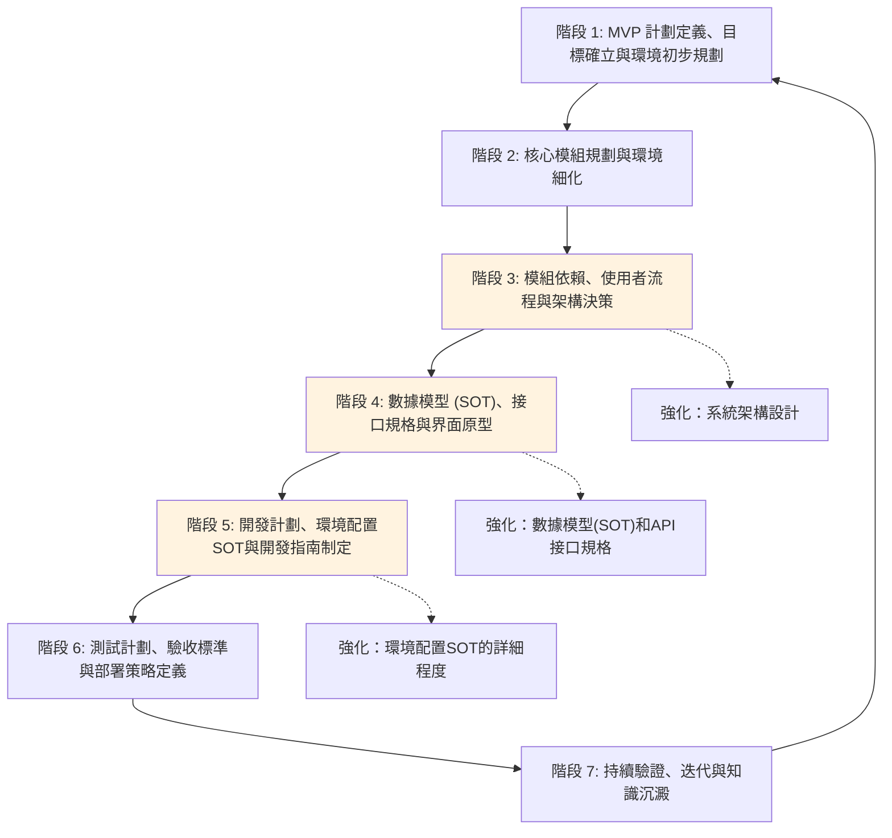

# Agent 協作開發計劃框架 Definition of Done (DoD) 指南 - 後端專項版

## 引言

### 文件目的
本文檔是基於 [`project_development_dod_guide_new.md`](project_development_dod_guide_new.md:1) 針對後端專案特性調整的專項版本，旨在為與 AI Agent 協作進行後端軟體開發時，提供一個用於建立完整開發計劃的標準化流程、步驟及各階段完成標準 (Definition of Done, DoD)。本指南特別強化了系統架構、數據一致性、接口可靠性等後端開發的核心關注點。

### 適用範圍
本指南適用於所有需要 AI Agent 深度參與規劃、設計與開發的後端軟體專案，包括但不限於：
- RESTful API 服務
- GraphQL API 服務
- 微服務架構系統
- 單體後端應用
- 數據處理服務
- 中間件和基礎設施服務

### 核心原則
- **MVP 優先 (MVP First):** 強調快速迭代，優先交付核心業務價值，並儘早驗證系統架構假設。
- **SOT 導向 (Source of Truth Oriented):** 對關鍵資訊（如數據模型、API規格、環境配置、核心架構決策）建立並維護唯一的真實來源文檔，所有其他文檔在引用時必須保持一致。
- **系統穩定性優先 (System Stability First):** 所有設計和開發決策都以確保系統穩定性為核心考量。
- **數據一致性保障 (Data Consistency Assurance):** 建立並維護嚴格的數據一致性和完整性機制。
- **接口可靠性驅動 (API Reliability Driven):** 確保所有接口的穩定性、可靠性和向後兼容性。
- **迭代驗證 (Iterative Validation):** 在流程的關鍵節點，利用自動化測試、性能監控、系統日誌分析等方式對架構和功能進行驗證。
- **持續文件化 (Continuous Documentation):** 隨專案進展持續更新和完善相關文件，確保文件是最新且準確的。
- **環境意識 (Environment Awareness):** 在規劃、設計、開發和測試的各個環節，充分考慮不同環境（開發、測試、預生產、生產）的差異和特定需求。
- **彈性互動與記錄 (Flexible Interaction & Logging):** 在遵循本指南與 AI Agent 互動時，使用者可對非強制性的規劃問題選擇「跳過」。AI Agent 應記錄所有被跳過的問題及其上下文，並將其彙總列入相關規劃文件的「待辦事項」或「待討論事項」部分，以供後續追蹤。

## 整體流程概覽

---

## 階段 1：MVP 計劃定義、目標確立與環境初步規劃

### 目標 (Objective)
-   快速定義專案的最小可行產品 (MVP)，明確其核心業務價值、目標用戶群、業務目標及可衡量的成功指標。
-   避免在專案初期過度設計和範圍擴張，有效限縮初期部署、開發工作量及所需文件數量。
-   確立專案的整體業務需求和市場目標，產出側重後端業務邏輯的市場需求文件 (MRD)。
-   初步識別後端專案所需的服務器環境、數據庫選型、中間件需求，並規劃環境定義文件的基本框架。

### 關鍵活動 (Key Activities)
1.  **需求訪談與分析 - 後端業務邏輯聚焦:**
    *   與使用者及各利益關係人進行深入訪談，全面收集原始需求、期望及痛點，特別關注核心業務邏輯、數據處理需求、系統集成需求。
    *   (AI 協作要點：Agent 可輔助記錄訪談內容，初步整理需求點，並根據需求生成初步的業務流程框架，特別關注後端數據處理和業務規則。)
2.  **MVP 範圍定義 - 後端核心功能聚焦:**
    *   共同討論並篩選核心功能，定義 MVP 的明確邊界，重點關注核心業務邏輯和數據處理功能。
    *   識別出哪些功能對於驗證核心業務價值主張至關重要。
    *   (AI 協作要點：Agent 可根據需求列表和業務目標，輔助進行功能優先級排序的建議，並草擬 MVP 功能列表，特別關注後端核心業務邏輯的價值。)

    *   **斷點問題建議：**
        1.  **問題：** 針對本次後端 MVP，是否有任何**絕對不能妥協的核心業務邏輯或數據處理功能**，即使這可能會增加初步的規劃或開發複雜性？
            *   **目的：** 確保 MVP 真正抓住了不可或缺的業務核心價值。
            *   **AI 應對：** 若有，AI 需在後續模組規劃和功能設計中優先保障這些功能。
        2.  **問題：** MVP 完成後，對於**下一個迭代 (例如 Phase 1) 的主要系統擴展和大致功能範圍**，您是否有初步的想法？
            *   **目的：** 幫助 AI 在設計 MVP 架構時，適度考慮近期的擴展性需求。
            *   **AI 應對：** AI 記錄此信息，並在架構設計和模組劃分時納入考量。
3.  **目標用戶與業務流程:**
    *   清晰描繪 MVP 的目標用戶畫像，特別關注其業務需求、數據量級、併發需求。
    *   撰寫 MVP 範圍內的核心業務流程，確保其符合業務邏輯完整性原則。
4.  **成功標準確立 - 後端指標聚焦:**
    *   定義衡量 MVP 是否成功的關鍵績效指標 (KPIs) 和具體的可衡量指標，包括系統性能相關指標（如 TPS/QPS、響應時間、系統可用性、錯誤率等）。
5.  **市場需求分析 (MRD) - 後端業務邏輯側重:**
    *   研究市場趨勢、競爭對手的後端解決方案。
    *   明確產品的市場定位、目標受眾、核心價值主張、潛在風險及初步的商業模式。
    *   **內容側重：**
        *   核心業務邏輯的詳細描述
        *   系統需要處理的主要數據類型、預期數據量級和增長趨勢
        *   預期的系統吞吐量（例如，QPS/TPS）、併發用戶數等性能指標的初步估計
        *   與現有內部系統或第三方外部服務的集成需求和接口方式
    *   (AI 協作要點：Agent 可輔助進行市場資料搜集、競品後端架構分析報告的初步整理。)
6.  **MVP 定義 - 後端 API 端點體現:**
    *   **MVP 核心功能列表應主要體現為：**
        *   關鍵的對外API端點及其核心職責
        *   核心的數據處理流程和業務規則
        *   必須在MVP階段實現的關鍵非功能性需求，例如基本的安全性保障（如認證授權）、數據庫事務一致性要求、關鍵操作的響應時間目標等
7.  **環境初步規劃 - 後端基礎設施聚焦:**
    *   討論並初步確定後端專案所需的基礎設施環境。
    *   **應更早地明確和記錄以下考量：**
        *   服務器操作系統的選型偏好或限制
        *   數據庫類型（如SQL vs NoSQL，具體產品如MySQL, PostgreSQL, MongoDB等）的初步選型及其理由
        *   可能需要的核心中間件（如消息隊列服務Kafka/RabbitMQ，緩存服務Redis/Memcached）的初步需求
        *   對特定雲服務提供商（AWS, Azure, GCP）的服務依賴性，或對公司內部私有基礎設施的要求
    *   為後續創建詳細環境定義文件打下基礎。

    *   **斷點問題建議：**
        1.  **問題：** 本後端專案在基礎設施選型上，是否有任何已知的**對特定雲服務商（如 AWS, Azure, GCP）、數據庫系統、或公司內部私有基礎設施的強依賴性或偏好**？
            *   **目的：** 及早確定基礎設施基礎，避免後續規劃與實際部署環境衝突。
            *   **AI 應對：** AI 將此信息作為後續環境細化和架構設計的重要輸入。
        2.  **問題：** 對於系統的**非功能性需求**，是否有初步的量化指標或期望？請特別針對以下您最關注的面向提供具體指標：
            *   **性能指標** (例如：預期 TPS/QPS、API 響應時間要求、數據庫查詢性能要求)
            *   **可靠性指標** (例如：系統可用性目標如 99.9%、故障恢復時間、數據備份頻率)
            *   **安全性指標** (例如：認證授權要求、數據加密標準、審計日誌要求)
            *   **可擴展性指標** (例如：預期用戶增長、數據增長速度、系統負載增長預期)
            *   **目的：** 非功能性需求將直接影響後端架構設計、技術選型、基礎設施規劃以及後續的驗證標準。
            *   **AI 應對：** AI 將這些具體指標作為架構設計、技術選型建議、資源估算以及後續性能測試計劃和驗收標準的關鍵輸入。

### 主要產出物 (Key Deliverables)
-   `docs/project_mrd.md` (市場需求文件 - 後端業務邏輯側重)
    *   內容應包含：市場分析、目標用戶、產品定位、核心價值、競爭分析、業務目標、成功指標、潛在風險，特別側重核心業務邏輯、數據類型、性能指標、系統集成需求。
-   `docs/mvp_definition.md` (MVP 定義文件 - 後端 API 端點體現)
    *   內容應包含：MVP 範圍、核心功能列表（以 API 端點和數據處理流程體現）、目標用戶畫像、核心業務流程、MVP 成功標準。
-   `docs/mvp_vs_full_scope_diff.md` (MVP 與完整範圍差異定義文件)
    *   內容應清晰列出 MVP 未包含但在未來規劃中的重要功能、延遲原因以及預計納入的階段。
-   `docs/env/preliminary_environment_overview.md` (初步環境概述文件 - 後端基礎設施聚焦)
    *   簡要描述預計需要的服務器環境、數據庫選型、中間件需求及其主要用途。
-   [`docs/required_development_documents.md`](docs/required_development_documents.md:1) (開發所需文件清單) - 初始空檔案

### DoD 標準 (Definition of Done)
-   後端業務邏輯側重的 MRD 文件已完成撰寫，明確了業務目標和市場定位，並獲得主要利益關係人的審閱與初步確認。
-   MVP 定義文件已明確 MVP 的核心功能（以 API 端點和數據處理流程體現）、業務流程和可衡量的成功標準。
-   MVP 與完整範圍差異文件已清晰記錄，並解釋了延遲功能的理由。
-   初步的後端基礎設施環境和用途已討論並記錄。
-   初始的空「開發所需文件清單」([`docs/required_development_documents.md`](docs/required_development_documents.md:1)) 已創建。
-   所有產出物已按照專案文件管理規範存檔，並在 [`code_index.md`](code_index.md:1) 中正確索引。
-   本階段的關鍵決策（如 MVP 範圍確認、核心業務目標、後端基礎設施偏好）已記錄於 [`memory-bank/decisionLog.md`](memory-bank/decisionLog.md:1)。
-   任務狀態已在 [`cline_todo.md`](cline_todo.md:1) 中更新。

---

## 階段 2：核心模組規劃與環境細化

### 目標 (Objective)
-   基於已確定的 MVP 計劃，識別並定義後端專案所需的核心服務模組及其職責。
-   為每個核心模組創建初步的規劃與設計文件 (MDD - Module Design Document 的初稿)，重點關注業務領域邊界和服務架構。
-   細化後端各環境的具體需求和用途，為創建詳細環境定義文件做準備。

### 關鍵活動 (Key Activities)
1.  **模組識別與劃分 - 後端服務聚焦:**
    *   根據 MVP 的功能需求和業務流程，進行後端系統功能的初步模組劃分。
    *   **核心模組的劃分應主要基於：**
        *   清晰的業務領域邊界
        *   服務導向架構 (SOA) 或微服務架構中的服務邊界
        *   關鍵的技術組件或共享服務（例如：統一認證授權模組、數據訪問與持久化層、異步任務調度模組、日誌與監控組件）
    *   (AI 協作要點：Agent 可輔助分析功能列表，基於後端常見設計模式提出模組劃分的建議方案。)

    *   **斷點問題建議：**
        1.  **問題：** 在我們初步識別的後端核心模組之外，是否有任何**公司內部已有的、成熟的後端服務或中間件**（例如：統一認證服務、消息隊列、現有數據庫服務、監控系統等）是本專案可以或應該優先考慮複用的？
            *   **目的：** 最大化資源利用，減少重複開發，加速交付。
            *   **AI 應對：** 若有，AI 將研究這些既有服務的接口和整合方式，並在後續模組設計和架構決策中納入。
        2.  **問題：** 關於本次後端 MVP 的架構風格，您是傾向於**微服務架構**、**模組化單體架構**、**雲端原生架構 (例如基於特定雲服務商的 PaaS/FaaS)**、還是 **Serverless 架構**？或者，您是否考慮採用這些風格的**混合組合**？請說明您的主要考量。
            *   **目的：** 了解使用者對架構風格的偏好，這將影響接口設計、部署策略、技術選型和團隊協作方式。
            *   **AI 應對：** AI 根據使用者的選擇和考量，調整後續的系統架構圖、模組依賴分析、接口定義的詳細程度，並在技術選型建議中反映這些偏好。
2.  **模組職責定義 - 後端業務邏輯聚焦:**
    *   為每個識別出的核心後端模組明確其主要職責、核心功能點、輸入、輸出和關鍵接口草案。
    *   **初步的模組設計文件 (MDD) 應至少包含：**
        *   模組的核心職責和業務目標
        *   模組對外暴露的主要接口（API端點）草案及其請求/響應數據結構的初步設想
        *   模組所依賴的核心數據實體或數據表
        *   初步的技術選型，包括主要編程語言（如Java, Python, Go, Node.js）、核心框架（如Spring Boot, Django, Express.js）等
3.  **MDD 初稿撰寫:**
    *   為每個核心後端模組創建初步的模組設計文件 (MDD)。
    *   MDD 初稿應至少包含：模組目標、主要功能列表、核心職責、初步的輸入/輸出定義、初步技術考量、以及與其他模組的潛在交互點。
    *   (AI 協作要點：Agent 可根據模組職責和功能點，輔助生成 MDD 文件的基本框架和內容草稿。)
4.  **環境需求細化 - 後端基礎設施聚焦:**
    *   針對已識別的環境類型（開發、測試、預生產、生產），進一步討論其具體用途、所需資源（硬件、軟件、數據）、以及大致的配置方向。
    *   **需要更詳細地描述各個環境的以下方面：**
        *   初步的網絡拓撲結構，包括負載均衡器、防火牆、VPC/子網劃分等（如適用）
        *   各核心服務或模組的服務器資源需求估算（CPU核心數、內存大小、磁盤空間）
        *   數據庫服務的詳細配置方向（如集群模式、主從複製、讀寫分離等）
        *   日誌收集、存儲與分析方案的初步設想（如ELK Stack, Splunk）
        *   系統監控與告警機制的初步規劃（如Prometheus, Grafana）
    *   考慮各環境之間數據同步、版本控制的初步策略。

    *   **斷點問題建議：**
        1.  **問題：** 除了標準的開發、測試、生產環境外，根據後端專案的特性（例如：是否涉及大量數據處理、高併發場景、或需要客戶深度參與驗收），是否需要額外規劃如**UAT (使用者驗收測試) 環境、效能測試專用環境、或災備演練環境**？
            *   **目的：** 確保所有必要的測試和驗證活動都有合適的環境支持。
            *   **AI 應對：** 若需要，AI 將在後續的環境配置SOT定義和測試計劃中加入這些特殊環境的規劃。
        2.  **問題：** 對於各環境中的**數據管理**（例如：測試數據的生成與維護、生產數據到測試環境的脫敏與同步、環境數據的備份與恢復策略），是否有特殊的公司政策、合規性要求（如 GDPR）或安全規定需要遵守？
            *   **目的：** 確保數據管理策略符合規範，並保障數據安全。
            *   **AI 應對：** AI 將這些要求記錄下來，並在數據模型設計、環境配置以及測試計劃中予以體現。

### 主要產出物 (Key Deliverables)
-   [`docs/mvp/mvp_service_framework.md`](docs/mvp/mvp_service_framework.md) (或類似的 MVP 總體技術框架文件) 中更新或包含核心後端模組列表、各模組高層次職責描述，基於業務領域邊界、服務架構、技術組件劃分。
-   `docs/mod/[module_name]_mdd.md` (為每個核心後端模組創建的初步模組設計文件)
    *   內容應包含：模組目標、主要功能概述、核心職責、初步的輸入/輸出定義、初步技術考量、API端點草案、依賴的數據實體、[MVP] 或 [完整階段] 標記。
-   (更新) `docs/env/preliminary_environment_overview.md` 或開始草擬獨立的後端環境定義文件框架。
    *   記錄各後端環境的細化需求和用途，包括網絡拓撲、資源需求、數據庫配置、日誌監控等。
-   [`docs/required_development_documents.md`](docs/required_development_documents.md:1) (開發所需文件清單) - 更新版

### DoD 標準 (Definition of Done)
-   MVP 核心後端模組列表及其高層次職責已在總體技術框架文件中明確記錄。
-   每個核心後端模組均已創建初步的 MDD 文件，並明確其主要職責、核心功能、初步接口思考和初步技術考量。
-   各後端環境的具體需求和用途已得到初步細化並記錄。
-   AI Agent 已與使用者討論並確認本階段衍生的、下一開發階段所需的技術文件，並將其包含預期內容摘要/目的，記錄/更新至 [`docs/required_development_documents.md`](docs/required_development_documents.md:1)。
-   所有產出物已按照專案文件管理規範存檔，並在 [`code_index.md`](code_index.md:1) 中正確索引。
-   相關決策（如後端模組劃分確認、環境需求初步確認）已記錄於 [`memory-bank/decisionLog.md`](memory-bank/decisionLog.md:1)。
-   任務狀態已在 [`cline_todo.md`](cline_todo.md:1) 中更新。

---

## 階段 3：模組依賴、使用者流程與架構決策

### 目標 (Objective)
-   清晰定義 MVP 階段核心後端模組之間的依賴關係和交互方式。
-   定義 MVP 核心功能對應的關鍵系統級交互流程和業務事務處理流程。
-   確立關鍵的後端架構設計原則和技術選型決策，特別強化系統架構設計，並記錄其理由。

### 關鍵活動 (Key Activities)
1.  **模組交互分析與接口定義:**
    *   分析各核心後端模組之間為完成 MVP 功能所必需的數據流和控制流。
    *   初步定義關鍵的模組間 API 接口（請求、響應、協議）。
    *   (AI 協作要點：Agent 可輔助分析模組職責，生成初步的 API 接口定義草案。)
2.  **繪製模組依賴圖與架構圖:**
    *   使用圖表（如 Mermaid `graph` 或 `C4 Model` 的上下文圖/容器圖）清晰展示核心後端模組之間的依賴關係及整體系統架構。
    *   (AI 協作要點：Agent 可根據模組交互分析結果，輔助生成圖表的 Mermaid 原始碼。)
3.  **使用者流程細化 - 精簡為系統級流程:**
    *   **對於後端規劃，此部分應簡化為描述系統級的交互流程或關鍵業務事務的處理流程。**
    *   重點應放在數據如何在不同的後端模組、服務或數據存儲之間流動，以及流程中的關鍵業務決策點和處理邏輯。
    *   可以省略或大幅簡化與使用者界面直接相關的詳細交互步驟和界面狀態描述。
    *   確保流程覆蓋正常路徑、主要異常路徑和邊界條件。
    *   (AI 協作要點：Agent 可輔助將業務流程轉化為詳細的系統處理步驟，並生成流程圖的 Mermaid 原始碼，或輔助識別流程中的潛在瓶頸或缺失環節。)
4.  **關鍵架構決策 - 系統架構強化:**
    *   討論並確定關鍵的技術選型（如主要編程語言、框架、數據庫類型）。
    *   確立核心的架構模式（如分層架構、微服務架構的初步考量）。
    *   **此部分需要更全面和深入地描述後端系統的整體架構，應強化以下方面：**
        *   **部署架構**: 詳細說明服務器的物理或虛擬分佈、負載均衡策略、高可用性 (HA) 設計、以及災難恢復 (DR) 和備份方案
        *   **數據架構**: 闡述數據庫的邏輯與物理分佈策略（如分庫分表）、數據同步與一致性機制（如最終一致性、強一致性選擇）、以及與數據倉庫或數據湖的集成方案（如適用）
        *   **組件交互模式**: 明確核心組件或服務之間的通信方式（如同步RESTful API調用、異步消息隊列、事件驅動模式）及其適用場景
        *   **安全性架構**: 詳細定義認證機制（如OAuth2, JWT）、授權模型（如RBAC, ABAC）、數據傳輸與存儲的加密標準、以及網絡安全防護措施（如WAF, IDS/IPS）
        *   **非功能性需求支持**: 具體闡述架構如何支持關鍵的非功能性需求，如性能目標（TPS/QPS, 延遲）、系統可擴展性（水平/垂直擴展策略）、可靠性（故障轉移、降級策略）和可維護性（模塊化、日誌監控）
    *   記錄這些決策及其背後的理由、優缺點分析和潛在風險。
    *   (AI 協作要點：Agent 可提供不同技術選項的比較信息，輔助決策分析。)

    *   **斷點問題建議：**
        1.  **問題：** 在後端技術選型方面（如主要程式語言、後端框架、資料庫類型、中間件選擇），是否有任何**團隊既有的技術棧偏好、過往專案的成功經驗、或公司層面的技術標準**需要優先遵循？
            *   **目的：** 確保技術選型與團隊能力和公司策略相符，降低學習成本和整合風險。
            *   **AI 應對：** AI 將基於這些偏好和標準，在可能的選項中進行推薦和分析。
        2.  **問題：** 對於後端系統的**非功能性需求**，是否有初步的量化指標或期望？請特別針對以下一個或多個您最關注的面向提供具體指標：
            *   **效能指標** (例如：目標 TPS/QPS、API 平均/最大響應時間、數據庫查詢性能要求)
            *   **可靠性指標** (例如：系統可用性目標如 99.9%、故障恢復時間 RTO、數據恢復點 RPO)
            *   **安全性指標** (例如：認證授權要求、數據加密標準、審計日誌完整性、漏洞掃描頻率)
            *   **可擴展性指標** (例如：預期負載增長、水平擴展能力、資源利用率目標)
            *   **目的：** 非功能性需求將直接影響後端架構設計、技術選型、基礎設施規劃以及後續的驗證標準。
            *   **AI 應對：** AI 將這些具體指標作為架構設計、技術選型建議、資源估算以及後續效能測試計劃和驗收標準的關鍵輸入。
        3.  **問題：** 後端系統是否需要支持**多租戶 (Multi-tenancy)** 架構，即一套系統服務多個獨立的客戶群體，且數據互相隔離？
            *   **目的：** 多租戶架構對數據模型、權限控制、資源隔離等方面有特殊要求。
            *   **AI 應對：** 若需要，AI 將在數據模型設計、用戶管理模組和整體架構中重點考慮多租戶的實現。
5.  **審閱與確認:**
    *   與團隊成員共同審閱後端模組依賴圖、架構圖、系統流程圖和架構決策，確保其準確性、完整性和可行性。

### 主要產出物 (Key Deliverables)
-   `docs/architecture/system_architecture.md` (後端系統架構文件 - 強化版)
    *   包含高層次的後端系統架構圖、模組依賴關係圖 (Mermaid)，並對核心組件、模組交互方式、關鍵技術選型及其理由進行文字說明。
    *   記錄重要的後端架構決策和設計原則。
    *   **強化內容：** 詳細的部署架構、數據架構、組件交互模式、安全性架構、非功能性需求支持。
-   `docs/user_flows/core_system_flows.md` (核心系統流程文件 - 精簡為系統級)
    *   包含針對 MVP 核心功能的系統級交互流程圖或業務事務處理流程圖 (Mermaid `flowchart` 或 `sequenceDiagram`)，並配有必要的文字說明，覆蓋主要處理路徑和關鍵異常路徑。
-   (更新) 各後端模組 MDD (`docs/mod/[module_name]_mdd.md`)
    *   根據本階段的分析，更新模組的接口定義和依賴關係描述。
-   [`docs/required_development_documents.md`](docs/required_development_documents.md:1) (開發所需文件清單) - 更新版

### DoD 標準 (Definition of Done)
-   後端系統整體架構和核心模組之間的依賴關係已清晰定義、圖示化，並獲得團隊確認。
-   MVP 的核心系統流程已詳細記錄、圖示化（包含主要異常路徑），並獲得團隊確認。
-   關鍵的後端技術選型和架構決策已做出並記錄了充分的理由。
-   系統架構文件已強化，包含詳細的部署架構、數據架構、組件交互模式、安全性架構、非功能性需求支持。
-   各後端模組 MDD 中的接口和依賴關係已更新。
-   AI Agent 已與使用者討論並確認本階段衍生的、下一開發階段所需的技術文件，並將其包含預期內容摘要/目的，記錄/更新至 [`docs/required_development_documents.md`](docs/required_development_documents.md:1)。
-   所有產出物已按照專案文件管理規範存檔，並在 [`code_index.md`](code_index.md:1) 中正確索引。
-   關鍵後端架構決策已記錄於 [`memory-bank/decisionLog.md`](memory-bank/decisionLog.md:1)。
-   任務狀態已在 [`cline_todo.md`](cline_todo.md:1) 中更新。

---

## 階段 4：數據模型 (SOT)、接口規格與界面原型

### 目標 (Objective)
-   定義後端專案的整體數據模型和核心數據結構，並確立其為唯一真實來源 (SOT)，特別強化數據模型的設計。
-   詳細定義後端模組間及對外暴露的 API 接口規格，特別強化 API 接口規格的定義。
-   對於後端專案，界面原型可以大幅精簡或省略。

### 關鍵活動 (Key Activities)
1.  **詳細數據模型設計 (SOT確立) - 強化版:**
    *   基於後端模組功能需求和系統流程，設計數據庫的詳細實體、屬性（含數據類型、約束）、關係（主外鍵、基數）及索引策略。
    *   使用 ERD (Entity Relationship Diagram) 和/或 Class Diagram 清晰展示數據模型。
    *   明確指定一份文件 (例如 [`docs/master_data_model.md`](docs/master_data_model.md:1)) 作為數據庫 Schema 和核心數據結構的唯一真實來源 (SOT)。所有其他相關文件在引用數據結構時，都必須指向此 SOT 文件。
    *   **除了包含詳細的實體關係圖 (ERD)、數據庫表結構、字段類型、約束條件和索引策略外，還應強化以下內容：**
        *   **數據生命周期管理**: 明確核心數據的創建、讀取、更新、刪除 (CRUD) 規則，以及數據歸檔和清理策略
        *   **詳細數據字典**: 為每個表和關鍵字段提供清晰的業務含義解釋、數據來源、枚舉值的完整定義及其業務對應關係
        *   （可選）數據質量規則和數據驗證邏輯的描述
    *   (AI 協作要點：Agent 可根據功能描述和流程圖，輔助識別核心實體、屬性及關係，生成 ERD/Class Diagram 的 Mermaid 原始碼，並草擬數據字典。)

    *   **斷點問題建議：**
        1.  **問題：** 本後端專案的數據模型是否需要考慮從**現有舊系統進行歷史數據的遷移**，或者需要與**舊系統的數據保持一定程度的兼容性或同步**？
            *   **目的：** 及早識別數據遷移或兼容的複雜性，避免影響新系統上線。
            *   **AI 應對：** 若需要，AI 將在數據模型設計中考慮兼容性字段或設計數據遷移方案，並在開發計劃中預留相應任務。
        2.  **問題：** 關於數據的**隱私保護和合規性要求**（例如：GDPR, CCPA, HIPAA，或行業特定法規），是否有需要在數據模型設計階段就特別標識敏感數據、設計加密方案或考慮數據匿名化/假名化處理的？
            *   **目的：** 確保數據模型從設計之初就符合法規要求。
            *   **AI 應對：** AI 將在數據模型中標註敏感字段，並在相關模組設計（如用戶管理、日誌記錄）中考慮合規性措施。
        3.  **問題：** 是否有任何已知的**第三方系統或外部服務**（例如：支付網關、物流 API、CRM 系統）需要與本專案的數據模型進行深度整合或頻繁的數據交換？其數據格式和接口標準是怎樣的？
            *   **目的：** 確保數據模型能夠支持與關鍵第三方系統的順暢對接。
            *   **AI 應對：** AI 將分析第三方系統的數據需求，並在數據模型和接口設計中預留擴展點或適配層。
2.  **API 接口規格定義 (SOT確立) - 強化版:**
    *   為所有核心後端模組間交互的內部 API 以及需要對外暴露的公開 API，定義詳細的接口規格。
    *   規格應包含：請求/響應格式 (JSON)、HTTP 方法、URL 路徑、請求參數、響應數據結構、錯誤碼、認證授權機制。
    *   使用 OpenAPI (Swagger) 規範或其他標準格式編寫 API 文檔，並確立其為 API 規格的 SOT。
    *   **基於OpenAPI (Swagger) 標準，除了定義請求/響應格式、HTTP方法、URL路徑、請求參數、響應數據結構和錯誤碼外，還應更強調和詳細說明以下方面：**
        *   **冪等性 (Idempotency)**: 對於可能產生副作用的寫操作接口（POST, PUT, DELETE），明確其冪等性設計和實現方式
        *   **版本控制 (Versioning)**: 清晰的API版本管理策略（如URL路徑版本、Header版本、Accept Header版本）及其演進規則
        *   **速率限制 (Rate Limiting)**: 說明API的調用頻率限制策略，以及超出限制時的響應機制
        *   **事務處理邊界**: 對於涉及多個資源操作或需要保證原子性的業務場景，明確API接口的事務處理邊界和一致性保障機制
        *   **認證與授權**: 詳細說明API接口所採用的認證機制（如Token類型、獲取方式、有效期）和授權要求（如所需權限、Scope）
        *   （可選）每個接口的預期性能指標（如平均響應時間、最大併發數）
    *   (AI 協作要點：Agent 可根據後端模組 MDD 中的初步接口定義，輔助生成符合 OpenAPI 規範的 API 文檔草稿。)

    *   **斷點問題建議：**
        1.  **問題：** 本後端專案的 API 主要的消費者是**系統內部的前端應用和模組間調用**，還是預期會有**外部的第三方開發者或合作夥伴應用**來調用？
            *   **目的：** API 的目標受眾會影響其設計風格、版本管理策略、安全級別、文檔詳細程度以及是否需要 API Gateway 等。
            *   **AI 應對：** AI 將根據 API 消費者類型，調整 API 設計的最佳實踐建議。
        2.  **問題：** 對於 API 的**版本迭代和向後兼容性**，是否有明確的策略或要求？例如，是否允許破壞性變更，或者需要長期支持舊版本 API？
            *   **目的：** 確保 API 的演進不會對現有消費者造成意外中斷。
            *   **AI 應對：** AI 將在 API 設計中考慮版本管理機制，並在開發指南中強調相關策略。
3.  **界面原型 - 精簡/省略:**
    *   **後端規劃通常不直接產出詳細的界面原型，此產出物可以大幅精簡或省略。**
    *   如有需要，可創建簡單的管理界面或監控儀表板的基本原型。

### 主要產出物 (Key Deliverables)
-   [`docs/master_data_model.md`](docs/master_data_model.md:1) (數據模型 SOT 文件 - 強化版)
    *   包含數據字典、ERD/Class Diagram (Mermaid)、詳細的 DB Schema 定義（表結構、字段類型、約束、索引等）。
    *   **強化內容：** 數據生命周期管理、詳細數據字典、數據質量規則。
    *   文件需明確聲明其作為數據模型 SOT 的地位。
-   `docs/api_specification.md` (或存放於 API 管理平台的鏈接) (API 規格 SOT 文件 - 強化版)
    *   包含所有核心後端 API 的詳細規格，遵循 OpenAPI 標準。
    *   **強化內容：** 冪等性、版本控制、速率限制、事務處理邊界、認證與授權、性能指標。
-   (可選) `docs/ui_prototypes/admin_interface_prototypes.md` (或連結到管理界面原型工具的共享鏈接)
    *   如有需要，包含簡單的管理界面或監控儀表板的基本原型。
-   (更新) 各後端模組 MDD (`docs/mod/[module_name]_mdd.md`)
    *   更新數據模型相關描述，確保與 [`docs/master_data_model.md`](docs/master_data_model.md:1) 一致。
    *   更新接口設計部分，確保與 `docs/api_specification.md` 一致。
-   [`docs/required_development_documents.md`](docs/required_development_documents.md:1) (開發所需文件清單) - 更新版

### DoD 標準 (Definition of Done)
-   後端數據模型已完整、詳細定義，包含所有 MVP 所需的核心實體、屬性、關係、約束和索引策略，並已確立 SOT 文件。
-   數據模型已強化，包含數據生命周期管理、詳細數據字典、數據質量規則。
-   核心後端 API 接口規格已詳細定義，遵循 OpenAPI 標準，並已確立 SOT 文件。
-   API 接口規格已強化，包含冪等性、版本控制、速率限制、事務處理邊界、認證與授權、性能指標。
-   界面原型已根據後端專案特性進行精簡或省略。
-   各後端模組 MDD 中涉及數據模型和接口的部分已更新，與 SOT 文件保持一致。
-   AI Agent 已與使用者討論並確認本階段衍生的、下一開發階段所需的技術文件，並將其包含預期內容摘要/目的，記錄/更新至 [`docs/required_development_documents.md`](docs/required_development_documents.md:1)。
-   所有產出物已按照專案文件管理規範存檔，並在 [`code_index.md`](code_index.md:1) 中正確索引。
-   SOT 的確立及後端數據模型、API 規格的關鍵決策已記錄於 [`memory-bank/decisionLog.md`](memory-bank/decisionLog.md:1)。
-   任務狀態已在 [`cline_todo.md`](cline_todo.md:1) 中更新。

---

## 階段 5：開發計劃、環境配置SOT與開發指南制定

### 目標 (Objective)
-   基於已確定的 MVP 範圍、後端模組規劃、依賴關係、數據模型和接口規格，制定詳細的後端開發順序、任務分解及注意事項。
-   創建一份綜合性的後端開發指示文件，作為後端開發團隊的主要參考依據。
-   為後端各環境（開發、測試、生產等）定義詳細的配置參數和管理策略，並確立環境配置的 SOT，特別強化環境配置SOT的詳細程度。

### 關鍵活動 (Key Activities)
1.  **開發順序與迭代規劃 - 後端聚焦:**
    *   綜合考慮後端模組依賴關係、業務優先級、技術風險和資源情況，確定 MVP 階段各核心後端模組和主要功能的詳細開發順序和迭代計劃 (Sprints)。
    *   **後端的開發任務分解應更側重於：API接口的實現、核心業務邏輯單元的開發、數據庫交互邏輯的編寫、以及與其他內部或外部服務的集成點的實現。**

    *   **斷點問題建議：**
        1.  **問題：** 在我們初步規劃的後端模組開發順序和迭代計劃中，是否有任何已知的**外部依賴的交付時間點**（例如：依賴公司其他團隊交付某個基礎 API、等待第三方服務開通測試賬號、等待數據庫管理員配置生產環境）會對我們的計劃產生重大影響？
            *   **目的：** 識別潛在的阻塞點，以便及早協調或調整計劃。
            *   **AI 應對：** AI 將這些外部依賴標註在開發計劃中，並建議制定應對方案。
2.  **任務分解與估時 - 後端特化:**
    *   將各後端模組的開發工作進一步分解為更小、可管理、可追蹤的開發任務或用戶故事，並進行初步的工作量估算。
    *   (AI 協作要點：Agent 可輔助根據後端模組功能列表和 MDD，生成初步的任務分解建議和檢查清單。)
3.  **詳細環境配置定義 (SOT確立) - 強化版:**
    *   為開發、測試、預生產和生產等每個環境，詳細定義其網絡配置、服務器規格、數據庫連接信息、第三方服務憑證管理方式、環境變量等。
    *   **除了網絡拓撲、資源需求、數據庫配置、日誌監控等，還應包含：**
        *   詳細的服務器操作系統級別的配置參數（如內核參數調優）
        *   核心中間件（消息隊列、緩存服務等）的詳細配置參數和集群部署方案
        *   網絡安全組、防火牆規則的詳細定義
        *   考慮引入並記錄基礎設施即代碼 (IaC) 的實踐，例如提供Terraform、Ansible等工具的腳本引用或核心配置說明
    *   創建獨立的後端環境定義文件，並確立其為各環境配置的 SOT。
    *   (AI 協作要點：Agent 可根據後端通用實踐，提供各環境應包含的配置項建議。)
4.  **撰寫後端開發指南文件:**
    *   整合專案概覽、已確定的後端技術棧 (含版本)、環境配置指引 (引用 SOT 文件)、核心數據模型 (引用 SOT 文件)、API 規格 (引用 SOT 文件)、各後端模組開發指南 (含 MDD 連結)、重要架構決策、關鍵流程參考、版本控制策略、後端編碼規範、代碼審查流程、CI/CD 流程初步構想等資訊，形成一份統一的後端開發指南。
    *   **後端特有規範包含：**
        *   選定後端編程語言和框架的最佳實踐、設計模式和編碼規範
        *   數據庫操作規範，包括ORM框架的正確使用、高效SQL編寫指南、索引優化策略
        *   API設計的詳細原則（如RESTful風格指南、GraphQL設計模式）
        *   異步任務處理模式（如使用消息隊列、異步框架）的規範和最佳實踐
        *   統一的日誌記錄標準和格式，便於追蹤和分析
        *   健壯的錯誤處理機制和異常管理策略
        *   後端安全性最佳實踐，包括輸入驗證、SQL注入防護、跨站腳本 (XSS) 防護（針對API輸出）、依賴庫安全漏洞掃描與管理
        *   性能調優技巧和工具的使用（如代碼剖析、緩存策略）
    *   (AI 協作要點：Agent 可輔助從現有各類規劃文件中提取相關資訊，並整合生成後端開發指南的初稿。)

    *   **斷點問題建議：**
        1.  **問題：** 除了通用的後端編碼規範（如命名約定、註釋風格）、版本控制策略（如 Git 分支模型）和代碼審查流程外，貴團隊是否有**內部特定的後端開發慣例、偏好的靜態分析工具（如 SonarQube, CodeClimate）、單元測試覆蓋率要求、或後端日誌記錄標準**等需要明確寫入開發指南？
            *   **目的：** 確保後端開發指南全面反映團隊的最佳實踐和質量要求。
            *   **AI 應對：** AI 將這些特定要求整合到後端開發指南的相應章節中。
5.  **計劃審閱與確認:**
    *   與後端開發團隊共同審閱後端開發指南、環境配置定義和任務分解，確保計劃的可行性和團隊共識。

### 主要產出物 (Key Deliverables)
-   `docs/backend_development_guidelines.md` (後端開發指南文件)
    *   內容如上述活動4所述，是後端開發團隊的核心參考。
-   `docs/env/[environment_name]_environment.md` (例如 `docs/env/backend_development_environment.md`, `docs/env/backend_production_environment.md`) (各後端環境配置 SOT 文件 - 強化版)
    *   詳細描述各後端環境的配置參數和管理策略。
    *   **強化內容：** 服務器操作系統配置、中間件詳細配置、網絡安全組、IaC 實踐。
-   `docs/env/backend_environment_variables_definition.md` (後端環境變量總覽 SOT 文件)
    *   集中定義所有後端專案中使用的環境變量及其用途、來源和示例值。
-   (可選) 項目管理工具 (如 Jira, Trello) 中的詳細後端任務列表和迭代計劃。
-   [`docs/required_development_documents.md`](docs/required_development_documents.md:1) (開發所需文件清單) - 更新版

### DoD 標準 (Definition of Done)
-   後端開發指南文件已創建，內容完整、清晰，引用了所有相關的 SOT 文件（數據模型、API規格、環境配置），並包含了明確的開發順序和後端規範。
-   各後端環境的詳細配置已定義並記錄在相應的 SOT 文件中，並已強化詳細程度。
-   後端環境變量已集中定義並記錄在 SOT 文件中。
-   MVP 階段的主要後端開發任務已進行詳細分解和初步估時。
-   後端開發指南和環境配置已獲得後端開發團隊主要成員的審閱和認可。
-   AI Agent 已與使用者討論並確認本階段衍生的、下一開發階段所需的技術文件，並將其包含預期內容摘要/目的，記錄/更新至 [`docs/required_development_documents.md`](docs/required_development_documents.md:1)。
-   所有產出物已按照專案文件管理規範存檔，並在 [`code_index.md`](code_index.md:1) 中正確索引。
-   相關決策（如後端開發順序、迭代計劃、環境配置策略）已記錄於 [`memory-bank/decisionLog.md`](memory-bank/decisionLog.md:1)。
-   任務狀態已在 [`cline_todo.md`](cline_todo.md:1) 中更新。

---

## 階段 6：測試計劃、驗收標準與部署策略定義

### 目標 (Objective)
-   為後端 MVP 階段及後續各主要開發階段制定全面、詳細的測試計劃，確保覆蓋後端各類測試。
-   明確各階段和各核心後端模組的驗收標準，以確保最終產品質量並符合系統穩定性預期。
-   定義後端 MVP 階段的部署策略和流程。

### 關鍵活動 (Key Activities)
1.  **完善後端測試策略:**
    *   制定後端專項的測試策略，確保其涵蓋後端測試左移、自動化策略、缺陷管理流程等。
2.  **細化各階段後端測試計劃:**
    *   **開發階段測試計劃**: 詳細定義後端單元測試（針對核心業務邏輯、算法、工具類等）、集成測試（驗證模組間接口調用、與數據庫的交互、與消息隊列等中間件的集成）、後端 API 接口測試的範圍、策略、工具、環境要求和指標。
    *   **驗證階段測試計劃**: 詳細定義後端功能測試、API 功能與契約測試（確保API行為符合規格定義 SOT，可使用Postman/Newman、RestAssured等工具）、性能測試（包括壓力測試、負載測試、併發用戶測試，以驗證系統在高負載下的表現）、安全性測試（包括但不限於滲透測試、API安全漏洞掃描、權限控制測試）、容災與恢復測試（驗證系統在部分組件故障或災難情況下的恢復能力和數據一致性）、（可選）數據一致性驗證測試（針對涉及複雜數據操作的場景）的範圍、目標、策略、測試案例重點、環境要求（引用環境配置 SOT）和成功標準。
    *   **部署階段測試計劃**: 詳細定義後端部署驗證、冒煙測試、生產環境配置驗證（基於環境配置 SOT）、數據遷移驗證（如適用）、回滾測試等的範圍、流程、環境和檢查點。

    *   **斷點問題建議：**
        1.  **問題：** 團隊在**後端自動化測試**方面（包括單元測試、集成測試、API 測試）是否有偏好的框架、工具或已有的實踐經驗？對於後端自動化測試的覆蓋率是否有具體的目標？
            *   **目的：** 確保測試計劃與團隊的自動化能力和策略一致。
            *   **AI 應對：** AI 將在測試計劃中推薦或整合團隊偏好的自動化方案。
        2.  **問題：** 對於**後端性能測試**（如壓力測試、負載測試、穩定性測試）和**安全性測試**（如滲透測試、漏洞掃描），是否有具體的測試目標（例如：系統需支持 X TPS/QPS、API 響應時間 < Y ms、常見安全漏洞需覆蓋）、測試場景、或必須達到的安全基線標準？
            *   **目的：** 使後端性能和安全性測試的規劃更具針對性和可衡量性。
            *   **AI 應對：** AI 將這些具體目標和標準納入相應的測試計劃和驗收標準中。
3.  **完善後端模組功能測試計劃:**
    *   基於標準模板，為 MVP 階段的每個核心後端模組更新或創建具體的功能測試計劃，包含詳細的測試案例（基於 MDD 和業務流程）。
    *   (AI 協作要點：Agent 可輔助根據後端模組 MDD 中的功能列表和接口規格，生成更詳細的功能測試案例點，包括正常場景、異常場景和邊界條件。)
4.  **定義詳細驗收標準 - 後端聚焦:**
    *   為後端 MVP 階段整體以及每個核心後端模組的每個主要功能點，定義清晰、可衡量的驗收標準 (Acceptance Criteria)。
    *   **後端特有驗收標準：**
        *   除了API功能正確性和數據一致性外，還必須強調：
        *   **性能指標的達成**: 如TPS/QPS達到預期值、關鍵API的平均/P95/P99響應延遲在可接受範圍內
        *   **資源利用率的合理性**: 如CPU、內存、網絡帶寬在正常負載下的使用情況
        *   **系統穩定性**: 例如，長時間運行無內存洩漏、無意外崩潰
        *   **安全性要求的符合度**: 如通過安全測試、無已知高危漏洞
5.  **制定後端 MVP 部署策略與計劃:**
    *   創建後端部署計劃，詳細描述後端 MVP 的部署策略、部署步驟（引用環境配置 SOT）、回滾計劃、部署後監控方案和檢查清單。
    *   **後端部署策略詳細考慮：**
        *   **CI/CD (持續整合/持續部署) 流程**: 自動化構建、測試、打包、部署的完整流程
        *   **部署方式**: 如藍綠部署、金絲雀發布、滾動更新等策略的選擇與實施細節
        *   **數據庫遷移與回滾方案**: 確保數據庫結構變更的安全性和可回溯性
        *   **配置管理**: 如何管理不同環境的配置信息，並確保部署時的正確性
        *   **服務發現機制**: 在動態環境中如何讓服務相互發現
        *   **監控與告警集成**: 部署後如何與監控系統集成，並設置有效的告警
    *   (AI 協作要點：Agent 可輔助生成後端部署計劃的標準框架和檢查清單項目。)

    *   **斷點問題建議：**
        1.  **問題：** 後端 MVP 版本首次部署到生產環境後，是否有**特定的業務監控指標**（例如：API 調用成功率、數據處理吞吐量、業務事務完成率）或**系統運行監控指標**（例如：API 平均響應時間、錯誤率、服務器資源使用率、數據庫性能指標）需要立即建立並設定告警閾值？
            *   **目的：** 確保後端系統上線後能及時了解其運行狀態和業務表現。
            *   **AI 應對：** AI 將建議將這些監控指標納入部署後監控方案。
        2.  **問題：** 公司或團隊是否有**既有的 CI/CD (持續整合/持續部署) 流程、平台或工具**（如 Jenkins, GitLab CI, GitHub Actions）是本專案可以利用或必須整合的？
            *   **目的：** 盡可能複用現有成熟的自動化流程，提高部署效率和可靠性。
            *   **AI 應對：** AI 將在部署計劃中考慮與現有 CI/CD 體系的整合方案。
6.  **規劃後續階段測試 (待辦):**
    *   在開發指南或進度追蹤文件中，明確記錄為後續生產階段 (Phase 1, 2, 3) 制定詳細驗證和部署測試計劃的待辦任務。

### 主要產出物 (Key Deliverables)
-   更新後的 `docs/test-plan/` 目錄下的各類後端測試計劃文件，確保內容詳細且引用了相關 SOT（如 API 規格、環境配置）。
-   `docs/deploy/backend_mvp_deployment_plan.md` (後端 MVP 部署計劃文件)。
-   `docs/deploy/backend_deployment_documents_checklist.md` (後端部署所需文件清單)。
-   各後端模組 MDD 或業務流程中明確的驗收標準。
-   [`docs/required_development_documents.md`](docs/required_development_documents.md:1) (開發所需文件清單) - 更新版

### DoD 標準 (Definition of Done)
-   後端 MVP 階段的總體測試策略、開發階段、驗證階段和部署階段測試計劃均已詳細制定完成，引用了相關 SOT，並獲得團隊審核。
-   後端 MVP 階段各核心模組的功能測試計劃已完成，包含具體的測試案例和明確的驗收標準。
-   後端 MVP 的部署策略和詳細計劃已制定完成。
-   已明確識別後續生產階段後端測試計劃的待辦事項。
-   AI Agent 已與使用者討論並確認本階段衍生的、下一開發階段所需的技術文件，並將其包含預期內容摘要/目的，記錄/更新至 [`docs/required_development_documents.md`](docs/required_development_documents.md:1)。
-   所有產出物已按照專案文件管理規範存檔，並在 [`code_index.md`](code_index.md:1) 中正確索引。
-   相關決策（如後端 MVP 驗收標準、部署策略確認）已記錄於 [`memory-bank/decisionLog.md`](memory-bank/decisionLog.md:1)。
-   任務狀態已在 [`cline_todo.md`](cline_todo.md:1) 中更新。

---

## 階段 7：持續驗證、迭代與知識沉澱

### 目標 (Objective)
-   在整個後端開發流程的每個關鍵斷點或重要決策點，利用 Research Mode (例如通過串接 Perplexity API 的 Agent 能力) 或其他外部信息源，對後端規劃的正確性、技術方案的可行性、系統架構趨勢的符合度等進行驗證。
-   確保後端專案方向與外部最佳實踐和技術發展保持一致，並根據驗證結果進行必要的調整和迭代。
-   將驗證過程和決策沉澱為知識資產。

### 關鍵活動 (Key Activities)
1.  **識別驗證節點與主題 - 後端聚焦:**
    *   在後端專案計劃的每個階段轉換點、重要的技術選型決策前、複雜功能設計完成後、遇到未知領域或重大不確定性時，均視為潛在的驗證節點。
    *   明確需要驗證的具體問題或主題，特別關注後端技術趨勢、系統架構最佳實踐、性能優化策略等。

    *   **斷點問題建議：**
        1.  **問題：** 在後端專案的各個方面（例如：後端技術選型、系統架構設計、數據庫設計、API 設計、性能優化策略、安全性實踐、特定功能實現方案等），團隊目前感覺**不確定性最高、最有疑慮、或最缺乏內部經驗來做判斷**的部分是什麼？這些可能是我們最需要藉助外部研究或原型驗證來降低風險的領域。
            *   **目的：** 幫助團隊聚焦最有價值的驗證活動，避免盲目研究。
            *   **AI 應對：** AI 將優先針對這些高不確定性領域，利用 Research Mode 或建議其他驗證方法。
        2.  **問題：** 是否有任何**新興的後端技術趨勢、系統架構標準變化、或競爭對手的後端創新**可能對本專案的長期發展或系統競爭力產生顯著影響，值得我們投入時間進行研究和評估？
            *   **目的：** 保持後端專案的技術前瞻性和系統競爭力。
            *   **AI 應對：** AI 可協助追蹤相關資訊，並在適當時機提醒團隊進行評估。
2.  **執行 Research Mode 驗證 (或其他研究方法) - 後端聚焦:**
    *   針對特定的後端規劃內容或技術決策，向 Research Mode Agent 提出明確問題，或通過其他方式搜集後端行業報告、競品分析、技術文檔等信息。
    *   (AI 協作要點：Agent 負責執行 Research Mode 的查詢，並對返回的大量資訊進行初步篩選、總結和提煉關鍵洞察。)
3.  **記錄與分析驗證結果:**
    *   將研究的問題、過程、獲取的關鍵資訊、分析結論以及對現有後端規劃的潛在影響記錄在 [`memory-bank/research_log.md`](memory-bank/research_log.md:1) 中。
4.  **團隊討論與決策:**
    *   基於驗證結果和研究日誌，團隊共同討論是否需要對現有的後端規劃、設計或技術選型進行調整。
    *   如果決定調整，則返回到相應的規劃階段進行修改，並更新相關文件和 SOT。
    *   (AI 協作要點：Agent 可輔助評估驗證結果對現有後端規劃的影響程度，並基於新的信息提出調整建議方案。)
5.  **知識沉澱與共享 - 後端聚焦:**
    *   將重要的後端研究發現、決策過程和最終結論更新到相關的 Memory Bank 文件（如 [`decisionLog.md`](memory-bank/decisionLog.md:1), [`activeContext.md`](memory-bank/activeContext.md:1), [`systemPatterns.md`](memory-bank/systemPatterns.md:1)）中。
    *   **後端迭代驗證重點：**
        *   **自動化測試套件的持續運行與結果分析** (單元、集成、API測試)
        *   **生產環境性能監控數據的分析** (如APM系統的數據)
        *   **系統日誌的分析與異常檢測**
        *   基於監控和分析結果，對系統架構、代碼質量、數據庫性能等進行持續的重構與優化
    *   **後端知識沉澱重點：**
        *   應記錄後端特有的重要決策和經驗，例如：
        *   關鍵架構決策（如微服務拆分原則、數據庫選型、中間件選型）及其詳細理由和權衡過程
        *   重要技術選型的比較分析和最終結論
        *   性能瓶頸的定位、分析過程和解決方案
        *   安全漏洞的發現、修復過程和經驗教訓
        *   複雜業務邏輯的設計思路和實現細節
    *   確保團隊成員可以方便地查閱這些沉澱下來的知識。

### 主要產出物 (Key Deliverables)
-   [`memory-bank/research_log.md`](memory-bank/research_log.md:1) (研究日誌文件)
    *   持續更新，記錄所有重要的後端研究和驗證活動。
-   各階段後端規劃文件的迭代更新版本 (如果驗證結果導致了修改)。
-   更新後的 Memory Bank 文件。
-   [`docs/required_development_documents.md`](docs/required_development_documents.md:1) (開發所需文件清單) - 更新版

### DoD 標準 (Definition of Done)
-   在每個已完成階段的關鍵決策點或在遇到重大不確定性時，都已積極考慮並酌情執行了後端研究驗證活動。
-   後端研究驗證的過程、有價值的發現和基於此的分析與決策已被清晰記錄在 [`memory-bank/research_log.md`](memory-bank/research_log.md:1) 中。
-   基於驗證結果，相關的後端規劃文件已進行了必要的更新，或者已確認現有規劃無需調整並記錄了此結論。
-   重要的後端研究結論和決策已沉澱到相應的 Memory Bank 文件中。
-   AI Agent 已與使用者討論並確認本階段衍生的、下一開發階段所需的技術文件，並將其包含預期內容摘要/目的，記錄/更新至 [`docs/required_development_documents.md`](docs/required_development_documents.md:1)。
-   所有產出物已按照專案文件管理規範存檔，並在 [`code_index.md`](code_index.md:1) 中正確索引。
-   任務狀態已在 [`cline_todo.md`](cline_todo.md:1) 中更新。

---

## 附錄

### 開發所需文件清單 ([`docs/required_development_documents.md`](docs/required_development_documents.md:1))

為確保後端專案開發過程中的技術文件完整且易於追蹤，本 DoD 指南引入了「開發所需文件清單」的概念。該清單獨立存放於 [`docs/required_development_documents.md`](docs/required_development_documents.md:1) 檔案中。

**目的與用途：**
*   **確保文件齊備**：在實際後端開發開始前，明確所有必需的技術文件。
*   **追蹤進度**：監控這些文件的準備狀態和完成情況。
*   **輔助 AI Agent**：
    *   作為 AI Agent 檢查人工提供的文件是否符合需求的依據。
    *   若現有文件僅部分滿足需求，AI Agent 可根據清單中的「預期內容摘要/目的」進行擴寫。
    *   若清單中列舉的文件不存在，AI Agent 可利用清單中的描述作為生成該技術文件的基礎。

**維護方式：**
*   此清單在 DoD 指南的**階段 1 結束時創建為一個初始空檔案**。
*   在後續**每個 DoD 階段（階段 2 至 7）結束時**，AI Agent 將與使用者討論，識別並記錄基於當前階段成果而衍生的、下一開發實施階段所需的額外技術文件，並更新至此清單中。

**核心欄位：**
清單中的每個條目應至少包含以下資訊：
1.  **文件名稱/類型**：例如後端 API 設計文件、資料庫 Schema 詳細設計、系統架構設計、安全性設計考量等。
2.  **預期內容摘要/目的**：(必要欄位) 簡要描述該文件應包含的核心內容或要達成的目標。
3.  **當前狀態**：例如：待準備、準備中、已提供 (待 AI 檢閱/擴寫)、AI 生成初稿、已確認。
4.  **相關 DoD 階段**：指出這個文件主要與 DoD 指南的哪個階段相關聯或由哪個階段衍生。
5.  **(可選) SOT 指向**：如果此文件本身是某個資訊的 SOT，或者它強烈依賴於某個已有的 SOT 文件。
6.  **(可選) 負責人/團隊**
7.  **(可選) 預計完成時間**

**與 DoD 指南的關係：**
本 DoD 指南的每個階段的「主要產出物」和「DoD 標準」中均包含了對此「開發所需文件清單」進行更新或確認的要求，以確保其動態性和即時性。

### 詞彙表 (Glossary)
*   **MVP (Minimum Viable Product):** 最小可行產品
*   **MRD (Market Requirements Document):** 市場需求文件
*   **MDD (Module Design Document):** 模組設計文件
*   **SOT (Source of Truth):** 唯一真實來源
*   **ERD (Entity Relationship Diagram):** 實體關係圖
*   **API (Application Programming Interface):** 應用程式接口
*   **UAT (User Acceptance Test):** 使用者接受度測試
*   **DoD (Definition of Done):** 完成的定義
*   **KPI (Key Performance Indicator):** 關鍵績效指標
*   **TPS (Transactions Per Second):** 每秒事務數
*   **QPS (Queries Per Second):** 每秒查詢數
*   **HA (High Availability):** 高可用性
*   **DR (Disaster Recovery):** 災難恢復
*   **RBAC (Role-Based Access Control):** 基於角色的訪問控制
*   **ABAC (Attribute-Based Access Control):** 基於屬性的訪問控制
*   **CI/CD (Continuous Integration/Continuous Deployment):** 持續整合/持續部署
*   **IaC (Infrastructure as Code):** 基礎設施即代碼

### 參考文件列表 (Reference Documents)
*   [`project_development_dod_guide_new.md`](project_development_dod_guide_new.md:1) - 原始 DoD 指南框架
*   [`docs/dod_guide_variants_discussion_log.md`](docs/dod_guide_variants_discussion_log.md:1) - 後端變體討論記錄
*   [`docs/log/dod_guide_variants_creation_plan.md`](docs/log/dod_guide_variants_creation_plan.md:1) - 變體創建執行計劃

---

*本後端專項 DoD 指南創建於 2025/5/23，基於原始 DoD 指南框架針對後端專案特性進行調整和強化。*