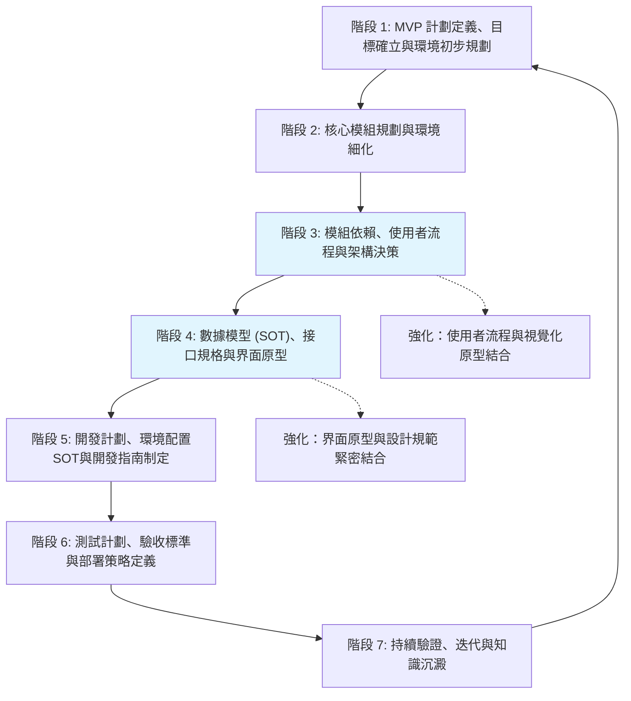

# Agent 協作開發計劃框架 Definition of Done (DoD) 指南 - 前端專項版

## 引言

### 文件目的
本文檔是基於 [`project_development_dod_guide_new.md`](project_development_dod_guide_new.md:1) 針對前端專案特性調整的專項版本，旨在為與 AI Agent 協作進行前端軟體開發時，提供一個用於建立完整開發計劃的標準化流程、步驟及各階段完成標準 (Definition of Done, DoD)。本指南特別強化了使用者體驗、界面設計、前端技術棧等前端開發的核心關注點。

### 適用範圍
本指南適用於所有需要 AI Agent 深度參與規劃、設計與開發的前端軟體專案，包括但不限於：
- 單頁應用程式 (SPA)
- 多頁應用程式 (MPA)
- 移動端 Web 應用
- 桌面端 Web 應用
- 混合式應用的前端部分

### 核心原則
- **MVP 優先 (MVP First):** 強調快速迭代，優先交付核心使用者價值，並儘早驗證使用者體驗假設。
- **SOT 導向 (Source of Truth Oriented):** 對關鍵資訊（如設計規範、組件庫、API規格、環境配置、核心架構決策）建立並維護唯一的真實來源文檔，所有其他文檔在引用時必須保持一致。
- **使用者中心 (User-Centered):** 所有設計和開發決策都以提升使用者體驗為核心考量。
- **設計系統驅動 (Design System Driven):** 建立並維護一致的設計規範和組件庫，確保界面的一致性和可維護性。
- **迭代驗證 (Iterative Validation):** 在流程的關鍵節點，利用使用者測試、A/B 測試、可用性測試等方式對設計和功能進行驗證。
- **持續文件化 (Continuous Documentation):** 隨專案進展持續更新和完善相關文件，確保文件是最新且準確的。
- **環境意識 (Environment Awareness):** 在規劃、設計、開發和測試的各個環節，充分考慮不同瀏覽器、設備、網絡環境的差異和特定需求。
- **彈性互動與記錄 (Flexible Interaction & Logging):** 在遵循本指南與 AI Agent 互動時，使用者可對非強制性的規劃問題選擇「跳過」。AI Agent 應記錄所有被跳過的問題及其上下文，並將其彙總列入相關規劃文件的「待辦事項」或「待討論事項」部分，以供後續追蹤。

## 整體流程概覽

---

## 階段 1：MVP 計劃定義、目標確立與環境初步規劃

### 目標 (Objective)
-   快速定義專案的最小可行產品 (MVP)，明確其核心使用者價值、目標用戶群、業務目標及可衡量的成功指標。
-   避免在專案初期過度設計和範圍擴張，有效限縮初期部署、開發工作量及所需文件數量。
-   確立專案的整體業務需求和市場目標，產出精簡的市場需求文件 (MRD)。
-   初步識別前端專案所需的開發環境和構建工具鏈，並規劃環境定義文件的基本框架。

### 關鍵活動 (Key Activities)
1.  **需求訪談與分析:**
    *   與使用者及各利益關係人進行深入訪談，全面收集原始需求、期望及痛點，特別關注使用者體驗相關需求。
    *   (AI 協作要點：Agent 可輔助記錄訪談內容，初步整理需求點，並根據需求生成初步的用戶故事框架，特別關注前端交互和視覺需求。)
2.  **MVP 範圍定義:**
    *   共同討論並篩選核心功能，定義 MVP 的明確邊界，重點關注使用者直接感知的功能。
    *   識別出哪些功能對於驗證核心使用者價值主張至關重要。
    *   (AI 協作要點：Agent 可根據需求列表和業務目標，輔助進行功能優先級排序的建議，並草擬 MVP 功能列表，特別關注前端功能的使用者價值。)

    *   **斷點問題建議：**
        1.  **問題：** 針對本次前端 MVP，是否有任何**絕對不能妥協的核心使用者體驗功能**，即使這可能會增加初步的規劃或開發複雜性？
            *   **目的：** 確保 MVP 真正抓住了不可或缺的使用者體驗核心價值。
            *   **AI 應對：** 若有，AI 需在後續模組規劃和功能設計中優先保障這些功能。
        2.  **問題：** MVP 完成後，對於**下一個迭代 (例如 Phase 1) 的主要使用者體驗改進和大致功能範圍**，您是否有初步的想法？
            *   **目的：** 幫助 AI 在設計 MVP 架構時，適度考慮近期的擴展性需求。
            *   **AI 應對：** AI 記錄此信息，並在架構設計和模組劃分時納入考量。
3.  **目標用戶與用戶故事:**
    *   清晰描繪 MVP 的目標用戶畫像 (User Persona)，特別關注其使用習慣、設備偏好、技術水平。
    *   撰寫 MVP 範圍內的核心用戶故事 (User Stories)，確保其符合 INVEST 原則，並特別關注使用者交互和體驗細節。
4.  **成功標準確立:**
    *   定義衡量 MVP 是否成功的關鍵績效指標 (KPIs) 和具體的可衡量指標，包括使用者體驗相關指標（如頁面加載時間、使用者滿意度、轉化率等）。
5.  **市場需求分析 (MRD) - 精簡版:**
    *   研究市場趨勢、競爭對手的前端解決方案。
    *   明確產品的市場定位、目標受眾、核心價值主張、潛在風險及初步的商業模式，內容相對精簡但重點突出。
    *   (AI 協作要點：Agent 可輔助進行市場資料搜集、競品前端分析報告的初步整理。)
6.  **差異分析 - 綜合性文件:**
    *   將 MVP 定義與完整範圍差異分析合併為一份簡潔的綜合性文件，概述 MVP 的核心功能、用戶故事以及與長遠目標的主要差異點。
7.  **環境初步規劃 - 前端聚焦:**
    *   討論並初步確定前端專案所需的開發環境（如 Node.js 版本、套件管理器選擇）。
    *   初步選型前端構建工具鏈（如 Webpack, Vite, Babel 等的初步選型或考量）。
    *   為後續創建詳細環境定義文件打下基礎。

    *   **斷點問題建議：**
        1.  **問題：** 本前端專案在技術選型上，是否有任何已知的**對特定前端框架（如 React, Vue, Angular）、構建工具（如 Webpack, Vite）或 UI 組件庫的強依賴性或偏好**？
            *   **目的：** 及早確定技術基礎，避免後續規劃與實際開發環境衝突。
            *   **AI 應對：** AI 將此信息作為後續環境細化和技術選型的重要輸入。
        2.  **問題：** 對於目標使用者的**設備和瀏覽器支持範圍**，是否有**特定的兼容性要求、性能指標（如首次內容繪製時間、可交互時間）、或無障礙訪問性標準**需要我們在早期就納入考量？
            *   **目的：** 確保前端規劃的務實性和使用者覆蓋度。
            *   **AI 應對：** AI 在進行技術選型和性能規劃時，會將這些要求考慮進去。

### 主要產出物 (Key Deliverables)
-   `docs/project_mrd.md` (市場需求文件 - 精簡版)
    *   內容應包含：市場分析、目標用戶、產品定位、核心價值、競爭分析、業務目標、成功指標、潛在風險，內容精簡但重點突出。
-   `docs/mvp_definition_comprehensive.md` (MVP 綜合定義文件)
    *   內容應包含：MVP 範圍、核心功能列表、目標用戶畫像、核心用戶故事、MVP 成功標準，以及與完整範圍的主要差異點和延遲原因。
-   `docs/env/preliminary_environment_overview.md` (初步環境概述文件 - 前端聚焦)
    *   簡要描述預計需要的前端開發環境、構建工具鏈及其主要用途。
-   [`docs/required_development_documents.md`](docs/required_development_documents.md:1) (開發所需文件清單) - 初始空檔案

### DoD 標準 (Definition of Done)
-   精簡版 MRD 文件已完成撰寫，明確了業務目標和市場定位，並獲得主要利益關係人的審閱與初步確認。
-   MVP 綜合定義文件已明確 MVP 的核心功能、用戶故事、可衡量的成功標準，以及與完整範圍的差異。
-   初步的前端開發環境和構建工具鏈已討論並記錄。
-   初始的空「開發所需文件清單」([`docs/required_development_documents.md`](docs/required_development_documents.md:1)) 已創建。
-   所有產出物已按照專案文件管理規範存檔，並在 [`code_index.md`](code_index.md:1) 中正確索引。
-   本階段的關鍵決策（如 MVP 範圍確認、核心業務目標、前端技術偏好）已記錄於 [`memory-bank/decisionLog.md`](memory-bank/decisionLog.md:1)。
-   任務狀態已在 [`cline_todo.md`](cline_todo.md:1) 中更新。

---

## 階段 2：核心模組規劃與環境細化

### 目標 (Objective)
-   基於已確定的 MVP 計劃，識別並定義前端專案所需的核心 UI 組件和模組及其職責。
-   為每個核心模組創建初步的規劃與設計文件 (MDD - Module Design Document 的初稿)，重點關注 UI 組件和交互邏輯。
-   細化前端開發環境的具體需求和用途，為創建詳細環境定義文件做準備。

### 關鍵活動 (Key Activities)
1.  **模組識別與劃分 - 前端聚焦:**
    *   根據 MVP 的功能需求和用戶故事，進行前端系統功能的初步模組劃分，重點關注 UI 組件（可複用組件庫、特定頁面的主要組件結構）及其交互邏輯和狀態管理方式。
    *   (AI 協作要點：Agent 可輔助分析功能列表，基於前端常見設計模式提出模組劃分的建議方案。)

    *   **斷點問題建議：**
        1.  **問題：** 在我們初步識別的前端核心模組之外，是否有任何**公司內部已有的、成熟的 UI 組件庫、設計系統或前端服務**（例如：統一認證組件、通用 Header/Footer、現有設計規範等）是本專案可以或應該優先考慮複用的？
            *   **目的：** 最大化資源利用，減少重複開發，確保視覺一致性。
            *   **AI 應對：** 若有，AI 將研究這些既有組件的使用方式，並在後續模組設計和架構決策中納入。
        2.  **問題：** 關於本次前端 MVP 的架構風格，您是傾向於**組件化架構**、**模組化架構**、**微前端架構**、還是**單體前端架構**？對於狀態管理，是否有偏好的方案（如 Redux, Vuex, Zustand, Context API）？請說明您的主要考量。
            *   **目的：** 了解使用者對前端架構風格的偏好，這將影響組件設計、狀態管理、路由策略和團隊協作方式。
            *   **AI 應對：** AI 根據使用者的選擇和考量，調整後續的組件架構圖、模組依賴分析、狀態管理設計的詳細程度。
2.  **模組職責定義 - UI 組件聚焦:**
    *   為每個識別出的核心前端模組明確其主要職責、核心功能點、輸入、輸出和關鍵接口草案，特別關注 UI 組件的可複用性和交互邏輯。
3.  **MDD 初稿撰寫 - 輕量化:**
    *   為每個核心前端模組創建初步的模組設計文件 (MDD)，內容輕量化。
    *   MDD 初稿應至少包含：模組目標、主要功能列表、核心職責、初步的輸入/輸出定義、初步技術考量、與其他模組的潛在交互點，以及 UI 組件的基本規格。
    *   (AI 協作要點：Agent 可根據模組職責和功能點，輔助生成 MDD 文件的基本框架和內容草稿。)
4.  **環境需求細化 - 前端開發聚焦:**
    *   針對前端開發環境，進一步討論其具體用途、所需資源（Node.js 版本、npm/yarn 配置、開發工具）、以及大致的配置方向。
    *   考慮前端構建工具鏈的詳細配置（如 Webpack/Vite 的配置文件、優化選項）。
    *   初步提及前端測試可能需要的特定環境（如不同瀏覽器版本的測試環境、移動設備模擬器等）。

    *   **斷點問題建議：**
        1.  **問題：** 除了標準的開發、測試、生產環境外，根據前端專案的特性（例如：是否需要設計師協作環境、是否涉及多語言本地化測試、或需要客戶深度參與的 UAT 環境），是否需要額外規劃如**設計協作環境、多語言測試環境、或視覺回歸測試專用環境**？
            *   **目的：** 確保所有必要的前端測試和協作活動都有合適的環境支持。
            *   **AI 應對：** 若需要，AI 將在後續的環境配置SOT定義和測試計劃中加入這些特殊環境的規劃。
        2.  **問題：** 對於前端資源的**版本管理和發布策略**（例如：靜態資源的版本控制、CDN 快取策略、漸進式發布），是否有特殊的公司政策、效能要求或使用者體驗標準需要遵守？
            *   **目的：** 確保前端發布策略符合效能和使用者體驗要求。
            *   **AI 應對：** AI 將這些要求記錄下來，並在環境配置以及部署策略中予以體現。

### 主要產出物 (Key Deliverables)
-   [`docs/mvp/mvp_service_framework.md`](docs/mvp/mvp_service_framework.md) (或類似的 MVP 總體技術框架文件) 中更新或包含核心前端模組列表、各模組高層次職責描述，重點突出主要的 UI 組件劃分和前端技術棧的選擇。
-   `docs/mod/[module_name]_mdd.md` (為每個核心前端模組創建的初步模組設計文件)
    *   內容應包含：模組目標、主要功能概述、核心職責、初步的輸入/輸出定義、初步技術考量、UI 組件基本規格、[MVP] 或 [完整階段] 標記。
-   (更新) `docs/env/preliminary_environment_overview.md` 或開始草擬獨立的前端環境定義文件框架。
    *   記錄前端開發環境的細化需求和用途。
-   [`docs/required_development_documents.md`](docs/required_development_documents.md:1) (開發所需文件清單) - 更新版

### DoD 標準 (Definition of Done)
-   MVP 核心前端模組列表及其高層次職責已在總體技術框架文件中明確記錄。
-   每個核心前端模組均已創建初步的 MDD 文件，並明確其主要職責、核心功能、初步接口思考和初步技術考量。
-   前端開發環境的具體需求和用途已得到初步細化並記錄。
-   AI Agent 已與使用者討論並確認本階段衍生的、下一開發階段所需的技術文件，並將其包含預期內容摘要/目的，記錄/更新至 [`docs/required_development_documents.md`](docs/required_development_documents.md:1)。
-   所有產出物已按照專案文件管理規範存檔，並在 [`code_index.md`](code_index.md:1) 中正確索引。
-   相關決策（如前端模組劃分確認、環境需求初步確認）已記錄於 [`memory-bank/decisionLog.md`](memory-bank/decisionLog.md:1)。
-   任務狀態已在 [`cline_todo.md`](cline_todo.md:1) 中更新。

---

## 階段 3：模組依賴、使用者流程與架構決策

### 目標 (Objective)
-   清晰定義 MVP 階段核心前端模組之間的依賴關係和交互方式。
-   詳細定義 MVP 核心功能對應的關鍵使用者流程，並與視覺化原型緊密結合。
-   確立關鍵的前端架構設計原則和技術選型決策，並記錄其理由。

### 關鍵活動 (Key Activities)
1.  **模組交互分析與接口定義:**
    *   分析各核心前端模組之間為完成 MVP 功能所必需的數據流和控制流。
    *   初步定義關鍵的模組間接口（組件 props、事件、狀態管理）。
    *   (AI 協作要點：Agent 可輔助分析模組職責，生成初步的組件接口定義草案。)
2.  **繪製模組依賴圖與架構圖:**
    *   使用圖表（如 Mermaid `graph` 或組件樹狀圖）清晰展示核心前端模組之間的依賴關係及整體前端架構。
    *   (AI 協作要點：Agent 可根據模組交互分析結果，輔助生成圖表的 Mermaid 原始碼。)
3.  **使用者流程細化 - 與視覺化原型結合:**
    *   針對 MVP 的核心用戶故事，設計詳細的使用者流程圖 (User Flow Diagram)，明確各步驟的操作者和系統響應。
    *   **強化要點：** 使用者流程的呈現應與早期的線框圖 (Wireframes) 或低保真原型 (Low-fidelity Prototypes) 緊密結合，以更直觀地展示交互路徑和界面轉換。
    *   **產出物調整：** 在使用者流程文件中，除了使用 Mermaid 等工具繪製流程圖外，嵌入相關線框圖的截圖，或提供指向原型工具（如 Figma, Axure 的特定畫布）的鏈接。流程圖中的關鍵節點明確標註其對應的界面原型。
    *   **活動調整：** 在定義使用者流程的關鍵活動中，加入與設計師協同進行早期線框圖設計的環節，使得流程定義和初步的界面佈局能夠同步進行、相互印證。
    *   確保流程覆蓋正常路徑、主要異常路徑和邊界條件。
    *   (AI 協作要點：Agent 可輔助將用戶故事轉化為詳細流程步驟，並生成流程圖的 Mermaid 原始碼，或輔助識別流程中的潛在瓶頸或缺失環節。)
4.  **關鍵架構決策 - 前端聚焦:**
    *   討論並確定關鍵的前端技術選型（如主要前端框架、狀態管理方案、UI 組件庫）。
    *   確立核心的前端架構模式（如組件化架構、狀態管理模式的初步考量）。
    *   記錄這些決策及其背後的理由、優缺點分析和潛在風險。
    *   (AI 協作要點：Agent 可提供不同前端技術選項的比較信息，輔助決策分析。)

    *   **斷點問題建議：**
        1.  **問題：** 在前端技術選型方面（如主要前端框架、狀態管理方案、UI 組件庫、CSS 預處理器），是否有任何**團隊既有的技術棧偏好、過往專案的成功經驗、或公司層面的前端技術標準**需要優先遵循？
            *   **目的：** 確保技術選型與團隊能力和公司策略相符，降低學習成本和整合風險。
            *   **AI 應對：** AI 將基於這些偏好和標準，在可能的選項中進行推薦和分析。
        2.  **問題：** 對於前端的**非功能性需求**，是否有初步的量化指標或期望？請特別針對以下一個或多個您最關注的面向提供具體指標：
            *   **效能指標** (例如：首次內容繪製 FCP < 1.5s、可交互時間 TTI < 3s、頁面加載時間、Bundle 大小限制)
            *   **使用者體驗指標** (例如：頁面響應時間、動畫流暢度、無障礙訪問性評分)
            *   **兼容性指標** (例如：支援的瀏覽器版本、移動設備適配、網絡環境適應性)
            *   **其他可量化的前端指標** (例如：代碼覆蓋率、組件複用率、設計一致性評分等)
            *   **目的：** 非功能性需求將直接影響前端架構設計、技術選型、優化策略以及後續的驗證標準。
            *   **AI 應對：** AI 將這些具體指標作為前端架構設計、技術選型建議、性能優化策略以及後續測試計劃和驗收標準的關鍵輸入。
        3.  **問題：** 前端是否需要支持**多語言國際化 (i18n)**、**多主題切換**、或**響應式設計**等特殊需求？
            *   **目的：** 這些需求對前端架構、組件設計、狀態管理等方面有特殊要求。
            *   **AI 應對：** 若需要，AI 將在前端架構設計、組件規劃和整體架構中重點考慮這些特殊需求的實現。
5.  **審閱與確認:**
    *   與團隊成員共同審閱前端模組依賴圖、架構圖、使用者流程圖和架構決策，確保其準確性、完整性和可行性。

### 主要產出物 (Key Deliverables)
-   `docs/architecture/system_architecture.md` (前端系統架構文件)
    *   包含高層次的前端系統架構圖、模組依賴關係圖 (Mermaid)，並對核心組件、模組交互方式、關鍵技術選型及其理由進行文字說明。
    *   記錄重要的前端架構決策和設計原則。
-   `docs/user_flows/core_user_flows.md` (核心使用者流程文件 - 與視覺化原型結合)
    *   包含針對 MVP 核心功能的使用者流程圖 (Mermaid `flowchart`)，並配有必要的文字說明，覆蓋主要 Happy Path 和關鍵異常路徑。
    *   **強化內容：** 嵌入相關線框圖的截圖，或提供指向原型工具的鏈接，流程圖中的關鍵節點明確標註其對應的界面原型。
-   (更新) 各前端模組 MDD (`docs/mod/[module_name]_mdd.md`)
    *   根據本階段的分析，更新模組的接口定義和依賴關係描述。
-   [`docs/required_development_documents.md`](docs/required_development_documents.md:1) (開發所需文件清單) - 更新版

### DoD 標準 (Definition of Done)
-   前端系統整體架構和核心模組之間的依賴關係已清晰定義、圖示化，並獲得團隊確認。
-   MVP 的核心使用者流程已詳細記錄、圖示化（包含主要異常路徑），並與視覺化原型緊密結合，獲得團隊確認。
-   關鍵的前端技術選型和架構決策已做出並記錄了充分的理由。
-   各前端模組 MDD 中的接口和依賴關係已更新。
-   AI Agent 已與使用者討論並確認本階段衍生的、下一開發階段所需的技術文件，並將其包含預期內容摘要/目的，記錄/更新至 [`docs/required_development_documents.md`](docs/required_development_documents.md:1)。
-   所有產出物已按照專案文件管理規範存檔，並在 [`code_index.md`](code_index.md:1) 中正確索引。
-   關鍵前端架構決策已記錄於 [`memory-bank/decisionLog.md`](memory-bank/decisionLog.md:1)。
-   任務狀態已在 [`cline_todo.md`](cline_todo.md:1) 中更新。

---

## 階段 4：數據模型 (SOT)、接口規格與界面原型

### 目標 (Objective)
-   定義前端專案的整體數據模型和核心數據結構，並確立其為唯一真實來源 (SOT)。
-   詳細定義前端模組間及與後端 API 的接口規格。
-   為 MVP 的關鍵使用者界面創建詳細的原型，與設計規範緊密結合，以便早期驗證和收集反饋。

### 關鍵活動 (Key Activities)
1.  **詳細數據模型設計 (SOT確立) - 前端聚焦:**
    *   基於前端模組功能需求和使用者流程，設計前端數據模型的詳細結構，包括組件狀態、全局狀態、本地存儲數據等。
    *   使用適當的圖表清晰展示前端數據流和狀態管理架構。
    *   明確指定一份文件作為前端數據模型和核心數據結構的唯一真實來源 (SOT)。所有其他相關文件在引用數據結構時，都必須指向此 SOT 文件。
    *   (AI 協作要點：Agent 可根據功能描述和流程圖，輔助識別核心數據實體、狀態結構及關係，生成狀態管理圖的 Mermaid 原始碼。)

    *   **斷點問題建議：**
        1.  **問題：** 本前端專案的數據模型是否需要考慮**離線功能支持、本地數據快取策略、或與現有系統的數據同步**？
            *   **目的：** 及早識別前端數據管理的複雜性，避免影響使用者體驗。
            *   **AI 應對：** 若需要，AI 將在前端數據模型設計中考慮離線存儲、快取策略，並在開發計劃中預留相應任務。
        2.  **問題：** 關於前端數據的**隱私保護和安全性要求**（例如：敏感數據的前端處理、XSS 防護、CSRF 預防），是否有需要在前端數據模型設計階段就特別考慮的安全措施？
            *   **目的：** 確保前端數據處理從設計之初就符合安全要求。
            *   **AI 應對：** AI 將在前端數據模型中標註敏感數據處理方式，並在相關組件設計中考慮安全性措施。
2.  **API 接口規格定義 (SOT確立) - 前端視角:**
    *   為前端與後端交互的所有 API，以及前端模組間的內部接口，定義詳細的接口規格。
    *   規格應包含：請求/響應格式 (JSON)、HTTP 方法、URL 路徑、請求參數、響應數據結構、錯誤處理、前端狀態更新邏輯。
    *   使用 OpenAPI (Swagger) 規範或其他標準格式編寫 API 文檔，並確立其為 API 規格的 SOT。
    *   (AI 協作要點：Agent 可根據前端模組 MDD 中的初步接口定義，輔助生成符合 OpenAPI 規範的 API 文檔草稿。)

    *   **斷點問題建議：**
        1.  **問題：** 本前端專案主要的 API 消費模式是**RESTful API**、**GraphQL**、**WebSocket 實時通信**，還是**混合模式**？對於 API 的錯誤處理和重試機制是否有特殊要求？
            *   **目的：** API 消費模式會影響前端數據獲取策略、狀態管理設計、錯誤處理機制。
            *   **AI 應對：** AI 將根據 API 消費模式，調整前端數據層設計和錯誤處理策略。
        2.  **問題：** 對於前端 API 調用的**性能優化**，是否有明確的策略或要求？例如，是否需要實現請求去重、數據預加載、分頁加載、或 API 響應快取？
            *   **目的：** 確保前端 API 調用的效率不會影響使用者體驗。
            *   **AI 應對：** AI 將在前端 API 設計中考慮性能優化機制，並在開發指南中強調相關策略。
3.  **界面原型細化與評審 - 與設計規範緊密結合:**
    *   針對 MVP 的核心使用者流程和關鍵界面，創建高保真線框圖 (Wireframes) 或交互原型 (Interactive Prototypes)。
    *   **強化要點：** 強調界面原型中使用的所有視覺元素（如組件、顏色、字體、圖標、間距等）必須遵循專案既有的設計規範，以確保最終產品的視覺和交互一致性。
    *   **規範的演進：** 若專案初期設計規範尚不完善，原型設計過程應視為推動設計規範建立和演進的機會。原型中出現的可複用組件或新設計模式，應考慮納入設計規範中進行標準化。
    *   **產出物體現：** 在界面原型文件或原型工具（如 Figma, Axure）的註釋中，應清晰標註原型元素與設計規範中對應組件、樣式或模式的鏈接或引用。對於原型中使用了設計規範尚未定義的新組件或樣式，應特別註明，並啟動將其納入設計規範的討論流程。
    *   **活動協同：** 在創建、評審界面原型的相關活動中，應確保負責設計規範維護的設計師或團隊成員參與，以審核原型與規範的符合程度，並推動規範的更新。
    *   原型應能清晰展示界面佈局、核心交互元素和主要操作流程。
    *   與使用者和團隊成員評審界面原型，收集反饋並進行迭代修改。
    *   (AI 協作要點：Agent 可根據使用者流程和功能描述，提供界面佈局和元素建議，或基於文本描述生成初步的界面草圖概念。)

### 主要產出物 (Key Deliverables)
-   `docs/frontend_data_model.md` (前端數據模型 SOT 文件)
    *   包含前端數據字典、狀態管理架構圖 (Mermaid)、詳細的數據結構定義（組件狀態、全局狀態、本地存儲等）。
    *   文件需明確聲明其作為前端數據模型 SOT 的地位。
-   `docs/api_specification.md` (或存放於 API 管理平台的鏈接) (API 規格 SOT 文件 - 前端視角)
    *   包含所有前端相關 API 的詳細規格，遵循 OpenAPI 標準，特別關注前端數據處理和狀態更新邏輯。
-   `docs/ui_prototypes/mvp_detailed_prototypes.md` (或連結到 Figma, Axure 等專業原型工具的共享鏈接)
    *   包含 MVP 核心界面的高保真線框圖或交互原型，與設計規範緊密結合。
    *   **強化內容：** 清晰標註原型元素與設計規範的對應關係，記錄新組件或樣式的規範化需求。
-   (更新) 各前端模組 MDD (`docs/mod/[module_name]_mdd.md`)
    *   更新數據模型相關描述，確保與前端數據模型 SOT 一致。
    *   更新接口設計部分，確保與 API 規格 SOT 一致。
-   [`docs/required_development_documents.md`](docs/required_development_documents.md:1) (開發所需文件清單) - 更新版

### DoD 標準 (Definition of Done)
-   前端數據模型已完整、詳細定義，包含所有 MVP 所需的核心數據結構、狀態管理架構，並已確立 SOT 文件。
-   前端相關 API 接口規格已詳細定義，遵循 OpenAPI 標準，並已確立 SOT 文件。
-   MVP 核心界面的高保真原型已創建，與設計規範緊密結合，並獲得主要利益關係人的審閱和反饋。
-   各前端模組 MDD 中涉及數據模型和接口的部分已更新，與 SOT 文件保持一致。
-   AI Agent 已與使用者討論並確認本階段衍生的、下一開發階段所需的技術文件，並將其包含預期內容摘要/目的，記錄/更新至 [`docs/required_development_documents.md`](docs/required_development_documents.md:1)。
-   所有產出物已按照專案文件管理規範存檔，並在 [`code_index.md`](code_index.md:1) 中正確索引。
-   SOT 的確立及前端數據模型、API 規格、設計規範的關鍵決策已記錄於 [`memory-bank/decisionLog.md`](memory-bank/decisionLog.md:1)。
-   任務狀態已在 [`cline_todo.md`](cline_todo.md:1) 中更新。

---

## 階段 5：開發計劃、環境配置SOT與開發指南制定

### 目標 (Objective)
-   基於已確定的 MVP 範圍、前端模組規劃、依賴關係、數據模型和接口規格，制定詳細的前端開發順序、任務分解及注意事項。
-   創建一份綜合性的前端開發指示文件，作為前端開發團隊的主要參考依據。
-   為前端各環境（開發、測試、生產等）定義詳細的配置參數和管理策略，並確立環境配置的 SOT。

### 關鍵活動 (Key Activities)
1.  **開發順序與迭代規劃 - 前端聚焦:**
    *   綜合考慮前端模組依賴關係、使用者體驗優先級、技術風險和資源情況，確定 MVP 階段各核心前端模組和主要功能的詳細開發順序和迭代計劃 (Sprints)。

    *   **斷點問題建議：**
        1.  **問題：** 在我們初步規劃的前端模組開發順序和迭代計劃中，是否有任何已知的**外部依賴的交付時間點**（例如：依賴設計師交付 UI 設計稿、等待後端 API 開發完成、等待第三方 UI 組件庫更新）會對我們的計劃產生重大影響？
            *   **目的：** 識別潛在的阻塞點，以便及早協調或調整計劃。
            *   **AI 應對：** AI 將這些外部依賴標註在開發計劃中，並建議制定應對方案。
2.  **任務分解與估時 - 前端特化:**
    *   將各前端模組的開發工作進一步分解為更小、可管理、可追蹤的開發任務或用戶故事，並進行初步的工作量估算。
    *   (AI 協作要點：Agent 可輔助根據前端模組功能列表和 MDD，生成初步的任務分解建議和檢查清單。)
3.  **詳細環境配置定義 (SOT確立) - 前端聚焦:**
    *   為開發、測試、預生產和生產等每個環境，詳細定義前端相關的配置，包括：
        *   前端本地開發環境的搭建（如 Node.js 版本、npm/yarn 配置）
        *   前端構建工具鏈的詳細配置（如 Webpack/Vite 的配置文件、優化選項）
        *   與後端 API 接口對接的配置（如開發環境代理伺服器設置）
        *   生產環境相關配置（重點描述靜態資源的打包和優化策略）
    *   創建獨立的前端環境定義文件，並確立其為各環境配置的 SOT。
    *   (AI 協作要點：Agent 可根據前端通用實踐，提供各環境應包含的配置項建議。)
4.  **撰寫前端開發指南文件:**
    *   整合專案概覽、已確定的前端技術棧 (含版本)、環境配置指引 (引用 SOT 文件)、核心數據模型 (引用 SOT 文件)、API 規格 (引用 SOT 文件)、各前端模組開發指南 (含 MDD 連結)、重要架構決策、關鍵流程參考、版本控制策略、前端編碼規範、代碼審查流程、CI/CD 流程初步構想等資訊，形成一份統一的前端開發指南。
    *   **前端特有規範包含：**
        *   選定前端框架（React, Vue, Angular等）的最佳實踐和編碼規範
        *   組件化開發的約定和目錄結構
        *   CSS架構模式（如BEM, SMACSS, Tailwind CSS）的選擇和使用
        *   狀態管理方案（如Redux, Vuex, Pinia, Zustand）的使用模式
        *   與後端API交互的數據處理和錯誤處理規範
        *   前端性能優化指南（如代碼分割、懶加載、圖片優化、減少重繪重排）
        *   瀏覽器兼容性策略和Polyfill的使用
        *   （可選）前端安全性考量（如XSS防護、CSRF預防）
    *   (AI 協作要點：Agent 可輔助從現有各類規劃文件中提取相關資訊，並整合生成前端開發指南的初稿。)

    *   **斷點問題建議：**
        1.  **問題：** 除了通用的前端編碼規範（如命名約定、註釋風格）、版本控制策略（如 Git 分支模型）和代碼審查流程外，貴團隊是否有**內部特定的前端開發慣例、偏好的靜態分析工具（如 ESLint, Prettier）、單元測試覆蓋率要求、或前端日誌記錄標準**等需要明確寫入開發指南？
            *   **目的：** 確保前端開發指南全面反映團隊的最佳實踐和質量要求。
            *   **AI 應對：** AI 將這些特定要求整合到前端開發指南的相應章節中。
5.  **計劃審閱與確認:**
    *   與前端開發團隊共同審閱前端開發指南、環境配置定義和任務分解，確保計劃的可行性和團隊共識。

### 主要產出物 (Key Deliverables)
-   `docs/frontend_development_guidelines.md` (前端開發指南文件)
    *   內容如上述活動4所述，是前端開發團隊的核心參考。
-   `docs/env/[environment_name]_environment.md` (例如 `docs/env/frontend_development_environment.md`, `docs/env/frontend_production_environment.md`) (各前端環境配置 SOT 文件)
    *   詳細描述各前端環境的配置參數和管理策略。
-   `docs/env/frontend_environment_variables_definition.md` (前端環境變量總覽 SOT 文件)
    *   集中定義所有前端專案中使用的環境變量及其用途、來源和示例值。
-   (可選) 項目管理工具 (如 Jira, Trello) 中的詳細前端任務列表和迭代計劃。
-   [`docs/required_development_documents.md`](docs/required_development_documents.md:1) (開發所需文件清單) - 更新版

### DoD 標準 (Definition of Done)
-   前端開發指南文件已創建，內容完整、清晰，引用了所有相關的 SOT 文件（前端數據模型、API規格、環境配置），並包含了明確的開發順序和前端規範。
-   各前端環境的詳細配置已定義並記錄在相應的 SOT 文件中。
-   前端環境變量已集中定義並記錄在 SOT 文件中。
-   MVP 階段的主要前端開發任務已進行詳細分解和初步估時。
-   前端開發指南和環境配置已獲得前端開發團隊主要成員的審閱和認可。
-   AI Agent 已與使用者討論並確認本階段衍生的、下一開發階段所需的技術文件，並將其包含預期內容摘要/目的，記錄/更新至 [`docs/required_development_documents.md`](docs/required_development_documents.md:1)。
-   所有產出物已按照專案文件管理規範存檔，並在 [`code_index.md`](code_index.md:1) 中正確索引。
-   相關決策（如前端開發順序、迭代計劃、環境配置策略）已記錄於 [`memory-bank/decisionLog.md`](memory-bank/decisionLog.md:1)。
-   任務狀態已在 [`cline_todo.md`](cline_todo.md:1) 中更新。

---

## 階段 6：測試計劃、驗收標準與部署策略定義

### 目標 (Objective)
-   為前端 MVP 階段及後續各主要開發階段制定全面、詳細的測試計劃，確保覆蓋前端各類測試。
-   明確各階段和各核心前端模組的驗收標準，以確保最終產品質量並符合使用者體驗預期。
-   定義前端 MVP 階段的部署策略和流程。

### 關鍵活動 (Key Activities)
1.  **完善前端測試策略:**
    *   制定前端專項的測試策略，確保其涵蓋前端測試左移、自動化策略、缺陷管理流程等。
2.  **細化各階段前端測試計劃:**
    *   **開發階段測試計劃**: 詳細定義前端單元測試（針對JavaScript邏輯、工具函數、純組件邏輯等）、組件測試（驗證UI組件的渲染、交互和狀態變化）、前端 API 接口測試的範圍、策略、工具、環境要求和指標。
    *   **驗證階段測試計劃**: 詳細定義前端功能測試、端到端測試 (E2E)（模擬真實用戶操作流程，驗證關鍵功能路徑）、可用性測試（邀請真實用戶或代表性用戶進行操作，收集體驗反饋）、性能測試（關注頁面加載速度、首次內容繪製 FCP、可交互時間 TTI、響應時間等指標）、跨瀏覽器/設備兼容性測試（確保在主流瀏覽器和目標設備上的表現一致）、（可選）視覺回歸測試（自動比較UI截圖，防止意外的視覺變更）的範圍、目標、策略、測試案例重點、環境要求（引用環境配置 SOT）和成功標準。
    *   **部署階段測試計劃**: 詳細定義前端部署驗證、冒煙測試、生產環境配置驗證（基於環境配置 SOT）、靜態資源驗證、回滾測試等的範圍、流程、環境和檢查點。

    *   **斷點問題建議：**
        1.  **問題：** 團隊在**前端自動化測試**方面（包括單元測試、組件測試、E2E 測試）是否有偏好的框架、工具或已有的實踐經驗？對於前端自動化測試的覆蓋率是否有具體的目標？
            *   **目的：** 確保測試計劃與團隊的自動化能力和策略一致。
            *   **AI 應對：** AI 將在測試計劃中推薦或整合團隊偏好的自動化方案。
        2.  **問題：** 對於**前端性能測試**（如頁面加載速度、首次內容繪製、可交互時間）和**可用性測試**（如使用者體驗評估、無障礙訪問性測試），是否有具體的測試目標（例如：FCP < 1.5s、TTI < 3s、無障礙訪問性評分 > 90）、測試場景、或必須達到的使用者體驗基線標準？
            *   **目的：** 使前端性能和可用性測試的規劃更具針對性和可衡量性。
            *   **AI 應對：** AI 將這些具體目標和標準納入相應的測試計劃和驗收標準中。
3.  **完善前端模組功能測試計劃:**
    *   基於標準模板，為 MVP 階段的每個核心前端模組更新或創建具體的功能測試計劃，包含詳細的測試案例（基於 MDD 和用戶故事）。
    *   (AI 協作要點：Agent 可輔助根據前端模組 MDD 中的功能列表和接口規格，生成更詳細的功能測試案例點，包括正常場景、異常場景和邊界條件。)
4.  **定義詳細驗收標準 - 前端聚焦:**
    *   為前端 MVP 階段整體以及每個核心前端模組的每個主要功能點，定義清晰、可衡量的驗收標準 (Acceptance Criteria)。
    *   **前端特有驗收標準：**
        *   除了確保功能按預期工作外，還必須包含對**交互流暢性**的驗證，確保動畫、過渡效果、用戶操作響應等達到預期體驗
        *   應包含對UI/UX設計稿和原型的高度符合性驗證
        *   （可選）無障礙訪問性 (Accessibility, a11y) 標準的符合性
5.  **制定前端 MVP 部署策略與計劃:**
    *   創建前端部署計劃，詳細描述前端 MVP 的部署策略、部署步驟（引用環境配置 SOT）、回滾計劃、部署後監控方案和檢查清單。
    *   **前端部署策略重點考慮：**
        *   **靜態資源優化**: 如代碼壓縮、Tree Shaking、圖片壓縮等
        *   **CDN分發**: 利用CDN加速靜態資源的全球訪問速度
        *   **版本控制**: 清晰的前端資源版本管理策略
        *   **回滾機制**: 快速回滾到先前穩定版本的能力
        *   （可選）**按需加載/增量更新**: 針對大型應用，優化首次加載和後續更新的體驗
    *   (AI 協作要點：Agent 可輔助生成前端部署計劃的標準框架和檢查清單項目。)

    *   **斷點問題建議：**
        1.  **問題：** 前端 MVP 版本首次部署到生產環境後，是否有**特定的前端監控指標**（例如：頁面加載時間、JavaScript 錯誤率、使用者交互響應時間）或**使用者行為監控指標**（例如：頁面瀏覽量、使用者停留時間、轉化漏斗）需要立即建立並設定告警閾值？
            *   **目的：** 確保前端系統上線後能及時了解其運行狀態和使用者體驗表現。
            *   **AI 應對：** AI 將建議將這些監控指標納入部署後監控方案。
        2.  **問題：** 公司或團隊是否有**既有的前端 CI/CD (持續整合/持續部署) 流程、平台或工具**（如 Jenkins, GitLab CI, GitHub Actions, Netlify, Vercel）是本專案可以利用或必須整合的？
            *   **目的：** 盡可能複用現有成熟的自動化流程，提高部署效率和可靠性。
            *   **AI 應對：** AI 將在部署計劃中考慮與現有 CI/CD 體系的整合方案。
6.  **規劃後續階段測試 (待辦):**
    *   在開發指南或進度追蹤文件中，明確記錄為後續生產階段 (Phase 1, 2, 3) 制定詳細驗證和部署測試計劃的待辦任務。

### 主要產出物 (Key Deliverables)
-   更新後的 `docs/test-plan/` 目錄下的各類前端測試計劃文件，確保內容詳細且引用了相關 SOT（如 API 規格、環境配置）。
-   `docs/deploy/frontend_mvp_deployment_plan.md` (前端 MVP 部署計劃文件)。
-   `docs/deploy/frontend_deployment_documents_checklist.md` (前端部署所需文件清單)。
-   各前端模組 MDD 或用戶故事中明確的驗收標準。
-   [`docs/required_development_documents.md`](docs/required_development_documents.md:1) (開發所需文件清單) - 更新版

### DoD 標準 (Definition of Done)
-   前端 MVP 階段的總體測試策略、開發階段、驗證階段和部署階段測試計劃均已詳細制定完成，引用了相關 SOT，並獲得團隊審核。
-   前端 MVP 階段各核心模組的功能測試計劃已完成，包含具體的測試案例和明確的驗收標準。
-   前端 MVP 的部署策略和詳細計劃已制定完成。
-   已明確識別後續生產階段前端測試計劃的待辦事項。
-   AI Agent 已與使用者討論並確認本階段衍生的、下一開發階段所需的技術文件，並將其包含預期內容摘要/目的，記錄/更新至 [`docs/required_development_documents.md`](docs/required_development_documents.md:1)。
-   所有產出物已按照專案文件管理規範存檔，並在 [`code_index.md`](code_index.md:1) 中正確索引。
-   相關決策（如前端 MVP 驗收標準、部署策略確認）已記錄於 [`memory-bank/decisionLog.md`](memory-bank/decisionLog.md:1)。
-   任務狀態已在 [`cline_todo.md`](cline_todo.md:1) 中更新。

---

## 階段 7：持續驗證、迭代與知識沉澱

### 目標 (Objective)
-   在整個前端開發流程的每個關鍵斷點或重要決策點，利用 Research Mode (例如通過串接 Perplexity API 的 Agent 能力) 或其他外部信息源，對前端規劃的正確性、技術方案的可行性、使用者體驗趨勢的符合度等進行驗證。
-   確保前端專案方向與外部最佳實踐和技術發展保持一致，並根據驗證結果進行必要的調整和迭代。
-   將驗證過程和決策沉澱為知識資產。

### 關鍵活動 (Key Activities)
1.  **識別驗證節點與主題 - 前端聚焦:**
    *   在前端專案計劃的每個階段轉換點、重要的技術選型決策前、複雜功能設計完成後、遇到未知領域或重大不確定性時，均視為潛在的驗證節點。
    *   明確需要驗證的具體問題或主題，特別關注前端技術趨勢、使用者體驗最佳實踐、性能優化策略等。

    *   **斷點問題建議：**
        1.  **問題：** 在前端專案的各個方面（例如：前端技術選型、UI/UX設計趨勢、性能優化策略、使用者體驗最佳實踐、特定功能實現方案等），團隊目前感覺**不確定性最高、最有疑慮、或最缺乏內部經驗來做判斷**的部分是什麼？這些可能是我們最需要藉助外部研究或原型驗證來降低風險的領域。
            *   **目的：** 幫助團隊聚焦最有價值的驗證活動，避免盲目研究。
            *   **AI 應對：** AI 將優先針對這些高不確定性領域，利用 Research Mode 或建議其他驗證方法。
        2.  **問題：** 是否有任何**新興的前端技術趨勢、UI/UX設計標準變化、或競爭對手的前端創新**可能對本專案的長期發展或使用者體驗競爭力產生顯著影響，值得我們投入時間進行研究和評估？
            *   **目的：** 保持前端專案的技術前瞻性和使用者體驗競爭力。
            *   **AI 應對：** AI 可協助追蹤相關資訊，並在適當時機提醒團隊進行評估。
2.  **執行 Research Mode 驗證 (或其他研究方法) - 前端聚焦:**
    *   針對特定的前端規劃內容或技術決策，向 Research Mode Agent 提出明確問題，或通過其他方式搜集前端行業報告、競品分析、技術文檔等信息。
    *   (AI 協作要點：Agent 負責執行 Research Mode 的查詢，並對返回的大量資訊進行初步篩選、總結和提煉關鍵洞察。)
3.  **記錄與分析驗證結果:**
    *   將研究的問題、過程、獲取的關鍵資訊、分析結論以及對現有前端規劃的潛在影響記錄在 [`memory-bank/research_log.md`](memory-bank/research_log.md:1) 中。
4.  **團隊討論與決策:**
    *   基於驗證結果和研究日誌，團隊共同討論是否需要對現有的前端規劃、設計或技術選型進行調整。
    *   如果決定調整，則返回到相應的規劃階段進行修改，並更新相關文件和 SOT。
    *   (AI 協作要點：Agent 可輔助評估驗證結果對現有前端規劃的影響程度，並基於新的信息提出調整建議方案。)
5.  **知識沉澱與共享 - 前端聚焦:**
    *   將重要的前端研究發現、決策過程和最終結論更新到相關的 Memory Bank 文件（如 [`decisionLog.md`](memory-bank/decisionLog.md:1), [`activeContext.md`](memory-bank/activeContext.md:1), [`systemPatterns.md`](memory-bank/systemPatterns.md:1)）中。
    *   **前端迭代驗證重點：**
        *   **使用者反饋**: 通過用戶訪談、問卷、可用性測試等方式收集
        *   **A/B 測試**: 對不同的UI設計或交互方案進行對比測試，選擇最優方案
        *   對界面設計和使用者體驗的持續數據分析和優化
    *   **前端知識沉澱重點：**
        *   記錄前端技術選型、架構決策、重要UI/UX設計決策及其理由
        *   沉澱前端性能優化、兼容性問題解決方案等經驗
    *   確保團隊成員可以方便地查閱這些沉澱下來的知識。

### 主要產出物 (Key Deliverables)
-   [`memory-bank/research_log.md`](memory-bank/research_log.md:1) (研究日誌文件)
    *   持續更新，記錄所有重要的前端研究和驗證活動。
-   各階段前端規劃文件的迭代更新版本 (如果驗證結果導致了修改)。
-   更新後的 Memory Bank 文件。
-   [`docs/required_development_documents.md`](docs/required_development_documents.md:1) (開發所需文件清單) - 更新版

### DoD 標準 (Definition of Done)
-   在每個已完成階段的關鍵決策點或在遇到重大不確定性時，都已積極考慮並酌情執行了前端研究驗證活動。
-   前端研究驗證的過程、有價值的發現和基於此的分析與決策已被清晰記錄在 [`memory-bank/research_log.md`](memory-bank/research_log.md:1) 中。
-   基於驗證結果，相關的前端規劃文件已進行了必要的更新，或者已確認現有規劃無需調整並記錄了此結論。
-   重要的前端研究結論和決策已沉澱到相應的 Memory Bank 文件中。
-   AI Agent 已與使用者討論並確認本階段衍生的、下一開發階段所需的技術文件，並將其包含預期內容摘要/目的，記錄/更新至 [`docs/required_development_documents.md`](docs/required_development_documents.md:1)。
-   所有產出物已按照專案文件管理規範存檔，並在 [`code_index.md`](code_index.md:1) 中正確索引。
-   任務狀態已在 [`cline_todo.md`](cline_todo.md:1) 中更新。

---

## 附錄

### 開發所需文件清單 ([`docs/required_development_documents.md`](docs/required_development_documents.md:1))

為確保前端專案開發過程中的技術文件完整且易於追蹤，本 DoD 指南引入了「開發所需文件清單」的概念。該清單獨立存放於 [`docs/required_development_documents.md`](docs/required_development_documents.md:1) 檔案中。

**目的與用途：**
*   **確保文件齊備**：在實際前端開發開始前，明確所有必需的技術文件。
*   **追蹤進度**：監控這些文件的準備狀態和完成情況。
*   **輔助 AI Agent**：
    *   作為 AI Agent 檢查人工提供的文件是否符合需求的依據。
    *   若現有文件僅部分滿足需求，AI Agent 可根據清單中的「預期內容摘要/目的」進行擴寫。
    *   若清單中列舉的文件不存在，AI Agent 可利用清單中的描述作為生成該技術文件的基礎。

**維護方式：**
*   此清單在 DoD 指南的**階段 1 結束時創建為一個初始空檔案**。
*   在後續**每個 DoD 階段（階段 2 至 7）結束時**，AI Agent 將與使用者討論，識別並記錄基於當前階段成果而衍生的、下一開發實施階段所需的額外技術文件，並更新至此清單中。

**核心欄位：**
清單中的每個條目應至少包含以下資訊：
1.  **文件名稱/類型**：例如前端組件設計文件、狀態管理設計、前端 API 設計文件等。
2.  **預期內容摘要/目的**：(必要欄位) 簡要描述該文件應包含的核心內容或要達成的目標。
3.  **當前狀態**：例如：待準備、準備中、已提供 (待 AI 檢閱/擴寫)、AI 生成初稿、已確認。
4.  **相關 DoD 階段**：指出這個文件主要與 DoD 指南的哪個階段相關聯或由哪個階段衍生。
5.  **(可選) SOT 指向**：如果此文件本身是某個資訊的 SOT，或者它強烈依賴於某個已有的 SOT 文件。
6.  **(可選) 負責人/團隊**
7.  **(可選) 預計完成時間**

**與 DoD 指南的關係：**
本 DoD 指南的每個階段的「主要產出物」和「DoD 標準」中均包含了對此「開發所需文件清單」進行更新或確認的要求，以確保其動態性和即時性。

### 詞彙表 (Glossary)
*   **MVP (Minimum Viable Product):** 最小可行產品
*   **MRD (Market Requirements Document):** 市場需求文件
*   **MDD (Module Design Document):** 模組設計文件
*   **SOT (Source of Truth):** 唯一真實來源
*   **API (Application Programming Interface):** 應用程式接口
*   **UAT (User Acceptance Test):** 使用者接受度測試
*   **DoD (Definition of Done):** 完成的定義
*   **KPI (Key Performance Indicator):** 關鍵績效指標
*   **SPA (Single Page Application):** 單頁應用程式
*   **MPA (Multi Page Application):** 多頁應用程式
*   **FCP (First Contentful Paint):** 首次內容繪製
*   **TTI (Time to Interactive):** 可交互時間
*   **E2E (End-to-End):** 端到端測試
*   **CDN (Content Delivery Network):** 內容分發網絡
*   **CI/CD (Continuous Integration/Continuous Deployment):** 持續整合/持續部署

### 參考文件列表 (Reference Documents)
*   [`project_development_dod_guide_new.md`](project_development_dod_guide_new.md:1) - 原始 DoD 指南框架
*   [`docs/dod_guide_variants_discussion_log.md`](docs/dod_guide_variants_discussion_log.md:1) - 前端變體討論記錄
*   [`docs/log/dod_guide_variants_creation_plan.md`](docs/log/dod_guide_variants_creation_plan.md:1) - 變體創建執行計劃

---

*本前端專項 DoD 指南創建於 2025/5/23，基於原始 DoD 指南框架針對前端專案特性進行調整和強化。*