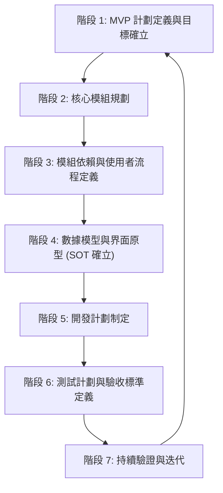

# Agent 協作開發計劃框架 Definition of Done (DoD) 指南

## 引言

### 文件目的
本文件旨在為與 AI Agent 協作進行軟體開發時，提供一個用於建立完整開發計劃的標準化流程、步驟及各階段完成標準 (Definition of Done, DoD)。遵循此指南有助於確保專案規劃的全面性、各階段產出物的明確性以及與 AI Agent 協作的順暢性。

### 適用範圍
本指南適用於所有需要 AI Agent 深度參與規劃、設計與開發的軟體專案。

### 核心原則
- **MVP 優先 (MVP First):** 強調快速迭代，優先交付核心價值。
- **SOT 導向 (Source of Truth Oriented):** 對關鍵資訊（如數據模型、API規格）建立並維護唯一的真實來源。
- **迭代驗證 (Iterative Validation):** 在流程的關鍵節點進行驗證，確保方向正確。
- **持續文件化 (Continuous Documentation):** 隨專案進展持續更新和完善相關文件。

## 整體流程概覽

---

## 階段 1：MVP 計劃定義與目標確立 (MVP Planning & Goal Setting)

### 目標 (Objective)
-   快速定義專案的最小可行產品 (MVP)，明確其核心價值、目標用戶群及成功指標。
-   避免在專案初期過度設計和範圍擴張，有效限縮初期部署、開發工作量及所需文件數量。
-   確立專案的整體業務需求和市場目標，產出市場需求文件 (MRD)。

### 關鍵活動 (Key Activities)
1.  **需求訪談與分析:**
    *   與使用者及各利益關係人進行深入訪談，全面收集原始需求、期望及痛點。
    *   (AI 協作要點：Agent 可輔助記錄訪談內容，初步整理需求點。)
2.  **MVP 範圍定義:**
    *   共同討論並篩選核心功能，定義 MVP 的明確邊界。
    *   識別出哪些功能對於驗證核心價值主張至關重要。
    *   (AI 協作要點：Agent 可根據需求列表，輔助進行功能優先級排序的建議。)
3.  **目標用戶與用戶故事:**
    *   清晰描繪 MVP 的目標用戶畫像 (User Persona)。
    *   撰寫 MVP 範圍內的核心用戶故事 (User Stories)。
4.  **成功標準確立:**
    *   定義衡量 MVP 是否成功的關鍵指標 (Key Metrics)。
5.  **市場需求分析 (MRD):**
    *   研究市場趨勢、競爭對手情況。
    *   明確產品的市場定位、目標受眾、核心價值主張及潛在風險。
    *   (AI 協作要點：Agent 可輔助進行市場資料搜集、競品分析報告的初步整理。)
6.  **差異分析:**
    *   識別並記錄 MVP 範圍與專案完整願景 (Full Scope) 之間的主要差異點。

### 主要產出物 (Key Deliverables)
-   `docs/project_mrd.md` (市場需求文件 - Market Requirements Document)
    *   內容應包含市場分析、目標用戶、產品定位、核心價值、競爭分析等。
-   `docs/mvp_definition.md` (MVP 定義文件)
    *   內容應包含 MVP 範圍、核心功能列表、目標用戶畫像、用戶故事、成功標準。
    *   參考範例：[`docs/pg_b2b_portal_mvp_proposal.md`](docs/pg_b2b_portal_mvp_proposal.md:1) (部分內容可借鑒其結構)
-   `docs/mvp_vs_full_scope_diff.md` (MVP 與完整範圍差異定義文件)
    *   內容應清晰列出 MVP 未包含但在未來規劃中的重要功能及其延遲原因。
    *   參考範例：[`docs/mvp_vs_full_implementation_diff.md`](docs/mvp_vs_full_implementation_diff.md:1)

### DoD 標準 (Definition of Done)
-   MRD 文件已完成撰寫，並獲得主要利益關係人的審閱與初步確認。
-   MVP 定義文件已明確 MVP 的核心功能、用戶故事和初步的驗收標準。
-   MVP 與完整範圍差異文件已清晰記錄，並解釋了延遲功能的理由。
-   所有產出物已按照專案文件管理規範存檔，並在 [`code_index.md`](code_index.md:1) 中正確索引。
-   本階段的關鍵決策（如 MVP 範圍確認）已記錄於 [`memory-bank/decisionLog.md`](memory-bank/decisionLog.md:1)。
-   任務狀態已在 [`cline_todo.md`](cline_todo.md:1) 中更新。

---

## 階段 2：核心模組規劃 (Core Module Planning)

### 目標 (Objective)
-   基於已確定的 MVP 計劃，識別並定義專案所需的核心軟體模組。
-   為每個核心模組創建初步的規劃與設計文件 (MDD - Module Design Document 的初稿)。

### 關鍵活動 (Key Activities)
1.  **模組識別與劃分:**
    *   根據 MVP 的功能需求和用戶故事，進行系統功能的初步模組劃分。
    *   (AI 協作要點：Agent 可輔助分析功能列表，提出模組劃分的建議方案。)
2.  **模組職責定義:**
    *   為每個識別出的核心模組明確其主要職責、核心功能點。
3.  **初步接口思考:**
    *   初步思考各模組可能需要的輸入 (Inputs)、輸出 (Outputs) 以及與其他模組的潛在交互點。
4.  **MDD 初稿撰寫:**
    *   為每個核心模組創建初步的模組設計文件 (MDD)。
    *   MDD 初稿應至少包含：模組目標、主要功能列表、初步技術考量。
    *   (AI 協作要點：Agent 可根據模組職責和功能點，輔助生成 MDD 文件的基本框架和內容草稿。)

### 主要產出物 (Key Deliverables)
-   [`docs/mvp/mvp_service_framework.md`](docs/mvp/mvp_service_framework.md) (或類似的 MVP 總體技術框架文件) 中更新或包含核心模組列表及其高層次描述。
    *   應明確列出 MVP 階段需要實現的所有核心模組。
-   `docs/mod/[module_name]_mdd.md` (為每個核心模組創建的初步模組設計文件)
    *   例如：[`docs/mod/user_management_module.md`](docs/mod/user_management_module.md:1), [`docs/mod/product_catalog_module.md`](docs/mod/product_catalog_module.md:1), [`docs/mod/quotation_system_module.md`](docs/mod/quotation_system_module.md:1) 等。
    *   內容應包含：模組目標、主要功能概述、初步技術考量、[MVP] 或 [完整階段] 標記。

### DoD 標準 (Definition of Done)
-   MVP 核心模組列表已在總體技術框架文件中明確記錄。
-   每個核心模組均已創建初步的 MDD 文件，並明確其主要職責、核心功能和初步技術考量。
-   所有產出物已按照專案文件管理規範存檔，並在 [`code_index.md`](code_index.md:1) 中正確索引。
-   相關決策（如模組劃分確認）已記錄於 [`memory-bank/decisionLog.md`](memory-bank/decisionLog.md:1)。
-   任務狀態已在 [`cline_todo.md`](cline_todo.md:1) 中更新。

---

## 階段 3：模組依賴與使用者流程定義 (Module Dependency & User Flow Definition)

### 目標 (Objective)
-   清晰定義 MVP 階段核心模組之間的依賴關係和交互方式。
-   詳細定義 MVP 核心功能對應的關鍵使用者流程和系統活動。

### 關鍵活動 (Key Activities)
1.  **模組交互分析:**
    *   分析各核心模組之間為完成 MVP 功能所必需的數據流和控制流。
    *   識別關鍵的模組間接口。
2.  **繪製模組依賴圖:**
    *   使用圖表（如 Mermaid `graph`）清晰展示核心模組之間的依賴關係。
    *   (AI 協作要點：Agent 可根據模組交互分析結果，輔助生成模組依賴圖的 Mermaid 原始碼。)
3.  **使用者流程設計:**
    *   針對 MVP 的核心用戶故事，設計詳細的使用者流程圖 (User Flow Diagram) 或活動圖 (Activity Diagram)。
    *   確保流程覆蓋正常路徑和主要異常路徑。
    *   (AI 協作要點：Agent 可輔助將用戶故事轉化為流程步驟，並生成流程圖的 Mermaid 原始碼，或輔助識別流程中的潛在瓶頸或缺失環節。)
4.  **審閱與確認:**
    *   與團隊成員共同審閱模組依賴圖和使用者流程圖，確保其準確性和完整性。

### 主要產出物 (Key Deliverables)
-   `docs/architecture/module_dependency_diagram.md`
    *   包含使用 Mermaid 繪製的模組依賴關係圖，並對依賴關係進行文字說明。
    *   參考範例：[`docs/mvp/mvp_service_framework.md`](docs/mvp/mvp_service_framework.md) 中的核心模組關係圖 (經過更新，包含關係說明的版本)。
-   `docs/user_flows/core_user_flows.md`
    *   包含針對 MVP 核心功能的使用者流程圖或活動圖 (Mermaid `flowchart` 或 `sequenceDiagram`)，並配有必要的文字說明。
    *   參考範例：[`docs/quotation_flow_detailed.md`](docs/quotation_flow_detailed.md:1) 中的報價流程圖。

### DoD 標準 (Definition of Done)
-   核心模組之間的依賴關係已清晰定義、圖示化，並獲得團隊確認。
-   MVP 的核心使用者流程已詳細記錄、圖示化，並獲得團隊確認。
-   所有產出物已按照專案文件管理規範存檔，並在 [`code_index.md`](code_index.md:1) 中正確索引。
-   相關決策已記錄於 [`memory-bank/decisionLog.md`](memory-bank/decisionLog.md:1)。
-   任務狀態已在 [`cline_todo.md`](cline_todo.md:1) 中更新。

---

## 階段 4：數據模型與界面原型 (SOT 確立) (Data Model, UI Prototype & SOT Establishment)

### 目標 (Objective)
-   定義專案的整體數據模型和核心數據結構，並確立其為唯一真實來源 (SOT)。
-   為 MVP 的關鍵使用者界面創建原型，以便早期驗證和收集反饋。

### 關鍵活動 (Key Activities)
1.  **數據模型設計:**
    *   根據模組功能需求和使用者流程，設計數據庫的核心實體、屬性、關係及約束。
    *   (AI 協作要點：Agent 可根據功能描述和流程圖，輔助識別核心實體和屬性，並提出初步的關係建議。)
2.  **繪製數據關係圖:**
    *   使用 ERD (Entity Relationship Diagram) 或 Class Diagram 清晰展示數據模型。
    *   (AI 協作要點：Agent 可輔助生成 ERD/Class Diagram 的 Mermaid 原始碼。)
3.  **數據庫 Schema 初稿:**
    *   基於數據模型設計，撰寫初步的數據庫 Schema 定義 (例如 SQL DDL 語句的草稿)。
4.  **SOT 文件確立:**
    *   明確指定一份文件 (例如 [`docs/master_data_model.md`](docs/master_data_model.md:1)) 作為數據庫 Schema 和核心數據結構的唯一真實來源 (SOT)。
    *   確保所有其他相關文件在引用數據結構時，都指向此 SOT 文件。
    *   (AI 協作要點：Agent 可輔助檢查其他文件中對數據模型的引用是否一致，並提示更新。)
5.  **界面原型設計:**
    *   針對 MVP 的核心使用者流程和關鍵界面，創建低保真線框圖 (Wireframes) 或高保真交互原型 (Interactive Prototypes)。
    *   (AI 協作要點：Agent 可根據使用者流程和功能描述，提供界面佈局和元素建議，或生成初步的界面草圖概念。)
6.  **原型評審與迭代:**
    *   與使用者和團隊成員評審界面原型，收集反饋並進行迭代修改。

### 主要產出物 (Key Deliverables)
-   [`docs/master_data_model.md`](docs/master_data_model.md:1) (或類似命名的數據模型 SOT 文件)
    *   包含數據字典 (各實體、屬性的詳細說明)、ERD/Class Diagram (Mermaid)、初步的 DB Schema 定義。
    *   文件需明確聲明其作為數據模型 SOT 的地位。
    *   參考範例：[`docs/data_model_ui_prototype.md`](docs/data_model_ui_prototype.md:5) (其 ERD 部分可作參考，但 SOT 文件應更全面)。
-   `docs/ui_prototypes/mvp_prototypes.md` (或連結到 Figma, Axure 等專業原型工具的共享鏈接)
    *   包含 MVP 核心界面的線框圖或交互原型。

### DoD 標準 (Definition of Done)
-   數據模型已完整定義，包含所有 MVP 所需的核心實體、屬性、關係和初步 Schema。
-   ERD/Class Diagram 已完成並包含在 SOT 文件中。
-   數據模型的 SOT 文件已確立，並在團隊內達成共識，相關文件已更新引用。
-   MVP 核心界面的原型已創建，並獲得主要利益關係人的初步審閱和反饋。
-   所有產出物已按照專案文件管理規範存檔，並在 [`code_index.md`](code_index.md:1) 中正確索引。
-   SOT 的確立及數據模型的關鍵決策已記錄於 [`memory-bank/decisionLog.md`](memory-bank/decisionLog.md:1)。
-   任務狀態已在 [`cline_todo.md`](cline_todo.md:1) 中更新。

---

## 階段 5：開發計劃制定 (Development Plan Creation)

### 目標 (Objective)
-   基於已確定的 MVP 範圍、模組規劃、依賴關係和數據模型，制定詳細的開發順序、任務分解及注意事項。
-   創建一份綜合性的開發指示文件，作為開發團隊的主要參考依據，並能支持在開發中斷時順利接續工作。

### 關鍵活動 (Key Activities)
1.  **開發順序規劃:**
    *   綜合考慮模組依賴關係、業務優先級和技術風險，確定 MVP 階段各核心模組和主要功能的開發順序。
2.  **任務分解:**
    *   將各模組的開發工作進一步分解為更小、可管理、可追蹤的開發任務或用戶故事 (User Stories for development)。
    *   (AI 協作要點：Agent 可輔助根據模組功能列表和 MDD，生成初步的任務分解建議。)
3.  **技術細節與風險識別:**
    *   針對關鍵任務，識別潛在的技術難點、實現方案選項及相關風險。
4.  **撰寫開發指示文件:**
    *   整合專案概覽、技術棧、環境配置、核心數據模型引用、各模組開發指南 (含 MDD 連結)、重要架構決策、關鍵流程參考等資訊，形成一份統一的開發指示文件。
    *   確保文件中包含清晰的開發順序和各模組的開發要點。
    *   (AI 協作要點：Agent 可輔助從現有各類規劃文件中提取相關資訊，並整合生成開發指示文件的初稿。)
5.  **計劃審閱與確認:**
    *   與開發團隊共同審閱開發指示文件和任務分解，確保計劃的可行性和團隊共識。

### 主要產出物 (Key Deliverables)
-   [`docs/b2b_project_development_guidelines.md`](docs/b2b_project_development_guidelines.md:1) (或類似命名的開發指示文件)
    *   內容應如您在 `2025-05-20/session-17-12-58.md` 中與 Agent 共同草擬的結構，包含引言、專案概覽、技術棧、數據模型、開發階段與模組順序、重要決策、流程參考等。
-   (可選) 項目管理工具 (如 Jira, Trello) 中的任務列表，與開發指示文件中的任務分解對應。

### DoD 標準 (Definition of Done)
-   開發指示文件已創建，內容完整、清晰，包含明確的開發順序、各核心模組的開發指引（包括對應 MDD 和數據模型 SOT 的連結），並已整合所有必要的參考資訊。
-   MVP 階段的主要開發任務已進行初步分解。
-   開發指示文件已獲得開發團隊主要成員的審閱和認可。
-   所有產出物已按照專案文件管理規範存檔，並在 [`code_index.md`](code_index.md:1) 中正確索引。
-   相關決策（如開發順序確認）已記錄於 [`memory-bank/decisionLog.md`](memory-bank/decisionLog.md:1)。
-   任務狀態已在 [`cline_todo.md`](cline_todo.md:1) 中更新。

---

## 階段 6：測試計劃與驗收標準定義 (Test Planning & Acceptance Criteria Definition)

### 目標 (Objective)
-   為 MVP 階段及後續各主要開發階段制定全面、詳細的測試計劃。
-   明確各階段和各核心模組的驗收標準，以確保最終產品質量並符合預期。

### 關鍵活動 (Key Activities)
1.  **定義總體測試策略:**
    *   明確測試左移理念在本專案的實踐方式。
    *   概述各測試階段（開發階段、驗證階段、部署階段）的目標、職責和主要活動。
    *   參考文件：[`docs/test-plan/overall_test_strategy.md`](docs/test-plan/overall_test_strategy.md:1)
2.  **制定 MVP 階段測試計劃:**
    *   **開發階段測試計劃:** 詳細定義單元測試、組件測試、早期集成測試的範圍、策略、工具和指標。參考文件：[`docs/test-plan/development_stage_test_plan.md`](docs/test-plan/development_stage_test_plan.md:1)
    *   **驗證階段測試計劃:** 詳細定義功能測試、端到端測試、用戶接受度測試 (UAT)、效能測試、基本安全性測試的範圍、目標、策略、測試案例重點和環境。參考文件：[`docs/test-plan/validation_stage_test_plan.md`](docs/test-plan/validation_stage_test_plan.md:1)
    *   **部署階段測試計劃:** 詳細定義部署驗證、冒煙測試、生產環境配置驗證、數據遷移驗證、回滾測試等的範圍、流程和檢查點。參考文件：[`docs/test-plan/deployment_stage_test_plan.md`](docs/test-plan/deployment_stage_test_plan.md:1)
3.  **制定模組功能測試計劃:**
    *   基於標準模板 ([`docs/test-plan/module_functional_test_plan_template.md`](docs/test-plan/module_functional_test_plan_template.md:1))，為 MVP 階段的每個核心模組創建具體的功能測試計劃。
    *   (AI 協作要點：Agent 可輔助根據模組 MDD 中的功能列表，生成功能測試計劃的初步測試案例點。)
4.  **定義驗收標準:**
    *   為 MVP 階段整體以及每個核心模組的功能點，定義清晰、可衡量的驗收標準 (Acceptance Criteria)。這些標準應與用戶故事和需求緊密相關。
    *   MVP 階段的總體驗收標準可參考 [`docs/test-plan/validation_stage_test_plan.md:154-174`](docs/test-plan/validation_stage_test_plan.md:154-174)。
5.  **規劃後續階段測試 (待辦):**
    *   識別出現有測試計劃中對於 Production Phase 1, 2, 3 的不足之處。
    *   記錄一個明確的待辦任務 (如您提供的 Prompt)，以便後續為這些階段制定詳細的驗證測試計劃。此 Prompt 可附加在開發指示文件末尾或記錄在 [`memory-bank/progress.md`](memory-bank/progress.md:1) 中。

### 主要產出物 (Key Deliverables)
-   `docs/test-plan/` 目錄下的各類測試計劃文件，確保其內容已針對 MVP 階段進行了詳細規劃：
    *   [`docs/test-plan/overall_test_strategy.md`](docs/test-plan/overall_test_strategy.md:1) (總體策略)
    *   [`docs/test-plan/development_stage_test_plan.md`](docs/test-plan/development_stage_test_plan.md:1) (MVP 開發階段)
    *   [`docs/test-plan/validation_stage_test_plan.md`](docs/test-plan/validation_stage_test_plan.md:1) (MVP 驗證階段，包含 MVP 總體驗收標準)
    *   [`docs/test-plan/deployment_stage_test_plan.md`](docs/test-plan/deployment_stage_test_plan.md:1) (MVP 部署階段)
    *   各核心模組的功能測試計劃 (例如 [`docs/test-plan/mod_user_management_functional_test.md`](docs/test-plan/mod_user_management_functional_test.md) 等，至少應有 MVP 階段的測試案例)。
-   開發指示文件 ([`docs/b2b_project_development_guidelines.md`](docs/b2b_project_development_guidelines.md:1)) 中關於 MVP 階段驗證計劃的摘要和連結，以及「完善後續階段測試計劃」的待辦任務 Prompt。

### DoD 標準 (Definition of Done)
-   MVP 階段的總體測試策略、開發階段測試計劃、驗證階段測試計劃和部署階段測試計劃均已制定完成，內容詳細，並獲得團隊審核。
-   MVP 階段各核心模組的功能測試計劃初稿已完成，並明確了主要測試案例方向。
-   MVP 的整體及各核心功能的驗收標準已清晰定義並記錄在案。
-   已明確識別後續生產階段 (Phase 1, 2, 3) 測試計劃的缺失，並已將完善這些計劃的任務記錄為待辦事項 (例如，將 Prompt 附加到開發指示文件末尾)。
-   所有產出物已按照專案文件管理規範存檔，並在 [`code_index.md`](code_index.md:1) 中正確索引。
-   相關決策（如 MVP 驗收標準確認）已記錄於 [`memory-bank/decisionLog.md`](memory-bank/decisionLog.md:1)。
-   任務狀態已在 [`cline_todo.md`](cline_todo.md:1) 中更新。

---

## 階段 7：持續驗證與迭代 (Continuous Validation & Iteration)

### 目標 (Objective)
-   在整個開發流程的每個關鍵斷點或重要決策點，利用 Research Mode (例如通過串接 Perplexity API 的 Agent 能力) 對規劃的正確性、技術方案的可行性、市場趨勢的符合度等進行驗證。
-   確保專案方向與外部最佳實踐和技術發展保持一致，並根據驗證結果進行必要的調整和迭代。

### 關鍵活動 (Key Activities)
1.  **識別驗證節點:**
    *   在專案計劃的每個階段轉換點、重要的技術選型決策前、複雜功能設計完成後等，均視為潛在的驗證節點。
2.  **執行 Research Mode 驗證:**
    *   針對特定的規劃內容或技術決策，向 Research Mode Agent 提出明確問題。例如：
        *   "針對我們 B2B Portal 的報價模組，目前業界主流的技術實現方案有哪些優缺點？"
        *   "我們計劃採用的[某技術棧/架構模式]，在處理類似[我們業務場景]時，有哪些已知的挑戰或最佳實踐？"
        *   "關於[某個延遲到 Phase 2 的功能，如 Shopify 自動同步]，目前是否有新的技術或趨勢值得我們在重新規劃時考慮？"
    *   (AI 協作要點：Agent 負責執行 Research Mode 的查詢，並對返回的大量資訊進行初步篩選和總結。)
3.  **記錄與分析驗證結果:**
    *   將 Research Mode 的查詢問題、獲取的關鍵資訊、分析結論以及對現有規劃的潛在影響記錄下來。
4.  **決策與調整:**
    *   基於驗證結果，團隊共同討論是否需要對現有的規劃、設計或技術選型進行調整。
    *   如果決定調整，則返回到相應的規劃階段進行修改，並更新相關文件。
    *   (AI 協作要點：Agent 可輔助評估驗證結果對現有規劃的影響程度，並提出調整建議。)

### 主要產出物 (Key Deliverables)
-   `memory-bank/research_log.md` (或類似命名的研究日誌文件)
    *   記錄每次 Research Mode 驗證的日期、驗證主題/問題、查詢關鍵詞、主要發現、分析結論以及最終的行動決策（例如：確認原計劃、調整方案A為方案B等）。
-   各階段規劃文件的迭代更新版本 (如果驗證結果導致了修改)。

### DoD 標準 (Definition of Done)
-   在每個已完成階段的關鍵決策點或在遇到重大不確定性時，都已積極考慮並酌情執行了 Research Mode 驗證。
-   Research Mode 的查詢過程、有價值的發現和基於此的分析與決策已被清晰記錄在 `research_log.md` 中。
-   基於驗證結果，相關的規劃文件已進行了必要的更新，或者已確認現有規劃無需調整並記錄了此結論。
-   所有產出物已按照專案文件管理規範存檔，並在 [`code_index.md`](code_index.md:1) 中正確索引（如 `research_log.md`）。
-   相關決策已記錄於 [`memory-bank/decisionLog.md`](memory-bank/decisionLog.md:1)。
-   任務狀態已在 [`cline_todo.md`](cline_todo.md:1) 中更新。

---

## 附錄

### 詞彙表 (Glossary)
*   **MVP (Minimum Viable Product):** 最小可行產品
*   **MRD (Market Requirements Document):** 市場需求文件
*   **MDD (Module Design Document):** 模組設計文件
*   **SOT (Source of Truth):** 唯一真實來源
*   **ERD (Entity Relationship Diagram):** 實體關係圖
*   **UAT (User Acceptance Test):** 使用者接受度測試
*   **DoD (Definition of Done):** 完成的定義

### 參考文件列表 (Reference Documents)
*   [`code_index.md`](code_index.md:1)
*   [`README.md`](README.md:1)
*   `memory-bank/` (所有 Memory Bank 文件)
*   `docs/` (所有專案規劃與設計文件)
*   [`Emil.txt`](Emil.txt) (原始討論逐字稿)