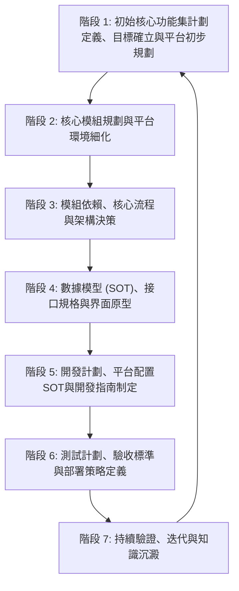

# 通用軟體開發框架 Definition of Done (DoD) 指南

## 引言

### 文件目的
本文檔旨在為與 AI Agent 協作進行各類軟體開發時，提供一個用於建立完整開發計劃的標準化流程、步驟及各階段完成標準 (Definition of Done, DoD)。遵循此指南有助於確保專案規劃的全面性、各階段產出物的明確性、對目標平台與執行環境的充分考慮、以及與 AI Agent 協作的順暢性與高效性。

### 適用範圍
本指南適用於所有需要 AI Agent 深度參與規劃、設計與開發的軟體專案，包括但不限於：
- 網站與網路應用程式
- 移動應用程式 (iOS, Android)
- 桌面應用程式 (Windows, macOS, Linux)
- 嵌入式系統軟體
- API 與後端服務
- 系統工具與命令列程式
- 函式庫與 SDK

特別適用於那些需要生成一系列相互關聯的規劃設計文檔的專案。

### 核心原則
- **初始核心功能集優先 (Initial Core Feature Set First):** 強調快速迭代，優先交付針對初始目標平台的初始核心功能集，並儘早驗證技術可行性與基本可操作性。
- **SOT 導向 (Source of Truth Oriented):** 對關鍵資訊（如數據模型、API規格、目標平台配置、核心架構決策）建立並維護唯一的真實來源文檔，所有其他文檔在引用時必須保持一致。
- **迭代驗證 (Iterative Validation):** 在流程的關鍵節點，利用人工審查、團隊討論以及 Research Mode (如適用) 對規劃的正確性、可行性和完整性進行驗證。
- **持續文件化 (Continuous Documentation):** 隨專案進展持續更新和完善相關文件，確保文件是最新且準確的。
- **目標平台與執行環境 (Target Platform & Execution Environment):** 在規劃、設計、開發和測試的各個環節，充分考慮目標運行平台、開發環境、測試環境的差異和特定需求。
- **彈性互動與記錄 (Flexible Interaction & Logging):** 在遵循本指南與 AI Agent 互動時，使用者可對非強制性的規劃問題選擇「跳過」。AI Agent 應記錄所有被跳過的問題及其上下文，並將其彙總列入相關規劃文件的「待辦事項」或「待討論事項」部分，以供後續追蹤。

## 整體流程概覽

---

## 階段 1：初始核心功能集計劃定義、目標確立與平台初步規劃

### 目標 (Objective)
-   快速定義專案的初始核心功能集，明確其核心價值、主要利益關係人、專案目標及可衡量的成功指標。
-   避免在專案初期過度設計和範圍擴張，有效限縮初期部署、開發工作量及所需文件數量。
-   確立專案的整體目標和需求定義，產出專案目標與需求定義文件。
-   初步識別專案所需的目標平台類型，並規劃平台定義文件的基本框架。

### 關鍵活動 (Key Activities)
1.  **需求訪談與分析:**
    *   與使用者及各利益關係人進行深入訪談，全面收集原始需求、期望及痛點。
    *   (AI 協作要點：Agent 可輔助記錄訪談內容，初步整理需求點，並根據需求生成初步的核心功能框架。)
2.  **初始核心功能集範圍定義:**
    *   共同討論並篩選核心功能，定義初始核心功能集的明確邊界。
    *   識別出哪些功能對於驗證核心價值主張至關重要。
    *   (AI 協作要點：Agent 可根據需求列表和專案目標，輔助進行功能優先級排序的建議，並草擬初始核心功能列表。)

    *   **斷點問題建議：**
        1.  **問題：** 針對本次初始核心功能集，是否有任何**絕對不能妥協的核心功能**，即使這可能會增加初步的規劃或開發複雜性？
            *   **目的：** 確保初始核心功能集真正抓住了不可或缺的核心價值。
            *   **AI 應對：** 若有，AI 需在後續模組規劃和功能設計中優先保障這些功能。
        2.  **問題：** 初始核心功能集完成後，對於**下一個迭代 (例如 Phase 1) 的主要目標和大致功能範圍**，您是否有初步的想法？
            *   **目的：** 幫助 AI 在設計初始架構時，適度考慮近期的擴展性需求。
            *   **AI 應對：** AI 記錄此信息，並在架構設計和模組劃分時納入考量。
3.  **主要利益關係人與核心場景:**
    *   清晰描繪初始核心功能集的主要利益關係人畫像（可能是終端使用者、開發者、系統管理員等）。
    *   撰寫初始核心功能集範圍內的核心使用場景或互動流程，確保其符合 INVEST 原則 (Independent, Negotiable, Valuable, Estimable, Small, Testable)。
4.  **成功標準確立:**
    *   定義衡量初始核心功能集是否成功的關鍵績效指標和具體的可衡量指標。
5.  **專案目標與需求分析:**
    *   研析專案背景、問題陳述、專案目標。
    *   明確專案的定位、主要利益關係人、核心價值主張、潛在風險及初步的實現策略。
    *   (AI 協作要點：Agent 可輔助進行背景資料搜集、需求分析報告的初步整理。)
6.  **差異分析:**
    *   識別並記錄初始核心功能集範圍與專案完整願景 (Full Vision) 之間的主要差異點，以及這些差異的理由。
7.  **目標平台初步規劃:**
    *   討論並初步確定專案所需的目標平台類型 (如 iOS、Android、Windows、Linux、Web、嵌入式系統等)。
    *   為後續創建詳細平台定義文件打下基礎。

    *   **斷點問題建議：**
        1.  **問題：** 本專案在**目標作業系統（如iOS、Android、Windows、Linux）、硬體平台或特定SDK版本**的選擇上，是否有任何已知的強依賴性、限制或偏好？
            *   **目的：** 及早確定平台基礎，避免後續規劃與實際部署環境衝突。
            *   **AI 應對：** AI 將此信息作為後續平台細化和部署策略定義的重要輸入。
        2.  **問題：** 對於不同的**目標設備（真實機或模擬器）的開發與測試環境**，是否有特定的工具鏈、硬體資源（如特定型號手機、開發板）、或軟體授權限制需要早期考慮？
            *   **目的：** 確保平台規劃的務實性和可行性。
            *   **AI 應對：** AI 在進行平台配置SOT定義和部署計劃時，會將這些限制因素考慮進去。

### 主要產出物 (Key Deliverables)
-   `docs/project_goals_and_requirements.md` (專案目標與需求定義文件)
    *   內容應包含：問題陳述/專案背景、專案目標、主要利益關係人、高層次核心需求、初步的成功標準/驗收條件。
-   `docs/mvp_definition.md` (初始核心功能集定義文件)
    *   內容應包含：初始核心功能列表、初始目標平台詳述、核心使用場景、初始核心功能集成功標準。
-   `docs/Init_Scope_n_Full_Vision_Gap.md` (初始範圍與完整願景差異定義文件)
    *   內容應清晰列出初始核心功能集未包含但在未來規劃中的重要功能、延遲原因以及預計納入的階段。
-   (可選) `docs/platform/preliminary_platform_overview.md` (初步平台概述文件)
    *   簡要描述預計需要的目標平台類型及其主要用途。
-   [`docs/required_development_documents.md`](docs/required_development_documents.md:1) (開發所需文件清單) - 初始空檔案

### DoD 標準 (Definition of Done)
-   專案目標與需求定義文件已完成撰寫，明確了專案目標和核心需求，並獲得主要利益關係人的審閱與初步確認。
-   初始核心功能集定義文件已明確初始核心功能、目標平台和可衡量的成功標準。
-   初始範圍與完整願景差異文件已清晰記錄，並解釋了延遲功能的理由。
-   初步的目標平台類型和用途已討論並記錄。
-   初始的空「開發所需文件清單」([`docs/required_development_documents.md`](docs/required_development_documents.md:1)) 已創建。
-   所有產出物已按照專案文件管理規範存檔，並在 [`code_index.md`](code_index.md:1) 中正確索引。
-   本階段的關鍵決策（如初始核心功能集範圍確認、核心專案目標）已記錄於 [`memory-bank/decisionLog.md`](memory-bank/decisionLog.md:1)。
-   任務狀態已在 [`cline_todo.md`](cline_todo.md:1) 中更新。

---

## 階段 2：核心模組規劃與平台環境細化

### 目標 (Objective)
-   基於已確定的初始核心功能集計劃，識別並定義專案所需的核心軟體模組及其職責。
-   為每個核心模組創建初步的規劃與設計文件 (MDD - Module Design Document 的初稿)。
-   細化各目標平台的具體需求和用途，為創建詳細平台定義文件做準備。

### 關鍵活動 (Key Activities)
1.  **模組識別與劃分:**
    *   根據初始核心功能集的功能需求和核心場景，進行系統功能的初步模組劃分，遵循高內聚、低耦合原則。
    *   (AI 協作要點：Agent 可輔助分析功能列表，基於常見設計模式提出模組劃分的建議方案。)

    *   **斷點問題建議：**
        1.  **問題：** 在我們初步識別的核心模組之外，是否有任何**公司內部已有的、成熟的服務或模組**（例如：統一認證服務、消息隊列、現有產品庫 API 等）是本專案可以或應該優先考慮複用的？
            *   **目的：** 最大化資源利用，減少重複開發，加速交付。
            *   **AI 應對：** 若有，AI 將研究這些既有服務的接口和整合方式，並在後續模組設計和架構決策中納入。
        2.  **問題：** 關於本次初始核心功能集的架構風格，您是傾向於**MicroService 架構**、**模組化架構**、**雲端原生架構 (例如基於特定雲服務商的 PaaS/FaaS)**、還是 **Serverless 架構**？或者，您是否考慮採用這些風格的**混合組合**？請說明您的主要考量。
            *   **目的：** 了解使用者對架構風格的偏好，這將影響接口設計、部署策略、技術選型和團隊協作方式。
            *   **AI 應對：** AI 根據使用者的選擇和考量，調整後續的系統架構圖、模組依賴分析、接口定義的詳細程度，並在技術選型建議中反映這些偏好。
2.  **模組職責定義:**
    *   為每個識別出的核心模組明確其主要職責、核心功能點、輸入、輸出和關鍵接口草案。
3.  **MDD 初稿撰寫:**
    *   為每個核心模組創建初步的模組設計文件 (MDD)。
    *   MDD 初稿應至少包含：模組目標、主要功能列表、核心職責、初步的輸入/輸出定義、初步技術考量、以及與其他模組的潛在交互點。
    *   (AI 協作要點：Agent 可根據模組職責和功能點，輔助生成 MDD 文件的基本框架和內容草稿。)
4.  **平台需求細化:**
    *   針對已識別的目標平台類型，進一步討論其具體用途、所需資源（硬件、軟件、數據）、以及大致的配置方向。
    *   考慮各平台之間兼容性、版本控制的初步策略。

    *   **斷點問題建議：**
        1.  **問題：** 除了標準的開發和測試環境外，針對特定的**目標平台驗證或特殊測試需求**（例如特定硬體兼容性測試、多地區語言測試），是否需要規劃額外的測試設置或採購特定設備？
            *   **目的：** 確保所有必要的測試和驗證活動都有合適的環境支持。
            *   **AI 應對：** 若需要，AI 將在後續的平台配置SOT定義和測試計劃中加入這些特殊環境的規劃。
        2.  **問題：** 對於各目標平台中的**數據管理**（例如：測試數據的生成與維護、不同平台間數據同步、平台數據的備份與恢復策略），是否有特殊的公司政策、合規性要求（如 GDPR）或安全規定需要遵守？
            *   **目的：** 確保數據管理策略符合規範，並保障數據安全。
            *   **AI 應對：** AI 將這些要求記錄下來，並在數據模型設計、平台配置以及測試計劃中予以體現。

### 主要產出物 (Key Deliverables)
-   [`docs/initial_scope_technical_framework.md`](docs/initial_scope_technical_framework.md) (初始範圍技術框架文件) 中更新或包含核心模組列表、各模組高層次職責描述。
-   `docs/mod/[module_name]_mdd.md` (為每個核心模組創建的初步模組設計文件)
    *   內容應包含：模組目標、主要功能概述、核心職責、初步的輸入/輸出定義、初步技術考量、[初始範圍] 或 [完整階段] 標記。
-   (更新) `docs/platform/preliminary_platform_overview.md` 或開始草擬獨立的平台定義文件框架。
    *   記錄各平台的細化需求和用途。
-   [`docs/required_development_documents.md`](docs/required_development_documents.md:1) (開發所需文件清單) - 更新版

### DoD 標準 (Definition of Done)
-   初始核心功能集核心模組列表及其高層次職責已在總體技術框架文件中明確記錄。
-   每個核心模組均已創建初步的 MDD 文件，並明確其主要職責、核心功能、初步接口思考和初步技術考量。
-   各目標平台的具體需求和用途已得到初步細化並記錄。
-   AI Agent 已與使用者討論並確認本階段衍生的、下一開發階段所需的技術文件，並將其包含預期內容摘要/目的，記錄/更新至 [`docs/required_development_documents.md`](docs/required_development_documents.md:1)。
-   所有產出物已按照專案文件管理規範存檔，並在 [`code_index.md`](code_index.md:1) 中正確索引。
-   相關決策（如模組劃分確認、平台需求初步確認）已記錄於 [`memory-bank/decisionLog.md`](memory-bank/decisionLog.md:1)。
-   任務狀態已在 [`cline_todo.md`](cline_todo.md:1) 中更新。

---

## 階段 3：模組依賴、核心流程與架構決策

### 目標 (Objective)
-   清晰定義初始核心功能集階段核心模組之間的依賴關係和交互方式。
-   詳細定義初始核心功能集對應的關鍵核心流程和系統活動。
-   確立關鍵的架構設計原則和技術選型決策，並記錄其理由。

### 關鍵活動 (Key Activities)
1.  **模組交互分析與接口定義:**
    *   分析各核心模組之間為完成初始核心功能集所必需的數據流和控制流。
    *   初步定義關鍵的模組間 API 接口（請求、響應、協議）。
    *   (AI 協作要點：Agent 可輔助分析模組職責，生成初步的 API 接口定義草案。)
2.  **繪製模組依賴圖與架構圖:**
    *   使用圖表（如 Mermaid `graph` 或 `C4 Model` 的上下文圖/容器圖）清晰展示核心模組之間的依賴關係及整體系統架構。
    *   (AI 協作要點：Agent 可根據模組交互分析結果，輔助生成圖表的 Mermaid 原始碼。)
3.  **核心流程細化:**
    *   針對初始核心功能集的核心場景，設計詳細的核心流程圖 (Core Flow Diagram) 或活動圖 (Activity Diagram)，明確各步驟的操作者和系統響應。
    *   確保流程覆蓋正常路徑、主要異常路徑和邊界條件。
    *   (AI 協作要點：Agent 可輔助將核心場景轉化為詳細流程步驟，並生成流程圖的 Mermaid 原始碼，或輔助識別流程中的潛在瓶頸或缺失環節。)
4.  **關鍵架構決策:**
    *   討論並確定關鍵的技術選型（如主要編程語言、框架、數據庫類型）。
    *   確立核心的架構模式（如分層架構、微服務架構的初步考量）。
    *   記錄這些決策及其背後的理由、優缺點分析和潛在風險。
    *   (AI 協作要點：Agent 可提供不同技術選項的比較信息，輔助決策分析。)

    *   **斷點問題建議：**
        1.  **問題：** 在技術選型方面（如主要程式語言、前端/後端框架、資料庫類型），是否有任何**團隊既有的技術棧偏好、過往專案的成功經驗、或公司層面的技術標準**需要優先遵循？
            *   **目的：** 確保技術選型與團隊能力和公司策略相符，降低學習成本和整合風險。
            *   **AI 應對：** AI 將基於這些偏好和標準，在可能的選項中進行推薦和分析。
        2.  **問題：** 為了確保您的『初始核心功能集』不僅功能正確，還能滿足品質、效率和長期維護等方面的期望，請思考您的專案在**非功能性需求 (Non-Functional Requirements, NFRs)** 上有哪些關鍵考量？您可以從以下一個或多個您認為最重要的品質維度出發，描述您的期望或初步目標。如果暫時沒有具體的量化指標，也請描述您對這些品質的定性期望。（可參考下方提供的『常見非功能性需求維度參考列表』）
            *   **常見非功能性需求維度參考列表：**
                *   **效能 (Performance):** 響應時間、吞吐量、併發用戶數、資源利用率、啟動時間等。
                *   **可靠性 (Reliability):** 平均故障間隔時間、系統可用性、錯誤率、數據一致性、容錯能力等。
                *   **可用性/易用性 (Usability):** 學習曲線、操作效率、接口清晰度、文檔完整性等。
                *   **安全性 (Security):** 身份驗證、授權、數據加密、漏洞防護、合規性要求等。
                *   **可維護性 (Maintainability):** 代碼可讀性、模塊化、可測試性、配置管理、部署便捷性等。
                *   **可擴展性/可伸縮性 (Scalability):** 系統處理能力擴展、數據存儲擴展等。
                *   **可移植性/兼容性 (Portability/Compatibility):** 跨平台兼容性等。
                *   **資源效率/成本效益 (Resource Efficiency):** 資源消耗、成本節約等。
            *   **目的：** 非功能性需求將直接影響架構設計、技術選型、基礎設施規劃以及後續的驗證標準。
            *   **AI 應對：** AI 將這些具體指標作為架構設計、技術選型建議、資源估算以及後續效能測試計劃和驗收標準的關鍵輸入。
        3.  **問題：** 專案是否需要支持**多租戶 (Multi-tenancy)** 架構，即一套系統服務多個獨立的客戶群體，且數據互相隔離？
            *   **目的：** 多租戶架構對數據模型、權限控制、資源隔離等方面有特殊要求。
            *   **AI 應對：** 若需要，AI 將在數據模型設計、用戶管理模組和整體架構中重點考慮多租戶的實現。
5.  **審閱與確認:**
    *   與團隊成員共同審閱模組依賴圖、架構圖、核心流程圖和架構決策，確保其準確性、完整性和可行性。

### 主要產出物 (Key Deliverables)
-   `docs/architecture/system_architecture.md` (系統架構文件)
    *   包含高層次的系統架構圖、模組依賴關係圖 (Mermaid)，並對核心組件、模組交互方式、關鍵技術選型及其理由進行文字說明。
    *   記錄重要的架構決策和設計原則。
-   `docs/core_flows/core_flows.md` (核心流程文件)
    *   包含針對初始核心功能集的核心流程圖或活動圖 (Mermaid `flowchart` 或 `sequenceDiagram`)，並配有必要的文字說明，覆蓋主要Happy Path和關鍵異常路徑。
-   (更新) 各模組 MDD (`docs/mod/[module_name]_mdd.md`)
    *   根據本階段的分析，更新模組的接口定義和依賴關係描述。
-   [`docs/required_development_documents.md`](docs/required_development_documents.md:1) (開發所需文件清單) - 更新版

### DoD 標準 (Definition of Done)
-   系統整體架構和核心模組之間的依賴關係已清晰定義、圖示化，並獲得團隊確認。
-   初始核心功能集的核心流程已詳細記錄、圖示化（包含主要異常路徑），並獲得團隊確認。
-   關鍵的技術選型和架構決策已做出並記錄了充分的理由。
-   各模組 MDD 中的接口和依賴關係已更新。
-   AI Agent 已與使用者討論並確認本階段衍生的、下一開發階段所需的技術文件，並將其包含預期內容摘要/目的，記錄/更新至 [`docs/required_development_documents.md`](docs/required_development_documents.md:1)。
-   所有產出物已按照專案文件管理規範存檔，並在 [`code_index.md`](code_index.md:1) 中正確索引。
-   關鍵架構決策已記錄於 [`memory-bank/decisionLog.md`](memory-bank/decisionLog.md:1)。
-   任務狀態已在 [`cline_todo.md`](cline_todo.md:1) 中更新。

---

## 階段 4：數據模型 (SOT)、接口規格與界面原型

### 目標 (Objective)
-   定義專案的整體數據模型和核心數據結構，並確立其為唯一真實來源 (SOT)。
-   詳細定義模組間及對外暴露的 API 接口規格。
-   為初始核心功能集的關鍵使用者界面創建更詳細的原型（若適用），以便早期驗證和收集反饋。

### 關鍵活動 (Key Activities)
1.  **詳細數據模型設計 (SOT確立):**
    *   基於模組功能需求和核心流程，設計數據庫的詳細實體、屬性（含數據類型、約束）、關係（主外鍵、基數）及索引策略。
    *   使用 ERD (Entity Relationship Diagram) 和/或 Class Diagram 清晰展示數據模型。
    *   明確指定一份文件 (例如 [`docs/master_data_model.md`](docs/master_data_model.md:1)) 作為數據庫 Schema 和核心數據結構的唯一真實來源 (SOT)。所有其他相關文件在引用數據結構時，都必須指向此 SOT 文件。
    *   (AI 協作要點：Agent 可根據功能描述和流程圖，輔助識別核心實體、屬性及關係，生成 ERD/Class Diagram 的 Mermaid 原始碼，並草擬數據字典。)

    *   **斷點問題建議：**
        1.  **問題：** 本專案的數據模型是否需要考慮從**現有舊系統進行歷史數據的遷移**，或者需要與**舊系統的數據保持一定程度的兼容性或同步**？
            *   **目的：** 及早識別數據遷移或兼容的複雜性，避免影響新系統上線。
            *   **AI 應對：** 若需要，AI 將在數據模型設計中考慮兼容性字段或設計數據遷移方案，並在開發計劃中預留相應任務。
        2.  **問題：** 關於數據的**隱私保護和合規性要求**（例如：GDPR, CCPA, HIPAA，或行業特定法規），是否有需要在數據模型設計階段就特別標識敏感數據、設計加密方案或考慮數據匿名化/假名化處理的？
            *   **目的：** 確保數據模型從設計之初就符合法規要求。
            *   **AI 應對：** AI 將在數據模型中標註敏感字段，並在相關模組設計（如用戶管理、日誌記錄）中考慮合規性措施。
        3.  **問題：** 是否有任何已知的**第三方系統或外部服務**（例如：支付網關、物流 API、CRM 系統）需要與本專案的數據模型進行深度整合或頻繁的數據交換？其數據格式和接口標準是怎樣的？
            *   **目的：** 確保數據模型能夠支持與關鍵第三方系統的順暢對接。
            *   **AI 應對：** AI 將分析第三方系統的數據需求，並在數據模型和接口設計中預留擴展點或適配層。
2.  **API 接口規格定義 (SOT確立):**
    *   為所有核心模組間交互的內部 API 以及需要對外暴露的公開 API，定義詳細的接口規格。
    *   規格應包含：請求/響應格式 (JSON)、HTTP 方法、URL 路徑、請求參數、響應數據結構、錯誤碼、認證授權機制。
    *   使用 OpenAPI (Swagger) 規範或其他標準格式編寫 API 文檔，並確立其為 API 規格的 SOT。
    *   (AI 協作要點：Agent 可根據模組 MDD 中的初步接口定義，輔助生成符合 OpenAPI 規範的 API 文檔草稿。)

    *   **斷點問題建議：**
        1.  **問題：** 本專案的 API 主要的消費者是**系統內部的前端應用和模組間調用**，還是預期會有**外部的第三方開發者或合作夥伴應用**來調用？
            *   **目的：** API 的目標受眾會影響其設計風格、版本管理策略、安全級別、文檔詳細程度以及是否需要 API Gateway 等。
            *   **AI 應對：** AI 將根據 API 消費者類型，調整 API 設計的最佳實踐建議。
        2.  **問題：** 對於 API 的**版本迭代和向後兼容性**，是否有明確的策略或要求？例如，是否允許破壞性變更，或者需要長期支持舊版本 API？
            *   **目的：** 確保 API 的演進不會對現有消費者造成意外中斷。
            *   **AI 應對：** AI 將在 API 設計中考慮版本管理機制，並在開發指南中強調相關策略。
3.  **界面原型細化與評審（若適用）:**
    *   針對初始核心功能集的核心流程和關鍵界面，創建中高保真線框圖 (Wireframes) 或交互原型 (Interactive Prototypes)。
    *   原型應能清晰展示界面佈局、核心交互元素和主要操作流程。
    *   與使用者和團隊成員評審界面原型，收集反饋並進行迭代修改。
    *   (AI 協作要點：Agent 可根據核心流程和功能描述，提供界面佈局和元素建議，或基於文本描述生成初步的界面草圖概念。)

### 主要產出物 (Key Deliverables)
-   [`docs/master_data_model.md`](docs/master_data_model.md:1) (數據模型 SOT 文件)
    *   包含數據字典、ERD/Class Diagram (Mermaid)、詳細的 DB Schema 定義（表結構、字段類型、約束、索引等）。
    *   文件需明確聲明其作為數據模型 SOT 的地位。
-   `docs/api_specification.md` (或存放於 API 管理平台的鏈接) (API 規格 SOT 文件)
    *   包含所有核心 API 的詳細規格，遵循 OpenAPI 標準。
-   `docs/ui_prototypes/initial_scope_detailed_prototypes.md` (或連結到 Figma, Axure 等專業原型工具的共享鏈接) **[若適用]**
    *   包含初始核心功能集界面的中高保真線框圖或交互原型。
-   (更新) 各模組 MDD (`docs/mod/[module_name]_mdd.md`)
    *   更新數據模型相關描述，確保與 [`docs/master_data_model.md`](docs/master_data_model.md:1) 一致。
    *   更新接口設計部分，確保與 `docs/api_specification.md` 一致。
-   [`docs/required_development_documents.md`](docs/required_development_documents.md:1) (開發所需文件清單) - 更新版

### DoD 標準 (Definition of Done)
-   數據模型已完整、詳細定義，包含所有初始核心功能集所需的核心實體、屬性、關係、約束和索引策略，並已確立 SOT 文件。
-   核心 API 接口規格已詳細定義，遵循 OpenAPI 標準，並已確立 SOT 文件。
-   初始核心功能集界面的中高保真原型已創建（若適用），並獲得主要利益關係人的審閱和反饋。
-   各模組 MDD 中涉及數據模型和接口的部分已更新，與 SOT 文件保持一致。
-   AI Agent 已與使用者討論並確認本階段衍生的、下一開發階段所需的技術文件，並將其包含預期內容摘要/目的，記錄/更新至 [`docs/required_development_documents.md`](docs/required_development_documents.md:1)。
-   所有產出物已按照專案文件管理規範存檔，並在 [`code_index.md`](code_index.md:1) 中正確索引。
-   SOT 的確立及數據模型、API 規格的關鍵決策已記錄於 [`memory-bank/decisionLog.md`](memory-bank/decisionLog.md:1)。
-   任務狀態已在 [`cline_todo.md`](cline_todo.md:1) 中更新。

---

## 階段 5：開發計劃、平台配置SOT與開發指南制定

### 目標 (Objective)
-   基於已確定的初始核心功能集範圍、模組規劃、依賴關係、數據模型和接口規格，制定詳細的開發順序、任務分解及注意事項。
-   創建一份綜合性的開發指示文件，作為開發團隊的主要參考依據。
-   為各目標平台（開發、測試、生產等）定義詳細的配置參數和管理策略，並確立平台配置的 SOT。

### 關鍵活動 (Key Activities)
1.  **開發順序與迭代規劃:**
    *   綜合考慮模組依賴關係、業務優先級、技術風險和資源情況，確定初始核心功能集階段各核心模組和主要功能的詳細開發順序和迭代計劃 (Sprints)。

    *   **斷點問題建議：**
        1.  **問題：** 在我們初步規劃的模組開發順序和迭代計劃中，是否有任何已知的**外部依賴的交付時間點**（例如：依賴公司其他團隊交付某個基礎 API、等待第三方服務開通測試賬號）會對我們的計劃產生重大影響？
            *   **目的：** 識別潛在的阻塞點，以便及早協調或調整計劃。
            *   **AI 應對：** AI 將這些外部依賴標註在開發計劃中，並建議制定應對方案。
2.  **任務分解與估時:**
    *   將各模組的開發工作進一步分解為更小、可管理、可追蹤的開發任務或核心場景，並進行初步的工作量估算。
    *   (AI 協作要點：Agent 可輔助根據模組功能列表和 MDD，生成初步的任務分解建議和檢查清單。)
3.  **詳細平台配置定義 (SOT確立):**
    *   為開發、測試、預生產和生產等每個目標平台，詳細定義其網絡配置、硬體規格、作業系統版本、SDK版本、第三方服務憑證管理方式、環境變量等。
    *   創建獨立的平台定義文件，並確立其為各平台配置的 SOT。
    *   (AI 協作要點：Agent 可根據通用實踐，提供各平台應包含的配置項建議。)
4.  **撰寫開發指南文件:**
    *   整合專案概覽、已確定的技術棧 (含版本)、平台配置指引 (引用 SOT 文件)、核心數據模型 (引用 SOT 文件)、API 規格 (引用 SOT 文件)、各模組開發指南 (含 MDD 連結)、重要架構決策、關鍵流程參考、版本控制策略、編碼規範、代碼審查流程、CI/CD 流程初步構想等資訊，形成一份統一的開發指南。
    *   (AI 協作要點：Agent 可輔助從現有各類規劃文件中提取相關資訊，並整合生成開發指南的初稿。)

    *   **斷點問題建議：**
        1.  **問題：** 除了通用的編碼規範（如命名約定、註釋風格）、版本控制策略（如 Git 分支模型）和代碼審查流程外，貴團隊是否有**內部特定的開發慣例、偏好的靜態分析工具、單元測試覆蓋率要求、或日誌記錄標準**等需要明確寫入開發指南？
            *   **目的：** 確保開發指南全面反映團隊的最佳實踐和質量要求。
            *   **AI 應對：** AI 將這些特定要求整合到開發指南的相應章節中。
5.  **計劃審閱與確認:**
    *   與開發團隊共同審閱開發指南、平台配置定義和任務分解，確保計劃的可行性和團隊共識。

### 主要產出物 (Key Deliverables)
-   [`docs/project_development_guidelines.md`](docs/project_development_guidelines.md:1) (開發指南文件)
    *   內容如上述活動4所述，是開發團隊的核心參考。
-   `docs/platform/[platform_name]_platform.md` (例如 `docs/platform/development_platform.md`, `docs/platform/production_platform.md`) (各平台配置 SOT 文件)
    *   詳細描述各平台的配置參數和管理策略。
-   `docs/platform/platform_variables_definition.md` (平台變量總覽 SOT 文件)
    *   集中定義所有項目中使用的平台變量及其用途、來源和示例值。
-   (可選) 項目管理工具 (如 Jira, Trello) 中的詳細任務列表和迭代計劃。
-   [`docs/required_development_documents.md`](docs/required_development_documents.md:1) (開發所需文件清單) - 更新版

### DoD 標準 (Definition of Done)
-   開發指南文件已創建，內容完整、清晰，引用了所有相關的 SOT 文件（數據模型、API規格、平台配置），並包含了明確的開發順序和規範。
-   各平台的詳細配置已定義並記錄在相應的 SOT 文件中。
-   平台變量已集中定義並記錄在 SOT 文件中。
-   初始核心功能集階段的主要開發任務已進行詳細分解和初步估時。
-   開發指南和平台配置已獲得開發團隊主要成員的審閱和認可。
-   AI Agent 已與使用者討論並確認本階段衍生的、下一開發階段所需的技術文件，並將其包含預期內容摘要/目的，記錄/更新至 [`docs/required_development_documents.md`](docs/required_development_documents.md:1)。
-   所有產出物已按照專案文件管理規範存檔，並在 [`code_index.md`](code_index.md:1) 中正確索引。
-   相關決策（如開發順序、迭代計劃、平台配置策略）已記錄於 [`memory-bank/decisionLog.md`](memory-bank/decisionLog.md:1)。
-   任務狀態已在 [`cline_todo.md`](cline_todo.md:1) 中更新。

---

## 階段 6：測試計劃、驗收標準與部署策略定義

### 目標 (Objective)
-   為初始核心功能集階段及後續各主要開發階段制定全面、詳細的測試計劃，確保覆蓋各類測試。
-   明確各階段和各核心模組的驗收標準，以確保最終產品質量並符合預期。
-   定義初始核心功能集階段的部署策略和流程。

### 關鍵活動 (Key Activities)
1.  **完善總體測試策略:**
    *   回顧並完善 [`docs/test-plan/overall_test_strategy.md`](docs/test-plan/overall_test_strategy.md:1)，確保其涵蓋測試左移、自動化策略、缺陷管理流程等。
2.  **細化各階段測試計劃:**
    *   **開發階段測試計劃** ([`docs/test-plan/development_stage_test_plan.md`](docs/test-plan/development_stage_test_plan.md:1)): 詳細定義單元測試、組件測試、API 接口測試（基於 API SOT）、早期集成測試的範圍、策略、工具、平台要求和指標。
    *   **驗證階段測試計劃** ([`docs/test-plan/validation_stage_test_plan.md`](docs/test-plan/validation_stage_test_plan.md:1)): 詳細定義功能測試、端到端測試、用戶接受度測試 (UAT)、效能測試、安全性測試的範圍、目標、策略、測試案例重點、平台要求（引用平台配置 SOT）和成功標準。
    *   **部署階段測試計劃** ([`docs/test-plan/deployment_stage_test_plan.md`](docs/test-plan/deployment_stage_test_plan.md:1)): 詳細定義部署驗證、冒煙測試、生產平台配置驗證（基於平台配置 SOT）、數據遷移驗證（如適用）、回滾測試等的範圍、流程、平台和檢查點。

    *   **斷點問題建議：**
        1.  **問題：** 團隊在**自動化測試**方面（包括單元測試、集成測試、UI 自動化測試）是否有偏好的框架、工具或已有的實踐經驗？對於自動化測試的覆蓋率是否有具體的目標？
            *   **目的：** 確保測試計劃與團隊的自動化能力和策略一致。
            *   **AI 應對：** AI 將在測試計劃中推薦或整合團隊偏好的自動化方案。
        2.  **問題：** 對於**效能測試**（如壓力測試、負載測試、穩定性測試）和**安全性測試**（如滲透測試、漏洞掃描），是否有具體的測試目標（例如：系統需支持 X 用戶併發，常見 Web 漏洞需覆蓋）、測試場景、或必須達到的安全基線標準？
            *   **目的：** 使效能和安全性測試的規劃更具針對性和可衡量性。
            *   **AI 應對：** AI 將這些具體目標和標準納入相應的測試計劃和驗收標準中。
3.  **完善模組功能測試計劃:**
    *   基於標準模板 ([`docs/test-plan/module_functional_test_plan_template.md`](docs/test-plan/module_functional_test_plan_template.md:1))，為初始核心功能集階段的每個核心模組更新或創建具體的功能測試計劃，包含詳細的測試案例（基於 MDD 和核心場景）。
    *   (AI 協作要點：Agent 可輔助根據模組 MDD 中的功能列表和接口規格，生成更詳細的功能測試案例點，包括正常場景、異常場景和邊界條件。)
4.  **定義詳細驗收標準:**
    *   為初始核心功能集階段整體以及每個核心模組的每個主要功能點，定義清晰、可衡量的驗收標準 (Acceptance Criteria)。這些標準應與核心場景和專案目標與需求定義中的成功指標緊密相關。
5.  **制定初始核心功能集部署策略與計劃:**
    *   創建 [`docs/deploy/initial_release_deployment_plan.md`](docs/deploy/initial_release_deployment_plan.md:1)，詳細描述初始核心功能集的部署策略（如藍綠部署、金絲雀發布的初步考量）、部署步驟（引用平台配置 SOT）、回滾計劃、部署後監控方案和檢查清單。
    *   (AI 協作要點：Agent 可輔助生成部署計劃的標準框架和檢查清單項目。)

    *   **斷點問題建議：**
        1.  **問題：** 在您的『初始核心功能集』首次部署到目標環境後，您會通過觀察哪些**關鍵的運行指標或健康度指標**，來判斷它是否達到了預期的穩定性、可用性和核心功能表現？請列出您認為最重要的監控項，並考慮是否需要為它們設定初步的告警閾值。（可參考下方提供的『常見部署後監控指標類別參考列表』）
            *   **常見部署後監控指標類別參考列表：**
                *   **系統層面健康度:** CPU/記憶體/磁碟/網絡使用率、服務/進程存活狀態、錯誤日誌頻率。
                *   **應用程式效能:** 關鍵請求/交易的響應時間、請求/交易的吞吐量、錯誤率。
                *   **核心功能運作狀態:** 關鍵業務流程/核心功能的成功率/失敗率、核心API的調用成功率與延遲、隊列長度/積壓任務數（若適用）。
                *   **數據一致性與完整性:** (若適用)
                *   **安全性事件:** (若適用)
                *   **資源消耗與成本:** (若適用)
                *   **使用者體驗相關:** 應用崩潰率、頁面加載時間等（若適用）。
            *   **目的：** 確保系統上線後能及時了解其運行狀態和核心功能表現。
            *   **AI 應對：** AI 將建議將這些監控指標納入部署後監控方案。
        2.  **問題：** 公司或團隊是否有**既有的 CI/CD (持續整合/持續部署) 流程、平台或工具**（如 Jenkins, GitLab CI, GitHub Actions）是本專案可以利用或必須整合的？
            *   **目的：** 盡可能複用現有成熟的自動化流程，提高部署效率和可靠性。
            *   **AI 應對：** AI 將在部署計劃中考慮與現有 CI/CD 體系的整合方案。
6.  **規劃後續階段測試 (待辦):**
    *   在開發指南或進度追蹤文件中，明確記錄為後續生產階段 (Phase 1, 2, 3) 制定詳細驗證和部署測試計劃的待辦任務。

### 主要產出物 (Key Deliverables)
-   更新後的 `docs/test-plan/` 目錄下的各類測試計劃文件，確保內容詳細且引用了相關 SOT（如 API 規格、平台配置）。
-   [`docs/deploy/initial_release_deployment_plan.md`](docs/deploy/initial_release_deployment_plan.md:1) (初始核心功能集部署計劃文件)。
-   [`docs/deploy/deployment_documents_checklist.md`](docs/deploy/deployment_documents_checklist.md:1) (部署所需文件清單)。
-   各模組 MDD 或核心場景中明確的驗收標準。
-   [`docs/required_development_documents.md`](docs/required_development_documents.md:1) (開發所需文件清單) - 更新版

### DoD 標準 (Definition of Done)
-   初始核心功能集階段的總體測試策略、開發階段、驗證階段和部署階段測試計劃均已詳細制定完成，引用了相關 SOT，並獲得團隊審核。
-   初始核心功能集階段各核心模組的功能測試計劃已完成，包含具體的測試案例和明確的驗收標準。
-   初始核心功能集的部署策略和詳細計劃已制定完成。
-   已明確識別後續生產階段測試計劃的待辦事項。
-   AI Agent 已與使用者討論並確認本階段衍生的、下一開發階段所需的技術文件，並將其包含預期內容摘要/目的，記錄/更新至 [`docs/required_development_documents.md`](docs/required_development_documents.md:1)。
-   所有產出物已按照專案文件管理規範存檔，並在 [`code_index.md`](code_index.md:1) 中正確索引。
-   相關決策（如初始核心功能集驗收標準、部署策略確認）已記錄於 [`memory-bank/decisionLog.md`](memory-bank/decisionLog.md:1)。
-   任務狀態已在 [`cline_todo.md`](cline_todo.md:1) 中更新。

---

## 階段 7：持續驗證、迭代與知識沉澱

### 目標 (Objective)
-   在整個開發流程的每個關鍵斷點或重要決策點，利用 Research Mode (例如通過串接 Perplexity API 的 Agent 能力) 或其他外部信息源，對規劃的正確性、技術方案的可行性、市場趨勢的符合度等進行驗證。
-   確保專案方向與外部最佳實踐和技術發展保持一致，並根據驗證結果進行必要的調整和迭代。
-   將驗證過程和決策沉澱為知識資產。

### 關鍵活動 (Key Activities)
1.  **識別驗證節點與主題:**
    *   在專案計劃的每個階段轉換點、重要的技術選型決策前、複雜功能設計完成後、遇到未知領域或重大不確定性時，均視為潛在的驗證節點。
    *   明確需要驗證的具體問題或主題。

    *   **斷點問題建議：**
        1.  **問題：** 在專案的各個方面（例如：市場定位、技術選型、架構設計、使用者體驗、特定功能實現方案等），團隊目前感覺**不確定性最高、最有疑慮、或最缺乏內部經驗來做判斷**的部分是什麼？這些可能是我們最需要藉助外部研究或原型驗證來降低風險的領域。
            *   **目的：** 幫助團隊聚焦最有價值的驗證活動，避免盲目研究。
            *   **AI 應對：** AI 將優先針對這些高不確定性領域，利用 Research Mode 或建議其他驗證方法。
        2.  **問題：** 是否有任何**新興的技術趨勢、行業標準變化、或競爭對手的新動態**可能對本專案的長期發展或競爭力產生顯著影響，值得我們投入時間進行研究和評估？
            *   **目的：** 保持專案的技術前瞻性和市場適應性。
            *   **AI 應對：** AI 可協助追蹤相關資訊，並在適當時機提醒團隊進行評估。
2.  **執行 Research Mode 驗證 (或其他研究方法):**
    *   針對特定的規劃內容或技術決策，向 Research Mode Agent 提出明確問題，或通過其他方式搜集行業報告、競品分析、技術文檔等信息。
    *   (AI 協作要點：Agent 負責執行 Research Mode 的查詢，並對返回的大量資訊進行初步篩選、總結和提煉關鍵洞察。)
3.  **記錄與分析驗證結果:**
    *   將研究的問題、過程、獲取的關鍵資訊、分析結論以及對現有規劃的潛在影響記錄在 [`memory-bank/research_log.md`](memory-bank/research_log.md:1) 中。
4.  **團隊討論與決策:**
    *   基於驗證結果和研究日誌，團隊共同討論是否需要對現有的規劃、設計或技術選型進行調整。
    *   如果決定調整，則返回到相應的規劃階段進行修改，並更新相關文件和 SOT。
    *   (AI 協作要點：Agent 可輔助評估驗證結果對現有規劃的影響程度，並基於新的信息提出調整建議方案。)
5.  **知識沉澱與共享:**
    *   將重要的研究發現、決策過程和最終結論更新到相關的 Memory Bank 文件（如 [`decisionLog.md`](memory-bank/decisionLog.md:1), [`activeContext.md`](memory-bank/activeContext.md:1), [`systemPatterns.md`](memory-bank/systemPatterns.md:1)）中。
    *   確保團隊成員可以方便地查閱這些沉澱下來的知識。

### 主要產出物 (Key Deliverables)
-   [`memory-bank/research_log.md`](memory-bank/research_log.md:1) (研究日誌文件)
    *   持續更新，記錄所有重要的研究和驗證活動。
-   各階段規劃文件的迭代更新版本 (如果驗證結果導致了修改)。
-   更新後的 Memory Bank 文件。
-   [`docs/required_development_documents.md`](docs/required_development_documents.md:1) (開發所需文件清單) - 更新版

### DoD 標準 (Definition of Done)
-   在每個已完成階段的關鍵決策點或在遇到重大不確定性時，都已積極考慮並酌情執行了研究驗證活動。
-   研究驗證的過程、有價值的發現和基於此的分析與決策已被清晰記錄在 [`memory-bank/research_log.md`](memory-bank/research_log.md:1) 中。
-   基於驗證結果，相關的規劃文件已進行了必要的更新，或者已確認現有規劃無需調整並記錄了此結論。
-   重要的研究結論和決策已沉澱到相應的 Memory Bank 文件中。
-   AI Agent 已與使用者討論並確認本階段衍生的、下一開發階段所需的技術文件，並將其包含預期內容摘要/目的，記錄/更新至 [`docs/required_development_documents.md`](docs/required_development_documents.md:1)。
-   所有產出物已按照專案文件管理規範存檔，並在 [`code_index.md`](code_index.md:1) 中正確索引。
-   任務狀態已在 [`cline_todo.md`](cline_todo.md:1) 中更新。

---

## 附錄

### 開發所需文件清單 ([`docs/required_development_documents.md`](docs/required_development_documents.md:1))

為確保專案開發過程中的技術文件完整且易於追蹤，本 DoD 指南引入了「開發所需文件清單」的概念。該清單獨立存放於 [`docs/required_development_documents.md`](docs/required_development_documents.md:1) 檔案中。

**目的與用途：**
*   **確保文件齊備**：在實際開發開始前，明確所有必需的技術文件。
*   **追蹤進度**：監控這些文件的準備狀態和完成情況。
*   **輔助 AI Agent**：
    *   作為 AI Agent 檢查人工提供的文件是否符合需求的依據。
    *   若現有文件僅部分滿足需求，AI Agent 可根據清單中的「預期內容摘要/目的」進行擴寫。
    *   若清單中列舉的文件不存在，AI Agent 可利用清單中的描述作為生成該技術文件的基礎。

**維護方式：**
*   此清單在 DoD 指南的**階段 1 結束時創建為一個初始空檔案**。
*   在後續**每個 DoD 階段（階段 2 至 7）結束時**，AI Agent 將與使用者討論，識別並記錄基於當前階段成果而衍生的、下一開發實施階段所需的額外技術文件，並更新至此清單中。

**核心欄位：**
清單中的每個條目應至少包含以下資訊：
1.  **文件名稱/類型**：例如 API 設計文件、資料庫 Schema 詳細設計、安全性設計考量等。
2.  **預期內容摘要/目的**：(必要欄位) 簡要描述該文件應包含的核心內容或要達成的目標。
3.  **當前狀態**：例如：待準備、準備中、已提供 (待 AI 檢閱/擴寫)、AI 生成初稿、已確認。
4.  **相關 DoD 階段**：指出這個文件主要與 DoD 指南的哪個階段相關聯或由哪個階段衍生。
5.  **(可選) SOT 指向**：如果此文件本身是某個資訊的 SOT，或者它強烈依賴於某個已有的 SOT 文件。
6.  **(可選) 負責人/團隊**
7.  **(可選) 預計完成時間**

**與 DoD 指南的關係：**
本 DoD 指南的每個階段的「主要產出物」和「DoD 標準」中均包含了對此「開發所需文件清單」進行更新或確認的要求，以確保其動態性和即時性。

### 流程彈性與裁剪機制

為了使通用軟體開發框架能夠適應不同規模和類型的專案，本指南提供以下彈性機制：

#### 最小核心規劃集 (Minimum Core Planning Set)

無論專案規模大小或迭代速度快慢，都應當完成的最基本、最核心的規劃活動和產出物：

**必要活動：**
1. 初始核心功能集範圍定義
2. 初始目標平台確定
3. 核心模組識別與基本職責定義
4. 關鍵架構決策記錄
5. 基本數據模型定義（若適用）
6. 核心 API 接口定義（若適用）

**必要產出物：**
1. `docs/project_goals_and_requirements.md`
2. `docs/mvp_definition.md`
3. 至少一個核心模組的 MDD
4. 基本的系統架構文件
5. 開發指南的核心部分

#### 敏捷輕量實踐 (Agile Lite Practices)

對於小型專案或快速原型開發，可以考慮以下簡化實踐：

**快速啟動問卷：**
- 用於快速收集核心需求和上下文
- 可替代詳細的需求訪談過程
- 適用於需求相對集中且明確的單一功能開發

**精簡文件策略：**
- 合併相關產出物（如將 MRD 內容直接整合到專案目標文件中）
- 使用輕量級的文件格式和模板
- 重點關注 SOT 文件，其他文件可以簡化

**適用場景：**
- 專案規模較小（開發週期 < 4 週）
- 需求相對簡單且明確
- 團隊規模較小（< 5 人）
- 快速原型驗證專案

### 詞彙表 (Glossary)
*   **初始核心功能集 (Initial Core Feature Set):** 針對初始目標平台的初始核心功能集
*   **專案目標與需求定義 (Project Goals & Requirements Definition):** 專案目標與需求定義文件
*   **MDD (Module Design Document):** 模組設計文件
*   **SOT (Source of Truth):** 唯一真實來源
*   **ERD (Entity Relationship Diagram):** 實體關係圖
*   **API (Application Programming Interface):** 應用程式接口
*   **UAT (User Acceptance Test):** 使用者接受度測試
*   **DoD (Definition of Done):** 完成的定義
*   **KPI (Key Performance Indicator):** 關鍵績效指標

### 參考文件列表 (Reference Documents)
*   [`docs/agile_lite_planning_strategy.md`](docs/agile_lite_planning_strategy.md:1) - 敏捷輕量規劃策略
*   [`project_development_dod_guide_new.md`](project_development_dod_guide_new.md:1) - 原始 DoD 指南（網站專項）
*   [`docs/general_software_dev_framework_discussion.md`](docs/general_software_dev_framework_discussion.md:1) - 通用化討論記錄
*   [`docs/general_software_dev_framework_execution_plan.md`](docs/general_software_dev_framework_execution_plan.md:1) - 執行計劃